# Master Universitario de Ciberseguridad y privacidad.

# M1.881 - TFM - Análisis forense

## Alumno:

José Enrique Rodríguez González.

## Tutora de TFM:

Dña. Elena Botana de Castro.

## Profesor responsable de la asignatura:

D. Jordi Serra Ruiz.

## Fecha de Entrega:

Enero de 2024.

---

                        

## Índice General.

- [Deuda técnica.](#deuda-técnica)
- [0. Agradecimientos.](#0-agradecimientos)
- [1. Plan de trabajo.](#1-plan-de-trabajo)
  - [Índice del capítulo 1. Plan de trabajo.](#índice-del-capítulo-1-plan-de-trabajo)
  - [1.0. Introducción al capítulo 1. Plan de trabajo.](#10-introducción-al-capítulo-1-plan-de-trabajo)
  - [1.1. Problema a resolver.](#11-problema-a-resolver)
  - [1.2. Objetivos.](#12-objetivos)
  - [1.3. Descripción del entorno de trabajo.](#13-descripción-del-entorno-de-trabajo)
  - [1.4. Listado de tareas.](#14-listado-de-tareas)
  - [1.5. Planificación temporal de las tareas.](#15-planificación-temporal-de-las-tareas)
  - [1.6. Revisión del estado del arte de la informática forense.](#16-revisión-del-estado-del-arte-de-la-informática-forense)
- [2. Extremos del análisis y previsión de pruebas técnicas.](#2-extremos-del-análisis-y-previsión-de-pruebas-técnicas)
  - [Índice del capítulo 2. Extremos del análisis y previsión de pruebas técnicas.](#índice-del-capítulo-2-extremos-del-análisis-y-previsión-de-pruebas-técnicas)
  - [2.0. Introducción al capítulo 2. Extremos del análisis y previsión de pruebas técnicas.](#índice-del-capítulo-2-extremos-del-análisis-y-previsión-de-pruebas-técnicas)
  - [2.1. Propuesta de extremos.](#21-propuesta-de-extremos)
  - [2.2. Previsión de pruebas técnicas.](#22-previsión-de-pruebas-técnicas)
- [3. Análisis de la memoria RAM.](#3-análisis-de-la-memoria-ram)
  - [Índice del capítulo 3. Análisis de la memoria RAM.](#índice-del-capítulo-3-análisis-de-la-memoria-ram)
  - [3.0. Introducción al capítulo 3. Análisis de la memoria RAM.](#30-introducción-al-capítulo-3-análisis-de-la-memoria-ram)
  - [3.1. Acciones previas al análisis de la memoria RAM.](#31-acciones-previas-al-análisis-de-la-memoria-ram)
  - [3.2. Sistema Operativo de la memoria RAM analizada.](#32-sistema-operativo-de-la-memoria-ram-analizada)
  - [3.3. Datos de interés de la captura de la memoria RAM.](#33-datos-de-interés-de-la-captura-de-la-memoria-ram)
  - [3.4. Búsqueda de procesos en funcionamiento de interés para el análisis.](#34-búsqueda-de-procesos-en-funcionamiento-de-interés-para-el-análisis)
  - [3.5. Listado de conexiones de red y conexiones sospechosas.](#35-listado-de-conexiones-de-red-y-conexiones-sospechosas)
- [4. Análisis del disco duro.](#4-análisis-del-disco-duro)
  - [Índice del capítulo 4. Análisis del disco duro.](#índice-del-capítulo-4-análisis-del-disco-duro)
  - [4.0. Introducción al capítulo 4. Análisis del disco duro.](#40-introducción-al-capítulo-4-análisis-del-disco-duro)
  - [4.1. Acciones previas al análisis del disco duro.](#41-acciones-previas-al-análisis-del-disco-duro)
  - [4.2. Datos de interés del disco duro.](#42-datos-de-interés-del-disco-duro)
  - [4.3. Usuarios del sistema.](#43-usuarios-del-sistema)
  - [4.4. Análisis de evidencias del disco duro.](#44-análisis-de-evidencias-del-disco-duro)
- [5. Resumen ejecutivo.](#5-resumen-ejecutivo)
  - [Índice del capítulo 5. Resumen ejecutivo.](#índice-del-capítulo-5-resumen-ejecutivo)
  - [5.0. Introducción al capítulo 5. Resumen ejecutivo.](#50-introducción-al-capítulo-5-resumen-ejecutivo)
  - [5.1. Resumen ejecutivo](#51-resumen-ejecutivo)
- [6. Informe pericial.](#6-informe-pericial)
  - [Índice del capítulo 6. Informe pericial.](#índice-del-capítulo-6-informe-pericial)
  - [6.0. Introducción al capítulo 6. Informe pericial.](#60-introducción-al-capítulo-6-informe-pericial)
  - [6.1. Informe pericial.](#61-informe-pericial)
- [7. Conclusiones.](#7-conclusiones)
  - [Índice del capítulo 7. Conclusiones.](#índice-del-capítulo-7-conclusiones)
  - [7.0. Introducción al capítulo 7. Conclusiones.](#70-introducción-al-capítulo-7-conclusiones)
  - [7.1 Conclusiones.](#71-conclusiones)
- [8. Anexos.](#8-anexos)
  - [Índice del capítulo 8. Anexos.](#índice-del-capítulo-8-anexos)
  - [8.0. Introducción al capítulo 8. Anexos.](#80-introducción-al-capítulo-8-anexos)
  - [8.1. Creación de perfil para volatility.](#81-creación-de-perfil-para-volatility)
  - [8.2. Glosario de términos y abreviaturas.](#82-glosario-de-términos-y-abreviaturas)
  - [8.3. Imágenes.](#83-imágenes)
  - [8.4. Extracto de comandos utilizados.](#84-extracto-de-comandos-utilizados)
  - [8.5. Referencias.](#85-referencias)

---

                                     

# Deuda técnica.

Este no es un capitulo al uso del TFM, si no que tratará de llevar un control de las tareas pendientes (Deuda técnica) de todo el TFM.

PEC 1

**DEUDA TÉCNICA: Pendiente de Referenciar!!!, enunciado del TFM**

**DEUDA TÉCNICA: Pendiente de Referenciar!!!, referenciar de la web de los TFM**

**DEUDA TÉCNICA: Buscar presidente de los EE.UU., preguntar a "//4lanoga" LA RESPUESTA ES REAGAN**

**DEUDA TÉCNICA: Listado de aplicaciones a utilizar en la descripción del entorno de trabajo**

**DEUDA TÉCNICA: plantear posible reducción del estado del arte**

**DEUDA TÉCNICA: Referencia a WIKIPEDIA**

PEC 2

**DEUDA TÉCNICA: Indexar indice, indicar paginas**

**DEUDA TÉCNICA: ENLAZAR CON INDICE DEL CAPITULO**

**DEUDA TÉCNICA: MOVER COMANDOS UTILIZADOS Y LAS IMAGENES A LOS ANEXOS DE IMAGENES.**

COMENTARIOS TUTORA TFM PEC 1.

- Has realizado un buen trabajo con la planificación temporal y actividades.
  - Sin embargo, deben mejorarse los siguientes puntos:
    - 1. Metodología: En tu TFM falta una metodología sólida y formal que guíe tu investigación. Debes definir un marco metodológico claro que describa cómo recopilaste y analizaste tus datos, y que respalde tus hallazgos. Para ello, deberías revisar diferentes normas y estándares internacionales como por ejemplo la ISO 27037, la RFC 3227 o las UNE 71505 y UNE 71506.
    - 2. Definición de Objetivos: Has definido claramente tus objetivos, lo cual es positivo. Sin embargo, es esencial que logres responder a todos ellos en la entrega final o justifiques cualquier impedimento que impida su cumplimiento.
    - 3. Entorno de Trabajo: Debes proporcionar más detalles sobre el equipo y las herramientas específicas que utilizarás en tu análisis forense. Esto garantizará una comprensión completa de tu enfoque.
    -  4. Estado del Arte: Has realizado un buen trabajo en general, pero es importante incluir más referencias a artículos utilizados para documentación y mencionar las metodologías que aplicarás durante el análisis forense.
    -   5. Comparativa de Herramientas: La comparativa de herramientas es exhaustiva, pero muchas de ellas pueden resultar irrelevantes. Sería más beneficioso seleccionar algunas, analizarlas en detalle y explicar por qué las has elegido y cómo se utilizarán en tu TFM.
    -  6. Glosario: Es positivo que incluyas un glosario de términos y abreviaturas, pero es necesario desarrollarlo, incluyendo el origen de abreviaturas como "CISO".
    -  7. Bibliografía: La ausencia de una bibliografía es una deficiencia significativa. Debes incluir una bibliografía que respalde tus afirmaciones y muestre la base teórica en la que se basa tu TFM.
    - 8. Impacto ético y social: No he podido ver nada relativo a este punto en la entrega realizada.

---

                                      

# 0. Agradecimientos.

A mi esposa e hija, acompañantes en todo momento de esta aventura académica.

A mis compañeros de trabajo, Juanma, Luisma y Borja, que saben de que estos tres años que llevo realizando este master y han conocido todos los derroteros que me ha llevado este camino.

[Volver al Índice General.](#índice-general)

---

                                    

# 1. Plan de trabajo.

## Índice del capítulo 1. Plan de trabajo.

- [1.0. Introducción al capítulo 1. Plan de trabajo.](#10-introducción-al-capítulo-1-plan-de-trabajo)
- [1.1. Problema a resolver.](#11-problema-a-resolver)
- [1.2. Objetivos.](#12-objetivos)
- [1.3. Descripción del entorno de trabajo.](#13-descripción-del-entorno-de-trabajo)
- [1.4. Listado de tareas.](#14-listado-de-tareas)
- [1.5. Planificación temporal de las tareas.](#15-planificación-temporal-de-las-tareas)
- [1.6. Revisión del estado del arte de la informática forense.](#16-revisión-del-estado-del-arte-de-la-informática-forense)
  - [1.6.1. Introducción.](#161-introducción)
  - [1.6.2. Definiciones.](#162-definiciones)
  - [1.6.3. Objetivos de la informática forense.](#163-objetivos-de-la-informática-forense)
  - [1.6.4. Evidencia digital.](#164-evidencia-digital)
  - [1.6.5. Perspectiva de tres roles.](#165-perspectiva-de-tres-roles)
  - [1.6.6. Pasos del proceso del cómputo forense.](#166-pasos-del-proceso-del-cómputo-forense)
  - [1.6.7. Retos y riesgos en el cómputo forense.](#167-retos-y-riesgos-en-el-cómputo-forense)
  - [1.6.8. Herramientas de Análisis Forense.](#168-herramientas-de-análisis-forense)

[Volver al Índice General.](#índice-general)

---

                       

## 1.0. Introducción al capítulo 1. Plan de trabajo.

La situación en la que nos encontramos es un caso práctico laboral, en el que realizamos el papel de CISO.

En este caso, la dirección de la empresa tiene serias sospechas, no probadas, de que han accedido a los sistemas de forma ilícita. Por lo que el gerente de la empresa me solicita, como CISO, que se compruebe si realmente han accedido, así como el método que han utilizado. Por otro lado, solicitan las consecuencias que se derivan del dicho acceso, si ha habido extracción de información alguna.

**DEUDA TÉCNICA: Pendiente de Referenciar!!! ENUNCIADO TFM**

[Volver al Índice del capítulo 1. Plan de trabajo.](#índice-del-capítulo-1-plan-de-trabajo)

[Volver al Índice General.](#índice-general)

---

                    

## 1.1. Problema a resolver.

Por, lo expuesto en la introducción del capítulo, se coliga que el problema a resolver es la resolución de las cuestiones solicitadas por el Gerente de la empresa.

Una definición idónea que se puede adoptar en el presente TFM es lo indicado en su momento en la propuesta del TFM:

Solventar las necesidades del gerente de la empresa mediante el análisis forense del disco duro y la captura de memoria de un ordenador personal, en un caso real con un sistema virtualizado, vinculado a una presunta conducta delictiva real. Para ello, se utilizarán herramientas específicas para la localización de las evidencias digitales sobre los discos duros y la memoria que puedan demostrar el presunto delito (Encase, Autopsy, Volatility, o cualquier otra herramienta, o conjunto de herramientas con prestaciones equivalentes). Finalmente, las evidencias localizadas deberán recogerse en un informe ejecutivo o pericial, el cual, además de los aspectos técnicos, deberá tener en cuenta aquellos requisitos procesales necesarios para que el análisis pueda tener validez en un proceso judicial.

**DEUDA TÉCNICA: Pendiente de Referenciar!!!, referenciar de la web de los TFM**

[Volver al Índice del capítulo 1. Plan de trabajo.](#índice-del-capítulo-1-plan-de-trabajo)

[Volver al Índice General.](#índice-general)

---

## 1.2. Objetivos.

Se describe un el siguiente listado de objetivos que se obtienen al analizar el enunciado del TFM:

  - 1. Elaboración del Análisis forense de Disco Duro y RAM.
    - 1.1. realizar una recuperación parcial o total de la información borrada existente en los dispositivos susceptibles de ser analizados (carving).
    - 1.2. Relativo al análisis de la memoria RAM.
      - 1.2.1. Comprobar la integridad de la memoria RAM.
      - 1.2.2. Comprobar fecha de la captura de la RAM.
      - 1.2.3. Determinar la edición y versión de Windows que tiene instalado el sistema operativo del ordenador sobre el cual se ha efectuado la captura de la memoria RAM.
      - 1.2.4. Buscar los procesos en funcionamiento y localiza aquellos que te parezcan de interés para el análisis forense del ordenador analizado.
      - 1.2.5. Extraer los procesos que consideres sospechosos y analizarlos.
      - 1.2.6. Listar las conexiones de red y analizarlas.
    - 1.3. Relativo al análisis del Disco Duro.
      - 1.3.1. Comprobar la integridad del disco duro.
      - 1.3.2. Determinar la siguiente información del disco duro.
        - 1.3.2.1. Tamaño del disco duro analizado.
        - 1.3.2.2. Sistema y versión del sistema operativo instalado.
        - 1.3.2.3. Nombre del propietario y relación de software instalado.
        - 1.3.2.4. "Product ID" y "Product Key" asociadas al sistema.
        - 1.3.2.5. Fecha y hora de instalación del sistema operativo.
        - 1.3.2.6. Determinar marca y modelo (si es posible) del hardware siguiente: CPU, monitor, tarjeta gráfica, tarjeta Ethernet y Wireless.
      - 1.3.3. Determinar qué usuarios tiene definidos el sistema.
      - 1.3.4.Localizar los documentos (archivos PDF, de texto, hojas de cálculo, etc.) que puedan tener relación con alguna conducta presuntamente delictiva.
      - 1.3.5. Localizar los archivos eliminados y determina si hay alguno relevante para la causa investigada.
      - 1.3.6. Localizar los ficheros comprimidos relevantes analizarlos, reventar contraseña si es necesario y analizar su contenido.
      - 1.3.7. Localizar algún fichero ejecutable que pueda resultar de interés para la investigación, ademas, analizar la relación con alguna evidencia anterior.
      - 1.3.8. Determinar el contenido del fichero log de un conocido programa de comunicación si es necesario y relacionarlo con el caso investigado.
      - 1.3.9. Realizar un análisis de la navegación web.
      - 1.3.10. Estudio de los dispositivos físicos que en algún momento fueron conectados al sistema estudiado: móviles, USBs, impresoras, escáneres, cámaras, tarjetas de memoria.
      - 1.3.11. Estudio de la información contenida en los unallocated cluster o en el file slack.
      - 1.3.12. Información contenida en los archivos de hibernación, paginación, particiones y archivos de intercambio (swap).
      - 1.3.13. Análisis de la cola de impresión.
      - 1.3.14. Visualización de los links de los archivos y de los archivos accedidos recientemente.
      - 1.3.15. Estudio de los metadatos de los archivos, si se considera que pueden ser relevantes para el caso.
      - 1.3.16. Estudio de las aplicaciones de virtualización.
      - 1.3.17 Estudio de las bases de datos instaladas y las aplicaciones que permiten su gestión.
      - 1.3.18. Estudio de los programas de cifrado, particiones cifradas.
      - 1.3.19. Análisis de los clientes de correo electrónico y del webmail.
    - 1.4. Realizar un estudio de la seguridad.
      - 1.4.1. Estudiar si las evidencias analizadas han sido comprometidas.
      - 1.4.2. Identificar cualquier aplicación vulnerable, software malicioso, evaluar el daño sufrido, identificar los archivos que han sido comprometidos, así como determinar la vía de acceso al sistema.
  - 2. Relativo al resumen ejecutivo, elaborarlo teniendo en cuenta los siguientes apartados.
    - 2.1. Claridad en la comunicación, proporcionando información de forma clara y concisa y, por otro lado, utilizar un lenguaje accesible para los no expertos en el área.
    - 2.2. Presentar el contexto u antecedentes, describiendo el motivo y las circunstancias del análisis forense y Proporcionar una breve descripción del incidente o situación bajo investigación.
    - 2.3. Redactar un resumen ejecutivo con los hallazgos clave y las recomendaciones.
    - 2.4. Describir la metodología utilizada durante el análisis forense.
    - 2.5. Explicar las herramientas y técnicas de análisis implementadas.
    - 2.6. Proporcionar una línea de tiempo detallada de los eventos y acciones tomadas.
    - 2.7. Detallar los hallazgos significativos del análisis.
    - 2.8. Incluir evidencia técnica relevante, como registros de logs, archivos, etc
    - 2.9. Evaluar y describir el impacto del incidente en la organización o individuos afectados.
    - 2.10. Proveer conclusiones basadas en los hallazgos del análisis forense.
    - 2.11. Proporcionar recomendaciones para la acción futura, basadas en los hallazgos y conclusiones.
    - 2.12. Sugerir medidas preventivas y correctivas para evitar incidentes similares en el futuro.
  - 3. Elaborar un informe pericial teniendo en cuenta los siguientes apartados.
    - 3.1. Mantener una postura objetiva e imparcial en todo momento.
    - 3.2. Garantizar que el análisis y las conclusiones estén fundamentados en evidencias tangibles y replicables.
    - 3.3. Mantener la cadena de custodia y la integridad de las pruebas durante todo el proceso.
    - 3.4. Redactar el informe de manera clara, precisa y entendible para personas sin conocimientos técnicos específicos.
    - 3.5. Describir detalladamente el caso, partes involucradas, y el objeto del peritaje.
    - 3.6. Detallar las herramientas, técnicas y procedimientos utilizados en el análisis forense.
    - 3.7. Justificar la elección de la metodología y herramientas utilizadas.
    - 3.8. Establecer una línea temporal clara de todas las acciones y procesos llevados a cabo durante la investigación
    - 3.9. Presentar de forma clara y precisa los hallazgos resultantes del análisis forense. Los cuales será
    - 3.10 Incluir elementos visuales como gráficos, imágenes o tablas para facilitar la comprensión de los datos.
    - 3.11. Interpretar las evidencias de manera fundamentada y ligada a las normativas y principios de la ciencia forense digital.
    - 3.12. Derivar conclusiones basadas exclusivamente en las evidencias y hallazgos del análisis.
    - 3.13. Ofrecer una opinión pericial en base a los hallazgos, respetando los límites de la prueba pericial y los datos disponibles.
    - 3.14. Garantizar que toda la información manejada se mantiene confidencial y segura.
    - 3.15. Discutir las implicaciones legales de los hallazgos y su posible impacto en el caso.
    - 3.16. Estar preparado para ratificar el informe en un tribunal y responder a preguntas relacionadas con el análisis y los hallazgos. Este supuesto, el defensor se intuye que se realizará en la defensa síncrona de la defensa de este TFM.
  - 4. Realizar unas conclusiones acordes a todo el TFM realizado.
    - 4.1. Basarse en ideas fuerza que han aparecido durante todo el TFM.
    - 4.2. Tener en cuenta que este apartado es el que finalmente, el gerente de la empresa, como miembro directivo de la misma, usando el método del Presidente Reagan.

**DEUDA TÉCNICA: Pendiente de Referenciar!!! ENUNCIADO TFM**

[Volver al Índice del capítulo 1. Plan de trabajo.](#índice-del-capítulo-1-plan-de-trabajo)

[Volver al Índice General.](#índice-general)

---

## 1.3. Descripción del entorno de trabajo.

El entorno de trabajo para un análisis forense enfocado en la exploración de memoria RAM y disco duro exige una meticulosa preparación y adecuación de las herramientas y espacios de trabajo. Las evidencias, provenientes tanto de la RAM como del almacenamiento persistente del ordenador en cuestión, se convierten en el pilar fundamental del análisis, permitiendo la evaluación de procesos en ejecución, archivos almacenados, registros de actividad y cualquier otro elemento que pueda arrojar luz sobre las acciones realizadas en la máquina.

En un segundo plano, pero no menos esencial, se encuentra el portátil personal, que se configura como la estación de trabajo principal para la realización del análisis forense. Este debe estar equipado con un sistema operativo que, comúnmente en el ámbito forense, suele ser alguna distribución de Linux, junto con una serie de herramientas específicas para el análisis forense (como Autopsy o Sleuth Kit). No obstante, la selección y configuración de estas herramientas incurren en una deuda técnica que debe ser minuciosamente administrada, asegurando la pertinencia, licencia y compatibilidad de las mismas.

Relativo al ordenador personal destacar las siguientes aplicaciones que se van a utilizar para la realización del análisis.

**DEUDA TÉCNICA: Listado de aplicaciones a utilizar en la descripción del entorno de trabajo**

Por otro lado, la documentación y redacción del Trabajo de Fin de Máster (TFM) se consolida mediante el uso del repositorio en GitHub TFM-ANÁLISIS-FORENSE (https://github.com/jrodg85/TFM-ANALISIS-FORENSE). Este repositorio no solo sirve como medio para documentar y presentar los hallazgos y metodologías empleadas, sino que también se erige como una herramienta para gestionar versiones y cambios a lo largo del desarrollo del trabajo, facilitando la trazabilidad y coherencia del mismo. Se deben establecer estrategias robustas para garantizar la integridad y confidencialidad de la información almacenada, considerando la naturaleza sensible de los datos manejados en la investigación forense.

Finalmente, Internet emerge como un recurso invaluable para la investigación, actualización y comunicación a lo largo del proyecto. Navegar por la red debe ser realizado de forma segura y consciente, protegiendo las comunicaciones y asegurando la integridad de las herramientas y datos descargados.

[Volver al Índice del capítulo 1. Plan de trabajo.](#índice-del-capítulo-1-plan-de-trabajo)

[Volver al Índice General.](#índice-general)

---

## 1.4. Listado de tareas.

En esta sección se ha elaborado después de una planificación del trabajo, el cual se han designado el siguiente listado de tareas a realizar. Gracias a este listado, podemos organizar el cómo vamos a realizar el TFM

Destacar que durante el listado de las tareas, cabe mencionar que habrán tareas de grooming o refinamiento, ellas no son utilizadas para reducción de deuda técnica, el objetivo estas jornadas es reflexionar sobre el contenido del mismo y valorar posibilidad de mejorar la organización del mismo. Estas variaciones, gracias a que se está realizando un control de versiones con git, se podrán ver las evoluciones o cambios del TFM en el mismo.

Durante la elaboración del reto 1 (PEC 1), se realizarán las siguientes tareas:

1. Lectura enunciado actividad 1.
2. Decision de formato de TFM.
3. Maquetación de TFM en LaTeX.
4. Elaboración de índice.
5. Refinamiento de TFM 1.
6. Diagrama de Gantt.
7. Problema a resolver.
8. Objetivos.
9. Revisión del estado del arte de la informática forense.
10. Refinamiento de TFM 2.

Durante la elaboración del reto 2 (PEC 2), se realizarán las siguientes tareas:

1. Lectura enunciado actividad 2.
2. Extremos de análisis y previsión de pruebas: Introducción.
3. Extremos de análisis.
4. Previsión de pruebas.
5. Análisis de la memoria RAM: Introducción.
6. Acciones previas al análisis de RAM.
7. Búsqueda de procesos en funcionamiento.
8. Análisis y extracción de procesos sospechosos.
9. Listado de conexiones de red y conexiones sospechosas.
10. Refinamiento TFM 3.
11. Feedback de la PEC 01.
12. Análisis de disco duro: Introducción.
13. Acciones previas al análisis de disco duro.
14. Datos de interés y usuarios del sistema del disco duro analizado.
15. Análisis de las evidencias del disco duro.
16. Planning relativo al resumen ejecutivo.
17. Planning relativo al informe pericial.
18. Adaptación al indice a los nuevos cambios en los capítulos 6 y 7.
19. Refinamiento TFM 4.

Durante la elaboración del reto 3  (PEC 3), se realizarán las siguientes tareas:

1. Lectura enunciado actividad 3.
2. Introducción Resumen ejecutivo.
3. Análisis Ejecutivo.
4. Conclusión de análisis ejecutivo.
5. Refinamiento TFM 5.
6. Feedback de la PEC 02.
7. Introducción del informe pericial.
8. Cuerpo del informe pericial.
9. Conclusiones del informe pericial.
10. Conclusiones TFM.
11. Revision de términos abreviaturas y acrónimos.
12. Revisión de imágenes.
13. Revision de referencias.
14. Refinamiento TFM 6.

Durante la elaboración del reto 4  (PEC 4), se realizarán las siguientes tareas.

1. Revisión de las anotaciones y consejos de la tutora de TFM 1.
2. Ultimas correcciones Feedback TFM 1.
3. Revisión de las anotaciones y consejos de la tutora de TFM 2.
4. Ultimas correcciones Feedback TFM 2.

La Entrega de videos, presentación y realización de la defensa del TFM, se consideran que están fuera de este TFM, ya que a partir de la fecha se considera entregado el presente documento.

[Volver al Índice del capítulo 1. Plan de trabajo.](#índice-del-capítulo-1-plan-de-trabajo)

[Volver al Índice General.](#índice-general)

---

## 1.5. Planificación temporal de las tareas.

Para esta sección, se han elaborado los siguientes diagramas de Gantt relativos a cada uno de los retos a entregar.

Relativo al reto/PEC 1 se establece el siguiente diagrama:

##### [Imagen 001](#83001)

Relativo al reto/PEC 2 se establece el siguiente diagrama.

##### [Imagen 002](#83002)

Relativo al reto/PEC 3 se establece el siguiente diagrama.

##### [Imagen 003](#83003)

Relativo al reto/PEC 4 se establece el siguiente diagrama.

##### [Imagen 004](#83004)

[Volver al Índice del capítulo 1. Plan de trabajo.](#índice-del-capítulo-1-plan-de-trabajo)

[Volver al Índice General.](#índice-general)

---

## 1.6. Revisión del estado del arte de la informática forense.

### 1.6.1. Introducción.

El análisis forense, también llamado informática forense, computación forense, análisis forense digital o examen forense digital es la aplicación de técnicas científicas y analíticas especializadas a infraestructuras tecnológicas que permiten identificar, preservar, analizar y presentar datos válidos dentro de un proceso legal.

Dichas técnicas incluyen reconstruir elementos informáticos, examinar datos residuales, autenticar datos y explicar las características técnicas del uso de datos y bienes informáticos.

Esta disciplina no sólo hace uso de tecnologías de punta para mantener la integridad de los datos y del procesamiento de los mismos; sino que también requiere de una especialización y conocimientos avanzados de informática y sistemas para identificar lo que ha ocurrido dentro de cualquier dispositivo electrónico. La formación de un informático forense abarca no sólo el conocimiento del software, sino también de hardware, redes, seguridad, piratería, hackeo y recuperación de información.

La informática forense ayuda a detectar pistas sobre ataques informáticos, robos de información, conversaciones o para recolectar evidencias en correos electrónicos y chats.

La evidencia digital o electrónica es sumamente frágil, de ahí la importancia de mantener su integridad; por ejemplo, el simple hecho de pulsar dos veces en un archivo modificaría la última fecha de acceso del mismo.

Dentro del proceso del análisis forense, un examinador forense digital puede llegar a recuperar información que haya sido borrada desde el sistema operativo. El informático forense debe tener muy presente el principio de intercambio de Locard por su importancia en el análisis criminalístico, así como el estándar de Daubert para hacer admisibles en juicio las pruebas presentadas por el experto forense.

Es muy importante mencionar que la informática o el análisis forense no tiene como objetivo prevenir delitos, por lo que resulta imprescindible tener claros los distintos marcos de actuación de la informática forense, la seguridad informática y la auditoría informática.

[Volver al Índice del capítulo 1. Plan de trabajo.](#índice-del-capítulo-1-plan-de-trabajo)

### 1.6.2. Definiciones.

Existen diferentes términos referentes a la ciencia forense en informática. Cada uno de estos términos trata de manera particular o general temas que son de interés para las ciencias forenses. Estos términos se pueden ver en el Capítulo de [glosario de términos, abreviaturas y acrónimos](#82-glosario-de-términos-y-abreviaturas).

- [Computación forense (computer forensics).](#computación-forense-computer-forensics)

- [Ciencia forense en las redes (network forensics).](#ciencia-forense-en-las-redes-network-forensics)

- [Ciencia forense digital (digital forensics).](#ciencia-forense-digital-digital-forensics)

[Volver al Índice del capítulo 1. Plan de trabajo.](#índice-del-capítulo-1-plan-de-trabajo)

### 1.6.3. Objetivos de la informática forense.

La informática forense tiene tres objetivos:

1. La compensación de los daños causados por los intrusos o criminales.
2. La persecución y procesamiento judicial de los criminales.
3. La creación y aplicación de medidas para prevenir casos similares.

Estos objetivos se alcanzan de varias formas, siendo la principal la recopilación de evidencias.

Es importante mencionar que quienes se dedican a la informática forense deben ser profesionales con altos niveles de ética, pues gracias a su trabajo se toman decisiones sobre los hechos y casos analizados.

[Volver al Índice del capítulo 1. Plan de trabajo.](#índice-del-capítulo-1-plan-de-trabajo)

### 1.6.4. Evidencia digital.

Los discos duros, las memorias USB y las impresoras (entre otros elementos) se pueden considerar evidencias en un proceso legal, al igual que las huellas digitales o las armas. Las evidencias digitales son las que se extraen de un medio informático.

**Características.**

Estas evidencias comparten una serie de características que dificultan el ejercicio de la computación forense:

1. Volatilidad.
2. Anonimato.
3. Facilidad de duplicación.
4. Alterabilidad.
5. Facilidad de eliminación.

**Categorías.**

Estas evidencias se pueden dividir en tres categorías:

- Registros almacenados en el equipo de tecnología informática (ej. imágenes y correos).
- Registros generados por equipos de tecnología informática (ej. transacciones, registros en eventos).
- Registros parcialmente generados y almacenados en los equipos de tecnología informática (ej. consultas en bases de datos).

**Dispositivos a analizar.**

Cualquier infraestructura informática que tenga una memoria (almacenamiento) es susceptible a los análisis:

- Disco duro de una Computadora o Servidor.
- Documentación referente al caso.
- Tipo de sistema de telecomunicaciones.
- Dirección MAC.
- Inicios de sesiones.
- Información de los cortafuegos.
- IP, redes Proxy. LMhost, host, conexiones cruzadas, pasarelas.
- Software de supervisión y seguridad.
- Credenciales de autentificación.
- Rastreo de paquetes de red.
- Teléfonos móviles o celulares (telefonía móvil)
- Agendas electrónicas (PDA).
- Dispositivos de GPS.
- Impresoras.
- Memorias USB.
- BIOS.

[Volver al Índice del capítulo 1. Plan de trabajo.](#índice-del-capítulo-1-plan-de-trabajo)

### 1.6.5. Perspectiva de tres roles.

En el análisis de un caso en el que sea necesario el cómputo forense, hay tres roles principales que son importantes y se deben tener en cuenta: el intruso, el administrador y la infraestructura de la seguridad informática, al igual que el investigador.

**Intrusos.**

El intruso es aquel que ataca un sistema, hace cambios no autorizados, manipula contraseñas o cambia configuraciones, entre otras actividades que ponen a prueba la seguridad de un sistema. La intención de los intrusos es un punto clave para poder analizar el caso, ya que no se puede comparar un intruso cuya motivación es el dinero con otro cuya motivación es la demostración de sus habilidades. Jeimy J. Cano hace una comparación entre las motivaciones de diferentes tipos de atacantes en la siguiente tabla, basada en el artículo de Steven Furnell Cybercrime.

| Motivaciones | Ciberterroristas | Phreakers | Script kiddies | Crackers | Desarrollo de virus	 | Atacante interno |
| :------------: | :----------------: | :---------: | :--------------: | :--------: | :------------------: | :----------------: |
| Reto |  | X |  |  | X	| X |
| Ego |  | X | X |  | X	|  |
| Espionaje |  |  |  | X | X | X |
| Ideología | X |  |  |  |  |  |
| Dinero |  | X |  | X | X | X |
| Venganza | X |  | X |  | X | X |
|  |  |  |  |  |  |  |

En la primera fase (reconocimiento), se busca reconocer y recolectar información. De esta manera, el atacante puede saber cómo puede actuar y los riesgos posibles, para así poder avanzar. En la segunda fase (ataque) se compromete el sistema, avanzando hasta el nivel más alto, teniendo el control del sistema atacado. Esta etapa usualmente se maneja de manera discreta, lo que dificulta la identificación del intruso. Usualmente, la vanidad del intruso y la falta de discreción ayudan al investigador a resolver el caso con mayor facilidad. Finalmente, (en la fase de eliminación) se altera, elimina o desaparece toda la evidencia que pueda comprometer al intruso en algún caso judicial. Del cuidado con el que el atacante proceda en esta fase depende el proceso del informático forense y del caso.

**Administradores y la infraestructura de la seguridad informática.**

El administrador del sistema es el experto encargado de la configuración de este, de la infraestructura informática y de la seguridad del sistema. Estos administradores son los primeros en estar en contacto con la inseguridad de la información, ya sea por un atacante o por una falla interna de los equipos. Al ser los arquitectos de la infraestructura y de la seguridad de la información del sistema, son quienes primero deberían reaccionar ante un ataque. Además, ellos deben proporcionar su conocimiento de la infraestructura del sistema para apoyar el caso y poder resolverlo con mayor facilidad.

Las infraestructuras de seguridad informática (realizadas por el administrador) han avanzado a medida que avanzan las tecnologías. Inicialmente, se utilizaba una infraestructura centralizada en la cual la información se encontraba en un equipo. Por lo tanto, en este caso la seguridad informática se concentraba en el control del acceso a los equipos con la información, al control del lugar en donde se encontraban y en el entrenamiento de quienes estaban encargados de manejar los equipos. Pero con la tecnología fueron cambiando las infraestructuras y las inseguridades cambiaron. Así es como se crearon los proxies, firewall, el sistema de detección de intrusos (IDS) , el sistema de prevención de intrusos (IPS) entre muchas otras herramientas para proveer una mejor seguridad a los sistemas, ya que ahora el acceso no ocurría solo a través de la máquina, sino a través de otras y de la Web.

Por otro lado, es importante hablar de la auditabilidad y trazabilidad, que son propiedades del sistema, relacionados con la infraestructura que son útiles como evidencia para el investigador. La auditabilidad es la capacidad del sistema para registrar los eventos de una acción en particular con el fin de mantener la historia de estos y de realizar un control con mayor facilidad. En cambio, la trazabilidad es la propiedad que tiene un sistema para rastrear o reconstruir relaciones entre diferentes objetos monitorizados.

Es importante resaltar que el administrador debe conocer lo suficiente sobre la infraestructura del sistema para poder colaborar con el caso, ya que su análisis puede facilitar el proceso del investigador forense. Adicionalmente, contar con los rastros y registro de eventos (Auditoría informática) en los sistemas es crucial para el administrador y su infraestructura, no solo porque genera confianza en sus clientes, sino también porque es una buena práctica en términos de seguridad para toda la empresa.

**Investigador.**

Es un nuevo profesional que actúa como experto, criminalista digital, o informático. Comprende y conoce las nuevas tecnologías de la información. Además, el investigador analiza la inseguridad informática emergente en los sistemas. El perfil del investigador es nuevo y necesario en el contexto abierto informático en el que vivimos. Por lo tanto, es necesario formar personas que puedan trabajar como investigadores en la disciplina emergente de la criminalística digital y el cómputo forense. Estas prácticas emergentes buscan articular las prácticas generales de la criminalística con las evidencias digitales disponibles en una escena del crimen. El trabajo del informático es indagar en las evidencias, analizarlas y evaluarlas para poder decidir cómo estas evidencias pueden ayudar a resolver el caso. Por lo tanto, es ideal que un investigador tenga conocimientos (al menos) sobre las siguientes áreas: justicia criminal, auditoría, administración y operación de tecnologías de Información.

En una investigación informática forense, hay ocho roles principales en un caso: el líder del caso, el propietario del sistema, el asesor legal, el auditor/ingeniero especialista en seguridad de la información, el administrador del sistema, el especialista en informática forense, el analista en informática forense y el fiscal. Usualmente, entre todos estos roles, los informáticos forenses pueden tomar los siguientes cuatro roles:

1. Líder del caso.

Es aquel que planea y organiza todo el proceso de investigación digital. Debe identificar el lugar en donde se realizará la investigación, quienes serán los participantes y el tiempo necesario para esta.

2. Auditor/ingeniero especialista en seguridad de la información.

Conoce el escenario en donde se desarrolla la investigación. Tiene el conocimiento del modelo de seguridad, los usuarios y las acciones que pueden realizar en el respectivo sistema. A partir de sus conocimientos debe entregar información crítica a la investigación.

3. Especialista en informática forense:

Es un criminalista digital que debe identificar los diferentes elementos probatorios informáticos vinculados al caso, determinando la relación entre los elementos y los hechos para descubrir el autor del delito.

4. Analista en informática forense:

Examina en detalle los datos, los elementos informáticos recogidos en la escena del crimen con el fin de extraer toda la información posible y relevante para resolver el caso.

[Volver al Índice del capítulo 1. Plan de trabajo.](#índice-del-capítulo-1-plan-de-trabajo)

### 1.6.6. Pasos del proceso del cómputo forense.

A continuación se describe el proceso de análisis forense:

**Identificación.**

Es muy importante conocer los antecedentes a la investigación "HotFix", la situación actual y el proceso que se quiere seguir para poder tomar la mejor decisión con respecto a las búsquedas y las estrategias (debes estar bien programado y sincronizado con las actividades a realizar, herramientas de extracción de los registros de información a localizar). Incluye muchas veces (en un momento específico observar, analizar e interpretar y aplicar la certeza, esto se llama criterio profesional que origina la investigación) la identificación del bien informático, su uso dentro de la red, el inicio de la cadena de custodia (proceso que verifica la integridad y manejo adecuado de la evidencia), la revisión del entorno legal que protege el bien y del apoyo para la toma de decisión con respecto al siguiente paso una vez revisados los resultados.

**Preservación.**

Este paso incluye la revisión y generación de las imágenes forenses de la evidencia para poder realizar el análisis. Esta duplicación se realiza utilizando tecnología punta para poder mantener la integridad de la evidencia y la cadena de custodia requerida (soportes). Al realizar una imagen forense, nos referimos al proceso que se requiere para generar una copia "bit-a-bit" (copia binaria) de todo el disco duro, el cual permitirá recuperar (en el siguiente paso) toda la información contenida y borrada del disco duro. Para evitar la contaminación del disco duro, normalmente se ocupan bloqueadores de escritura de hardware, los cuales evitan el contacto de lectura con el disco, lo que provocaría una alteración no deseada en los medios.

**Análisis.**

Proceso de aplicar técnicas científicas y analíticas a los medios duplicados por medio del proceso forense para poder encontrar pruebas de ciertas conductas. Se pueden realizar búsquedas de cadenas de caracteres, acciones específicas del o de los usuarios de la máquina como son el uso de dispositivos de USB (marca, modelo), búsqueda de archivos específicos, recuperación e identificación de correos electrónicos, recuperación de los últimos sitios visitados, recuperación de la caché del navegador de Internet, etc.

**Presentación.**

Es la recopilación de toda la información que se obtuvo a partir del análisis para realizar el reporte y la presentación a los abogados, jueces o instancias que soliciten este informe, la generación (si es el caso) de una pericial y de su correcta interpretación sin hacer uso de tecnicismos; se deberá presentar de manera cauta, prudente y discreta al solicitante la documentación, ya que siempre existirán puertas traseras dentro del sistema en observación. Debe ser muy específica la investigación dentro del sistema que se documenta porque se compara y vincula una plataforma de telecomunicación y cómputo forense que están muy estrechamente enlazadas, sin olvidar los medios de almacenamiento magnéticos portables basados en software libre y privativo. La información que se transmite debe manejarse con cuidado, porque el prestigio técnico depende de las plataformas y los sistemas

Para poder realizar con éxito su trabajo, el investigador nunca debe olvidar:

- Ser imparcial. Solamente analizar y reportar lo encontrado.
- Realizar una investigación formal sin conocimiento y experiencia.
- Mantener la cadena de custodia (proceso que verifica la integridad y manejo adecuado de la evidencia).
- Documentar toda actividad realizada.

El especialista debe conocer también sobre el desarrollo de los exploit (vulnerabilidades), esto le permite al informático forense saber qué tipo de programas se pondrán de moda, para generar una base de estudio que le permita observar patrones de comportamiento.

[Volver al Índice del capítulo 1. Plan de trabajo.](#índice-del-capítulo-1-plan-de-trabajo)

### 1.6.7. Retos y riesgos en el cómputo forense.

Al estar en un escenario que evoluciona constantemente, cada vez surgen más retos y riesgos en el área de la informática forense. Entre ellos la formación de informáticos forenses, la confiabilidad de las herramientas, la facilidad de la destrucción de las evidencias, las amenazas estratégicas y tácticas que plantea el ciberterrorismo; y las tecnologías emergentes como la nube, las tecnologías móviles, y las redes sociales. Algunos de estos temas se abordarán a continuación:

**Formación de informáticos forenses.**

Los criminales informáticos son una nueva generación de delincuentes, en este contexto, es necesario desarrollar un nuevo tipo de investigadores: los informáticos forenses. En este momento es un desafío encontrar personas que tengan este perfil, ya que no existen suficientes programas que realicen este tipo de formación. Adicionalmente, en este momento, la mayoría de las personas ignoran la importancia de los informáticos forenses porque no son conscientes de la dimensión del cibercrimen. Usualmente se cree que no es algo tan grave y se le da mayor importancia a otro tipo de crímenes.

Por lo tanto, se deben plantear programas e iniciativas para poder realizar esta formación. Según investigaciones e iniciativas ya realizadas, hay cuatro componentes principales que deben estar presentes en un programa de computación forense o forensia digital: contenido multidisciplinario, ejercicios prácticos, profesores de calidad y ejemplos del mundo real (investigación de Taylor Endicott-Popovsky y Phillips, 2007).

- \emph{Contenido multidisciplinario:} técnico en informática, conocimiento de criminalística, seguridad y delitos informáticos, entre otros.
- \emph{Ejercicios prácticos en el laboratorio:} con herramientas tecnológicas forenses, en diferentes niveles de dificultad y variedad de componentes a analizar.
- \emph{Profesores calificados:} con alto conocimiento en el tema.
- \emph{Ejemplos del mundo real:} con el fin de dar mayor profundidad al aprendizaje.

**Confiabilidad de las herramientas.**

Las herramientas existentes disponibles para el cómputo forense presentan otro reto. Las herramientas licenciadas exigen a los investigadores inversiones altas (tanto en hardware, como en software), al adquirirlas y para mantenerlas. Adicionalmente, como las herramientas están avanzando constantemente requieren técnicos y usuarios que estén constantemente aprendiendo las actualizaciones, las modificaciones y los posibles errores. Por otro lado, las herramientas de código abierto son cuestionadas en muchos tribunales por su confiabilidad. Por lo tanto, no se recomiendan a la hora de usarse en una audiencia.

Es por esto que el NIST (National Institute of Standards and Technology de Estados Unidos) ha planteado importantes investigaciones para probar y poner reglas para las herramientas del cómputo forense, en su proyecto NIST Computer Forensic Tool Testing Program. Las pruebas realizadas serán útiles para cumplir las exigencias del test de Daubert standard, prueba que establece la confiabilidad de las herramientas en computación forense.

[Volver al Índice del capítulo 1. Plan de trabajo.](#índice-del-capítulo-1-plan-de-trabajo)

### 1.6.8. Herramientas de Análisis Forense.

La siguiente tabla compara cuatro herramientas reconocidas internacionalmente al ser muy completas. Luego, se encuentra una lista más completa de herramientas útiles para la labor del investigador.

----------------------------------------------------------
| **Herramienta** | **Licencia** | **Imagen** | **Control de Integridad**  | **Administración del caso**  |
| :-----------: |  :-------: | :------: | :----------------------: | :------------------------: |
| Encase |  SI | SI | SI | SI |
| Forensic Toolkit | SI | SI | SI | SI |
| Winhex | SI | SI | SI | SI |
| Sleuth Kit | NO | SI | SI | SI |
|  |   |  |  |  |

- Air (Forensics Imaging GUI).
- Autopsy (Forensics Browser for Sleuth Kit)Cryptcat (Command Line)Deep Freeze.
- Dcfldd (DD Imaging Tool command line tool and also works with AIR).
- Dumpzilla (Forensics Browser: Firefox, Iceweasel and Seamonkey).
- Encase: \url{https://www.guidancesoftware.com/encase-forensic?cmpid=nav_r}.
- Exif Viewer (Visor de metadatos en imágenes).
- Faces.
- Foremost (Data Carver command line tool).
- Forensik Toolkit: \url{https://accessdata.com/products-services/forensic-toolkit-ftk}.
- Helix.
- Hetman software (Recuperador de datos borrados por los criminales).
- Hiren´s boot.
- Md5deep (MD5 Hashing Program).
- Metashield Analyser Online (Analizador de metadatos online).
- Mini XP.
- NTFS-Tools.
- Netcat (Command Line).
- Net resident.
- NetFlow.
- Py-Flag (Forensics Browser).
- Qtparted (GUI Partitioning Tool).
- R-Studio Emergency (Bootable Recovery media Maker).
- R-Studio Network Edtion.
- R-Studio RS Agent.
- Regviewer (Windows Registry).
- Sleuth Kit (Forensics Kit. Command Line): \url{https://www.sleuthkit.org/}.
- Snort.
- Viewer.
- Volatility (Reconstrucción y análisis de memoria RAM).
- X-Ways Forensics.
- X-Ways WinHex \url{https://www.x-ways.net/winhex/}.
- X-Ways WinTrace.

**Herramientas para el análisis de discos duros:**

- AccessData Forensic ToolKit (FTK).
- Guidance Software EnCase.
- Kit Electrónico de Transferencia de datos.

**Herramientas para el análisis de correos electrónicos:**

- Paraben.
- AccessData Forensic ToolKit (FTK).

**Herramientas para el análisis de dispositivos móviles:**

- Cellebrite UFED Touch 2, Physical Analyzer.
- AccessData Mobile Phone Examiner Plus (MPE+).

**Herramientas para el análisis de redes:**

- E-Detective - Decision Computer Group.
- SilentRunner - AccessData.
- NetworkMiner.
- Nerviness Investigator.

**Herramientas para filtrar y monitorear el tráfico de una red tanto interna como a internet:**

- Tcpdump.
- USBDeview.
- SilentRunner - AccessData.
- WireShark.

**DEUDA TÉCNICA: Referencia a WIKIPEDIA**

[Volver al Índice del capítulo 1. Plan de trabajo.](#índice-del-capítulo-1-plan-de-trabajo)

[Volver al Índice General.](#índice-general)

---

# 2. Extremos del análisis y previsión de pruebas técnicas.

## Índice del capítulo 2. Extremos del análisis y previsión de pruebas técnicas.

  - [2.0. Introducción al capítulo 2. Extremos del análisis y previsión de pruebas técnicas.](#índice-del-capítulo-2-extremos-del-análisis-y-previsión-de-pruebas-técnicas)
  - [2.1. Propuesta de extremos.](#21-propuesta-de-extremos)
  - [2.2. Previsión de pruebas técnicas.](#22-previsión-de-pruebas-técnicas)

[Volver al Índice General.](#índice-general)

---

## 2.0. Introducción al capítulo 2. Extremos del análisis y previsión de pruebas técnicas.

En la era digital actual, la capacidad de llevar a cabo análisis forenses en ordenadores se ha convertido en una competencia crítica dentro del ámbito de la investigación criminal. El análisis forense informático permite a los investigadores descubrir, preservar y analizar datos en dispositivos electrónicos que pueden ser críticos para resolver delitos. Este capítulo se dedica al estudio meticuloso de los métodos y prácticas estándar en la computación forense, con un enfoque específico en la adquisición y análisis de datos de la memoria RAM y discos duros. Se expondrá la metodología utilizada para garantizar la integridad de la evidencia y se ilustrarán los desafíos asociados a la recolección y el análisis de datos digitales.

Con el avance de la tecnología, los investigadores forenses enfrentan la dualidad de oportunidades y desafíos. Por un lado, las herramientas modernas ofrecen capacidades sin precedentes para recuperar y analizar datos; por otro lado, la creciente sofisticación del software y hardware supone nuevos niveles de complejidad y la necesidad de constante actualización en conocimientos y técnicas. Este capítulo también contempla la noción de deuda técnica asociada a la utilización de herramientas y sistemas operativos en la investigación forense, reconociendo la importancia de mantener un enfoque crítico hacia las herramientas utilizadas.

La documentación y control de versiones son aspectos cruciales en cualquier proyecto de investigación y desarrollo, más aún en el ámbito forense digital, donde la transparencia y reproducibilidad son fundamentales. Se detallará el uso del repositorio de Github (https://github.com/jrodg85/TFM-ANALISIS-FORENSE) para la documentación del TFM y el control de versiones aplicado al proceso de análisis forense. Se discutirá la relevancia de la colaboración y el seguimiento preciso de cambios en el código y documentos relacionados con el proyecto.

Finalmente, no se puede ignorar el papel fundamental que juega el acceso a recursos online en la actualización constante y el acceso a información relevante y actualizada en el campo de la forense digital. La Internet es una fuente inagotable de conocimiento, pero también presenta riesgos que deben ser gestionados con prudencia. En resumen, este capítulo traza el panorama del análisis forense en ordenadores, describiendo las herramientas y metodologías utilizadas, así como las mejores prácticas en la documentación y gestión de la información digital en investigaciones forenses.

Esta introducción proporciona una vista general y establece las expectativas para el contenido que seguirá, preparando al lector para los detalles técnicos y metodológicos que se presentarán en el capítulo.

[Volver al Índice del capítulo 2. Extremos del análisis y previsión de pruebas técnicas.](#índice-del-capítulo-2-extremos-del-análisis-y-previsión-de-pruebas-técnicas)

[Volver al Índice General.](#índice-general)

---

## 2.1. Propuesta de extremos.

La presente investigación tiene como propósito fundamental el establecimiento de un marco metodológico para el análisis forense de ordenadores, específicamente orientado hacia la identificación, recolección y análisis de evidencias digitales que puedan ser presentadas en un entorno judicial. A continuación, se delinean los extremos de esta propuesta:

**Objeto de Estudio:**

- La investigación se centrará exclusivamente en el análisis forense del material facilitado para el desarrollo de la asignatura por parte del profesorado de la asignatura.
- Se realizará una breve indicación sobre la aplicación utilizada con cada uno de los objetivos del presente TFM.

**Alcance metodológico:**

- La validación de la integridad de la evidencia se hará mediante el uso de funciones hash estándar.
- Se examinarán las metodologías para el análisis de la memoria volátil y no volátil.

**Limitaciones:**

- La validación de la integridad de la evidencia se hará mediante el uso de funciones hash estándar.
- Se examinarán las metodologías para el análisis de la memoria volátil y no volátil.

**Exclusiones:**

- No se utilizará material de análisis que no sea el proporcionado por la asignatura.

[Volver al Índice del capítulo 2. Extremos del análisis y previsión de pruebas técnicas.](#índice-del-capítulo-2-extremos-del-análisis-y-previsión-de-pruebas-técnicas)

[Volver al Índice General.](#índice-general)

---

## 2.2. Previsión de pruebas técnicas.

**Pruebas técnicas:**

- El propósito de estas pruebas técnicas es lo indicado en el apartado de problema a resolver del presente Trabajo de fin de master
  - Solventar las necesidades del gerente de la empresa mediante el análisis forense del disco duro y la captura de memoria de un ordenador personal, en un caso real con un sistema virtualizado.
  - Posible vinculación con una presunta conducta delictiva real.
- Importancia de las pruebas para validar la hipótesis y objetivos de investigación.
  - La posible imputación de los hechos ocurridos y tomar posibles medidas legales contra el autor univoco de la acción detectada.

**Marco metodológico de las pruebas:**

- Las pruebas que se realizarán serán una investigación y un estudio temporal de los hechos ocurridos dentro del pc.
- Se emplearán herramientas de análisis forense en sus distintos sistemas operativos (Linux/Windows) para su detección.
- se tratará de arrancar el sistema virtualizado para posible carving de la información del disco duro por posible eliminación de pruebas por parte del posible infractor.
- La planificación de las pruebas ha quedado detallado en la sección "planificación temporal de las tareas".

**Criterios de éxito de las pruebas:**

- Análisis de los incidentes ocurridos con una justificación probatoria del mismo.
- Realización de un análisis de seguridad de las vulnerabilidades detectadas y una via de mitigación de los mismos.

**Cronograma de pruebas:**

- El cronograma de las pruebas ha quedado detallado en la sección "planificación temporal de las tareas".
- Hitos importante, fechas de entrega de las PEC.

[Volver al Índice del capítulo 2. Extremos del análisis y previsión de pruebas técnicas.](#índice-del-capítulo-2-extremos-del-análisis-y-previsión-de-pruebas-técnicas)

[Volver al Índice General.](#índice-general)

---

# 3. Análisis de la memoria RAM.

## Índice del capítulo 3. Análisis de la memoria RAM.

[Volver al Índice General.](#índice-general)

---

## 3.0. Introducción al capítulo 3. Análisis de la memoria RAM.

El análisis forense de la memoria RAM es un componente crítico en la investigación digital, pues permite a los analistas extraer información valiosa que no persiste una vez que el dispositivo se apaga. Esta volatilidad hace que la memoria RAM sea una fuente de evidencia esencial, especialmente en casos donde los procesos activos y la información en tránsito son relevantes para el caso. El presente capítulo detalla un enfoque metodológico estructurado para examinar de manera exhaustiva el contenido de la memoria RAM capturada de un sistema informático, con el objetivo de identificar y analizar aspectos críticos que contribuyan a la investigación.

Las acciones específicas que se abordarán son las siguientes:

1. **Comprobación del MD5:**

- Iniciaremos con la verificación de la integridad del volcado de la memoria RAM mediante el cálculo de su suma de verificación MD5. Este paso es fundamental para asegurar que los datos analizados no han sido alterados desde el momento de su adquisición, garantizando así la cadena de custodia digital.

2. **Identificación del Sistema Operativo:**

- Aunque ya intuyamos, por el apartado anterior datos básicos del Sistema operativo, es vital determinar la versión y configuración del sistema operativo en uso, ya que esto influirá en la interpretación de los datos y en la selección de las herramientas de análisis adecuadas.

3. **Búsqueda de Datos de Interés:**

- Seguiremos con la inspección minuciosa del contenido de la memoria para identificar información potencialmente relevante para el caso. Esto incluye, pero no se limita a, datos residuales de aplicaciones, fragmentos de comunicaciones y elementos que puedan ser reconstruidos para obtener evidencia. Servirá para tener una previsión de por donde dirigir el estudio de todo el análisis forense.

4. **Búsqueda de Procesos en Funcionamiento de Interés:**

- Un punto focal de nuestra investigación será el examen de los procesos activos en el momento de la captura de la memoria. Esta inspección nos permitirá comprender mejor el estado del sistema antes del apagado o la hibernación.

5. **Análisis y Extracción de Procesos Sospechosos:**

- Finalmente, nos concentraremos en reconstruir y examinar las conexiones de red activas y pasivas. El objetivo es identificar patrones de tráfico inusuales o conexiones que puedan indicar comunicación con servidores de comando y control, exfiltración de datos o cualquier otra actividad que se considere sospechosa.

El resultado de este análisis exhaustivo proporcionará una comprensión detallada de lo que estaba ocurriendo en el sistema en el momento de la captura de la memoria. Esta información es invaluable para formar una imagen completa de los eventos bajo investigación y para establecer hechos concretos que puedan ser presentados como evidencia en un entorno judicial.

[Volver al Índice del capítulo 3. Análisis de la memoria RAM.](#índice-del-capítulo-3-análisis-de-la-memoria-ram)

[Volver al Índice General.](#índice-general)

---

## 3.1. Acciones previas al análisis de la memoria RAM.

En el presente TFM, se nos ha proporcionado a los alumnos un archivo de captura de memoria RAM .mem. Por otro lado, se nos ha proporcionado los resúmenes o hash en MD5 y en SHA1 de los archivos tal y como se muestra en la siguiente imagen.

##### [Imagen 005](#83005)

Como Podemos ver, los hash resúmenes del archivo de la ram, tememos los siguientes hashes en MD5 y en SHA1:

- **MD5:** 75a99b57032aa34ba19042ed85db273f
- **SHA1:** cc1fad2af321b8c2ddf0103986e3b344eb8f2cc8

El hash tal y como se indica en los apuntes de la asignatura, en el módulo de Fases y metodología del análisis forense, durante la adquisición de evidencias digitales dice  lo siguiente:

Una vez generada la copia o clon del soporte original, el programa o el dispositivo hardware empleado en este proceso realiza el cálculo del CRC o del valor hash del soporte original y del destino, con la finalidad de garantizar que los dos son idénticos y que la copia se ha producido sin ningún error. Este cálculo puede realizarse sobre todo el conjunto de información contenida en el soporte original, o bien emplear solamente un conjunto de ficheros del total.

A su vez, en el glosario de términos la definición de hash es la siguiente:

Es una función matemática unidireccional que resume un mensaje de tamaño variable (por ejemplo, un archivo), en una representación de tamaño fijo. Es poco probable que dos ficheros distintos tengan la misma representación hash, lo cual significa que este valor puede utilizarse a efectos de comprobación de la integridad de un archivo (o de un sistema entero). Las funciones hash más conocidas son MD5 y SHA-1.

Una vez descargado el archivo de captura de la memoria RAM, procedemos a usar PowerShell para determinar el hash del archivo. Para ello usamos el comando  "Get-FileHash [Argumento] -Algorithm MD5". En nuestro caso hemos usado los siguientes comandos:

~~~Shell
Get-FileHash .\Server_RAM.mem -Algorithm MD5
~~~

~~~Shell
Get-FileHash .\Server_RAM.mem -Algorithm SHA1
~~~

La respuesta de PowerShell es el siguiente respectivamente

~~~Shell
Algorithm       Hash                                                                   Path
---------       ----                                                                   ----
MD5             75A99B57032AA34BA19042ED85DB273F                                       D:\TFM\RAM\...
~~~

~~~Shell
Algorithm       Hash                                                                   Path
---------       ----                                                                   ----
SHA1            CC1FAD2AF321B8C2DDF0103986E3B344EB8F2CC8                               D:\TFM\RAM\...
~~~

Se puede observar en la siguiente imagen la respuesta de PowerShell de los hashes de MD5 y SHA1.

##### [Imagen 006](#83006)

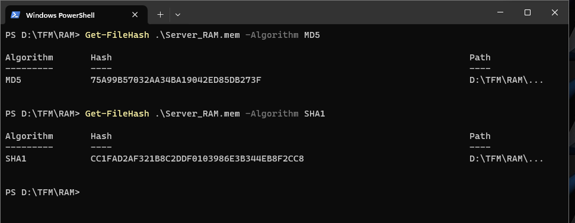

Como conclusión podemos verificar que la integridad de la copia facilitada para realizar el TFM no ha sido vulnerada.

[Volver al Índice del capítulo 3. Análisis de la memoria RAM.](#índice-del-capítulo-3-análisis-de-la-memoria-ram)

[Volver al Índice General.](#índice-general)

---

## 3.2. Sistema Operativo de la memoria RAM analizada.

Procedemos a preparar una máquina virtual con Ubuntu 22.04, el cual le instalamos el volatility según en el siguiente enlace. Haga click en la imagen para acceder al enlace:

> [https://www.youtube.com/watch?v=z_SWIIa3AnY](https://www.youtube.com/watch?v=z_SWIIa3AnY)

A continuación procedemos a buscar el perfil con volatility con el comando `imageinfo`.

##### [Imagen 007](#83007)

Como se puede observar en la imagen anterior, no hemos llegado a encontrar un perfil concreto con `imageinfo`, eso se debe a que el perfil creado no es el que se encuentra dentro de las conocidas en la base de datos de volatility. Por ello procedemos a buscar dentro de la memoria RAM un string que tenga la cadena de texto "linux version". para ello ejecutamos el comando `strings Server_{RAM}.mem \mid grep -Ei linux version \mid uniq`.

##### [Imagen 008](#83008)

Podemos observar en la imagen anterior que el sistema operativo que utiliza en nuestro caso es un sistema operativo Linux para Amazon Web Service, concretamente el sistema operativo es el **4.15.0-1021.21-aws 4.15.18**. Esta version de Linux, es muy usada para las instancias de Amazon Web Services.

Como no tenemos el perfil cargado dentro de volatility, nos va a tocar hacer la tarea de cargar un perfil de este Sistema operativo para poder seguir ejecutando la aplicación volatility.

Buscando en google **linux version 4.15.0-1021.21-aws volatility**, nos encontramos solo un enlace en internet, el cual es https://lists.ubuntu.com/archives/bionic-changes/2018-August/016183.html, con ello nos encontrábamos con algo que ya se intuía previamente, y es que la versión del server de AWS, es basada en un ubuntu 18.04, ya que la fecha que indica 4.15.18 es una fecha en tipo "d.mm.aa".

[Volver al Índice del capítulo 3. Análisis de la memoria RAM.](#índice-del-capítulo-3-análisis-de-la-memoria-ram)

[Volver al Índice General.](#índice-general)

---

## 3.3. Datos de interés de la captura de la memoria RAM.

En el anexo Creación perfil ubuntu AWS, hemos realizado una guía para crear el perfil de Linux AWS que detectado durante el análisis del sistema operativo.

Una vez creado el perfil de linuxUbuntu_4.15.0-1021-aws procederemos a hacer un pslist para listar todas las aplicaciones que estaban ejecutándose en el momento de la captura.

Para comprobar que el perfil funciona, vamos a comenzar a comprobar cual es el CPU que usa el sistema.

Para ello ejecutaremos `sudo python2.7 vol.py --profile=LinuxlinuxUbuntu_4_15_0-1021-awsx64 -f '/home/jrodg85/Server_RAM.mem' linux_cpuinfo`.

Al comprobar que el perfil funciona, obtenemos que solo hay un procesador de marca GenuineIntel modelo Intel(R) Xeon(R) CPU E5-2676 v3 que tiene una frecuencia de 2.4Ghz.

Otro comando de interés es obtener el history del la terminal, con ello podemos observar los pasos realizados y los que ha ejecutado. Para ello ejecutaremos el comando `sudo python2.7 vol.py --profile=LinuxlinuxUbuntu_4_15_0-1021-awsx64 -f '/home/jrodg85/Server_RAM.mem' linux_bash`. Los comandos usados son los siguientes:

~~~
exit

sudo apt update

sudo systemctl restart postfix

ls -l

mysql -uroot -p

cd apache2/

ls -l

sudo vi /etc/mysql/debian.cnf

ps -ef| grep mysql

tail access.log.1

cd /var/www/html

sudo kill -9 4539

ls -als

cd /

ps -ef| grep mysql

sudo mysqld_safe --skip-grant-tables

H?=? &

qls -l tmp

qls -l tmp

cd

exit

vi functions.php

ps -ef| grep mysql

ls -l /var/run/mysqld

ls -l /run

ls -lt

ls -lt| more

vi access.log.1

sudo mysql_secure_installation

ls -l

p?JU

su mysql

tail access.log

cat /var/log/mysql/error.log

cd /var/log

find . -name functions.php

sudo apt install python-certbot-apache

sudo service apache2 restart

ps -ef| grep mysql

mysql -uroot -p

sudo apt-get install apache2

apt-cache search mysql-server

apt-cache search php

mysql -u root -p

ls -l

#1546501785

tail error.log

sudo vi functions.php

sudo mysql

ls -l /var/run

exit

ls -l

apt-cache search php| grep apache

sudo vi /etc/mysql/debian

tail syslog

sudo apt-get install mysql-server

_service

apt-cache search mysql | grep php

sudo cp /home/ubuntu/wordpress-4.9.8.tar.gz  .

cd /var/log

cd

U

H???Nt??nu??6

sudo mysqld_safe --skip-grant-tables &

apt-cache search mysql

pwd

ls -l

ls -l

`uSU

sudo mv * ..

?,YU

sudo mysqld_safe --skip-grant-tables

r="$c_clear$r"

ls -l /run

ls -l

COMPREPLY=($(compgen -W "--help --local" -- $cur_word))

ls -l

sudo tar xzf wordpress-4.9.8.tar.gz

sudo apt-get install aapche2

tail -100 kern.log

mysql -u root -p

cd ..

cd /var/www/html/

ps -ef| grep mysql

apt-cache search php

cd wordpress/

cd hhtml

sudo rm -r wordpress/

ls -l

ls -l

sudo chmod 777 /var/run/mysqld

sudo apt upgrade

ls -l

sudo vi /etc/apache2/sites-enabled/000-default.conf

cd htmlls -l

mysql -uroot -p

ls -l

ls -l

ls -l

sudo chown -R www-data:www-data html

sudo mysqld_safe --skip-grant-tables

cd /var/www/html

find . -name functions.php -exec grep -H add_filer {} \;

sudo apt install libapache2-mod-php

exit

cd /var/lg

suudo mysqld_safe --skip-grant-tables &

ls -l

cd /var/log/apache2/sites-e

mysql -u root -p

cd

sudo service mysql restart

find . -name functions.php -exec grep -H add_filter {} \;

apt-cache search apache2

sudo apt-get update

cat debian

?2JU

echo "Test 1" | mail -s "Test 1" test12312321@mailinator.com

sudo chmod 777 /run/mysqld/

dpkg -l | grep mysql-server

sudo certbot --apache -d ganga.site -d www.ganga.site

ps -ef| grep mysql

cd /var/log/apache2/

sudo mkdir /run/mysqld

cd /etc/mysql/

sudo grep root *

mysql -u root -p

ps -ef| grep mysql

sudo mysqld_safe --skip-grant-tables

mysql -u root

ls -l /run

cd /var/log

cd

sudo dpkg-reconfigure mysql-server-5.7

sudo service mysql stop

cd apache2/

sudo service mysql stop

cat /var/log/mysql/error.log

sudo kill -9 3181

ls -l

mysql -u root

more access.log.1

dpkg -l | grep mysql

chmod 777 /run/mysqld/

g|MP?(E)G|wm[av]|WM[AV]|avi|AVI|asf|vob|VOB|bin|dat|divx|DIVX|vcd|ps|pes|fli|flv|FLV|fxm|FXM|viv|)4[av]|M?(P)4[AV]|mkv|MKV|og[agmvx]|OG[AGMVX]|t[ps]|T[PS]|m2t?(s)|M2T?(S)|mts|MTS|wav|WAV|flac||XM)|+([0-9]).@(vdr|VDR))?(.part)'

sudo kill -9 3182 3542

sudo kill -9 4179

ls

ls -l

sudo service mysql stop

?

ls -l

sudo service apache2 rewtart

ls

sudo apt install mailutils

ls -lt| more

sudo cat debian.cnf

exit

pwd

mysql -u root -p

cat /etc/issue

cd wordpress/

tail error.log

tail error.log

vi access.log

cd ..

cd wp-content/themes/twentyseventeen/

sudo systemctl restart psotfix

ls -l

exit

mysql_secure_installation

mysql -uroot -p

sudo cat /etc/mysql/debian

ls -l tmp

mysql -u root -p

tail syslog

cd /tmp

exit

cd html

find . -name functions.php -exec grep -H add_filter {} \;

cat debian.cnf

mysql -u root

suudo mysql_secure_installation

sudo cat /etc/mysql/debian.cnf

sudo service apache2 retart

sudo rm index.html

sudo rm -r /run/mysqld

sudo vi wp-config.php

sudo systemctl reload apache2

sudo service mysql start

sudo vi /etc/postfix/main.cf

tail access.log

tail -100 syslog

ps -ef| grep mysql

cd /var/log/apache2/

ls- l

pwd

vi index.html

sudo apachectl configtest

ps -ef| grep mysql

sudo mkdir /var/run/mysqld

tail access.log

exit

sudo add-apt-repository ppa:certbot/certbot

tail access.log

ls -l

tail -100 access.log

tail -100 access.log

execute-command

sudo mysqld_safe --skip-grant-tables &

sudo kill 3181

exit

!

sudo service apache2 restart

sudo apt install php-mysql

date

cd ap

ls -l

grep POST access.log

ls -l

vi access.log

ls -l

cd home

cd /var/log

sudo apchectl configtest

sudo service mysql start

sudo vi /etc/php/7.2/apache2/php.ini

sudo kill -9 4178

tail -100 syslog

ps -ef| grep mysql

tail -100 syslog

sudo rm wordpress-4.9.8.tar.gz

ls -l /run

??OU

ls -l /etc/cron.d

ls -l

cd /tmp

sudo insmod lime-4.15.0-42-generic.ko "path=captura.mem format=lime"

cat /etc/issue

uname -a

ls -l

rm lime-4.15.0-42-generic.ko

ls -l

sudo insmod lime-4.15.0-1021-aws.ko "path=captura.mem format=lime"
~~~

Analizando los comandos realizados se pueden destacar los siguientes:

- **exit**: Sale de la sesión actual, ya sea una sesión de terminal o una conexión SSH.
- **sudo apt update**: Actualiza la lista de paquetes disponibles y sus versiones. Es un paso previo común antes de instalar o actualizar paquetes.
- **sudo systemctl restart postfix**: Reinicia el servicio Postfix, un agente de transferencia de correo (MTA).
- **ls -l**: Lista los archivos en el directorio actual en un formato detallado.
- **mysql -uroot -p**: Inicia sesión en el servidor MySQL como usuario 'root', pidiendo la contraseña.
- **cd apache2/ y movimientos similares**: Cambia el directorio actual a uno especificado.
- **sudo vi /etc/mysql/debian.cnf**: Edita el archivo de configuración de MySQL usando el editor vi.
- **ps -ef| grep mysql**: Muestra los procesos actuales relacionados con MySQL.
- **sudo kill -9 4539**: Mata de manera forzosa el proceso con el ID 4539.
- **sudo mysqld_safe --skip-grant-tables**: Inicia MySQL en un modo especial que omite ciertas comprobaciones de seguridad.
- **sudo apt install python-certbot-apache**: Instala Certbot para Apache, una herramienta para obtener certificados SSL/TLS de Let's Encrypt.
- **sudo service apache2 restart**: Reinicia el servidor web Apache.
- **sudo mysql_secure_installation**: Ejecuta un script para mejorar la seguridad de MySQL.
- **sudo apt-get install mysql-server**: Instala el servidor MySQL.
- **sudo chmod 777 /var/run/mysqld**: Cambia los permisos del directorio /var/run/mysqld para que todos los usuarios puedan leer, escribir y ejecutar archivos en él.
- **sudo chown -R www-data:www-data html**: Cambia la propiedad del directorio html al usuario y grupo www-data, comúnmente usado para servidores web.
- **find . -name functions.php -exec grep -H add_filer {} \;**: Busca en archivos functions.php y ejecuta grep en ellos.
- **tail access.log y variantes**: Muestra las últimas líneas de los archivos de registro especificados.
- **sudo vi /etc/apache2/sites-enabled/000-default.conf**: Edita la configuración predeterminada del sitio de Apache.
- **sudo apt upgrade**: Actualiza todos los paquetes instalados a sus últimas versiones.
- **sudo systemctl reload apache2**: Recarga la configuración de Apache sin reiniciar el servicio.
- **sudo service mysql stop**: Detiene el servicio MySQL.
- **sudo dpkg-reconfigure mysql-server-5.7**: Reconfigura la versión especificada del servidor MySQL.
- **sudo apachectl configtest**: Verifica la sintaxis de los archivos de configuración de Apache.
- **sudo add-apt-repository ppa:certbot/certbot**: Añade el repositorio PPA para Certbot.
- **sudo apt install php-mysql**: Instala el módulo PHP para interactuar con MySQL.
- **sudo insmod lime-4.15.0-42-generic.ko "path=captura.mem format=lime"**: Carga un módulo del kernel para la captura de memoria.

Relativo a la seguridad del servidor, siguiente listado de documentos son notables para la seguridad, ya que pueden tener un impacto significativo en la seguridad del servidor. Aquí hay algunos ejemplos notables:

**1. sudo mysqld_safe --skip-grant-tables.**

  - Este comando inicia el servidor MySQL sin respetar el sistema de permisos. Cualquiera podría acceder a todas las bases de datos sin necesidad de una contraseña. Es extremadamente peligroso en un entorno de producción y debería usarse solo en situaciones de recuperación de emergencia.

**2. sudo chmod 777 /var/run/mysqld.**

  - Este comando establece los permisos de lectura, escritura y ejecución para todos los usuarios en el directorio /var/run/mysqld. Otorgar estos permisos tan amplios puede ser un riesgo de seguridad significativo, ya que permite a cualquier usuario en el sistema modificar o eliminar archivos críticos para el funcionamiento de MySQL.

**3. sudo kill -9 (con varios números de proceso).**

  - Si bien no es inherentemente inseguro, el uso imprudente de kill -9 puede terminar procesos cruciales y causar inestabilidad o pérdida de datos si se aplica a procesos críticos del sistema o de la base de datos.

**4. sudo rm -r /run/mysqld.**

  - Eliminar directorios críticos del sistema puede afectar la estabilidad y funcionamiento de los servicios asociados, en este caso, MySQL.

**5. sudo service mysql stop y sudo service apache2 stop.**

  - Detener servicios como MySQL y Apache puede afectar la disponibilidad de aplicaciones dependientes. Si se hace sin precaución, podría provocar tiempos de inactividad no planificados.

**6. vi /etc/mysql/debian.cnf y sudo vi /etc/apache2/sites-enabled/000-default.conf.**

  - Editar archivos de configuración es una tarea común, pero si se hacen cambios incorrectos o inseguros, pueden surgir problemas de seguridad y funcionamiento.

**7.sudo insmod lime-4.15.0-42-generic.ko "path=captura.mem format=lime".**

  - Cargar módulos del kernel personalizados o desconocidos puede ser una accion de riesgo si no se comprenden completamente sus funciones y orígenes.

**8. sudo apt install php-mysql.**

  - La instalación de software debe hacerse con cuidado, asegurándose de que las fuentes sean confiables y que no se introduzcan vulnerabilidades.

**9. Errores tipográficos y comandos incompletos.**

  - Podrían resultar en acciones no intencionadas que afectan la seguridad o estabilidad del sistema.

Es fundamental que cualquier administrador de sistemas ejecute estos comandos con conocimiento completo de sus implicaciones y en el contexto adecuado. Además, las buenas prácticas de seguridad, como la mínima exposición de servicios, el uso restringido de permisos y la monitorización constante, son esenciales para mantener la integridad y seguridad del sistema.

[Volver al Índice del capítulo 3. Análisis de la memoria RAM.](#índice-del-capítulo-3-análisis-de-la-memoria-ram)

[Volver al Índice General.](#índice-general)

---

## 3.4. Búsqueda de procesos en funcionamiento de interés para el análisis.

[Volver al Índice del capítulo 3. Análisis de la memoria RAM.](#índice-del-capítulo-3-análisis-de-la-memoria-ram)

[Volver al Índice General.](#índice-general)

---

## 3.5. Listado de conexiones de red y conexiones sospechosas.

[Volver al Índice del capítulo 3. Análisis de la memoria RAM.](#índice-del-capítulo-3-análisis-de-la-memoria-ram)

[Volver al Índice General.](#índice-general)

---

# 4. Análisis del disco duro.

## Índice del capítulo 4. Análisis del disco duro.

[Volver al Índice General.](#índice-general)

---

## 4.0. Introducción al capítulo 4. Análisis del disco duro.

[Volver al Índice del capítulo 4. Análisis del disco duro.](#índice-del-capítulo-4-análisis-del-disco-duro)

[Volver al Índice General.](#índice-general)

---

## 4.1. Acciones previas al análisis del disco duro.

[Volver al Índice del capítulo 4. Análisis del disco duro.](#índice-del-capítulo-4-análisis-del-disco-duro)

[Volver al Índice General.](#índice-general)

---

## 4.2. Datos de interés del disco duro.

[Volver al Índice del capítulo 4. Análisis del disco duro.](#índice-del-capítulo-4-análisis-del-disco-duro)

[Volver al Índice General.](#índice-general)

---

## 4.3. Usuarios del sistema.

[Volver al Índice del capítulo 4. Análisis del disco duro.](#índice-del-capítulo-4-análisis-del-disco-duro)

[Volver al Índice General.](#índice-general)

---

## 4.4. Análisis de evidencias del disco duro.

[Volver al Índice del capítulo 4. Análisis del disco duro.](#índice-del-capítulo-4-análisis-del-disco-duro)

[Volver al Índice General.](#índice-general)

---

# 5. Resumen ejecutivo.

## Índice del capítulo 5. Resumen ejecutivo.

[Volver al Índice General.](#índice-general)

---

## 5.0. Introducción al capítulo 5. Resumen ejecutivo.

[Volver al Índice del capítulo 5. Resumen ejecutivo.](#índice-del-capítulo-5-resumen-ejecutivo)

[Volver al Índice General.](#índice-general)

---

## 5.1. Resumen ejecutivo.

[Volver al Índice del capítulo 5. Resumen ejecutivo.](#índice-del-capítulo-5-resumen-ejecutivo)

[Volver al Índice General.](#índice-general)

---

# 6. Informe pericial.

## Índice del capítulo 6. Informe pericial.

[Volver al Índice General.](#índice-general)

---

## 6.0. Introducción al capítulo 6. Informe pericial.

[Volver al Índice del capítulo 6. Informe pericial.](#índice-del-capítulo-6-informe-pericial)

[Volver al Índice General.](#índice-general)

---

## 6.1. Informe pericial.

[Volver al Índice del capítulo 6. Informe pericial.](#índice-del-capítulo-6-informe-pericial)

[Volver al Índice General.](#índice-general)

---

# 7. Conclusiones.

## Índice del capítulo 7. Conclusiones.

[Volver al Índice General.](#índice-general)

---

## 7.0. Introducción al capítulo 7. Conclusiones.

[Volver al Índice del capítulo 7. Conclusiones.](#índice-del-capítulo-7-conclusiones)

[Volver al Índice General.](#índice-general)

---

## 7.1. Conclusiones.

[Volver al Índice del capítulo 7. Conclusiones.](#índice-del-capítulo-7-conclusiones)

[Volver al Índice General.](#índice-general)

---

# 8. Anexos.

## Índice del capítulo 8. Anexos.

[Volver al Índice General.](#índice-general)

---

## 8.0. Introducción al capítulo 8. Anexos.

[Volver al Índice del capítulo 8. Anexos.](#índice-del-capítulo-8-anexos)

[Volver al Índice General.](#índice-general)

---

## 8.1. Creación de perfil para volatility.

### 8.1.0. Introducción de creación de perfil de volatility.

Crear un perfil de volatility es fundamental para poder extraer la información de los datos de la ram.

En el repositorio de github de volatility podemos observar perfiles relativos a windows, pero ninguno relativo al sistema operativo linux. Si ejecutamos el comando `sudo python2.7 vol.py --info` tenemos la siguiente respuesta relativo a perfiles:

~~~Shell
Profiles
--------
VistaSP0x64                         - A Profile for Windows Vista SP0 x64
VistaSP0x86                         - A Profile for Windows Vista SP0 x86
VistaSP1x64                         - A Profile for Windows Vista SP1 x64
VistaSP1x86                         - A Profile for Windows Vista SP1 x86
VistaSP2x64                         - A Profile for Windows Vista SP2 x64
VistaSP2x86                         - A Profile for Windows Vista SP2 x86
Win10x64                            - A Profile for Windows 10 x64
Win10x64_10240_17770                - A Profile for Windows 10 x64 (10.0.10240.17770 / 2018-02-10)
Win10x64_10586                      - A Profile for Windows 10 x64 (10.0.10586.306 / 2016-04-23)
Win10x64_14393                      - A Profile for Windows 10 x64 (10.0.14393.0 / 2016-07-16)
Win10x64_15063                      - A Profile for Windows 10 x64 (10.0.15063.0 / 2017-04-04)
Win10x64_16299                      - A Profile for Windows 10 x64 (10.0.16299.0 / 2017-09-22)
Win10x64_17134                      - A Profile for Windows 10 x64 (10.0.17134.1 / 2018-04-11)
Win10x64_17763                      - A Profile for Windows 10 x64 (10.0.17763.0 / 2018-10-12)
Win10x64_18362                      - A Profile for Windows 10 x64 (10.0.18362.0 / 2019-04-23)
Win10x64_19041                      - A Profile for Windows 10 x64 (10.0.19041.0 / 2020-04-17)
Win10x86                            - A Profile for Windows 10 x86
Win10x86_10240_17770                - A Profile for Windows 10 x86 (10.0.10240.17770 / 2018-02-10)
Win10x86_10586                      - A Profile for Windows 10 x86 (10.0.10586.420 / 2016-05-28)
Win10x86_14393                      - A Profile for Windows 10 x86 (10.0.14393.0 / 2016-07-16)
Win10x86_15063                      - A Profile for Windows 10 x86 (10.0.15063.0 / 2017-04-04)
Win10x86_16299                      - A Profile for Windows 10 x86 (10.0.16299.15 / 2017-09-29)
Win10x86_17134                      - A Profile for Windows 10 x86 (10.0.17134.1 / 2018-04-11)
Win10x86_17763                      - A Profile for Windows 10 x86 (10.0.17763.0 / 2018-10-12)
Win10x86_18362                      - A Profile for Windows 10 x86 (10.0.18362.0 / 2019-04-23)
Win10x86_19041                      - A Profile for Windows 10 x86 (10.0.19041.0 / 2020-04-17)
Win2003SP0x86                       - A Profile for Windows 2003 SP0 x86
Win2003SP1x64                       - A Profile for Windows 2003 SP1 x64
Win2003SP1x86                       - A Profile for Windows 2003 SP1 x86
Win2003SP2x64                       - A Profile for Windows 2003 SP2 x64
Win2003SP2x86                       - A Profile for Windows 2003 SP2 x86
Win2008R2SP0x64                     - A Profile for Windows 2008 R2 SP0 x64
Win2008R2SP1x64                     - A Profile for Windows 2008 R2 SP1 x64
Win2008R2SP1x64_23418               - A Profile for Windows 2008 R2 SP1 x64 (6.1.7601.23418 / 2016-04-09)
Win2008R2SP1x64_24000               - A Profile for Windows 2008 R2 SP1 x64 (6.1.7601.24000 / 2016-04-09)
Win2008SP1x64                       - A Profile for Windows 2008 SP1 x64
Win2008SP1x86                       - A Profile for Windows 2008 SP1 x86
Win2008SP2x64                       - A Profile for Windows 2008 SP2 x64
Win2008SP2x86                       - A Profile for Windows 2008 SP2 x86
Win2012R2x64                        - A Profile for Windows Server 2012 R2 x64
Win2012R2x64_18340                  - A Profile for Windows Server 2012 R2 x64 (6.3.9600.18340 / 2016-05-13)
Win2012x64                          - A Profile for Windows Server 2012 x64
Win2016x64_14393                    - A Profile for Windows Server 2016 x64 (10.0.14393.0 / 2016-07-16)
Win7SP0x64                          - A Profile for Windows 7 SP0 x64
Win7SP0x86                          - A Profile for Windows 7 SP0 x86
Win7SP1x64                          - A Profile for Windows 7 SP1 x64
Win7SP1x64_23418                    - A Profile for Windows 7 SP1 x64 (6.1.7601.23418 / 2016-04-09)
Win7SP1x64_24000                    - A Profile for Windows 7 SP1 x64 (6.1.7601.24000 / 2018-01-09)
Win7SP1x86                          - A Profile for Windows 7 SP1 x86
Win7SP1x86_23418                    - A Profile for Windows 7 SP1 x86 (6.1.7601.23418 / 2016-04-09)
Win7SP1x86_24000                    - A Profile for Windows 7 SP1 x86 (6.1.7601.24000 / 2018-01-09)
Win81U1x64                          - A Profile for Windows 8.1 Update 1 x64
Win81U1x86                          - A Profile for Windows 8.1 Update 1 x86
Win8SP0x64                          - A Profile for Windows 8 x64
Win8SP0x86                          - A Profile for Windows 8 x86
Win8SP1x64                          - A Profile for Windows 8.1 x64
Win8SP1x64_18340                    - A Profile for Windows 8.1 x64 (6.3.9600.18340 / 2016-05-13)
Win8SP1x86                          - A Profile for Windows 8.1 x86
WinXPSP1x64                         - A Profile for Windows XP SP1 x64
WinXPSP2x64                         - A Profile for Windows XP SP2 x64
WinXPSP2x86                         - A Profile for Windows XP SP2 x86
WinXPSP3x86                         - A Profile for Windows XP SP3 x86
~~~

[Volver al Índice del capítulo 8. Anexos.](#índice-del-capítulo-8-anexos)

### 8.1.1. Creación de la máquina virtual.

Vamos crear una máquina virtual para generar una máquina virtual base con el mismo kernel que el servidor auditado.

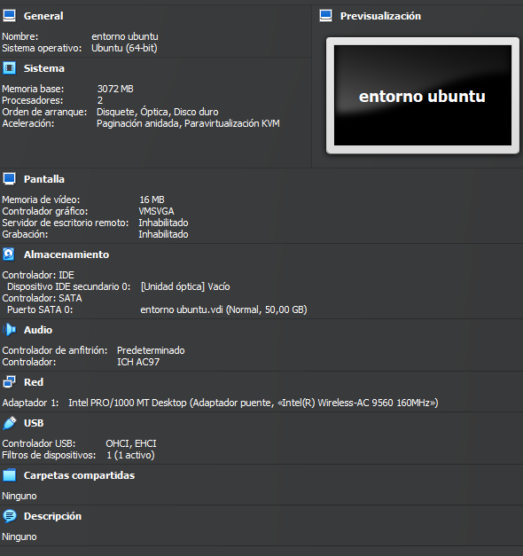

[Volver al Índice del capítulo 8. Anexos.](#índice-del-capítulo-8-anexos)

### 8.1.2. Búsqueda en cache del kernel relativo al perfil a crear.

Procedemos a arrancar la máquina virtual (en adelante VM), una vez realizado el login, procedemos a ejecutar el comando `sudo apt-cache search linux-image | grep 4.15.0-1021`.

Este comando realiza dos acciones, por un lado `sudo apt-cache search linux-image`, y por otro `grep 4.15.0-1021`. Gracias al  "pipe" o "|", pasaremos la respuesta del primera acción como entrada de la segunda acción.. Es una parte fundamental de la filosofía de Unix que permite a los usuarios combinar múltiples comandos sencillos para realizar tareas más complejas. En nuestro caso:

**sudo apt-cache search linux-image.**

  - Esta parte del comando busca en la caché de APT (Advanced Package Tool) todos los paquetes cuyos nombres o descripciones contienen la cadena "linux-image". Los paquetes "linux-image" generalmente se refieren a imágenes del kernel de Linux para diferentes versiones y configuraciones.

**| grep 4.15.0-1021.**

  - La salida del primer comando se canaliza (|) al comando grep, que filtra y muestra solo las líneas que contienen la cadena "4.15.0-1021". En este contexto, "4.15.0-1021" probablemente se refiere a una versión específica del kernel de Linux.

Al combinar estos dos comandos, `sudo apt-cache search linux-image | grep 4.15.0-1021` efectivamente busca y lista todas las versiones de las imágenes del kernel de Linux disponibles en los repositorios que coincidan con la versión específica "4.15.0-1021". Este comando es útil para identificar si una versión específica del kernel está disponible para la instalación o actualización en el sistema.

Se adjunta pantallazo de la respuesta por parte de la consola.

##### [Imagen 009](#83009)

[Volver al Índice del capítulo 8. Anexos.](#índice-del-capítulo-8-anexos)

### 8.1.3. Instalación del kernel relativo al perfil a crear.

Una vez encontrado la imagen del kernel que buscamos, procedemos a instalarla en el sistema, para ello ejecutamos el comando `sudo apt-get install linux-image-4.15.0-2021-aws`.

El comando `sudo apt-get install linux-image-4.15.0-2021-aws` en Ubuntu o sistemas basados en Debian, se utiliza para instalar una versión específica del kernel de Linux, diseñada para ambientes Amazon Web Services (AWS). Al usar `sudo`, el comando se ejecuta con privilegios de superusuario, necesarios para instalar software a nivel de sistema. `apt-get install` es parte del sistema de gestión de paquetes APT, y se usa aquí para instalar el paquete `linux-image-4.15.0-2021-aws`. Este paquete contiene una imagen del kernel de Linux, la cual está optimizada para correr en servidores AWS, indicando que este kernel podría tener configuraciones o parches específicos para un rendimiento mejorado o características adicionales en esa plataforma. **Al instalar un nuevo kernel, es importante reiniciar el sistema para que empiece a usar esta nueva versión.**

Se adjunta pantallazo de la instalación del kernel de AWS:

##### [Imagen 010](#83010)

Como hemos indicado anteriormente, es necesario reiniciar el sistema para que el kernel instalado se utilice en el Sistema operativo, procederemos a ejecutar el comando `sudo reboot now` para realizar esta acción.

##### [Imagen 011](#83011)

Una vez reiniciado el sistema, procedemos a ejecutar el comando `uname - r` para comprobar que el comando se ha ejecutado correctamente.

##### [Imagen 012](#83012)

[Volver al Índice del capítulo 8. Anexos.](#índice-del-capítulo-8-anexos)

### 8.1.4. Instalación de volatility.

Una vez comprobado, procederemos a la instalación de volatility en el servidor de ubuntu.

Primero de todo instalaremos los paquetes relativos a `dwarfdum`, `gcc`, `linux-headers` y `git`, ya que el servidor no los tiene instalado por defecto.

 Seguiremos los pasos ya indicados en el [Apartado 3.2](#32-sistema-operativo-de-la-memoria-ram-analizada):

> https://www.youtube.com/watch?v=z_SWIIa3AnY

Una vez instalado, procedemos a realizar los pasos para la creación del perfil de volatility.

[Volver al Índice del capítulo 8. Anexos.](#índice-del-capítulo-8-anexos)

### 8.1.5. Creación del perfil de volatility.

Una vez hemos realizado la instalación procedemos a crear el perfil de volatility.

Para ello entraremos en la carpeta `home/jrodg85/volatility/tools/linux`, una vez allí dentro ejecutaremos el comando `make`. En la siguiente imagen, se puede ver un pantallazo del comando, en caso de tener error del mismo, lo mas recomendable es hacer un `make clean` y después volver a ejecutar `make`. Lo mas importante es que se tiene que crear el archivo **`modules.dwarf`**

##### [Imagen 013](#83013)

Ahora procederemos a nombrar el perfil de volatility para ello vamos a generar un archivo zip, este archivo, como norma general, usaremos los valores de `lsb_release -si` y `uname -r`. De esta manera nombraremos de manera correcta el perfil de volatility para después no tengamos problemas al importarlo dentro de la máquina donde estamos realizando la investigación.

Este archivo zip, debe de contener los dos archivos necesarios de perfil:

**modules.dwarf**

- Este archivo se genera a partir de los módulos del kernel de Linux y contiene información sobre las estructuras de datos del kernel. Es creado usando, en nuestro caso, la herramienta dwarfdump sobre módulos del kernel compilados con símbolos de depuración (debugging symbols). El archivo module.dwarf es crucial porque contiene los offsets y las definiciones de las estructuras de datos internas del kernel, lo que permite a Volatility entender cómo están organizados los datos en el volcado de memoria.

**/boot/System.map-4.15.0-1021-aws**

- Este archivo es un mapa de símbolos del kernel. Proporciona una lista de todas las funciones y variables en el kernel, junto con sus direcciones de memoria. Cada versión del kernel de Linux tiene su propio archivo System.map, y el archivo específico para una versión dada del kernel (en tu caso, 4.15.0-1021-aws) es necesario para analizar un volcado de memoria tomado de un sistema que ejecuta esa versión del kernel. Este archivo es esencial para que Volatility pueda mapear las direcciones de memoria en el volcado a nombres de funciones y variables específicas en el kernel.

Para la generación del perfil, procederemos a ejecutar el comando `sudo zip /home/jrodg85/volatility/volatility/plugins/overlays/linux$(lsb_release -si)_$(uname -r)_profiles.zip /home/jrodg85/volatility/tools/linux/module.dwarf /boot/System.map-4.15.0-1021-aws`

Una vez creado el perfil, tenemos que sacar el perfil del servidor para después pegarlo dentro de la máquina una donde realizaremos el análisis. para ello procederemos a montar un usb dentro del servidor del ubuntu, posteriormente copiamos el archivo, `/home/jrodg85/volatility/volatility/plugins/overlays/linuxUbuntu_4.15.0-1021-aws_profile.zip`, y lo pegamos en el USB, posteriormente, procedemos a insertar en la VM de análisis en la carpeta en la carpeta `/home/jrodg85/volatility/volatility/plugins/overlays/linux` tal y como se muestra en la siguiente imagen.

para comprobar que esta correctamente creado el perfil procedemos a ejecutar el comando `sudo python2.7 col.py --info`, donde se podrá observar que se ha creado correctamente el perfil.

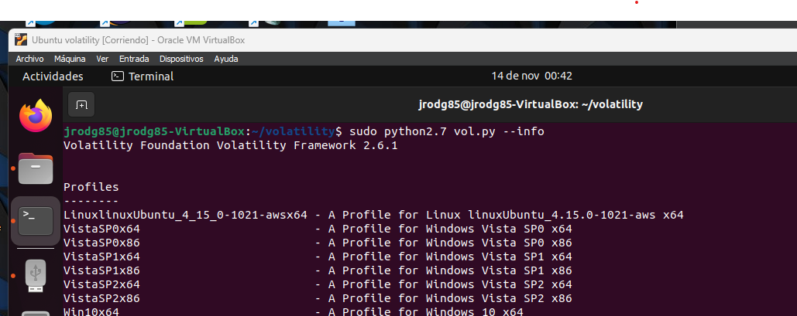

[Volver al Índice del capítulo 8. Anexos.](#índice-del-capítulo-8-anexos)

[Volver al Índice General.](#índice-general)

---

## 8.2. Glosario de términos y abreviaturas.

#### **Análisis de archivo.**

- Examina cada archivo digital descubierto y crea una base de datos de información relacionada al archivo (metadatos, etc.), consistente entre otras cosas en la firma del archivo o hash (indica la integridad del archivo).

#### **Cadena de custodia.**

- La identidad de personas que manejan la evidencia en el tiempo del suceso y la última revisión del caso. Es la responsabilidad de la persona que maneja la evidencia asegurar que los artículos son registrados y contabilizados durante el tiempo en el cual están en su poder, y que son protegidos, así mismo llevando un registro de los nombres de las personas que manejaron la evidencia o artículos durante el lapso de tiempo y fechas de entrega y recepción.VCX

#### **Ciencia forense digital (digital forensics).**

- Es una forma de aplicar los conceptos y procedimientos de la criminalística a los medios informáticos o digitales. Su objetivo es apoyar al poder judicial en el contexto de la inseguridad informática es decir, la perpetración de posibles delitos aclarando temas relacionados con incidentes o fraudes.

#### **Ciencia forense en las redes (network forensics).**

- Trata las operaciones de redes de computadores, estableciendo rastros e identificando movimientos y acciones. Es necesario entender los protocolos, configuraciones y la infraestructura de las comunicaciones. A diferencia de la computación forense, es necesario poder establecer relaciones entre eventos diferentes e incluso aleatorios.

#### **Computación forense (computer forensics):**

1. Disciplina de la ciencia forense que considera los procedimientos en relación con las evidencias para descubrir e interpretar la información en los medios informáticos con el fin de establecer hipótesis o hechos relacionados con un caso. (Centrada en las consideraciones forenses).

2. Disciplina científica que ofrece un análisis de la información que contienen las tecnologías y de los equipos de computación a partir de su compresión.(Centrada en la tecnología).

#### **Imagen forense.**

- Técnica llamada también "espejeo" (en inglés "Mirroring"), la cual es una copia binaria de un medio electrónico de almacenamiento. En la imagen quedan grabados los espacios que ocupan los archivos y las áreas borradas incluyendo particiones escondidas.

[Volver al Índice del capítulo 8. Anexos.](#índice-del-capítulo-8-anexos)

[Volver al Índice General.](#índice-general)

---

## 8.3. Imágenes.

---

#### 8.3.001. Diagrama de Gantt reto/PEC 1.

[Volver al texto de la imagen 001.](#imagen-001)

---

---

#### 8.3.002. Diagrama de Gantt reto/PEC 2.

[Volver al texto de la imagen 002.](#imagen-002)

---

---

#### 8.3.003. Diagrama de Gantt reto/PEC 3.

[Volver al texto de la imagen 003.](#imagen-003)

---

---

#### 8.3.004. Diagrama de Gantt reto/PEC 4.

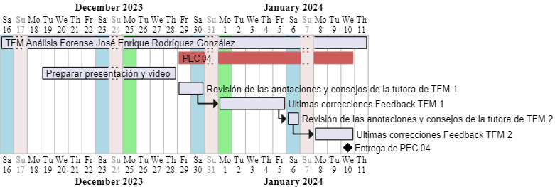

[Volver al texto de la imagen 004.](#imagen-004)

---

#### 8.3.005. Imagen Hash archivos.

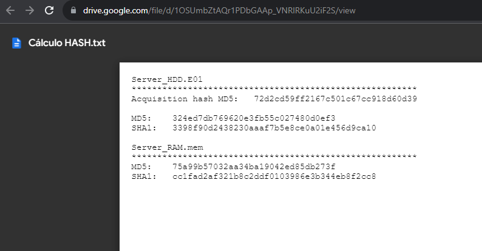

[Volver al texto de la imagen 005.](#imagen-005)

---

#### 8.3.006. Imagen Hash archivos.

[Volver al texto de la imagen 006.](#imagen-006)

---

#### 8.3.007. Imagen de imageinfo.

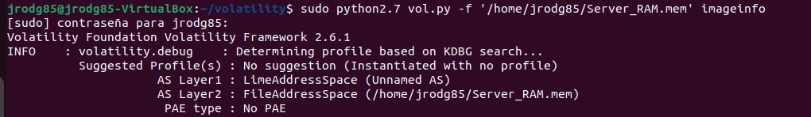

[Volver al texto de la imagen 007.](#imagen-007)

---

#### 8.3.008. Imagen de búsqueda de string linux version.

[Volver al texto de la imagen 008.](#imagen-008)

---

#### 8.3.009. Imagen de buscando caché de AWS.

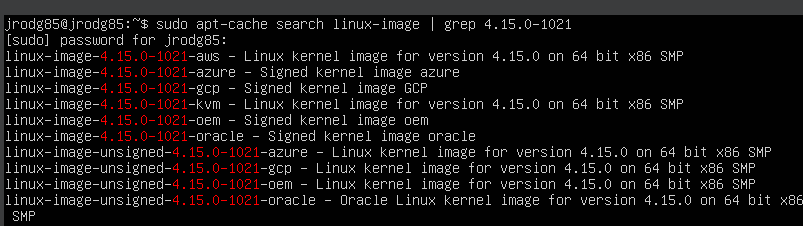

[Volver al texto de la imagen 009.](#imagen-009)

---

#### 8.3.010. Imagen de instalación de kernel de AWS.

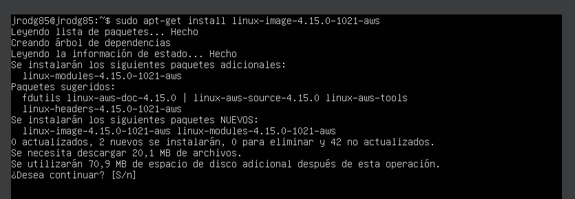

[Volver al texto de la imagen 010.](#imagen-010)

---

#### 8.3.011. Imagen de reicicio del servidor de AWS.

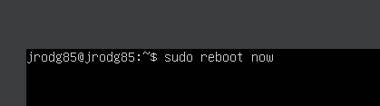

[Volver al texto de la imagen 011.](#imagen-011)

---

#### 8.3.012. Imagen de reinicio del servidor con kernel de AWS.

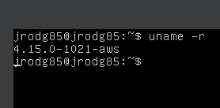

[Volver al texto de la imagen 012.](#imagen-012)

---

#### 8.3.013. .

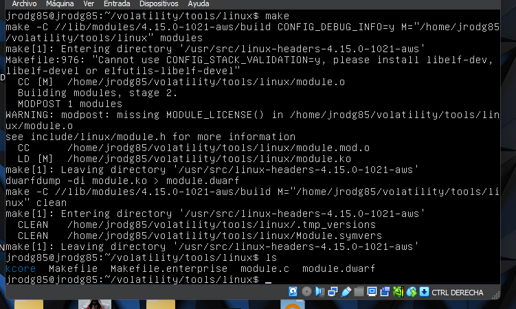

[Volver al texto de la imagen 013.](#imagen-013)

---

#### 8.3.014. .

[Volver al texto de la imagen 014.](#imagen-014)

---

#### 8.3.015. .

[Volver al texto de la imagen 015.](#imagen-015)

---

#### 8.3.016. .

[Volver al texto de la imagen 016.](#imagen-016)

---

#### 8.3.017. .

[Volver al texto de la imagen 017.](#imagen-017)

---

#### 8.3.018. .

[Volver al texto de la imagen 018.](#imagen-018)

---

#### 8.3.019. .

[Volver al texto de la imagen 019.](#imagen-019)

---

#### 8.3.020. .

[Volver al texto de la imagen 020.](#imagen-020)

---

#### 8.3.021. .

[Volver al texto de la imagen 021.](#imagen-021)

---

#### 8.3.022. .

[Volver al texto de la imagen 022.](#imagen-022)

---

#### 8.3.023. .

[Volver al texto de la imagen 024.](#imagen-024)

---

#### 8.3.025. .

[Volver al texto de la imagen 025.](#imagen-025)

---

#### 8.3.026. .

[Volver al texto de la imagen 026.](#imagen-026)

---

#### 8.3.027. .

[Volver al texto de la imagen 028.](#imagen-028)

---

[Volver al Índice del capítulo 8. Anexos.](#índice-del-capítulo-8-anexos)

[Volver al Índice General.](#índice-general)

---

## 8.4. Extracto de comandos utilizados.

[Volver al Índice del capítulo 8. Anexos.](#índice-del-capítulo-8-anexos)

[Volver al Índice General.](#índice-general)

---

## 8.5. Referencias.

#### 8.5.001. Enunciado TFM:

[]

[Volver al Índice del capítulo 8. Anexos.](#índice-del-capítulo-8-anexos)

[Volver al Índice General.](#índice-general)

---
